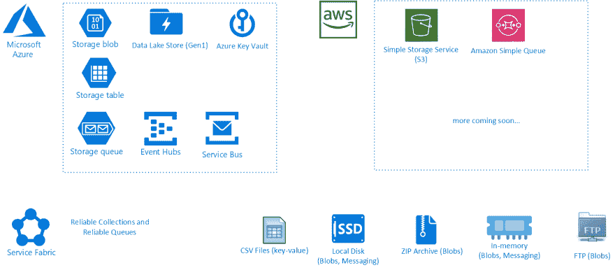

# 多云存储在。网络核心

> 原文：<https://dev.to/aloneguid/polycloud-storage-in-net-core-2m0o>

大概每个。NET 开发人员正在使用某种远程存储，比如 Azure Blob 存储、亚马逊 S3 等等。这可以从我在通勤途中画的一幅漫画中得到证明:

所以我写了一个 OSS 库来解决这个问题，见见[storage.net](https://github.com/aloneguid/storage)

我真的不知道为什么有这么多类似的存储提供商执行几乎相同的功能，但没有标准。为什么我们需要学习一个新的 SDK 来实现我们以前已经做了很多次的琐碎事情？我不知道。如果你也不喜欢，使用这个库。

它为流行的云存储提供商提供通用接口，如亚马逊 S3、Azure Service Bus、Azure Event Hub、Azure Storage、Azure Data Lake Store，从而抽象消息传递、Blob(非结构化数据的对象存储)和 Table (NoSQL 键值存储)服务。

它还实现了所有抽象的内存和磁盘版本，以加快本地机器开发。也支持连接字符串！

目前的实施清单是好的，但也在增长

