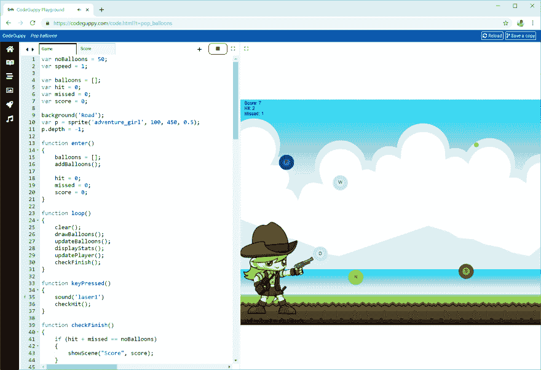

# 流行气球

> 原文：<https://dev.to/codeguppy/pop-balloons-5hdp>

# [T1】简介](#intro)

这个可爱的技能游戏是 CodeGuppy 上的“下落的气球”的变体。这种类型你需要使用你的打字技巧来弹出所有的气球之前，他们退出屏幕。

游戏教你如何:

*   生成随机数
*   使用经典游戏循环实现动画
*   使用精灵来增加传统游戏的趣味性

# 需要什么？

要运行本文中的代码，您不需要在本地计算机上安装任何东西。

只需从[codeguppy.com/code.html](https://codeguppy.com/code.html)打开在线 JavaScript playground，在集成编辑器中复制并粘贴以下代码。

准备就绪后，按“播放”按钮运行代码。

[](https://res.cloudinary.com/practicaldev/image/fetch/s--FntNLC4---/c_limit%2Cf_auto%2Cfl_progressive%2Cq_auto%2Cw_880/https://thepracticaldev.s3.amazonaws.com/i/90pqnv1ejmp11gxmrob1.png)

# 源代码

> 这个节目包含多个场景。请在单独的代码页中复制并粘贴每个场景。确保场景的名称如下所示。

## 场景:游戏

```
var noBalloons = 50;
var speed = 1;

var balloons = [];
var hit = 0;
var missed = 0;
var score = 0;

var p = sprite('adventure_girl', 100, 450, 0.5);
p.depth = -1;
background("Road");

function enter()
{
    balloons = [];
    addBalloons();

    hit = 0;
    missed = 0;
    score = 0;
}

function loop()
{
    clear();
    drawBalloons();
    updateBalloons();
    displayStats();
    updatePlayer();
    checkFinish();
}

function keyPressed()
{
    sound('laser1')
    checkHit();
}

function checkFinish()
{
    if (hit + missed == noBalloons)
    {
        showScene("Score", score);
    }
}

function addBalloons()
{
    var colors = ["Lime", "Red", "Green", "Orange", "Violet", "Teal", "Pink", "Magenta", "Navy"];
    var chars = ["A", "B", "C", "D", "E", "F", "G", "H", "I", "J", "K", "L", "M", "N", "O", "P", "Q", "R", "S", "T", "U", "V", "W", "X", "Y", "Z"];

    for(var i = 0; i < noBalloons; i++)
    {
        var balloon = {
            x : random(10, width - 10),
            y : random(-height * (noBalloons / 10), 0),
            chr : random(chars),
            r : 20,
            color : random(colors),
            speed : speed,
            hit : false,
            missed : false
        }

        balloons.push(balloon);
    }
}

function drawBalloons()
{
    for(var i = 0; i < balloons.length; i++)
    {
        var o = balloons[i];

        if (o.r > 0)
        {
            noStroke();

            fill(o.color);
            circle(o.x, o.y, o.r);

            if (!o.hit)
            {
                fill(255, 255, 255, 100);
                circle(o.x, o.y, 10);

                fill(0);
                textAlign(CENTER, CENTER);
                text(o.chr, o.x, o.y);
            }

            if (o.hit && o.r > 15)
            {
                stroke(0);
                strokeWeight(1);
                line(180, 450, o.x, o.y);
            }
        }
    }
}

function updateBalloons()
{
    for(var i = 0; i < balloons.length; i++)
    {
        var o = balloons[i];
        o.y += o.speed;

        if (o.hit && o.r > 0)
        {
            o.r--;
        }

        if (!o.missed && !o.hit && o.y >= height)
        {
            missed++;
            o.missed = true;
            score -= 10;
        }
    }
}

function checkHit()
{
    var prevHit = hit;

    for(var i = 0; i < balloons.length; i++)
    {
        var o = balloons[i];

        if (o.y >= 0 && o.y <= height)
        {
            if (o.chr === key.toUpperCase() && !o.hit)
            {
                o.hit = true;
                hit++;

                score += (o.y < 20 || o.y > height - 20) ? 20 : 10;

                break;
            }
        }
    }

    if (prevHit == hit)
    {
        score--;
    }
}

function updatePlayer()
{
    p.show(keyIsPressed ? "shoot" : "idle");
}

function displayStats()
{
    textAlign(LEFT, LEFT);
    fill(0);

    text("Score: " + score, 10, 10)
    text("Hit: " + hit, 10, 24);
    text("Missed: " + missed, 10, 38);

    text("Use keyboard to pop balloons...", 10, height - 10);
} 
```

## 场景:分数

```
function enter()
{
    clear();
    fill(0);
    noStroke();
    textSize(24);
    textAlign(CENTER);

    text("Your score: " + PublicVars.Arguments, width / 2, height / 2);

    textSize(14);
    text("Press any key to retry...", width / 2, height - 15);
}

function keyPressed()
{
    showScene("Game");
} 
```

# 反馈

如果你喜欢这篇文章，请在 Twitter 上关注 [@codeguppy](https://twitter.com/codeguppy) 和/或访问 codeguppy.com[获得更多教程和项目。](https://codeguppy.com)

另外，如果你想用详细的说明来扩展这篇文章，解释如何一步一步地构建程序，请在评论中留下反馈。