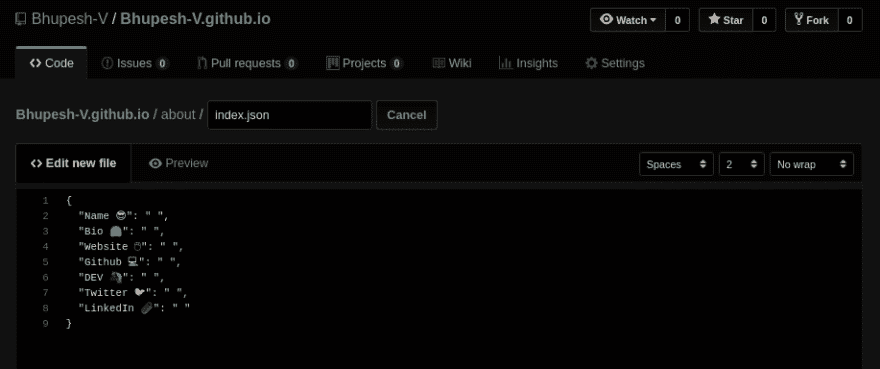

# 组合 API + GitHub 页面

> 原文：<https://dev.to/bhupesh/portfolio-api-github-pages-21ag>

## 组合 API + GitHub 页面=🔥

所以我意外地发现，当我们访问 GitHub Pages 站点时，我们可以返回 JSON 响应，而不是标准的 HTML。

我非常喜欢蒂尔尼·西伦
的名片概念

[](/wuz) [## 设置“npx 用户名”卡！

### 康林·德宾 12 月 26 日 183 分钟阅读

#beginners #tutorial #javascript #node](/wuz/setting-up-a-npx-username-card-1pip)

所以我想，与其创建一个用户卡，为什么不做一些有趣的事情呢😉并创建一个关于我的 REST API。

例如，如果你做

```
curl bhupeshv.me/api/ 
```

Enter fullscreen mode Exit fullscreen mode

在终端
上给出以下结果

```
{
    "Name 😎":"Bhupesh Varshney",
    "Bio 🤗":"OpenSource Lover, Blogger & CodePervert",
    "Website 🖱":"https://bhupeshv.me/",
    "Github 💻":"https://github.com/Bhupesh-V",
    "DEV 🦄":"https://dev.to/bhupesh",
    "Twitter 🐦":"https://twitter.com/codepervert",
    "LinkedIn 📎":"https://www.linkedin.com/in/bhupesh-v/",
    "blogs":{
        "blog8":{
            "name":"Making a Simple REST API Using Django REST Framework",
            "link":"https://bhupeshv.me/simple-api-using-drf/"
        },
        "blog7":{
            "name":"Internet for Developers",
            "link":"https://bhupeshv.me/internet-for-devs/"
        },
        "blog6":{
            "name":"Portfolio API + GitHub Pages",
            "link":"https://bhupeshv.me/Portfolio-API+GitHub-Pages/"
        },
        "blog5":{
            "name":"30 Seconds of C++",
            "link":"https://bhupeshv.me/30-Seconds-of-C++/"
        },
        "blog4":{
            "name":"A Simple Scheduler in Python",
            "link":"https://bhupeshv.me/A-Simple-Scheduler-in-Python/"
        },
        "blog3":{
            "name":"Exceptions in C++",
            "link":"https://bhupeshv.me/Exceptions-in-C++/"
        },
        "blog2":{
            "name":"pipreqs - Automatically generate python dependencies",
            "link":"https://bhupeshv.me/pipreqs/"
        },
        "blog1":{
            "name":"My dev life has just started 😎👩‍💻",
            "link":"https://bhupeshv.me/My-dev-life-has-just-started/"
        }
    }
} 
```

Enter fullscreen mode Exit fullscreen mode

您还可以在 [apitester](https://apitester.com/) 上测试它，并看到它确实返回了一个 JSON 响应，表现得像一个普通的 REST API。
这里是另一个使用 [HTTPie](https://httpie.org/) 的演示。
做

```
http GET bhupeshv.me/api/ 
```

Enter fullscreen mode Exit fullscreen mode

```
HTTP/1.1 200 OK
Accept-Ranges: bytes
Access-Control-Allow-Origin: *
Age: 0
Cache-Control: max-age=600
Connection: keep-alive
Content-Length: 1267
Content-Type: application/json; charset=utf-8
Date: Tue, 21 May 2019 06:37:05 GMT
ETag: "5ce3999b-4f3"
Expires: Tue, 21 May 2019 06:35:10 GMT
Last-Modified: Tue, 21 May 2019 06:24:27 GMT
Server: GitHub.com
Vary: Accept-Encoding
Via: 1.1 varnish
X-Cache: MISS
X-Cache-Hits: 0
X-Fastly-Request-ID: e19833ea471f930d8ef9cfb2574ab539530b7df7
X-GitHub-Request-Id: C806:4F97:95A48F:C36F69:5CE399C6
X-Served-By: cache-bom18223-BOM
X-Timer: S1558420625.037150,VS0,VE256

{
    "Bio 🤗": "OpenSource Lover, Blogger & CodePervert",
    "DEV 🦄": "https://dev.to/bhupesh",
    "Github 💻": "https://github.com/Bhupesh-V",
    "LinkedIn 📎": "https://www.linkedin.com/in/bhupesh-v/",
    "Name 😎": "Bhupesh Varshney",
    "Twitter 🐦": "https://twitter.com/codepervert",
    "Website 🖱": "https://bhupeshv.me/",
    "blogs": {
        "blog1": {
            "link": "https://bhupeshv.me/My-dev-life-has-just-started/",
            "name": "My dev life has just started 😎👩‍💻"
        },
        "blog2": {
            "link": "https://bhupeshv.me/pipreqs/",
            "name": "pipreqs - Automatically generate python dependencies"
        },
        "blog3": {
            "link": "https://bhupeshv.me/Exceptions-in-C++/",
            "name": "Exceptions in C++"
        },
        "blog4": {
            "link": "https://bhupeshv.me/A-Simple-Scheduler-in-Python/",
            "name": "A Simple Scheduler in Python"
        },
        "blog5": {
            "link": "https://bhupeshv.me/30-Seconds-of-C++/",
            "name": "30 Seconds of C++"
        },
        "blog6":{
            "name":"Portfolio API + GitHub Pages",
            "link":"https://bhupeshv.me/Portfolio-API+GitHub-Pages/"
        },
        "blog7":{
            "name":"Internet for Developers",
            "link":"https://bhupeshv.me/internet-for-devs/"
        },
        "blog8":{
            "name":"Making a Simple REST API Using Django REST Framework",
            "link":"https://bhupeshv.me/simple-api-using-drf/"
        },
    }
} 
```

Enter fullscreen mode Exit fullscreen mode

## 告诉我怎么回事？

[](https://i.giphy.com/media/kQOxxwjjuTB7O/giphy.gif)

下面是你如何在 GitHub 页面上为你的作品集创建一个有趣的静态 API:

*   选择您希望用户发送 GET 请求的路由。例如，您可以根据自己的选择选择`https://yourdomain.com/about/`
    或任何其他路线。

*   确保在 GitHub 页面上添加自定义域，因为向`https.username.github.io`发送请求听起来有点🤷🏾‍♂️.

*   现在，创建一个同名目录`about`，并在其中创建一个名为`index.json`的新文件。

[](https://res.cloudinary.com/practicaldev/image/fetch/s--xVn1gy9L--/c_limit%2Cf_auto%2Cfl_progressive%2Cq_auto%2Cw_880/https://drive.google.com/uc%3Fexport%3Dview%26id%3D1lolJ3T9kVwJLNnCnUxypijhMmuTvNqyx)

*   在 JSON 文件中添加以下内容。

```
{  "Name 😎":  " ",  "Bio 🤗":  " ",  "Website 🖱":  " ",  "GitHub 💻":  " ",  "DEV 🦄":  " ",  "Twitter 🐦":  " ",  "LinkedIn 📎":  " "  } 
```

Enter fullscreen mode Exit fullscreen mode

*   根据需要填写详细信息或创建新字段。

*   推动您的更改并测试它。

*   万岁！！您已经准备好了第一个静态 API。现在去请你的开发朋友给你做一个**卷发😁**

**注意** : *不要将任何其他文件与你的`index.json`文件放在同一个目录下。
例如，如果你放置了一个`README.md`或`index.html`，而不是 JSON 文件*，它将被提供。

## 缺点

*   无法通过 URL `?blogs=blog1`访问参数。
*   只有 GET 方法有效。
*   数据是静态的。

一旦你为自己做了一个，一定要分享😋或者直接说你觉得下面的帖子怎么样:)