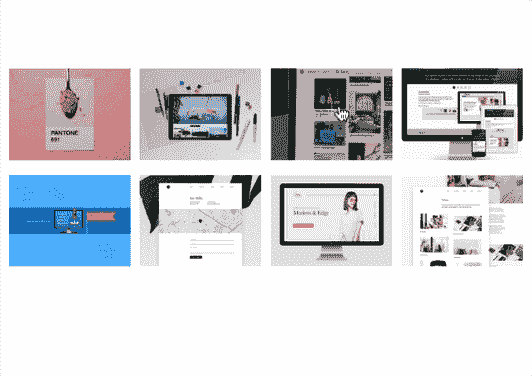
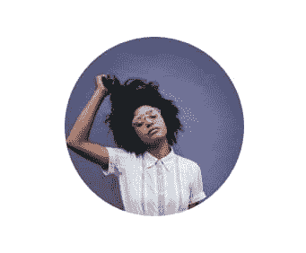
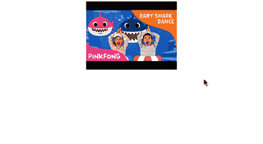
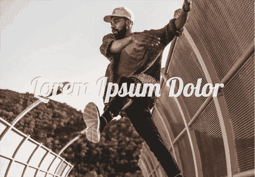
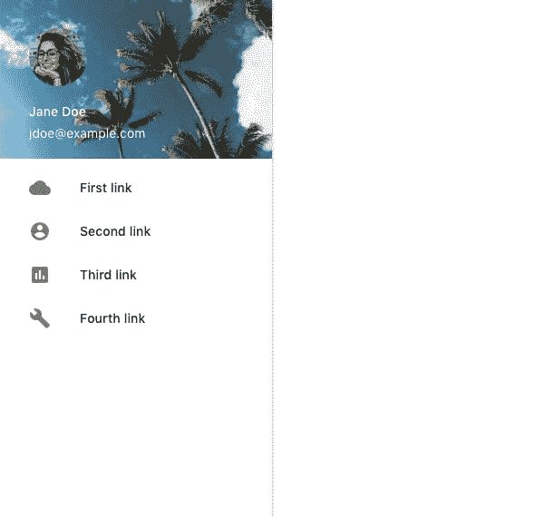

# 作品集、人脸检测、YouTube 叠加图及更多|模块周一 26

> 原文：<https://dev.to/tyrw/portfolio-gallery-face-detection-youtube-overlay--more--module-monday-26-i10>

## 为您的下一个项目提供开源 mods

以下所有内容都是开源的，可以在任何网站、web 应用程序或其他任何地方免费使用。Anymod 还有数百个这样的。

单击一个 mod 来查看它及其源代码。

### 作品集图库

展示你的工作在一个干净的网格格式。
[查看 mod](https://anymod.com/mod/allaml?v=20)
  

### 人脸检测图像

自动将上传的图像裁剪到人脸上。
[查看 mod](https://anymod.com/mod/dkkrbr?v=20)
  

### YouTube 视频叠加

打开任何 YouTube 视频-只需添加视频 ID。触发警告:小鲨鱼做做做。
[查看 mod](https://anymod.com/mod/kddlam?v=20)
  

### 英雄单位衬底

位于其他内容下方的全屏图像。
[查看 mod](https://anymod.com/mod/orranl?v=20)
  

### 固定轮廓导航

固定侧边导航，带有个人资料信息。
[查看 mod](https://anymod.com/mod/allanl?v=20)
  

* * *

我每周一都会在这里贴上新的 MODS-我希望你会觉得它们有用！

快乐编码✌️