# 快速认证的可能奇怪的方法——用户注册 API 和 Passport

> 原文：<https://dev.to/ibmdeveloper/possibly-odd-approach-for-quick-authentication-user-registry-api-passport-js-tutorial-3k02>

🌺所以我昨晚醒来时想“这可能有点奇怪。”🌺

T3】

* * *

**Article**

我想回顾一下我的所作所为以及原因。因此，本文将介绍如何将我现有的应用程序与通过在平台上创建 API 而生成的示例代码进行集成。

我的 Cloud Foundry 应用程序是带有快速框架路由的节点。ejs 视图引擎。这个名为`App ID`的 API 有一个用户注册中心，附带 Swift、Node、Java 和 Android 的样本代码| SDKs。API 有一个免费层，最多可容纳 1000 个用户和 1000 个事件(一个“事件”就像有人登录)。

查看该应用所有功能的最佳方式是查看 [API 文档](https://tinyurl.com/y34yy59z)。

[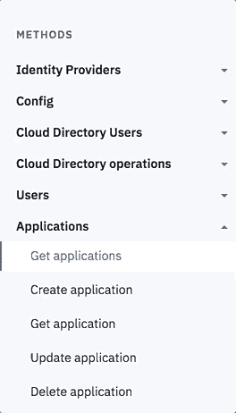](https://i.giphy.com/media/lPRJm0Y6QWnDUaY6ba/giphy.gif)T3】

* * *

**周五晚上**

我在办公室的豆包上使用[Passport-Local mongose](https://tinyurl.com/kwehabu)通过电子邮件和密码快速登录这个应用程序。

[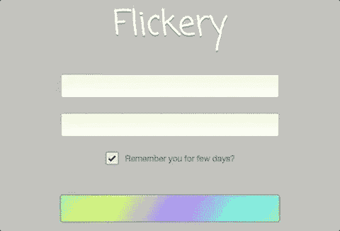](https://i.giphy.com/media/kEX6BLa5F2VofquFQt/giphy.gif)

我真的需要在 MongoDB 中存储用户信息吗？没有人需要注册这个应用程序。

目前，我正在为一小部分人提供应用程序的链接，这可能会有所帮助。该应用程序服务于一个目的，并且没有使用任何 API。没什么敏感的。

因为我已经在使用 Passport.js 了，我隐约记得 IBM Cloud 上有一个服务，我可能见过它以某种方式使用 Passport 这个 API 最终成为 App ID。它有一个用于移动和 web 的节点 SDK。

我查看了应用 ID 文档，注意到一些可能非常有用的东西:云目录。

因此，我决定使用这个 API 为我的应用程序注册用户。这个举动在周五晚上为我节省了很多时间。

奇怪的是，我必须为用户填充密码...

**花费的时间——我第一次使用这个 API** [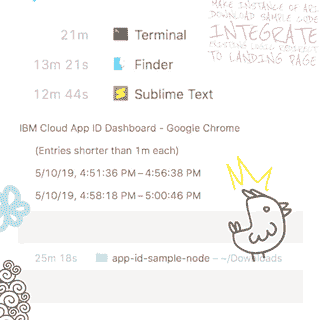](https://i.giphy.com/media/dXG2oppbjzs6PgWSKZ/giphy.gif)

让我们开始吧。以下是步骤。应该不会太多。

* * *

📄[注册 IBM 云](https://tinyurl.com/y5ma4aj3)
📧通过电子邮件确认注册
💻登录账户
😄配置 [IBM Cloud CLI](https://tinyurl.com/y46m227u)
🎸[创建应用 ID 服务](https://tinyurl.com/y2f7rtvq)
🎨下载示例代码
🌊集成到现有应用程序
👽从登录设置和重定向
🎀在云目录中添加用户
👑部署应用程序

* * *

**寄存器**

除了姓名|电子邮件，不需要任何东西。没有卡片。

* * *

**确认**

我写下这个注册过程，以确保我通过了所有的事情，每次注册到平台，不到五分钟就收到了确认邮件。

* * *

**Login**

登录您的帐户。

* * *

**CLI**

您将需要 IBM Cloud 的这个[命令行界面。这适用于在本地构建，然后想要重新部署与本教程相关的示例代码的情况。](https://tinyurl.com/y46m227u)

您需要知道的命令(请记住安装后使用 CLI 开始新的终端会话)= >

`ibmcloud login`
T1】

* * *

**API**

创建供您自己使用的 API。您可以使用我的[链接](https://tinyurl.com/y2f7rtvq)或在目录的安全部分下查找应用 ID。你可以通过 [IBM Cloud CLI](https://tinyurl.com/yx9s3naw) 来完成这一切。

[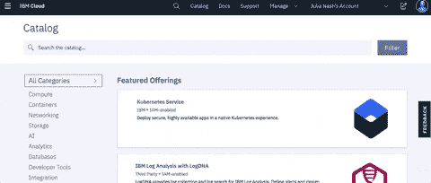](https://i.giphy.com/media/fVWConMBT2Pjunb93l/giphy.gif)

* * *

**点击**

一旦你到达服务的登陆页面，在最右边的角落有一个标有“创建”的小按钮。单击该按钮创建一个供您自己使用的 App ID 实例。

* * *

**Sample Code**

下载 Swift、Node、Java 或 Android 的示例代码。
[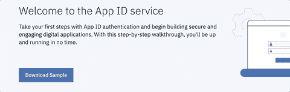](https://i.giphy.com/media/QWXb7zdirSYT5w7oF3/giphy.gif)T4】

* * *

**Integrate**

您可以在其他平台上托管您的应用程序时使用此服务。它不必托管在 IBM Cloud 上。

还记得那个示例代码吗？在这里真的很有用。
[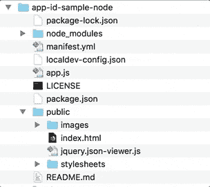T3】](https://i.giphy.com/media/eJA5Yrl4OcehkwvVcw/giphy.gif)

我在 Sublime 中打开了/protected.ejs，并将现有应用程序主页的代码放在这里。

然后，我确保所有文件的路径都是正确的，所以它可以正确地渲染。

* * *

**Setup**

因为当您想要将这个示例应用程序重新部署到 IBM Cloud 并进行集成时，您将需要查看位于`manifest.yml`底部的示例代码的别名连接。

[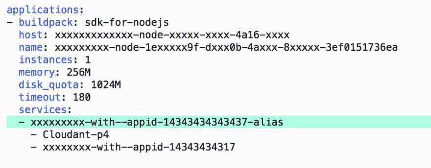](https://res.cloudinary.com/practicaldev/image/fetch/s--j-2YNyAl--/c_limit%2Cf_auto%2Cfl_progressive%2Cq_auto%2Cw_880/https://i.imgur.com/4lcPmV9.png)

这个别名在您的 App ID 服务和作为 Cloud Foundry 应用程序的示例代码之间创建了一个连接。因此，需要为您配置 IBM Cloud CLI 来完成这项工作。这部分的文档其实很好。

但是有一件有趣的事情需要处理，可以节省你一些时间。

如果您查看侧面板中您帐户的`Resource List`:

[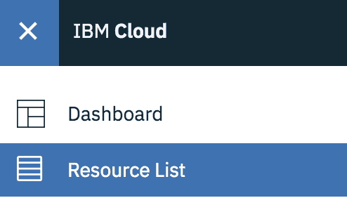](https://res.cloudinary.com/practicaldev/image/fetch/s--vny7qmuU--/c_limit%2Cf_auto%2Cfl_progressive%2Cq_auto%2Cw_880/https://i.imgur.com/Dj4ziDf.png)

您的服务名称中有空格吗？在重新部署时，有空白会把事情弄糟。如果你的应用 ID 的服务名有空格，例如`App ID-4343`，那么使用右边的省略号`Rename`到`AppID-4343`来纠正这个错误。

[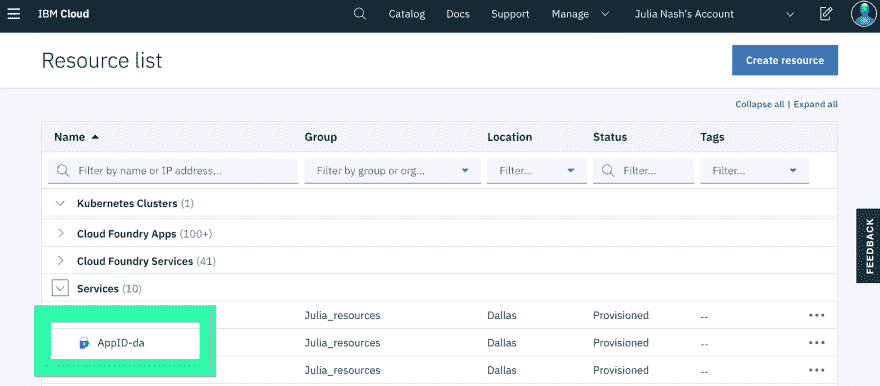](https://res.cloudinary.com/practicaldev/image/fetch/s--hZyAe6Ns--/c_limit%2Cf_auto%2Cfl_progressive%2Cq_auto%2Cw_880/https://i.imgur.com/dwjELhH.png)

然后转到本地的示例代码，查看 manifest.yml 文件。包含单词`alias`的服务名中有空格吗？

让我们去拿掉那个只会让我们的终端出错的空白，那个一直在我们身边的人！

然后按照这里的命令[正确地创建别名，以绑定到该服务名。它现在不应该吐出任何错误。](https://tinyurl.com/yy2gk59k)

还有一个小注意，这些指令中的这个特殊命令？

`ibmcloud resource service-alias-create {ALIAS_NAME} --instance-name {SERVICE_INSTANCE_NAME}`

当您为这些名称发出这个命令时，可以去掉那些花括号。

如果你搞砸了，你可以删除别名。为此，您可以进入左侧导航栏中的 IBM Cloud“Resource List ”,找到服务标题中带有“alias”一词的 App ID 实例，单击省略号并在下拉列表中选择“Delete”。

* * *

**Redirect**

manifest.yml 是从命令行部署带有您的修改的应用程序所必需的。如果你想了解更多，你可以在 [Cloud Foundry 文档](https://tinyurl.com/ya7d3fbw)中阅读关于该平台的目的。

让我们回到 IBM Cloud 上的 App ID 服务主页。

我们需要为您的应用程序添加适当的回调。

点击维修导航栏中的`Manage Authentication`。

并打开`Authentication Settings`选项卡。

[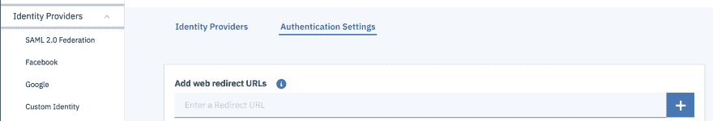](https://res.cloudinary.com/practicaldev/image/fetch/s--6ykOW9h4--/c_limit%2Cf_auto%2Cfl_progressive%2Cq_auto%2Cw_880/https://i.imgur.com/giIZAce.png)

在 manifest.yml 文件中查看应用程序的名称。你的域名是什么？

现在您可能还没有将它路由到一个自定义域，所以让我们使用`mybluemix.net`域并在其末尾添加`/ibm/bluemix/appid/callback`。

您也可以在这里添加任何其他路径。总的来说，你在这里提供了符合犹太教规的回电。

**云目录**

最后，现在我们可以用用户填充您的云目录了！

确保您的云目录在`Manage Authentication`管理部分的`Identity Providers`选项卡中切换`On`。

[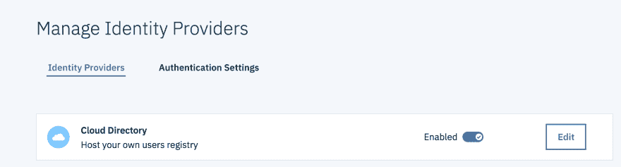](https://res.cloudinary.com/practicaldev/image/fetch/s--OafSPbv_--/c_limit%2Cf_auto%2Cfl_progressive%2Cq_auto%2Cw_880/https://i.imgur.com/DCEA4EJ.png)

[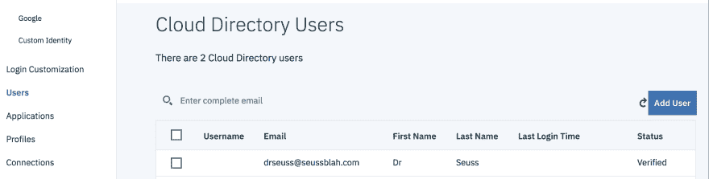](https://res.cloudinary.com/practicaldev/image/fetch/s--uLlGWds1--/c_limit%2Cf_auto%2Cfl_progressive%2Cq_auto%2Cw_880/https://i.imgur.com/Mhou8XR.png)

并在`Users`部分添加您的用户！

* * *

**直播**

一旦您准备好通过以上步骤配置一个实时链接，您就可以进入您的示例代码应用程序的本地根目录。键入命令`ibmcloud app push`来触发应用程序的部署。

部署过程完成后，此过程将为您提供一个到实时应用程序的链接。

[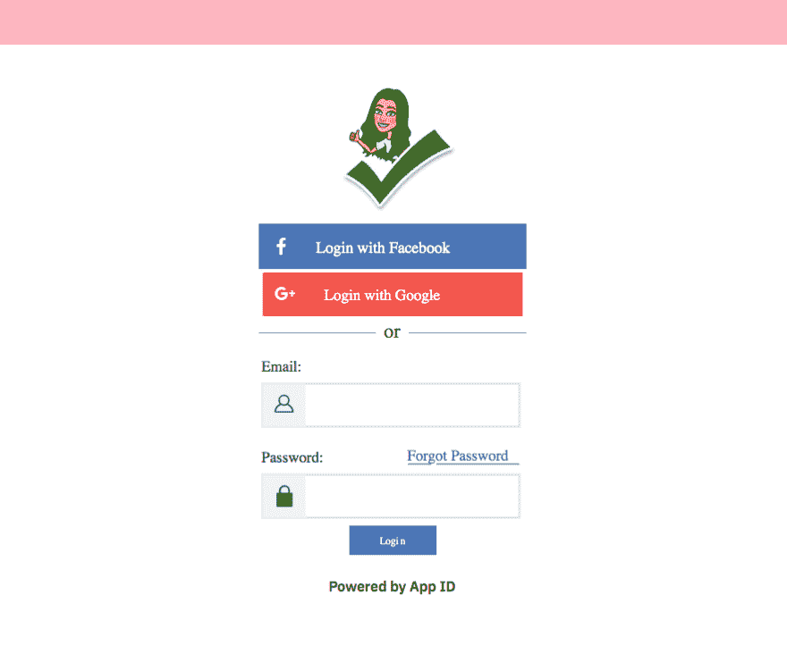](https://res.cloudinary.com/practicaldev/image/fetch/s--hrzC8x81--/c_limit%2Cf_auto%2Cfl_progressive%2Cq_auto%2Cw_880/https://i.imgur.com/5CwVima.png)

尝试使用其中一个电子邮件/用户名登录进行测试。

这项服务有很多很棒的功能。请记住，您不必在这里链接您的信用卡来提供服务。但是每发生 1000 次免费事件，它就会停止运行。

我认为这个阈值将是第一个上限，除非您可以通过 API 批量添加多个用户。这是因为我测试了登录本身的 6 个事件。但对于演示| PoC 或网络流量较小的应用程序的安全登录，这可能是一个临时的免费解决方案。

希望你喜欢这个教程。谢谢！

**一些有用的链接**

*   [App ID 登陆页面](https://tinyurl.com/y663blec)
*   [App ID 视频概述](https://tinyurl.com/yyl4fr5x)
*   [API 引用](https://tinyurl.com/y5ph6a28)
*   [使用应用 ID 保护 Angular+Node.js 应用](https://tinyurl.com/yy4zx22e)

