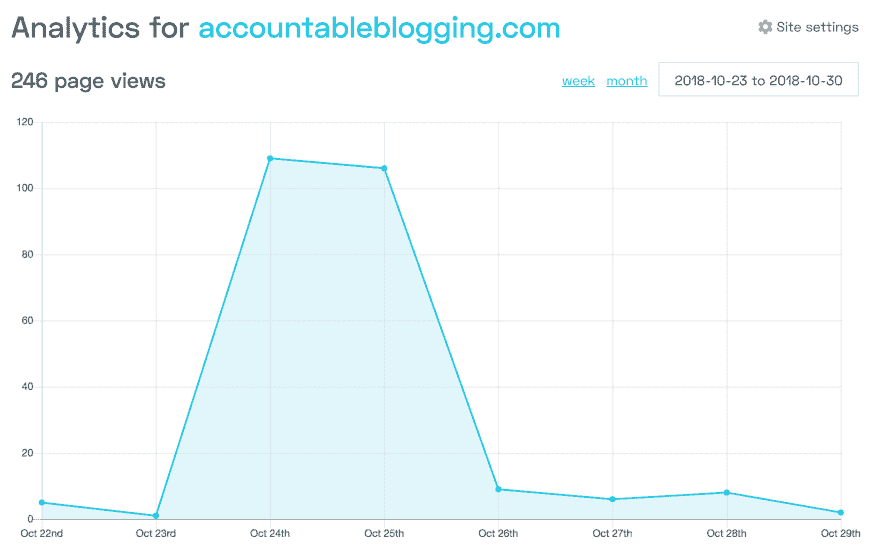
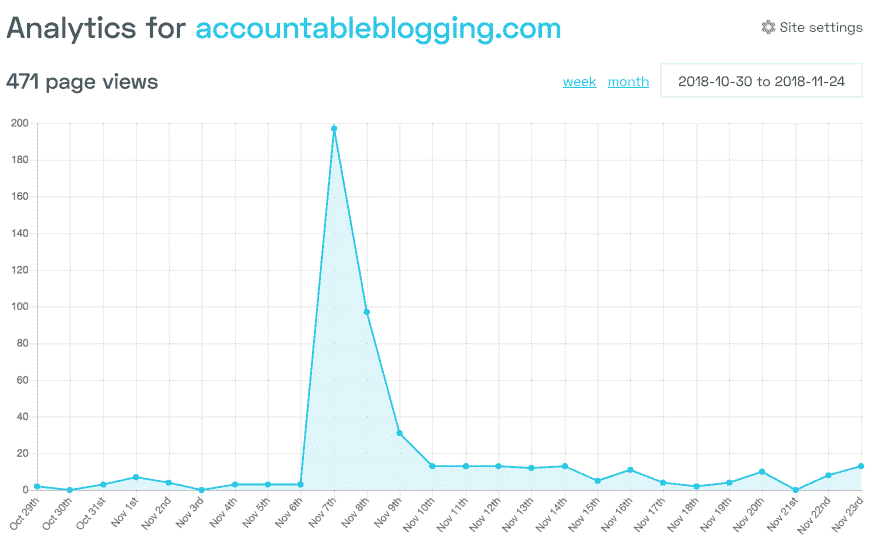

# 发布频率:使用 Vue +节点从原型到生产

> 原文：<https://dev.to/hugo__df/post-frequency-from-prototype-to-production-with-vue--node-27e5>

> 如果你想出货，使用你知道的工具。—很多人

让我们应用这个原则:我正在构建[帖子频率/负责任的博客](https://accountableblogging.com)，我熟悉 Vue 和基于节点的后端。Netlify 使前端部署变得简单，我已经决定用 Dokku 来托管数据库/后端应用程序。

看我如何部署我的应用[部署选项:DigitalOcean 上的 Netlify+Dokku vs now . sh，GitHub Pages，Heroku 和 AWS](https://dev.to/hugo__df/deployment-options-netlify--dokku-on-digitalocean-vs-nowsh-github-pages-heroku-and-aws-4cab) 。

目录:

*   [语境](#context)

*   [前端](#frontend)

    *   视图+视图 CLI 3
    *   [vista CLI 前传 SPA 插件](#vue-cli-prerender-spa-plugin)
    *   [仅在生产中加载一些脚本](#load-some-scripts-only-on-production)
    *   [仅在*未*预渲染`injectX`时加载脚本使用:](#load-scripts-only-if-not-pre-rendering-injectx-using)
*   [使用`.env.${ENVIRONMENT}`文件传递服务 URLs】](#pass-service-urls-using-envenvironment-files)

*   [社交和谷歌友好](#being-social-and-google-friendly)

    *   [可抓取](#be-crawlable)
    *   [图标和清单](#favicons-and-manifests)
    *   [元描述，OpenGraph 标签](#meta-description-opengraph-tags)
        *   [不带路由器](#without-router)
        *   [带 vue 路由器](#with-vue-router)
*   [后端服务](#backend-services)

*   [发射](#launch)

*   [结果](#outcomes)

## 上下文

负责任的博客将永远是一个单一的页面应用程序，最初的后端将是 Netlify lambdas…当我遇到一些问题时，我只是回到我所知道的，设置 Dokku 部署一些后端服务。

因为我的 lambdas 已经写好了，所以我选择了`micro`(见[简单但不太简单:如何使用 Zeit 的 micro 改进你的节点应用](https://dev.to/hugo__df/simple-but-not-too-simple-how-using-zeits-micro-improves-your-node-applications-1kah))而不是 Express。在[的另一篇文章](https://dev.to/hugo__df/simple-but-not-too-simple-how-using-zeits-micro-improves-your-node-applications-1kah)中，我将更详细地介绍我为什么这样做，简而言之:它更轻便，需要更少的样板文件/助手包来启动和运行单个 post 端点。

## 前端

### 视图 cli 视图 3

我是 Vue 的超级粉丝。它很简单，有很好的文档，很容易编写。

我从未真正尝试过 Vue CLI。就像其他官方的 Vue 包和生态系统一样，它有非常好的人体工程学(例如，一个插件系统，一个本地用户界面，热模块重装功能)。

### vista CLI 前 SPA 插件

为了让我们的 SPA 有可索引的 HTML，我们可以利用[vue-CLI-plugin-prerender-SPA](https://www.npmjs.com/package/vue-cli-plugin-prerender-spa):

```
# if you have vue-cli globally installed
vue add prerender-spa
# if you have it only locally installed
npx vue add prerender-spa 
```

### 仅在生产时加载一些脚本

有些情况下，您只想在生产环境中加载一些脚本。

下面以 [crisp.chat](https://crisp.chat) JavaScript SDK(加载很慢，在本地使用没有意义)`public/index.html`(我相信使用 EJS 模板):

```
<script type="text/javascript">
  window.$crisp=[];
</script>
<% if (NODE_ENV === 'production') { %>
    window.CRISP_WEBSITE_ID="SOME_ID";
    (function(){d=document;s=d.createElement("script");s.src="https://client.crisp.chat/l.js";s.async=1;d.getElementsByTagName("head")[0].appendChild(s);})();
  </script>
<% } %> 
```

这个`<% if (NODE_ENV === 'production') { %>`和匹配的`<% } %>`不包括在 dev 中呈现特定的脚本。

### 仅在*未使用*预渲染`injectX`时加载脚本:

有时候你想在*没有*预渲染的时候有条件的加载东西。这可以通过使用`window.__PRERENDER_INJECTED`(由 pre-render-SPA 设置的变量)来实现。

看起来是这样的:

```
if (!window. __PRERENDER_INJECTED || window.__ PRERENDER_INJECTED !== 'PRERENDERING'){
  // init stuff
} 
```

在`.prerender-spa.json`中需要以下内容:

```
{
  "customRendererConfig": {
    "inject": "PRERENDERING"
  }
} 
```

因此，完整的示例是:

```
<script type="text/javascript">
    window.$crisp = [];
    window.CRISP_WEBSITE_ID="SOME_ID";
  </script>
  <% if (NODE_ENV === 'production') { %>
  <script>
    if (!window. __PRERENDER_INJECTED || window.__ PRERENDER_INJECTED !== 'PRERENDERING'){
      (function(){d=document;s=d.createElement("script");s.src="https://client.crisp.chat/l.js";s.async=1;d.getElementsByTagName("head")[0].appendChild(s);})();
    }
  </script>
<% } %> 
```

## 使用`.env.${ENVIRONMENT}`文件传递服务 URL

你可能想在开发时使用后端服务的本地版本，而在生产时使用现场版本，以下是你如何使用`.env`文件`.env.development` :
来实现这一点

```
VUE_APP_FEED_SERVICE_URL=http://localhost:1234 
```

`.env.production` :

```
VUE_APP_FEED_SERVICE_URL=https://my-live-service.accoutableblogging.com 
```

在您的应用程序代码中，您可以在`process.env.VUE_APP_FEED_SERVICE_URL`下访问它，例如:

```
const FEED_SERVICE_URL = process.env.VUE_APP_FEED_SERVICE_URL;
export const FEED_DATA_URL = `${FEED_SERVICE_URL}`; 
```

## 社交和谷歌友好

### 可爬行

作为一个好的互联网公民，我们应该在不启用 JavaScript 的情况下也是可读的。由于我们正在利用 Vue/vue-cli/vue-router，我们可能应该预渲染(参见 Vue CLI prerender SPA 插件部分)。

更好的是你可以提交给谷歌网站管理员工具的`sitemap.xml`，我还没有找到一个好的解决方案，但如果/当我找到了，你可以肯定我会分享它，所以[订阅我的简讯](https://buttondown.email/hugo)。

### 图标和清单

从[realfavicongenerator.net](https://realfavicongenerator.net/)获得您的资产。

这个过程的最后是一个 zip 文件夹和一些标签的下载，你可以复制它们。

解压图标并把它们转储到`public`文件夹中，然后把标签添加到`public/index.html`文件的`head`中。

### Meta 描述，OpenGraph 标签

使用[realfavicongenerator.net/social](https://realfavicongenerator.net/social/)或 [metatags.io](https://metatags.io/) 创建您的资产。

这里有一个有趣的问题:标签中的资源(URL)需要是一个绝对的 URL。

#### 不带路由器

即。你有一个只有一页的应用程序🙂，然后只需将您的标签添加到`public/index.html`。

#### 带 vue-路由器

我使用了[这篇文章](https://alligator.io/vuejs/vue-router-modify-head/)，你应该[订阅时事通讯](https://buttondown.email/hugo)，为了下周的文章，如果你想知道我是如何设置它的。

## 后端服务

如果你有一个`some-service`服务，有一个`src/services`文件夹，任何后端的东西都将存放在里面。

我的过程从一个目录`src/services/some-service`开始，其中包含一个快速或微型应用程序(参见[这篇关于我如何设置我的微型应用程序](https://dev.to/hugo__df/simple-but-not-too-simple-how-using-zeits-micro-improves-your-node-applications-1kah)的文章)。

对于每个服务，我们将为 Dokku(或 Heroku 或您正在使用的任何其他基于 git 的方法)创建一个 git 远程

```
git remote add dokku-service dokku@${DOKKU_INSTANCE_IP}:some-service` 
```

从项目根(顶层`package.json`所在的位置)部署到 Dokku，可以通过
完成

```
git subtree push --prefix src/services/some-service dokku-service master 
```

如果您想使用`npm run deploy:service`进行部署，您可以将以下内容放入顶层`package.json` :

```
{
  "scripts": {
    "deploy:service": "git subtree push --prefix src/services/some-service dokku-service master"
  }
} 
```

## 发射

我的发布相当成功，它始于一篇 [IndieHackers](https://indiehackers.com) 帖子:[展示 IH:你博客的 GitHub 风格的图表](https://www.indiehackers.com/forum/show-ih-a-github-style-graph-for-your-blog-da74a24d42)和一篇 [dev.to](https://dev.to) 帖子:[你博客的 GitHub 风格的贡献图](https://dev.to/hugo__df/github-style-contribution-graph-for-your-blog-78f)。

这两个加起来给我带来了一些流量(IndieHackers 推荐了 90 个，dev.to 推荐了 60 个)，见:

[](https://res.cloudinary.com/practicaldev/image/fetch/s--oIBLUV1b--/c_limit%2Cf_auto%2Cfl_progressive%2Cq_auto%2Cw_880/https://i.imgur.com/iqfFJWP.png)

ProductHunt 的发布也相对顺利，[参见 ProductHunt 的发布频率](https://www.producthunt.com/posts/post-frequency)。它上了头版(我估计瑞安·胡佛与此有关😉)并获得了 100+的投票。这更像是“看看我做的这个东西”，而不是一个成熟的产品，所以它还不错。大约有 250 人从那里查看了它(从 ProductHunt 直接推荐)。ProductHunt 的特点是其他工具从那里读取数据并将其整合，因此您也可以看到少量其他流量，请参见下图:

[](https://res.cloudinary.com/practicaldev/image/fetch/s--P6qtrs2r--/c_limit%2Cf_auto%2Cfl_progressive%2Cq_auto%2Cw_880/https://i.imgur.com/AP27VWy.png)

## 结果

我目前有 18 个电子邮件注册，如果你感兴趣，你也可以注册:[accountableblogging.com](https://accountableblogging.com)。

我已经创建了一个小的电子邮件+调查，人们可以使用 Typeform，如果你注册，你会收到它。

接下来的步骤是把这个东西造出来。很简单:给我你的网址+支付细节，我跟踪你发布了多少，你达到你的目标或支付。

[un splash-logo
neon brand](https://unsplash.com/@neonbrand?utm_medium=referral&utm_campaign=photographer-credit&utm_content=creditBadge)