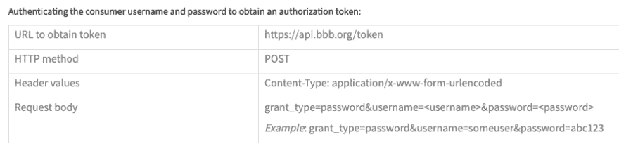
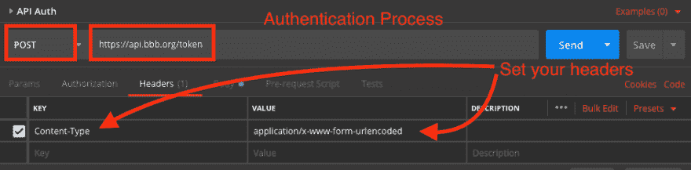
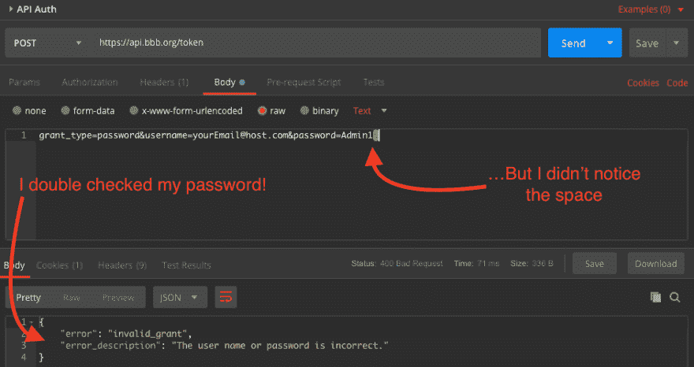
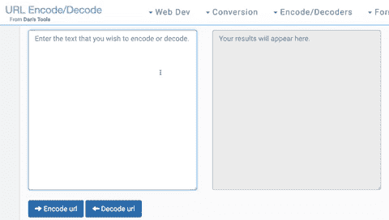

# 邮递员、URI 编码和奥卡姆剃刀

> 原文：<https://dev.to/stephencweiss/postman-uri-encoding-and-occams-razor-1kik>

奥卡姆是 14 世纪的神学家兼哲学家，他现在最出名的可能是坚持使用节俭定律。也被称为“保持简单，笨蛋。”

这是一个记住奥卡姆会派上用场的故事。相反，我到处寻找除了用户错误之外的解释。

想跳到最后？这个故事的寓意是，如果你在一个 API 调用中使用一个`application/x-www-form-urlencoded`的`content-type`,一定要检查正文中是否有多余的空格或新的行字符。把他们留在家里会产生问题。

# 我最初怀疑 URI 的背景和编码

我使用密码管理器为我使用的几乎所有服务创建唯一的密码。这极大地简化了我的生活，没有记住所有密码或在许多服务中重复使用密码的精神负担。这也意味着我复制和粘贴了大量的密码。

当我最近注册探索商业改善局的 API 时，我就是这么做的。我去找我的密码管理器，问，“请，哦，请，生成一个我永远也不会记得，我永远也不想输入的密码！”

噗。它施展魔法，产生了一个 20 多个字符的密码，包括大写和小写字符，以及一些有趣的特殊字符，如`#`、`$`和`*`！

现在，根据说明，我所要做的就是发送一个 POST 请求来获得我的身份验证。

<figure> 

<figcaption>认证指令</figcaption>

</figure>

我开了邮差，准备成功！

设置好标题后，我移动到主体上，并(几乎)完全按照说明进行操作！但是正如下面的屏幕截图所示，我在行尾留下了一个空格或者一个换行符。事实证明——这很重要。那是我开始得到`400 Bad Request`错误的时候。

我没有从头开始一次输入一个字符的密码，而是*更改了*我的密码。我把它改成了非常简单的东西。是`Passw0rd`(我需要一个大写字母和一个数字)。这让我很痛苦，但我想控制不同的变量，并找出我误入歧途的地方。

一旦我更新了我的密码，我就收到了我的第一个`200 OK`响应和一个 access_token！

证明了这一点！问题是密码！但是为什么呢？

## 让我们开始寻找答案吧

我开始寻找新密码和旧密码之间的不同之处。我当然没有注意到尾随空格和/或认为它可能*可能*是我所有沮丧的原因。所以，我创造了一个更复杂的理论。我发现 URI 编码/解码有保留字符。人物*如*`#``$``*`。

所以，我把责任归咎于团队，他们选择允许这些特殊字符出现在他们的密码中，因为他们有可能造成如此多的挫折。

## 驳斥不好的理论

直到我开始写这段经历时(最初是警告说如果必须编码就不要使用保留字符)，我才发现问题不在这里。

这证明了 URL 编码可以双向进行。使用 [Dan 的工具 URL 编码/解码](https://www.url-encode-decode.com/)(最初为我的半生不熟的理论提供素材的同一个网站)，我决定进行测试。

<figure> 

<figcaption>两路 URL 编码</figcaption>

</figure>

如果编码/解码过程是罪魁祸首，我就不能用保留字符对密码进行编码，然后得到同样的结果。然而，这正是*我所能做的。我从编码`A*D(S$#dasf1859`开始。这将返回`A%2AD%28S%24%23dasf1859`。然后我解码*和*并得到两条线的`A*D(S$#dasf1859`。*

 *瞧。摒弃错误的理论。

# 结论

当事情不太顺利时，把矛头指向其他地方要容易得多。然而，答案往往是最简单的。还有一个永远不要忘记奥卡姆或 T2 接吻法则的原因。*