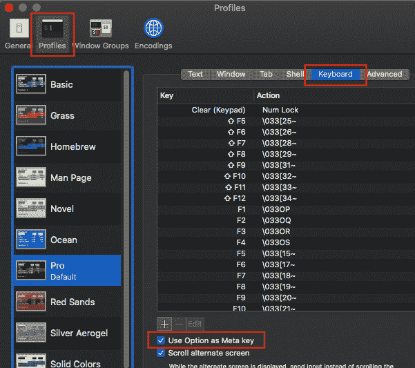
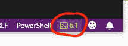

# PowerShell 速成班

> 原文：<https://dev.to/jeikabu/powershell-crash-course-3go5>

说实话，`cmd.exe`烂透了。我对 MS-DOS 6.0/6.22 有着美好的回忆，但在经历了 Linux/Unix 的学习曲线之后，很难再回头。当 PowerShell 1.0 发布时，我很兴奋；终于有了一个“真正的”Windows 命令行界面。但是我不能真的被要求学习它，继续安装 [cygwin](https://www.cygwin.com/) 或 [msys](http://mingw.org/wiki/msys) 。

[在发现](///2018/09/26/new-microsoft.html) [PowerShell Core](https://github.com/PowerShell/PowerShell) 是多平台后，它又回到了我的视野中，因为有几个用例:

*   [视窗自动化](//./reusable-windows-vms-with-vagrant-2h5c)
*   CI/CD
    *   我们的 [JenkinsFile](https://jenkins.io/doc/book/pipeline/) 被内联脚本弄得臃肿不堪(有些被转移到了 C#，但那次尝试并不成功)
    *   [某供应商](//./a-potpourri-of-net-core-cicd-lite-24ba#appveyor)其中`pwsh:` [在 Linux/Windows 上都能工作](https://www.appveyor.com/docs/getting-started-with-appveyor-for-linux/#running-windows-and-linux-builds-side-by-side)
*   Windows OEM
    *   如果您作为 Windows OEM 授权厂商、设备 OEM/ODM 或企业 IT 定制/自动化 Windows 操作系统设置，您几乎必须使用 PowerShell

这对于小抄/快速参考/食谱来说比教程更没用。如果你不习惯学习新的(脚本)语言，这可能是没有帮助的。

## 外壳键盘快捷键

显示所有快捷方式列表:

```
Get-PSReadlineKeyHandler 
```

Enter fullscreen mode Exit fullscreen mode

在 macOS/Linux 上，它默认为`emacs`“编辑模式”。如果你用过 emacs(或者 [bash 的 emacs 模式](https://www.gnu.org/software/bash/manual/html_node/Command-Line-Editing.html))，你会有宾至如归的感觉。在 Windows 上，默认是`Windows`，但是你可以:

```
Set-PSReadLineOption  -EditMode  Emacs 
```

Enter fullscreen mode Exit fullscreen mode

如果您是 PowerShell 新手，我强烈建议您切换到 emacs 模式。如果没有其他原因，您也将熟悉 Bash——您是否应该在 Linux 终端上工作。

日常使用的命令:

```
# Movement  Ctrl+a  # Beginning of line  Ctrl+e  # End of line  Ctrl+f  # Forward one character  Ctrl+b  # Back one character  Alt+f  # Forward one word  Alt+b  # Back one word  # Editing  Alt+.  # Insert last argument of previous command  Ctrl+d  # Delete character  Alt+d  # Delete word  Ctrl+u  # Delete to beginning of line  Ctrl+k  # Delete to end of line  # Command History  Ctrl+p  # Previous command  Ctrl+n  # Next command  Ctrl+o  # Execute command and advance to next  Ctrl+r  <text>  # Search command history for <text> 
```

Enter fullscreen mode Exit fullscreen mode

这是我希望在安装 Linux 的第一天就学会的。提示:您可以重复按下它，在最后一个参数的历史中循环。

同`Ctrl+o`。如果你需要重做一个命令序列:`Ctrl+p`回到开始，`Ctrl+o` `Ctrl+o` …如果你需要跳过一个就扔进`Ctrl+n`等等。

如果你在 macOS/OSX 上并且使用默认终端`Alt`是`Esc`。或者，您可以通过**端子>偏好** :

[](https://res.cloudinary.com/practicaldev/image/fetch/s--Y-_lK1b---/c_limit%2Cf_auto%2Cfl_progressive%2Cq_auto%2Cw_880/https://rendered-obsolete.github.io/assets/osx_term_option.png) 使用`Option`(推荐)

## 基本语法

文字和变量:

```
$boolean  =  $true  # or `$false`  $string  =  "string"  $int  =  42  $array  =  1,  2,  3  $array2  =  @(1,  2,  3)  $array[0]  =  $null  # Remove first item  $hash  =  @{first  =  1  "second"  =  2;  third  =  3  }  # Add to hashtable  $hash  +=  @{4  =  "fourth"}  $hash["fifth"]  =  5  # Key has to be quoted here  $hash[4]  =  $null  # Remove value (but not key) from hash  # String with `PATH` environment variable  "$env:PATH  ${env:PATH}: safer"  # Multi-line "here string"  @"
"Here-string" with value $env:PATH "@  # Escape character  "literal `$ or `" within double-quotes"  # Evaluate expression  "Hello $(echo  world)"

# Casting locks variable type
[int[]]$ints = "1", "2", "3" $ints = "string" # Throws exception
# Destructuring $first, $rest = $ints # first = 1; $rest = 2,3 
```

Enter fullscreen mode Exit fullscreen mode

控制流:

```
$value  =  42  if  ($value  -eq  0)  {  # Code  }  elseif  ($value  -gt  1)  {  }  else  {  }  $value  =  "value"  # Match against each string/int/variable/expression case  switch  ($value)  {  "x"  {  echo  "matched string"  }  1  {  echo  "matched int"  }  $var  {  echo  "matched variable"  }  {  $_  -gt  42  }{  echo  "matched expression"  }  default  {  }  }  $collection  =  1,2,3,4  # Matched against each element of collection. `$_` is current item. `Break` applies to entire collection  switch  ($collection)  {  1  {  echo  $_  1  }  {  $_  -gt  1  }  {  echo  "$_ Greater than 1"  }  3  {  echo  $_  3;  break  }  }  # Output is (NB: there's no 4):  #1 1  #2 Greater than 1  #3 Greater than 1  #3 3  foreach  ($val  in  $collection)  {  }  while  ($value  -gt  0)  {  $value--  } 
```

Enter fullscreen mode Exit fullscreen mode

*   **赋值** : `+=` `-=` `*=` `/=` `++` `--`(如`++$int`或`$int++`或`$int += 1`)
*   **相等** : `-eq` `-ne` `-gt` `-ge` `-lt` `-le`
*   **匹配** : `-like` `-notlike`(通配符)、`-match``-notmatch`(regex；`$matches`包含匹配字符串)
*   **遏制**:`-contains``-notcontains``-in`T3】
*   **类型** : `-is` `-isnot`
*   **逻辑** : `-and` `-or` `-xor` `-not`或`!`(如`$a -and $b`或`-not $a`或`!$a`)
*   **替换** : `-replace`(替换一个字符串模式)
*   除了最后一个，都返回`$true`或`$false`
*   所有都不区分大小写。对于区分大小写的前缀`c`(例如`-clike`)
*   如果输入是集合，则输出是匹配的集合

*   [比较运算符](https://docs.microsoft.com/en-us/powershell/module/microsoft.powershell.core/about/about_comparison_operators)

## 要领

```
# List commands containing "Path"  Get-Command  -Name  *path*  # Get help for `Get-Command`  Get-Help  Get-Command  # List properties/methods of object  Get-Command  |  Get-Member  cd  output/Debug  Set-Location  output/Debug  # Current file/module's directory  $PSScriptRoot  ls  dir  # also works which is freaky/helpful for migration  Get-ChildItem  # Pattern glob  ls  *.jpg  Get-ChildItem  *.jpg  # Just files  Get-ChildItem  -File  # Just directories  Get-ChildItem  -Directory  Get-ChildItem  |  ForEach-Object  {  $_.Name  }  Get-ChildItem  |  Where-Object  {$_.Length  -gt  1024}  md  tmp/  New-Item  -ItemType  Directory  -Name  tmp/  -Force  |  Out-Null  # Add to PATH  $env:PATH  +=  ";$(env:USERPROFILE)" # `;` for Windows, `:` for *nix $env:PATH += [IO.Path]::PathSeparator + $(pwd)  # Any platform  # Check environment variable `GITHUB_TOKEN` is set  Test-Path  Env:\GITHUB_TOKEN  # Test for file/directory  Test-Path  subdir/child  -PathType  Leaf  # `Container` for directory  pushd  tmp/  popd  Push-Location  tmp/  Pop-Location  cd  -  # Go back to previous directory  # Write to stdout, redirect stderr to stdout, send stdout to /dev/null  Write-Output  "echo"  2>&1  >  $null  &{  Write-Warning  "warning"  Write-Output  "stdout"  # Append warnings to tmp.txt, rest to /dev/null  }  3>>  ./tmp.txt  |  Out-Null  # Write to stderr, redirect all, append to file  Write-Warning  "oops"  *>>  ./tmp.txt  # Execute string  $ls  =  "ls"  &  $ls  &  $ls  -l  # with args  # Execute string with args  $ls_l  =  "ls -l"  Invoke-Expression  $ls_l  # Execute file `script.ps1`  &  ./script  $file  =  "./script.ps1"  &  $file  # Execute command looking for failure text  $res  =  Invoke-Expression  "& $cmd 2>&1"  if  ($LASTEXITCODE  -and  ($res  -match  "0x800700C1")) {
    # Do something
} 
```

Enter fullscreen mode Exit fullscreen mode

*   [自动变量](https://docs.microsoft.com/en-us/powershell/module/microsoft.powershell.core/about/about_automatic_variables)
*   [供应商](https://docs.microsoft.com/en-us/powershell/module/microsoft.powershell.core/about/about_providers)(类似`Env:\`)
*   [重定向](https://docs.microsoft.com/en-us/powershell/module/microsoft.powershell.core/about/about_redirection)
*   [呼叫接线员`&`](https://docs.microsoft.com/en-us/powershell/module/microsoft.powershell.core/about/about_operators#call-operator-)

## 错误处理

Powershell 有终止错误(即异常)和非终止错误。

```
# Delete PathToDelete/ folder recursively ignoring all errors  Remove-Item  -Force  -Recurse  -ErrorAction  Ignore  PathToDelete  # Make terminating error  Write-Error  "fail"  -ErrorAction  Stop  throw  "fail"  # Non-terminating errors are terminating  $ErrorActionPreference  =  "Stop"  # Handle terminating error  try  {  throw  "fail"  }  catch  [System.Management.Automation.RuntimeException]  {  Write-Output  "Throw'd: $_"  ]  catch  [Microsoft.PowerShell.Commands.WriteErrorException]  {  Write-Output  "Write-Error'd"  }  catch  {  # Any error  }  finally  {  # Always executes  }  # Handling non-terminating errors  if  ($LastExitCode  >  0)  {  # Exit code of last program >0, which might mean it failed  }  if  ($?)  {  # Last operation succeeded  }  else  {  # Last operation failed  } 
```

Enter fullscreen mode Exit fullscreen mode

*   [常用参数](https://docs.microsoft.com/en-us/powershell/module/microsoft.powershell.core/about/about_commonparameters)(如`-ErrorAction`)
*   [偏好变量](https://docs.microsoft.com/en-us/powershell/module/microsoft.powershell.core/about/about_preference_variables)(如`$ErrorActionPreference`)

## 岗位

```
# Start job in background (sleeps for 200 seconds)  $job  =  Start-Job  {  param($secs)  Start-Sleep  $secs  }  -ArgumentList  200  # Or  $job  =  Start-Sleep  200  &  # Wait for it with a timeout  Wait-Job  $job  -Timeout  4  # Jobs run in their own session, use -ArgumentList  $value  =  "hi"  Start-Job  {  Write-Output  "value=$value"  }  |  Wait-Job  |  Receive-Job  # Output: value=  Start-Job  {  Write-Output  "value=$args"  }  -ArgumentList  $value  |  Wait-Job  |  Receive-Job  # Output: value=hi  # Start a bunch of work in parallel  Get-Job  |  Remove-Job  # Remove existing jobs  $MaxThreads  =  2  # Limit concurrency  foreach  ($_  in  0..10)  {  # Wait for one of the jobs to finish  while  ($(Get-Job  -State  Running).count  -ge  $MaxThreads)  {  Start-Sleep  1  }  Start-Job  -ScriptBlock  {  Start-Sleep  2  }  # Random work  }  # Wait for them all to finish  while  ($(Get-Job  -State  Running)){  Start-Sleep  1  } 
```

Enter fullscreen mode Exit fullscreen mode

*   [工作岗位](https://docs.microsoft.com/en-us/powershell/module/microsoft.powershell.core/about/about_jobs)
*   使用相对路径时要小心:在 macOS/Linux 上作业从`$HOME`开始，在 Windows 上从`Documents/`开始
*   需要`Receive-Job`来查看标准输出/标准错误
*   来自 [this SO](https://stackoverflow.com/questions/43685522/running-tasks-parallel-in-powershell) 的并行工作片段

## 参数和功能

脚本的命令行参数被处理为位于文件顶部的`param()`。

```
function  Hello  {  echo  Hi  }  # Call the function  Hello  # Output: Hi  # Function with two named params. First with type and default (both optional)  function  HelloWithParams  {  param([string]$name  =  "<unknown>",  $greeting)  echo  "hello $name! $greeting"  }  HelloWithParams  1  2  # Output: hello 1! 2  HelloWithParams  -greeting  40  # Output: hello <unknown>! 40  # Function with switch and positional parameters  function  Greeting  {  param([switch]$flag)  echo  "hello $flag  $args"  }  Greeting  more  stuff  # Output: hello False more stuff  Greeting  -flag  more  stuff  # Output: hello True more stuff  Greeting  -flag:$false  more  stuff  # Output: hello False more stuff  function  PositionalParams  {  param(  [parameter(Position=0)]  $greeting,  [string]$name,  [parameter(Position=1)]  $tail  )  echo  "$greeting  $name$tail"  }  PositionalParams  hi  "!"  # Output: hi !  PositionalParams  hi  -name  jake  "!"  # Output: hi jake!  PositionalParams  hi  "!"  -name  jake  # Output: hi jake!  function  FormalHello  {  param(  # Params default to optional  [parameter(Mandatory=$true,  HelpMessage="Initial greeting")]  [string]$greeting,  # If have multiple values have to use @()  [string[]]$name  =  @("Sir",  "<unknown>")  )  echo  "$greeting  $name  $suffix"  }  FormalHello  "Greetings"  # Output: Greetings Sir <unknown>  FormalHello  -name  sir,jake,3rd  -greeting  welcome  # Output: welcome sir jake 3rd 
```

Enter fullscreen mode Exit fullscreen mode

## 杂项

**Visual Studio 代码**:

*   使用[分机](https://marketplace.visualstudio.com/items?itemName=ms-vscode.PowerShell)。
*   在 Windows 上，安装 PowerShell Core，并在 Visual Studio 代码中单击“PowerShell 会话菜单”:

从出现的命令面板中选择**切换到 PowerShell Core 6 (x64)** 。

詹金斯:

*   内嵌 powershell 或调用脚本:

```
 powershell '''
      & ./script.ps1
      ''' 
```

Enter fullscreen mode Exit fullscreen mode

*   调用脚本并处理退出代码:

```
 def res = powershell returnStatus: true, script: '''
      & ./script.ps1
      '''
  if (res != 0) {
      currentBuild.result = 'UNSTABLE'
  } 
```

Enter fullscreen mode Exit fullscreen mode