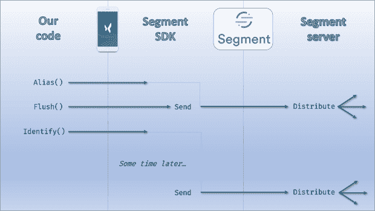

# 使用 Segment、Mixpanel 和 Google Analytics 的实用指南

> 原文：<https://dev.to/tdwright/practical-pointers-for-working-with-segment-mixpanel-and-google-analytics-5bo1>

虽然 Segment 可以让您轻松地从应用程序中快速发送事件，但还有许多不明显的细节。在这篇文章中，我将分享一些我们在 Mixpanel 和 Google Analytics 中实现坚如磐石的指标的过程中学到的技巧和诀窍。

如果你一直在关注这个系列的，你会知道我正在使用 Segment 将数据从我的移动应用程序和后端发送到 Mixpanel 和 Google Analytics。第一个帖子是[对这个话题的一般性介绍](https://dev.to/tdwright/understanding-your-users--an-introduction-to-behavioural-data-2f1g)。第二个介绍了[的技术](https://dev.to/tdwright/collecting-behavioural-data-with-segment-mixpanel-and-google-analytics-3ajh)。

在第三部分中，是时候真正深入一些具体细节了。的确，Segment 非常容易上手。添加 SDK，开始触发一些事件，也许添加屏幕加载跟踪到导航组件，嗯，完成？

不完全是。有几件事情要么不明显，要么完全令人困惑。我们的应用([来看看吧！在那之后的时间里，我们分享了令人挠头的行为数据。我翻遍了我的记事本，希望分享这些实用的建议能对某人有所帮助。](https://www.headuplabs.com/)

## 1) Mixpanel 身份管理

Mixpanel 对用户身份如何传达给它非常挑剔。在某种程度上，Segment 在他们的文档中有一个特殊的[部分，试图帮助开发人员把它做好。](https://segment.com/docs/destinations/mixpanel/#alias)

在用户从匿名潜在用户转变为注册用户的过程中，跟踪他们非常有用，但也非常棘手。Mixpanel(通过扩展，Segment)有一个名为`Alias()`的方法，需要在用户注册之后和使用新注册的用户信息调用`Identify()`之前调用一次。

如果您仔细阅读文档，这听起来并不太复杂，但是仍然有可能出错。你看，发送到 Segment 的事件不能保证按顺序到达。这意味着`Alias()`和`Identify()`的快速连续有时会颠倒过来(根据我的观察，在我们的应用程序中大约有 5%的时间是这样)。Mixpanel 没有很好地处理这个问题——它创建了重复的记录。这显然不太理想。

此问题的一个症状是存在重复用户，例如，电子邮件地址与多个“不同 ID”相关联。我改编了 Mixpanel 的一个 JQL 脚本来显示哪些电子邮件地址受到了影响。如果你喜欢，你可以在这里找到它[。(如果你还没有见过 JQL，请关注本系列的下一篇文章！)如果您看到重复的用户，他们可能是由于您的`Alias()`和`Identify()`事件以错误的顺序到达而创建的。](https://gist.github.com/tdwright/31b84ce23e61dc93b91c44eff28df31b)

幸运的是，这可以通过在两次调用之间调用`Flush()`来缓解。通过告诉 Segment SDK 清空其缓冲区，我们迫使它立即发送内容。

 

<figcaption>适时的冲水可以让你免于尴尬。</figcaption>

如果我们在调用`Alias()`之后但在调用`Identify()`之前立即这样做，我们最大化了事件以正确顺序到达的机会。

*注意:由于 Google 明确禁止您向他们发送可识别的用户信息，Segment 会自动阻止这些事件到达 GA。*

## 2)奇怪的页面序列

细分事件无序到达的另一个后果是，你的分析有时会让你看起来像是一小部分用户在你的应用中通过不寻常的(甚至不可能的)路径流动。

在谷歌分析中，当你查看“行为流”报告时，这种影响非常明显。如果你受到影响，你会注意到一些用户似乎偏离了大多数人的路线。

在我们的应用程序中，有几个单向页面序列，我们看到一小部分用户逆潮流而动。其中一些我们合理化了，因为用户点击了后退按钮，但其他的不应该是可能的。

与上面提到的身份管理问题一样，解决方案似乎是在代码中有策略地散布`Flush()`调用。

然而，我想强调这个症状的原因是它在 Mixpanel 中很难被检测到。我们还没有加入企业计划，所以不能使用“流程”功能。相反，我们将关键的相互作用建模为“漏斗”。这些是您可以指定的一系列事件中的流量报告。它们是严格单向的，所以如果事件没有按顺序发生，这些用户将会从你的漏斗中掉出。

在我看来，像这样的问题是细分市场指向多个目的地的一个很好的理由。如果不看谷歌分析，我们可能不会发现这一点。由于结果是少报了关键事件序列的完成率，我们很高兴理解并解决了这个问题。

## 3)绕过燃烧基

我不确定这是否一直都是一件事，但是谷歌分析正在大力推动人们使用 Firebase 作为中介。当你试图创建一个新的属性并选择“移动应用”作为类型时，你会被引导到 Firebase，而不是被提供通常的`UA-XXXXXXXX-1`跟踪代码。这可把我搞糊涂了！

无论如何，有一段时间，我似乎不得不在我们的应用程序中安装 Firebase SDK 来连接 GA。我对 Firebase 没有任何不满，但这似乎是一个不必要的步骤。Firebase 附带了许多我们不打算使用的功能，所以我为什么要在我的应用程序中加入他们的大块 SDK 呢？我为什么要支付他们每月 25 美元的特权呢？我肯定它很棒，但它不适合我们。

在那之后的一段时间里，我一直在考虑将 Firebase 配置为 Segment 中的一个目的地。不幸的是，很明显这只能在我们的应用程序的 iOS 版本中实现。不酷。

最终，我找到了一个解决方法。如果您创建了一个普通的(即网站)“属性”，则可以添加一个移动应用程序“视图”。此时，您有了一个跟踪代码，这意味着您现在可以将 Segment 连接到它。获得新视图后，您可以删除默认的网站视图。瞧啊。

## 4)你*将*编写目的地特定代码

尽管 Segment 的核心承诺，您将发现自己编写或更改代码来支持新的目的地。这是不可避免的，因为每个目的地都有自己的怪癖，对不同的事情会有不同的挑剔。减轻这种情况的一个事实是(如果你和我们一样的话)你可能会在不断完善你所追踪的事件的同时加入你自己的改变。

我已经提到过 Mixpanel 在身份管理方面很挑剔。如果你想把数据发送到 Mixpanel，我建议从一开始就满足他们的规范。

Google Analytics 也有一个有趣的要求:如果你希望页面浏览事件被接受(你可能会这样做)，你需要确保你发送的应用程序的完全限定名为 T1。我认为这对于原生应用是自动的，但是对于 React Native 必须手动完成。

作为一般的经验法则，在你开始编码之前，给文档一个相当彻底的阅读是值得的。

## 留意你的配额！

如果你正在尝试这些服务，你几乎肯定会从免费层开始。这些都是有限度的，而且(根据我的经验)当你超过限度时，并不总是能说清楚。我能看出这背后的原因——他们不想给那些还没有承诺的用户发垃圾邮件。

但是你的数据*会在某个时候*停止通过。当它来临时，你会踢你自己。很可能在拐点出现的时候。当你的应用程序最终获得牵引力，你兴奋地看着数字攀升。这会发生在这个时候，不是因为[欺骗法则](https://en.wikipedia.org/wiki/Finagle%27s_law)，而是因为你最有趣的时候也将是你最快速地咀嚼你的零花钱的时候。

我不会推荐一个技术解决方案。你只需要有点条理。以下是一些建议:

*   记下限制是什么
*   尽可能早地决定你是否最终想要转移到付费层级
*   定期(每周甚至每天)重新评估你预计何时达到定额
*   获得提前消费的授权，并知道谁有信用卡

不要犯错误，错过一些有趣的数据。不要让他们挟持你的度量标准。制定计划，做好准备，并保持领先。

## 包装完毕

这篇文章的主题是整个系列的推动力。当我在回顾我的笔记时，我意识到它们可能会引起其他试图做我们一直在做的事情的人的兴趣。然后，我开始思考我学到的其他东西，这些东西可能没有写进笔记本，好吧，我们在这里。

我真的希望这些建议对外面的人有用。这些工具都很优秀，但是要充分利用它们可能需要一些细致入微的细节。我希望我出发时准备得更充分些。

在下一篇文章中，我将探索一些更高级的技术，你可以在 Google Analytics 和 Mixpanel 中应用这些技术。在那之前，尽情玩你的行为数据吧！

你对使用 Segment、Mixpanel 或 Google Analytics 有什么建议吗？请在评论中分享！