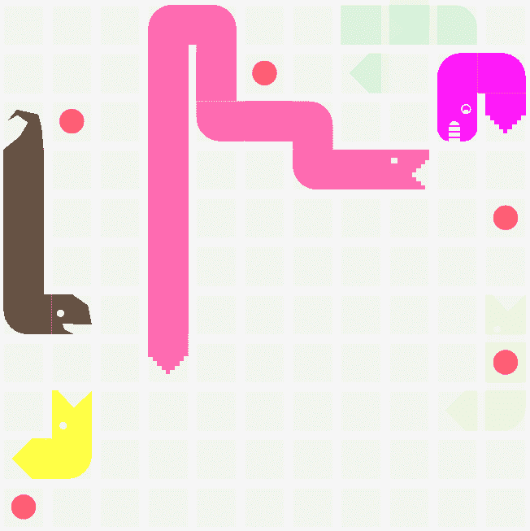

# 准备战斗蛇

> 原文：<https://dev.to/mykalmachon/preparing-for-battlesnake-4bl5>

今年的 Battlesnake 比赛将于 2019 年 3 月 2 日在维多利亚会议中心举行，在此之前我已经做了很多准备。

### 但是等一下...《战蛇》是什么？

用组织者的话说...

> 《战蛇》是一种练习编程和学习新技能的有趣方式。团体和个人利用现代现实技术构建 AI 机器人来玩游戏《贪吃蛇》。阅读文档，将您的蛇部署到一个活动的 web 服务器上，并加入其他程序员的行列，尝试成为最后一条蛇。( [Battlesnake.io](https://play.battlesnake.io/) )

如果你曾经在手机或电脑上玩过经典游戏 **snake** ，你就会确切地知道战蛇竞技场是什么样子。

想象屏幕上不是一条蛇，而是 4-5 条。所有人都为相同的食物和空间而战，最佳编程蛇将获得现金奖励和受人尊敬的战斗蛇冠军头衔。

听起来很有趣，对吧？我想是的！如果你仍然不相信，这里有一个视频

### 我今年为《战蛇》设定的目标

既然我已经了解了基本原理，我就把 battlesnake 作为一个机会，花一些时间磨练我的寻路技能，并编写一条至少可以用两条腿站立的蛇。

虽然，在一个完美的世界里，我会在这上面花上几个小时，但我在《战蛇》后的一周和下一周都有期中考试，所以我得安排一下优先顺序。

#### 优先级#1:自我维持

这是我想让我的蛇人工智能达到的最低限度。

在这个水平上，我的蛇应该能够:

1.  不要因为撞到自己的身体/其他蛇/墙壁而自杀...
2.  能够在该地区找到食物的路线，并确定它是否能在其他蛇之前找到食物。
3.  1 + 2 的结果，能够*自持*如果是竞技场唯一的蛇。

#### 优先级#2:基本寻路

这是我现实地感觉到我应该能够在比赛之前把蛇带到的地方。

在这个水平上，我的蛇应该能够:

1.  做一条自我维持的蛇所能做的一切
2.  有某种内在的目标。例如，总是四处觅食，或者总是试图诱捕其他的蛇。
3.  有一个基本的加权系统，蛇可以决定哪一步是最好的，并采取行动。

#### 第三要务:变得有趣

这些是我认为玩起来很酷的东西，但我怀疑我是否真的会去实现它们。

在这个水平上，我的蛇应该能够:

1.  做一条基本的寻路蛇能做的一切。
2.  通过一个训练有素的神经网络进行操作。很可能是通过 OpenAI 或 Clarifai 构建的东西
3.  通过使用机器学习，在每次比赛后自主提高或“学习”的能力。

除了使用一些非常简单的预训练面部识别模型，我从未使用过任何人工智能技术。这将是一个非常有趣的游戏，但可能有点超出我的能力范围，无法在两周内实现。

### 关闭思绪

这实际上是我参加《战蛇》的第二年。我第一次参加是在 2017 年，大学第一年。我不认为我和我的团队能让这条蛇改变方向。当时我们都是非常没有经验的开发人员，从来没有使用过，甚至没有听说过 Node.js 或 Heroku 这样的工具。

尽管我们缺乏知识，但我们玩得很开心！这个活动的气氛非常棒，在这个 5-6 个小时的活动中，我学到了比我一整年在课堂上学到的更多的真实世界的发展。我记得我感到非常自豪，我们甚至让我们的蛇向服务器回复了 200。

想想就在两年前，我对今天几乎每天都在使用的技术一无所知，这真是太疯狂了。我有时觉得自己在与科技的赛跑中不断失利；好像我永远学不够，学得不够快，以至于觉得自己被赶上了，知识渊博了。

也就是说，能够回顾我在 2017 年的技能，并通过《战蛇》这样的镜头将它们与我今天的技能进行对比，真的激励我向自己证明我在这段时间里已经走了多远。我等不及要开始今年的蛇了！

本帖原写于 2019 年 2 月 18 日，[为个人博客。](https://mykalmachon.com)我的蛇 AI 进入了初级组的第二轮🎉！我确实取得了进步，我期待着在明年的《战蛇》中取得更大的进步。