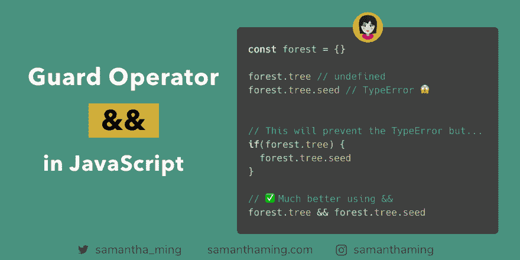

# 用&防止对象检索类型错误

> 原文：<https://dev.to/samanthaming/prevent-object-retrieval-typeerror-with--37b7>

[](https://res.cloudinary.com/practicaldev/image/fetch/s--zoduAEt9--/c_limit%2Cf_auto%2Cfl_progressive%2Cq_auto%2Cw_880/https://thepracticaldev.s3.amazonaws.com/i/tgrppxvcjz7elf7y1jxb.png)

当你获取一个`undefined`的对象值时，它会因为一个类型错误而崩溃！因此，请确保使用`if`语句进行初步检查。更好的是，使用`&&`重构它👍

以这种方式使用`&&`有时被称为**保护操作符**，因为第一个表达式保护第二个表达式。换句话说，只有当第一个表达式为真时，才会计算第二个表达式。

```
const forest = {}

forest.tree // undefined
forest.tree.seed // TypeError 😱

// This will prevent the TypeError but...
if(forest.tree) {
  forest.tree.seed
}

// ✅Much better using &&
forest.tree && forest.tree.seed // undefined 
```

## 理解& &运算符

我一直以为`&&`只是用于布尔校验，就像这样:

```
if(a && b) {
  // do something
} 
```

我从来没想过你可以用`&&`来评估某事或产生某种价值。所以当我第一次听说这个**守卫操作员**的时候，我超级迷茫。所以如果你也是也不用担心。理解这一点需要一些时间。帮助我最终理解这一点的资源是凯尔·辛普森的《[你不知道 JavaScript](https://github.com/getify/You-Dont-Know-JS/blob/f0d591b6502c080b92e18fc470432af8144db610/types%20%26%20grammar/ch4.md#operators--and-) 》一书。

他是这样描述的:不仅仅把`&&`看作逻辑运算符，还把**看作选择运算符**。它们不会产生布尔值或逻辑值。相反，结果总是两个表达式中的一个。用他的话说，**他们选择两个操作数值中的一个**。

> &&或||运算符产生的值不一定是布尔类型。产生的值将总是两个操作数表达式之一的值。

在你认输之前，我们来看一个例子:

```
const truthy = true;
const falsy = false;
const money = '💰';

truthy && money; // '💰'
falsy && money; // false 
```

因此，如果第一个表达式(左侧)为真，将选择`money`。否则，将选择第一个表达式，而不会计算第二个表达式(右侧)。这就是所谓的**短路求值**，因为第二个表达式永远不会被求值。

下面是凯尔·辛普森的《你不知道的 JS》一书中的定义:

> 如果左操作数足以确定运算结果，则不会计算右操作数。因此，命名为“短路”(如果可能的话，它将采取早期的捷径)。

### 真值

所以基本上第一个表达式(左边)是你的真理检验器。如果为真，那么您的第二个表达式(右侧)将被选中。如果第一个表达式为假，则使用第一个表达式的值。为了理解什么是真理，让我们来看一下🤓

真实值列表是一个相当广泛的列表。所以与其回忆真实。记住谎言列表要容易得多。凡是不在虚假清单上的，都被认为是真实的👍*(我写了另一篇关于 Falsy 价值观的博文，你可以在这里阅读*

```
// JS Essentials: Falsy Values

false
undefined
null
NaN
0 or +0 or -0
"" or '' or `` (empty string)

// Everything else is truthy 
```

## 用`&&`重构`if`条件句

让我们看另一个例子，看看 guard 操作符对于重构条件语句是如何有用的。

```
const steak = '🥩'
function cook() = {...}

// Most people use `if`
if(steak) {
  cook()
}

// Refactored using &&
steak && cook(); // `cook` only gets called if `steak` is true 
```

这里有一个很好的例子来思考这个问题:

```
someCondition && doSomething() 
```

*感谢:[@ marcdel](https://twitter.com/marcdel/status/1104466866100002816)T3】*

## 建议可选链接

所以这真的很令人兴奋。EcmaScript 人员或 JavaScript 委员会正在提议一种“可选链接”语法。当我在 C#中工作时，这对我来说是一个游戏改变者。我一直希望 JavaScript 能有类似的东西。我真的希望这个提议能通过🙌

用建议的可选链接语法重写我们的示例🤩:

```
// Current
forest.tree && forest.tree.seed

// Proposal
forest.tree?.seed 
```

*不要在你的应用中使用，目前不支持。*

点击阅读更多关于提案[的信息。](https://github.com/tc39/proposal-optional-chaining)

* * *

## 资源

*   [MDN:逻辑运算符](https://developer.mozilla.org/en-US/docs/Web/JavaScript/Reference/Operators/Logical_Operators)
*   类型&语法
*   [YDKJS:短路](https://github.com/getify/You-Dont-Know-JS/blob/f0d591b6502c080b92e18fc470432af8144db610/types%20%26%20grammar/ch5.md#short-circuited)
*   [Javascript 中的保护和默认操作符](https://seanmonstar.com/post/707078771/guard-and-default-operators)
*   [JavaScript/运算符](https://en.wikibooks.org/wiki/JavaScript/Operators)
*   [SamanthaMing.com: Falsy 值](https://www.samanthaming.com/tidbits/25-js-essentials-falsy-values)

* * *

**感谢阅读❤**
问好！[insta gram](https://www.instagram.com/samanthaming/)|[Twitter](https://twitter.com/samantha_ming)|[脸书](https://www.facebook.com/hisamanthaming) | [媒体](https://medium.com/@samanthaming) | [博客](https://www.samanthaming.com/blog)