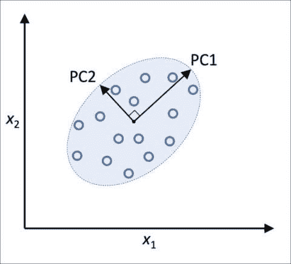
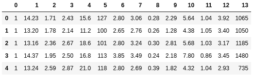
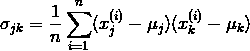
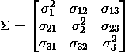
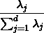
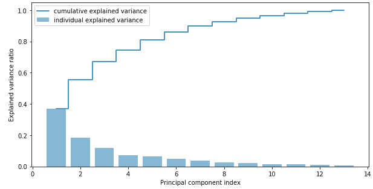
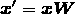
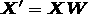
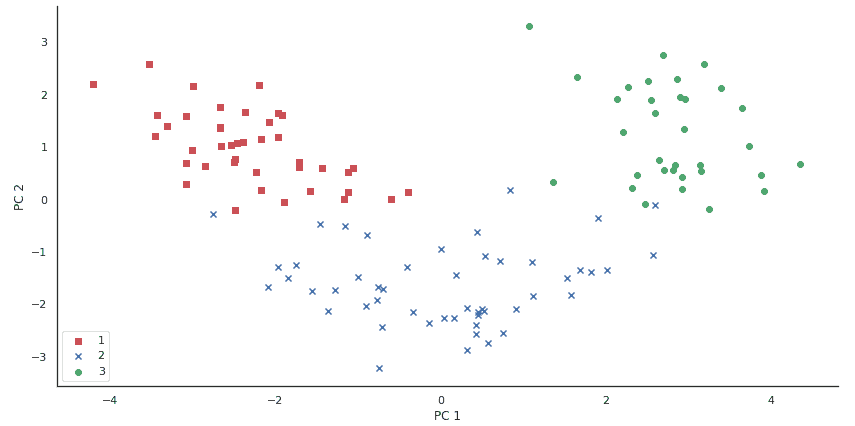
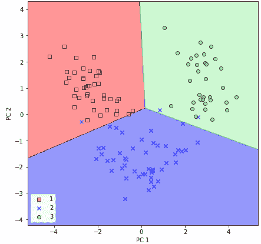

# 主成分分析降维

> 原文：<https://dev.to/nexttech/principal-component-analysis-for-dimensionality-reduction-57i1>

在现代技术时代，越来越多的数据被产生和收集。然而，在机器学习中，太多的数据可能是一件坏事。在某一点上，更多的特征或维度会降低模型的准确性，因为有更多的数据需要归纳——这被称为**维度诅咒**。

**降维**是降低模型复杂度，避免过度拟合的方法。降维主要有两类:特征选择和特征提取。通过特征选择，我们选择原始特征的子集，而在特征提取中，我们从特征集中提取信息来构建新的特征子空间。

在本教程中，我们将探讨特征提取。在实践中，特征提取不仅用于提高存储空间或学习算法的计算效率，还可以通过减少维数灾难来提高预测性能，尤其是在我们使用非正则化模型的情况下。

具体来说，我们将讨论用于将数据集压缩到低维特征子空间的**主成分分析** ( **PCA** )算法，目标是保持大部分相关信息。我们将探索:

*   PCA 背后的概念和数学
*   如何使用 Python 一步一步从头开始执行 PCA
*   如何使用 Python 库执行 PCA`scikit-learn`

我们开始吧！

> 本教程改编自 Next Tech 的 **Python 机器学习**系列的 *Part 2* ，带你从 0 到 100 用 Python 进行机器学习和深度学习算法。它包括一个浏览器内沙盒环境，预装了所有必要的软件和库，以及使用公共数据集的项目。这里可以免费[上手！](https://c.next.tech/2Jkpmb2)

* * *

## 主成分分析简介

**主成分分析** ( **PCA** )是一种无监督的线性变换技术，广泛应用于不同领域，最突出的是用于特征提取和降维。PCA 的其他流行应用包括股票市场交易中的探索性数据分析和信号去噪，以及生物信息学领域中的基因组数据和基因表达水平的分析。

PCA 帮助我们基于特征之间的相关性来识别数据中的模式。简而言之，PCA 旨在找到高维数据中最大方差的方向，并将其投影到一个新的子空间，该子空间的维数等于或小于原始子空间的维数。

给定新特征轴彼此正交的约束，新子空间的正交轴(**主分量**)可以被解释为最大方差的方向，如下图所示:

[](https://res.cloudinary.com/practicaldev/image/fetch/s--rgOTUI_F--/c_limit%2Cf_auto%2Cfl_progressive%2Cq_auto%2Cw_880/https://cdn-images-1.medium.com/max/720/1%2Azh1GxZ4BPCOPFmTxreVFdw.jpeg)

在上图中，*x<sub>1</sub>T3*x<sub>2</sub>T7】为原始特征轴， **PC1** 和 **PC2** 为主要部件。**

如果我们使用 PCA 进行降维，我们构建一个*d*x*k*–维度变换矩阵**T5】W**，它允许我们将样本向量 ***x*** 映射到一个新的*k*–维度特征子空间上，该子空间比原始的*d*–维度特征空间具有更少的维度:

[](https://res.cloudinary.com/practicaldev/image/fetch/s--3tM84RDT--/c_limit%2Cf_auto%2Cfl_progressive%2Cq_auto%2Cw_880/https://cdn-images-1.medium.com/max/720/1%2AytEHO-Wjos_ugY2LffXEyg.png)

作为将原始的 *d* 维数据转换到这个新的 *k* 维子空间(通常为 *k* ≪ *d* )上的结果，第一个主分量将具有最大可能的方差，并且所有后续主分量将具有最大方差，假设这些分量与其他主分量不相关(正交)——即使输入特征相关，得到的主分量也将相互正交(不相关)。

请注意，PCA 方向对数据缩放高度敏感，如果在不同的尺度上测量特征，并且我们希望对所有特征赋予同等的重要性，我们需要在 PCA 之前对特征进行标准化。

在更详细地查看用于降维的 PCA 算法之前，让我们用几个简单的步骤来总结该方法:

1.  标准化*维*维数据集。
2.  构建协方差矩阵。
3.  将协方差矩阵分解为其特征向量和特征值。
4.  按降序对特征值进行排序，对对应的特征向量进行排序。
5.  选择 *k* 个最大特征值对应的 *k* 个特征向量，其中 *k* 为新特征子空间的维数( *k* ≤ *d* )。
6.  从“顶” *k* 特征向量构造一个投影矩阵***W*T3】。**
7.  利用投影矩阵 ***W*** 对 *d* 维输入数据集 ***X*** 进行变换，得到新的 *k* 维特征子空间。

让我们使用 Python 作为学习练习，一步一步地执行 PCA。然后，我们将看到如何使用`scikit-learn`更方便地执行 PCA。

## 逐步提取主成分

在我们的例子中，我们将使用来自 UCI 机器学习知识库的 *Wine* 数据集。该数据集由 178 个葡萄酒样本组成，其中 13 个特征描述了它们不同的化学性质。你可以在这里找到更多[。](https://archive.ics.uci.edu/ml/datasets/wine)

在本节中，我们将处理 PCA 的前四个步骤；稍后我们将复习最后三个。您可以通过使用 Next Tech [沙箱](https://c.next.tech/2EtVp44)来遵循本教程中的代码，沙箱已经预安装了所有必要的库，或者如果您愿意，您可以在自己的本地环境中运行代码片段。

一旦您的沙盒加载完毕，我们将从直接从库
加载*葡萄酒*数据集开始

```
import pandas as pd

df_wine = pd.read_csv('https://archive.ics.uci.edu/ml/'
                      'machine-learning-databases/wine/wine.data',
                      header=None)
df_wine.head() 
```

[](https://res.cloudinary.com/practicaldev/image/fetch/s--IMprTFC8--/c_limit%2Cf_auto%2Cfl_progressive%2Cq_auto%2Cw_880/https://cdn-images-1.medium.com/max/720/1%2A4qDPuAo1N_SCV44YATKDFA.png)

接下来，我们将把 *Wine* 数据处理成单独的训练和测试集——使用 70:30 的分割——并将其标准化为单位方差:

```
from sklearn.model_selection import train_test_split
from sklearn.preprocessing import StandardScaler

# split into training and testing sets X, y = df_wine.iloc[:, 1:].values, df_wine.iloc[:, 0].values
X_train, X_test, y_train, y_test = train_test_split(
    X, y, test_size=0.3,
    stratify=y, random_state=0
)
# standardize the features sc = StandardScaler()
X_train_std = sc.fit_transform(X_train)
X_test_std = sc.transform(X_test) 
```

完成强制预处理后，我们进入第二步:构造协方差矩阵。对称的 *d* x *d* 维协方差矩阵，其中 *d* 是数据集中的维数，存储不同特征之间的成对协方差。例如，两个特征*x<sub>j</sub>T9】和*x<sub>k</sub>T13】在群体水平上的协方差可以通过以下等式计算:**

[](https://res.cloudinary.com/practicaldev/image/fetch/s--UZ0_VNL6--/c_limit%2Cf_auto%2Cfl_progressive%2Cq_auto%2Cw_880/https://cdn-images-1.medium.com/max/720/1%2AzsJQIL5ZnHRxxqxz0OxntQ.png)

这里，*μ<sub>j</sub>T3】和*μ<sub>k</sub>T7】分别是特征 *j* 和 *k* 的样本均值。**

请注意，如果我们标准化数据集，样本均值为零。两个要素之间的正协方差表示要素一起增加或减少，而负协方差表示要素以相反的方向变化。例如，三个特征的协方差矩阵可以写成如下形式(注意，**σ**代表希腊大写字母**σ**，不要与**总和**符号混淆):

[](https://res.cloudinary.com/practicaldev/image/fetch/s--VqtZiOoK--/c_limit%2Cf_auto%2Cfl_progressive%2Cq_auto%2Cw_880/https://cdn-images-1.medium.com/max/720/1%2Avyx57OmdL9HXraN-AkBSEw.png)

协方差矩阵的特征向量代表主要分量(最大方差的方向)，而相应的特征值将定义它们的大小。在 *Wine* 数据集的情况下，我们将从 13×13 维协方差矩阵中获得 13 个特征向量和特征值。

现在，对于我们的第三步，让我们获得协方差矩阵的特征对。特征向量 ***v*** 满足以下条件:

[](https://res.cloudinary.com/practicaldev/image/fetch/s--D0Gv3oVE--/c_limit%2Cf_auto%2Cfl_progressive%2Cq_auto%2Cw_880/https://cdn-images-1.medium.com/max/720/1%2AnoDBksvur0Y3mi0zeyy9dg.png)

这里， **λ** 是标量:特征值。由于手动计算特征向量和特征值是一项有些繁琐和复杂的任务，我们将使用来自`NumPy`的`linalg.eig`函数来获得*和*协方差矩阵的特征对:

```
import numpy as np

cov_mat = np.cov(X_train_std.T)
eigen_vals, eigen_vecs = np.linalg.eig(cov_mat) 
```

使用`numpy.cov`函数，我们计算了标准化训练数据集的协方差矩阵。使用`linalg.eig`函数，我们执行了特征分解，产生了一个向量(`eigen_vals`)，该向量由 13 个特征值和相应的特征向量组成，以列的形式存储在 13×13 维矩阵中(`eigen_vecs`)。

## 合计和解释方差

由于我们希望通过将数据集压缩到一个新的特征子空间来降低数据集的维数，因此我们只选择包含大部分信息(方差)的特征向量(主成分)的子集。特征值定义了特征向量的大小，所以我们要把特征值按大小递减排序；我们感兴趣的是基于其相应特征值的值的前 *k* 个特征向量。

但是在我们收集那些最能提供信息的特征向量之前，让我们先画出特征值的 T2 方差解释比率。特征值*λ<sub>j</sub>T7】的方差解释比就是特征值*λ<sub>j</sub>T11】和特征值总和的分数:**

[](https://res.cloudinary.com/practicaldev/image/fetch/s--9YUICgoV--/c_limit%2Cf_auto%2Cfl_progressive%2Cq_auto%2Cw_880/https://cdn-images-1.medium.com/max/720/1%2Ae3Ud73T1QZaock4MBb-lMw.png)

使用`NumPy` `cumsum`函数，我们可以计算解释方差的累积和，然后通过`matplotlib`的`step`函数:
绘制

```
import matplotlib.pyplot as plt

# calculate cumulative sum of explained variances tot = sum(eigen_vals)
var_exp = [(i / tot) for i in sorted(eigen_vals, reverse=True)]
cum_var_exp = np.cumsum(var_exp)

# plot explained variances plt.bar(range(1,14), var_exp, alpha=0.5,
        align='center', label='individual explained variance')
plt.step(range(1,14), cum_var_exp, where='mid',
         label='cumulative explained variance')
plt.ylabel('Explained variance ratio')
plt.xlabel('Principal component index')
plt.legend(loc='best')
plt.show() 
```

[](https://res.cloudinary.com/practicaldev/image/fetch/s--PbS0ZRDJ--/c_limit%2Cf_auto%2Cfl_progressive%2Cq_auto%2Cw_880/https://cdn-images-1.medium.com/max/720/1%2AbuXqasMp7vA6aPqdMkp2XA.png)

得到的图表明，仅第一主成分就占了方差的大约 40%。此外，我们可以看到，前两个主成分合起来解释了数据集中近 60%的方差。

## 特征变换

在我们成功地将协方差矩阵分解成特征对之后，现在让我们继续进行 PCA 的最后三个步骤，将 *Wine* 数据集转换到新的主分量轴上。

我们将按照特征值的降序对特征对进行排序，从选定的特征向量中构造一个投影矩阵，并使用投影矩阵将数据转换到低维子空间上。

我们首先按照特征值的降序对特征对进行排序:

```
# Make a list of (eigenvalue, eigenvector) tuples eigen_pairs = [(np.abs(eigen_vals[i]), eigen_vecs[:, i]) for i in range(len(eigen_vals))]

# Sort the (eigenvalue, eigenvector) tuples from high to low eigen_pairs.sort(key=lambda k: k[0], reverse=True) 
```

接下来，我们收集对应于两个最大特征值的两个特征向量，以捕获该数据集中约 60%的方差。请注意，出于说明的目的，我们只选择了两个特征向量，因为我们将在本小节稍后通过二维散点图绘制数据。在实践中，主成分的数量必须通过计算效率和分类器性能之间的权衡来确定:

```
w = np.hstack((eigen_pairs[0][1][:, np.newaxis], eigen_pairs[1][1][:, np.newaxis]))
print('Matrix W:\n', w) 
```

```
[Out:]
Matrix W:
 [[-0.13724218  0.50303478]
 [ 0.24724326  0.16487119]
 [-0.02545159  0.24456476]
 [ 0.20694508 -0.11352904]
 [-0.15436582  0.28974518]
 [-0.39376952  0.05080104]
 [-0.41735106 -0.02287338]
 [ 0.30572896  0.09048885]
 [-0.30668347  0.00835233]
 [ 0.07554066  0.54977581]
 [-0.32613263 -0.20716433]
 [-0.36861022 -0.24902536]
 [-0.29669651  0.38022942]] 
```

通过执行前面的代码，我们已经从顶部的两个特征向量创建了一个 13×2 维的投影矩阵 ***W*** 。

使用投影矩阵，我们现在可以将样本 ***x*** (表示为 1×13 维行向量)变换到 PCA 子空间(主分量 1 和 2)上，获得***x’***，现在是由两个新特征组成的二维样本向量:

[](https://res.cloudinary.com/practicaldev/image/fetch/s--31brDuzl--/c_limit%2Cf_auto%2Cfl_progressive%2Cq_auto%2Cw_880/https://cdn-images-1.medium.com/max/720/1%2AnuYZrTF8trabAfJq-3wVcA.png)T3】

```
X_train_std[0].dot(w) 
```

类似地，我们可以通过计算矩阵点积将整个 124 x 13 维训练数据集转换到两个主分量上:

[](https://res.cloudinary.com/practicaldev/image/fetch/s--y1wj2RoN--/c_limit%2Cf_auto%2Cfl_progressive%2Cq_auto%2Cw_880/https://cdn-images-1.medium.com/max/720/1%2ALo1e06UOCLsKPjJaeiNcDQ.png)T3】

```
X_train_pca = X_train_std.dot(w) 
```

最后，让我们可视化转换后的 *Wine* 训练集，现在存储为一个 124 x 2 维矩阵，在一个二维散点图中:

```
colors = ['r', 'b', 'g']
markers = ['s', 'x', 'o']
for l, c, m in zip(np.unique(y_train), colors, markers):
    plt.scatter(X_train_pca[y_train==l, 0], 
                X_train_pca[y_train==l, 1], 
                c=c, label=l, marker=m) 
plt.xlabel('PC 1')
plt.ylabel('PC 2')
plt.legend(loc='lower left')
plt.show() 
```

[](https://res.cloudinary.com/practicaldev/image/fetch/s--6MAW21tb--/c_limit%2Cf_auto%2Cfl_progressive%2Cq_auto%2Cw_880/https://thepracticaldev.s3.amazonaws.com/i/gkneew13bllp5kec59ks.png)

正如我们在结果图中看到的，数据更多地沿着第一主成分的*x*-轴分布，而不是第二主成分(*y*-轴)，这与我们之前创建的解释方差比图一致。然而，我们可以直观地看到，线性分类器可能能够很好地分离这些类别。

尽管在前面的散点图中，我们对类别标签信息进行了编码，但我们必须记住，PCA 是一种不使用任何类别标签信息的无监督技术。

## PCA 中的`scikit-learn`

尽管前一小节中的详细方法帮助我们了解了 PCA 的内部工作方式，但我们现在将讨论如何使用在`scikit-learn`中实现的`PCA`类。`PCA`类是`scikit-learn`的另一个 transformer 类，在使用相同的模型参数转换训练数据和测试数据集之前，我们首先使用训练数据拟合模型。

让我们使用*葡萄酒*训练数据集上的`PCA`类，通过逻辑回归对转换后的样本进行分类:

```
from sklearn.linear_model import LogisticRegression
from sklearn.decomposition import PCA

# intialize pca and logistic regression model pca = PCA(n_components=2)
lr = LogisticRegression(multi_class='auto', solver='liblinear')

# fit and transform data X_train_pca = pca.fit_transform(X_train_std)
X_test_pca = pca.transform(X_test_std)
lr.fit(X_train_pca, y_train) 
```

现在，使用一个定制的`plot_decision_regions`函数，我们将可视化决策区域:

```
from matplotlib.colors import ListedColormap

def plot_decision_regions(X, y, classifier, resolution=0.02):
    # setup marker generator and color map
    markers = ('s', 'x', 'o', '^', 'v')
    colors = ('red', 'blue', 'lightgreen', 'gray', 'cyan')
    cmap = ListedColormap(colors[:len(np.unique(y))])

    # plot the decision surface
    x1_min, x1_max = X[:, 0].min() - 1, X[:, 0].max() + 1
    x2_min, x2_max = X[:, 1].min() - 1, X[:, 1].max() + 1
    xx1, xx2 = np.meshgrid(np.arange(x1_min, x1_max, resolution),
                           np.arange(x2_min, x2_max, resolution))
    Z = classifier.predict(np.array([xx1.ravel(), xx2.ravel()]).T)
    Z = Z.reshape(xx1.shape)
    plt.contourf(xx1, xx2, Z, alpha=0.4, cmap=cmap)
    plt.xlim(xx1.min(), xx1.max())
    plt.ylim(xx2.min(), xx2.max())

    # plot class samples
    for idx, cl in enumerate(np.unique(y)):
        plt.scatter(x=X[y == cl, 0], 
                    y=X[y == cl, 1],
                    alpha=0.6, 
                    c=[cmap(idx)],
                    edgecolor='black',
                    marker=markers[idx], 
                    label=cl)# plot decision regions for training set 

plot_decision_regions(X_train_pca, y_train, classifier=lr)
plt.xlabel('PC 1')
plt.ylabel('PC 2')
plt.legend(loc='lower left')
plt.show() 
```

[](https://res.cloudinary.com/practicaldev/image/fetch/s--GGaBmSoC--/c_limit%2Cf_auto%2Cfl_progressive%2Cq_auto%2Cw_880/https://cdn-images-1.medium.com/max/720/1%2AlIFV-5PzduL3aoqCb85gcw.png)

通过执行前面的代码，我们现在应该看到训练数据的决策区域减少到两个主分量轴。

为了完整起见，让我们在转换后的测试数据集上绘制逻辑回归的决策区域，看看它是否能很好地分离类:

```
# plot decision regions for test set plot_decision_regions(X_test_pca, y_test, classifier=lr)
plt.xlabel('PC1')
plt.ylabel('PC2')
plt.legend(loc='lower left')
plt.show() 
```

[](https://res.cloudinary.com/practicaldev/image/fetch/s--kD7DLP0c--/c_limit%2Cf_auto%2Cfl_progressive%2Cq_auto%2Cw_880/https://cdn-images-1.medium.com/max/720/1%2AWotGez5Twhp0SP1B8c4OAg.png)

在我们通过执行前面的代码为测试集绘制了决策区域之后，我们可以看到，逻辑回归在这个小的二维特征子空间上表现得相当好，并且仅错误分类了测试数据集中非常少的样本。

如果我们对不同主成分的解释的方差比率感兴趣，我们可以简单地初始化`PCA`类，将`n_components`参数设置为`None`，这样所有主成分都被保留，然后可以通过`explained_variance_ratio_`属性:
访问解释的方差比率

```
pca = PCA(n_components=None)
X_train_pca = pca.fit_transform(X_train_std)
pca.explained_variance_ratio_ 
```

请注意，我们在初始化`PCA`类时设置了`n_components=None`,这样它将按照排序的顺序返回所有主成分，而不是执行维度缩减。

* * *

我希望你喜欢这篇关于主成分分析降维的教程！我们讨论了 PCA 算法背后的数学，如何用 Python 一步一步地执行 PCA，以及如何使用`scikit-learn`实现 PCA。其他降维技术有**线性判别分析** (LDA)和**核 PCA** (用于非线性可分数据)。

*Next Tech 的 **Python 机器学习(第二部分)**课程涵盖了这些其他技术和更多提高模型性能的主题，如数据预处理、模型评估、超参数调整和集成学习技术。*

*这里可以免费上手[！](https://c.next.tech/2Jkpmb2)*