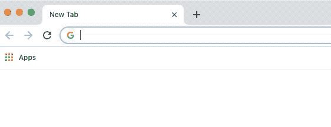

# 专业提示:自定义搜索引擎设置

> 原文：<https://dev.to/kyleparisi/pro-tip-custom-search-engine-settings-2334>

此页面是您定义搜索引擎的地方。那又怎样？以下是您可以对它们做的事情:

### 我的搜索引擎

这些是我最常用的自定义搜索引擎:

| 搜索引擎 | 关键字 | 查询 URL |
| --- | --- | --- |
| 美国焊接协会 | 美国焊接协会 | [https://console.aws.amazon.com/console/home?地区=美国东部-1](https://console.aws.amazon.com/console/home?region=us-east-1) |
| 美国焊接协会 | 美国焊接协会 | [https://console.aws.amazon.com/%s](https://console.aws.amazon.com/%s) |
| s3 | s3 | [https://console.aws.amazon.com/s3/home?region=us-east-1](https://console.aws.amazon.com/s3/home?region=us-east-1) |
| 要点 | 要点 | [https://gist . github . com/search？utf8 = % E2 % 9c % 93&q =用户%3Akyleparisi+%s](https://gist.github.com/search?utf8=%E2%9C%93&q=user%3Akyleparisi+%s) |
| 密码 | 密码 | 你的回购主机 |
| 维基网 | 维基网 | 您公司的 wiki |
| 吉拉 | 吉拉 | 你的公司 jira |
| 看 | 看 | 基础设施监控 |
| 邮件 | 邮件 | 您的电子邮件主机 |

一些网站会自动生成 chrome 的搜索引擎。他们中的大多数人太罗嗦了，我不喜欢。无论如何，和他们玩得开心。

| 搜索引擎 | 关键字 | 查询 URL |
| --- | --- | --- |
| rl | rl | [https://www.twitch.tv/directory/game/Rocket%20League](https://www.twitch.tv/directory/game/Rocket%20League) |