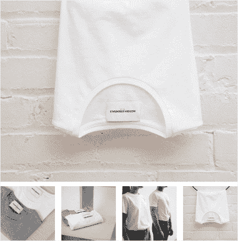
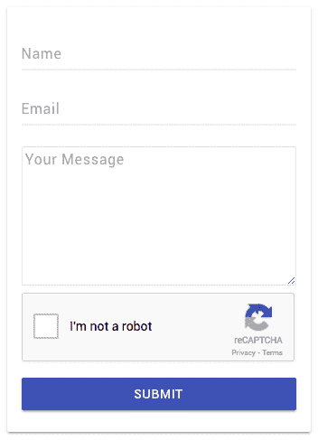
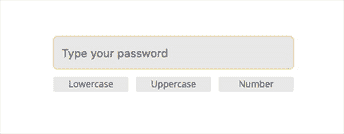
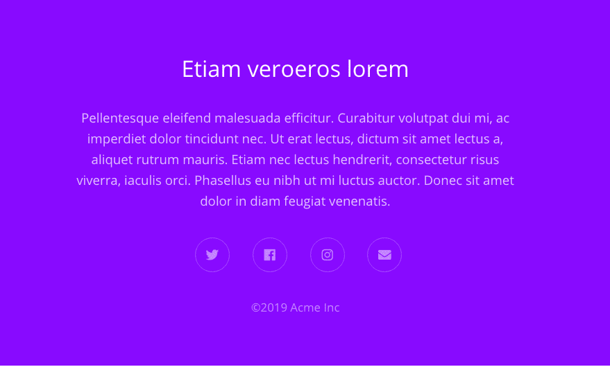

# 产品页面、布尔玛消息、密码验证器等|模块星期一 25

> 原文：<https://dev.to/tyrw/product-page-bulma-message-password-validator--more--module-monday-25-37ml>

## 为您的下一个项目提供开源 mods

以下所有内容都是开源的，可以在任何网站、web 应用程序或其他任何地方免费使用。Anymod 还有数百个这样的。

单击一个 mod 来查看它及其源代码。

### 产品页面图片部分

一个随时可用的图像部分与悬停缩放。

[视图对](https://anymod.com/mod/kdddmr?v=20)视图

 [
T4】](https://anymod.com/mod/kdddmr?v=20)

### 可辞退消息(布尔玛)

可以阅读和关闭的时尚信息。

[视图对](https://anymod.com/mod/raaakd?v=20)视图

 [
T4】](https://anymod.com/mod/raaakd?v=20)

### 用 reCaptcha 形成

自动工作的受机器人保护的联系方式。

[视图对](https://anymod.com/mod/nkldo?v=20)视图

 [
T4】](https://anymod.com/mod/nkldo?v=20)

### 密码输入验证器

检查小写、大写、数字和长度。

[视图对](https://anymod.com/mod/alllmb)视图

 [
T4】](https://anymod.com/mod/alllmb)

### 彩色页脚

带有消息和社交媒体链接。

[视图对](https://anymod.com/mod/mlllmn?h1=50&h2=100&v=20)视图

 [
T4】](https://anymod.com/mod/mlllmn?h1=50&h2=100&v=20)

* * *

我每周一都会在这里贴上新的 MODS-我希望你会觉得它们有用！

快乐编码✌️