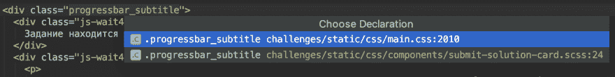
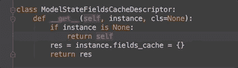
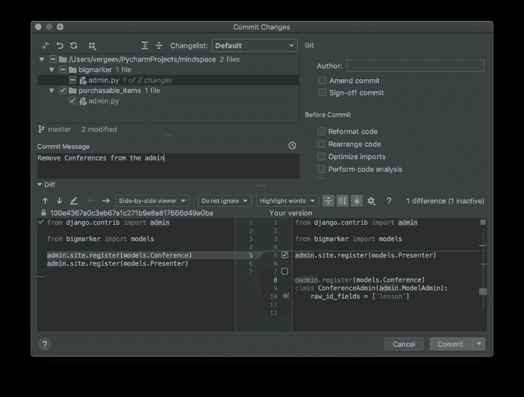
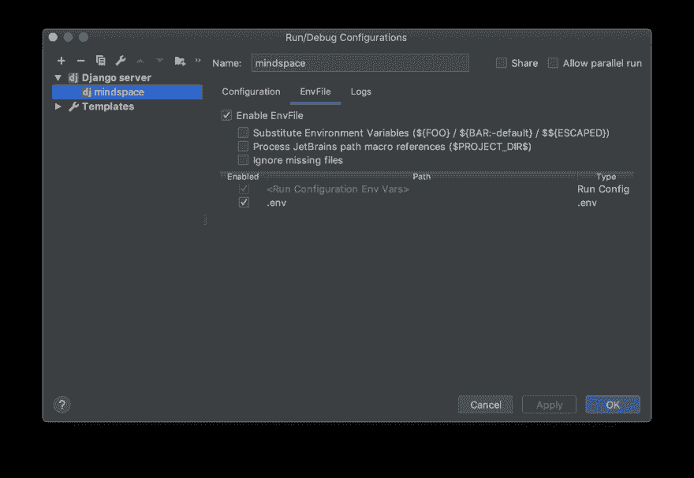
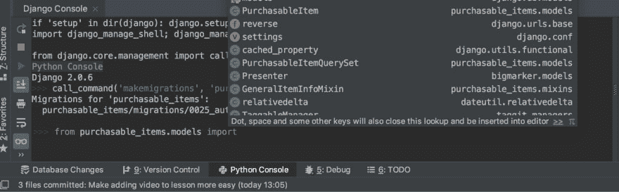
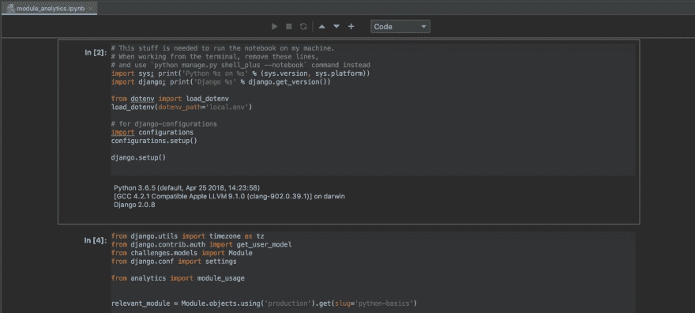
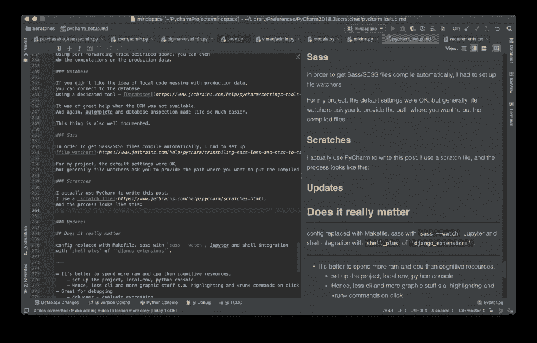

# 使用 PyCharm 进行高效的全栈开发

> 原文：<https://dev.to/vergeev/productive-full-stack-development-with-pycharm-3ah7>

我花了很长时间才找到自己喜欢的软件开发领域。所以我尝试了很多不同的技术，以及许多不同的工具。我花了[三年时间](https://gist.github.com/vergeev/94b161316906b4c7769d5eff6d107ad8)用 Vim 编码，用 Netbeans 给[写了一个完整的项目](https://github.com/vergeev/checkmate)，并逐渐尝试了所有流行的 web 开发文本编辑器，包括 VSCode。

看到 VSCode 得到如此多的关注，像 Kenneth Reitz [这样的人推荐它用于 Python 开发](https://www.kennethreitz.org/essays/why-you-should-use-vs-code-if-youre-a-python-developer)，我认为谈论完全不同的开发设置会令人耳目一新。

在我看到 PyCharm 的一些特性在其他编辑器中使用后，我发现了它们。在这篇文章中，我希望为你做同样的事情:鼓励你更彻底地探索你的编辑器，从中获得最大的收益。

## 认清长处

有几件事是 IDEs 做得最好的，所以我试着将我的工作流程围绕它们展开:

*   导航代码库。
*   将一切整合在一个地方。

下面是我几乎每天都会用到的功能列表。我还提供了相应文档页面的链接。如果有键盘快捷键，我会用括号标出(记住苹果键盘布局)。

## 导航代码库

### 常识性特征

编辑们的一个共同特点是“发现一切”。在 PyCharm 中，它是`⇧⇧`捷径。

“跳到声明”(`⌘B`)也不会让任何人感到惊讶。在 PyCharm 中，它可以在许多不同的上下文中工作，不需要任何配置。因此，如果我想找到 SCSS 类声明，我会按下`⌘B`并得到

[](https://res.cloudinary.com/practicaldev/image/fetch/s--1XcvgRv0--/c_limit%2Cf_auto%2Cfl_progressive%2Cq_auto%2Cw_880/https://thepracticaldev.s3.amazonaws.com/i/dvj3a1nubvn2u39pqao6.png)

JS 符号的相同快捷方式，Django 模板语言，以及简单地打开一个包含的文件。如果我在声明中使用`⌘B`,它会显示用法。

为了找到一个字符串，我使用了全局搜索(`⌘⇧F`)。它的好处是允许我搜索项目依赖项的源代码，即使它们位于不同的文件夹中。

当我找到我要找的东西时，“带我回去”按钮就派上了用场。

还有我喜欢的带有不同编辑快捷键的多光标，但我会避免背诵[手册](https://www.jetbrains.com/help/pycharm/basic-editing-procedures.html)。反正每个人都有这些特征。

### 我不知道我需要的东西

当我使用简单的文本编辑器时，无处不在且可靠的提示是我经常错过的。

[](https://res.cloudinary.com/practicaldev/image/fetch/s--FrMIexoA--/c_limit%2Cf_auto%2Cfl_progressive%2Cq_auto%2Cw_880/https://thepracticaldev.s3.amazonaws.com/i/4mpax09dej7g7mdgr5h5.png)

我再也不用谷歌引导类了！它还提示我所覆盖的属性的名称，这是我在使用 Django 时经常做的事情。

这些提示对于导入也很有用。但我并不为此使用它们，因为 PyCharm 内置了[自动导入](https://www.jetbrains.com/help/pycharm/settings-auto-import.html)。

Vim 绑定是我试图从每个编辑器中得到的东西。PyCharm 的 select-nearest-block-that-sense 特性(`⌥↑`)却不是这样:

[](https://res.cloudinary.com/practicaldev/image/fetch/s--Z3Q_ZSjq--/c_limit%2Cf_auto%2Cfl_progressive%2Cq_66%2Cw_880/https://thepracticaldev.s3.amazonaws.com/i/4iwo3uh1y4gp4intinhw.gif)

最后，对于像我这样的非英语母语者的奖励是:拼写检查。在我的一个项目中，我们有两个类:`Enhancement`和`EnchancementTemplate`。我的队友在第二个名字中犯了一个错别字，如果 PyCharm 在代码审查期间没有给`Enchancement`加下划线的话，这个问题不会被注意到。

## 集一切于一处

### 部署

我不完全记得如何部署我正在做的项目。

我所知道的是，点击角落的绿色“开始”按钮将为我做所有必要的工作。一旦我修改了源代码，它甚至会重新加载服务器。

这是通过 PyCharm 称之为[配置](https://www.jetbrains.com/help/pycharm/creating-and-editing-run-debug-configurations.html)的东西实现的。在 Django 项目中，所有这一切要求的是环境变量。但是它让我可以做更多的事情。

在我的项目中，Django 独立运行，但是 Redis 和 Postgres 运行在它们自己的容器中。所以每次启动项目时，我都运行我的 Django 配置。这样，我解除了必须记住这个细节的心理负担。

### 调试

一旦我配置了如何运行项目，我就可以免费获得调试器配置。唯一不同的是，我点击的是绿色的虫子，而不是绿色的三角形。

为了插入断点，我不需要插入任何代码。我点击我希望断点所在的行，并触发目标代码。不要再忘记为我移除`import pdb; pdb.set_trace()`！

[](https://res.cloudinary.com/practicaldev/image/fetch/s--PZKFlY-r--/c_limit%2Cf_auto%2Cfl_progressive%2Cq_auto%2Cw_880/https://thepracticaldev.s3.amazonaws.com/i/qk1inpktbbr0noox4o5s.png)

当我点击断点时，我点击“评估表达式”(小计算器图标)，这里我有了与在`pdb`中相同的交互式 shell，增加了提示和自动完成功能。

我喜欢调试器表现得很好，即使两个或更多的请求进来并多次触发同一个断点。有了`pdb`，这种情况简直就是一场噩梦。

### VCS 和任务跟踪

当我第一次开始使用 PyCharm 时，我从终端进行所有的版本控制。为了方便起见，我使用了大量的 [git 别名](https://dev.to/robertcoopercode/using-aliases-to-speed-up-your-git-workflow-2f5a)。然后我更深入地了解了皮查姆[如何操控 VCS](https://www.jetbrains.com/help/pycharm/version-control-integration.html) ，并喜欢上了它。

我不需要记住如何处理 VCS 的细节。每当我有事情要提交时，我就按下`⌘K`，取消选择我还不想提交的事情，并编写提交消息。作为一个痴迷于`git add --patch`和原子提交的人，我发现我可以可视化地选择我要提交的更改是非常棒的。

[](https://res.cloudinary.com/practicaldev/image/fetch/s--85mIieEk--/c_limit%2Cf_auto%2Cfl_progressive%2Cq_auto%2Cw_880/https://thepracticaldev.s3.amazonaws.com/i/oo22vbhq96ibx1sijl2a.png)

既然 PyCharm 知道我何时提交，如果它能跟踪我提交的票就好了，对吗？这是可以做到的:我用`Tools | Tasks & Contexts | Configure Servers`连接了公司的 Gitlab 服务器，PyCharm 获取了门票。现在，我为每个任务打开了不同的选项卡和更改集，可以更容易地切换到新任务。我甚至可以[测量我在每个上下文中花费的时间](https://www.jetbrains.com/help/pycharm/managing-tasks-and-context.html#time_tracking)，并将其发送给我的问题跟踪器。

有时我经常忘记提交，结果丢失了重要的更改。[本地历史](https://www.jetbrains.com/help/pycharm/local-history.html)允许我回滚它们，已经为我节省了几个小时的重复工作。

### 终端

它有两个优点:

1.  它会记住打开的标签和每个标签的历史记录。
    所以我的一个选项卡总是打开的，以防我需要 SSH 端口转发，在另一个选项卡中我做`fab deploy`来将代码部署到生产环境中。

2.  虚拟环境是自动激活的，所以`pip install`和我预期的完全一样。

它的突出问题是，如果不进行复制粘贴，终端无法与`Configurations`共享环境，因此`python manage.py makemigrations`可能最终会迁移到错误的数据库。我将在下一节展示如何改善这个问题。

### Python 控制台

能够在 Django 项目中运行任意代码真是太好了。问题是我得记得给`python manage.py shell`设置正确的环境。同样，我需要我的提示和自动完成。

为此，我安装了一些外部设备:

*   PyCharm 的 EnvFile 插件
*   用于 Python 的 dotenv 包

我告诉我的配置从`.env`文件加载变量，就像这样:

[](https://res.cloudinary.com/practicaldev/image/fetch/s--LJmI3i6O--/c_limit%2Cf_auto%2Cfl_progressive%2Cq_auto%2Cw_880/https://thepracticaldev.s3.amazonaws.com/i/6gphy82wkfv47uv3u1md.png)

然后我去`Preferences | Build, Execution, Deployment | Console | Django Console`，在`Starting script`区写下

```
import sys; print('Python %s on %s' % (sys.version, sys.platform))
import django; print('Django %s' % django.get_version())
sys.path.extend([WORKING_DIR_AND_PYTHON_PATHS])

# this will allow to load the correct environment for the shell from dotenv import load_dotenv
from pathlib import Path
load_dotenv(dotenv_path='.env')

# this is needed if the project uses django-configurations package
# import configurations
# configurations.setup() 
if 'setup' in dir(django): django.setup()
import django_manage_shell; django_manage_shell.run(PROJECT_ROOT)

# and this will allow to call any "python manage.py ..." command from the shell from django.core.management import call_command 
```

Enter fullscreen mode Exit fullscreen mode

现在，我可以打开 Python 控制台来运行迁移，并自由地与 Django 模型交互，同时获得自动完成和默认的 IDE 快捷方式。

[](https://res.cloudinary.com/practicaldev/image/fetch/s--3go8ldMx--/c_limit%2Cf_auto%2Cfl_progressive%2Cq_auto%2Cw_880/https://thepracticaldev.s3.amazonaws.com/i/kw7unmmepdsvtdo4z1m3.png)

在这个 shell 中，我甚至可以与远程数据库上的数据进行交互。为此，我将远程数据库转发到我的本地主机(参见[远程端口转发如何工作](https://unix.stackexchange.com/questions/115897/whats-ssh-port-forwarding-and-whats-the-difference-between-ssh-local-and-remot) ):

```
ssh -L 5431:127.0.0.1:5432 user@example.org 
```

Enter fullscreen mode Exit fullscreen mode

然后我告诉 Django，生产数据库位于`127.0.0.1:5432`，使用 [Django 对多数据库](https://docs.djangoproject.com/en/2.1/topics/db/multi-db/)的支持。

现在，Python 控制台中的以下代码将获取生产数据库中的用户数量:

```
User.objects.using('production').count() 
```

Enter fullscreen mode Exit fullscreen mode

### Jupyter 笔记本电脑

Jupyter Notebook 与 Django 的集成类似于集成 Python 控制台。在 PyCharm 中打开`.ipynb`。作为第一个单元格，运行

```
import sys; print('Python %s on %s' % (sys.version, sys.platform))
import django; print('Django %s' % django.get_version())
sys.path.extend([WORKING_DIR_AND_PYTHON_PATHS])

# this will allow to load the correct environment for the shell from dotenv import load_dotenv
from pathlib import Path
load_dotenv(dotenv_path='.env')

# this is needed if the project uses django-configurations package
# import configurations
# configurations.setup() 
django.setup() 
```

Enter fullscreen mode Exit fullscreen mode

你已经准备好了 Django-Jupyter-PyCharm 工具链。

[](https://res.cloudinary.com/practicaldev/image/fetch/s--KrEsZd5y--/c_limit%2Cf_auto%2Cfl_progressive%2Cq_auto%2Cw_880/https://thepracticaldev.s3.amazonaws.com/i/6x3wm9izr9smc8a46ziu.png)

使用上述端口转发技巧，您甚至可以对生产数据进行计算。

### 数据库

如果您不喜欢本地代码扰乱生产数据的想法，您可以使用专用工具连接到数据库。

当 ORM 不可用时，它非常有用。同样，自动完成和数据库检查使生活变得更加容易。

这个东西也是有据可查的。

### 萨斯

为了让 Sass/SCSS 文件自动编译，我必须设置[文件观察器](https://www.jetbrains.com/help/pycharm/transpiling-sass-less-and-scss-to-css.html)。

对于我的项目来说，默认设置是可以的，但是通常文件观察者会要求您提供放置编译文件的路径。

### 划痕

我在 PyCharm 写这篇文章。我使用了一个 [scratch 文件](https://www.jetbrains.com/help/pycharm/scratches.html)，过程如下:

[](https://res.cloudinary.com/practicaldev/image/fetch/s--RAm5JM7g--/c_limit%2Cf_auto%2Cfl_progressive%2Cq_auto%2Cw_880/https://thepracticaldev.s3.amazonaws.com/i/q214u2t8x9i0yd2hpsqy.png)

除了草稿文件，我还打开了示例项目。

当我设计一些复杂的功能时，我主要使用草稿文件。

Scratch 文件也很容易导出到 Github Gist: [](https://res.cloudinary.com/practicaldev/image/fetch/s--8FnHTcdh--/c_limit%2Cf_auto%2Cfl_progressive%2Cq_auto%2Cw_880/https://thepracticaldev.s3.amazonaws.com/i/lxej86g3vfxgiosxjccn.png)

### 更新 PyCharm

直到最近，我一直通过从网站手动下载新版本并替换二进制文件来更新 PyCharm。

现在[有了一个工具。](https://www.jetbrains.com/toolbox/app/)

## 准备好探索了吗？

我想出了我目前的工作流程，因为其他人分享了他们是如何做事情的。多亏了 Makefile，我熟悉了单步构建的思想。在了解了 VSCode 的确切特性后，我在 PyCharm 中找到了集成调试器。当我看到我的朋友使用 IPython 时，我决定我需要一个舒适的 Python shell。

这就是我写这篇文章的原因:这样你就可以发现你喜欢的新功能，并将它们集成到你的工作流程中。

我不想止步于我所拥有的。让我知道你更喜欢如何把事情做好，我可能还有很多要学。

## 也

*   [泄漏抽象法则](https://www.joelonsoftware.com/2002/11/11/the-law-of-leaky-abstractions/)——如果你只是刚开始，为什么不应该使用 IDE。
*   Vim 是完美的 IDE，虽然我尽可能避免使用 CLI，但这篇文章提供了相反的方法。
*   [IDE 的诅咒](https://dev.to/codemouse92/the-curse-of-the-ide-3j7n) —你应该注意的 IDE 问题。
*   [掌握你的 IDE](https://dev.to/danlebrero/master-your-ide)——一篇简短的帖子，有直接的指导。