# 使用 VS 代码和粒子工作台进行物联网专业调试:超越 Serial.print()

> 原文：<https://dev.to/particle/professional-debugging-for-iot-with-vs-code-particle-workbench-going-beyond-serial-print-3hc6>

早在 1999 年，我就开始了我的网络开发职业生涯。早期 web 的太平日子与今天大不相同，没有浏览器开发工具，没有 HTML5 的味道，JavaScript 仍处于 AJAX 出现之前的婴儿期。但是我希望有一个世界，在那里，设备上的调试会像我的浏览器开发工具一样简单。

今天，我不再渴望，随着最近推出的 [Particle Workbench](https://www.particle.io/workbench/) ，我终于找到了一个工具，它可以让硬件设备调试像浏览器开发工具一样简单易用。在这篇文章中，我将介绍如何用你的粒子设备做同样的事情！

注意:这篇文章涵盖了调试第三代粒子设备的基础知识，比如氩、硼和氙。粒子文档有一个[优秀、全面的第三代调试指南](https://docs.particle.io/tutorials/developer-tools/workbench/#debugging-3rd-generation-)，以及一个[第二代设备(光子、电子)](https://docs.particle.io/tutorials/developer-tools/workbench/#debugging-2nd-generation-with-particle-debugger-)调试指南。

## 我的调试经历简史:这是一门艺术

在我早期开发的时候，JavaScript 调试中最先进的是`alert`命令，它会在屏幕上弹出一个 UI 框，里面有你想要的任何值。需要知道循环计数器变量的当前状态？`alert(i);`想知道从 SQL Server 数据库中检索到的`ADDRESS_ONE`列是什么样子吗？`alert(address_one)`。

<center>

<figure>[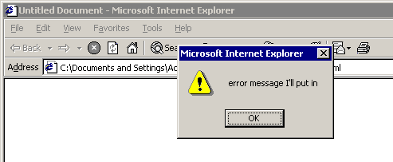](https://res.cloudinary.com/practicaldev/image/fetch/s--UCGCkpYn--/c_limit%2Cf_auto%2Cfl_progressive%2Cq_auto%2Cw_880/https://blog.particle.io/wp-content/uploads/2019/05/0291g.png) 

<figcaption>调试中的最新技术，大约在 1999 年。</figcaption>

</figure>

</center>

在周五下午 4 点部署之前，你拼命想找出你向老板发誓要彻底测试的新用户认证流程中的 heisenbug 在哪里？

```
alert(“HERE”); 

alert(“HERE 2”);

alert(“WHAT ARE WEEKENDS ANYWAY? I LIVE IN THIS CUBICLE NOW.”); 
```

自那以后的几年里，web 中的调试已经有了很大的发展。随着`console.log()`的出现，我们得到了 alertbox 的不引人注目的替代品。这是朝着正确方向迈出的一步，但当人们需要手术刀时，这仍然是一把鳄鱼邓迪大小的刀。

然后是浏览器开发工具，先是通过 Firebug 出现在 Firefox 中，然后内置在 Chrome、Firefox、IE 和 Opera 中。最后，任何地方的 web 开发人员都可以设置断点、监视和检查正在运行的客户端应用程序，就像我们专注于服务器的同事多年来一直在做的那样。

### Serial.print()，嵌入式开发的预警()

许多年后，我进入了硬件和嵌入式开发领域，我发现类似的试错调试过程在这个领域占据了主导地位，与早期的 web 没有什么不同。在那里，代替`alert()`和`console.log()`，趋势是在固件中加入`Serial.print()`和`Serial.println()`命令，作为记录嵌入式应用程序进度和状态的一种方式。

就像我早期使用`alert()`一样，当事情出错时，我发现自己将`Serial.print()`作为一种生硬的工具，我不知道在哪里可以找到自己引起的错误。当然，专业的设备上调试工具是可用的，但作为这个令人生畏的硬件世界的新手，我像许多其他人一样，寻求感觉舒适和熟悉的解决方案。

随着 Particle Workbench 的推出，我很高兴地报告，内置的调试功能正是我们固件开发人员需要超越的`Serial.print()`。

## 使用粒子工作台调试:像浏览器开发工具一样简单

开始之前，您需要收集一些材料，包括:

*   [粒子工作台](https://www.particle.io/workbench/)，面向物联网优化的全新 VS 基于代码的 IDE
*   一个第三代粒子设备。我在这篇文章中使用了[氩气套件](https://store.particle.io/products/argon-kit)；
*   一个[粒子调试器](https://store.particle.io/products/particle-debugger)；
*   一根 USB 微型电缆(包含在我使用的氩气套件中)。

调试器和粒子设备都必须通过 USB 连接到同一台电脑，因此请确保您有足够的可用端口。使用提供的带状电缆将调试器连接到粒子设备的调试端口，并将两者都插入计算机。调试端口由十个暴露的引脚组成，这些引脚由一些塑料保护，您可以在靠近设备顶部的 LiPo 电池端口旁边找到它。

<center>

<figure>[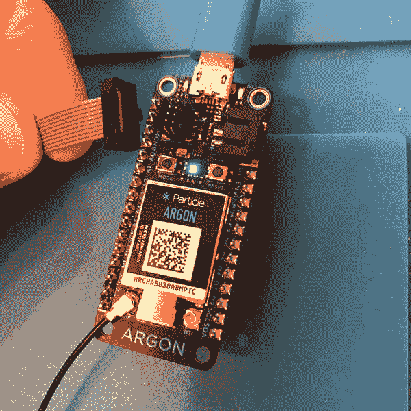](https://res.cloudinary.com/practicaldev/image/fetch/s--aIKamUYA--/c_limit%2Cf_auto%2Cfl_progressive%2Cq_auto%2Cw_880/https://blog.particle.io/wp-content/uploads/2019/05/DebuggerCable.png) 

<figcaption>调试器电缆插入设备左上角的 10 针 JTAG 端口。</figcaption>

</figure>

</center>

一旦所有设备都连接并通电，您需要将粒子设备置于设备固件更新(DFU)模式。为了让 Workbench 方便设备上的调试，它需要在一个二进制文件中编译和刷新应用程序和粒子设备操作系统固件的调试版本。您有时会看到这被称为“整体”构建，因为这不同于正常的构建过程，在正常的构建过程中，设备操作系统和应用程序固件可以彼此独立地更新。

要将设备置于 DFU 模式，请按住设备上的模式和重置按钮。然后，松开复位按钮，同时继续按住模式按钮，直到设备上的 RGB LED 开始闪烁黄色。

<center>

<figure>[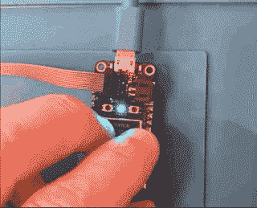](https://res.cloudinary.com/practicaldev/image/fetch/s--3bg1VcLp--/c_limit%2Cf_auto%2Cfl_progressive%2Cq_66%2Cw_880/https://blog.particle.io/wp-content/uploads/2019/05/DFU.gif) 

<figcaption>在开始调试过程之前，将您的设备置于 DFU 模式。</figcaption>

</figure>

</center>

*注意:由于 nrf52840 中 Nordic SoftDevice 的要求，目前不支持对启用网格功能的第三代设备进行 Step 调试。处于独立模式(可在移动设置期间配置)的设备可以顺利调试。*

### 工作台调试基础知识

现在您已经在硬件方面设置好了，让我们开始一个调试会话，并介绍一些工作台基础知识。首先，您需要用 Particle Workbench 打开一个固件项目。我不会涉及在 Workbench 中创建或导入项目的细节，所以如果您需要更多信息，请务必查阅[文档](https://docs.particle.io/workbench/)。

#### 启动调试会话

要启动调试会话，请单击调试图标打开调试侧栏。然后点击调试下拉菜单，选择“粒子调试器(氩，硼，氙)”选项。

<center>

<figure>[](https://res.cloudinary.com/practicaldev/image/fetch/s--7NQ1sLqT--/c_limit%2Cf_auto%2Cfl_progressive%2Cq_auto%2Cw_880/https://blog.particle.io/wp-content/uploads/2019/05/DebugMenu.png) 

<figcaption>调试工具条图标是……一个 bug。很容易发现，这比我在代码中容易产生的错误要多得多。</figcaption>

</figure>

</center>

现在，准备等待一会儿，因为 Workbench 会为您的项目创建一个调试二进制文件。这在重复跑步时会快得多，但是第一次跑步是喝杯咖啡、休息一下或者在走廊上练习击剑的好时机。

一旦调试二进制文件被构建并刷新到您的设备，Workbench 将暂停，您的设备将断电，这将在板载 RGB LED 关闭时看到。您还会在调试控制台中看到以下消息，这是意料之中的。

<center>

<figure>[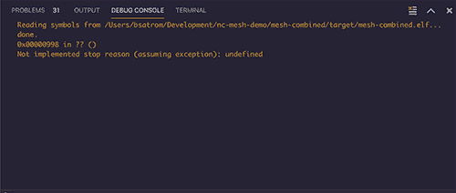](https://res.cloudinary.com/practicaldev/image/fetch/s--4YdV7Z7P--/c_limit%2Cf_auto%2Cfl_progressive%2Cq_auto%2Cw_880/https://blog.particle.io/wp-content/uploads/2019/05/DebugConsole.png) 

<figcaption>启动调试会话时，此处的消息是正常的</figcaption>

</figure>

</center>

点按“继续”按钮以重新启动您的设备。一旦您再次呼吸到青色，您就准备好调试了！

<center>

<figure>[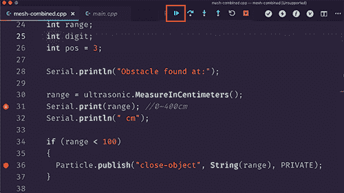](https://res.cloudinary.com/practicaldev/image/fetch/s--VAqvIbDE--/c_limit%2Cf_auto%2Cfl_progressive%2Cq_auto%2Cw_880/https://blog.particle.io/wp-content/uploads/2019/05/ContinueButton.png) 

<figcaption>继续按钮是单步调试框左侧的播放按钮。</figcaption>

</figure>

</center>

#### 设置断点

您可能要做的第一件事是设置一些断点，以便暂停和检查正在运行的代码。您可以通过单击单独一行旁边的栏槽来设置断点，或者从调试边栏的“断点”部分设置断点。设置断点时，要断点的那一行旁边会出现一个红圈。

<center>

<figure>[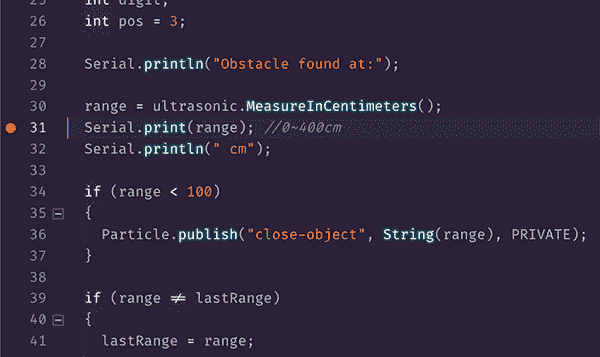](https://res.cloudinary.com/practicaldev/image/fetch/s--llZ2msyG--/c_limit%2Cf_auto%2Cfl_progressive%2Cq_auto%2Cw_880/https://blog.particle.io/wp-content/uploads/2019/05/DebugSidebar.png) 

<figcaption>点击任一行旁边的装订线设置断点</figcaption>

</figure>

</center>

<center>

<figure>[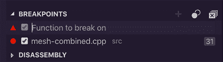](https://res.cloudinary.com/practicaldev/image/fetch/s--c_dtNKZa--/c_limit%2Cf_auto%2Cfl_progressive%2Cq_auto%2Cw_880/https://blog.particle.io/wp-content/uploads/2019/05/DebugSide.png) 

<figcaption>还可以通过引用函数名</figcaption>

</figure>

在工具条中添加断点</center>

也可以设置断点，只在满足您定义的条件时中断代码。您可以设置条件断点，以便在条件为真或超过命中次数时暂停执行。在下面的截图中，我设置了一个断点，当超声波距离传感器读取的值小于 100 厘米时暂停。

<center>

<figure>[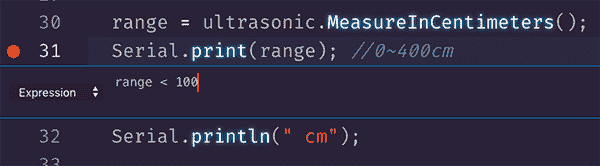](https://res.cloudinary.com/practicaldev/image/fetch/s--6cBlP6X6--/c_limit%2Cf_auto%2Cfl_progressive%2Cq_auto%2Cw_880/https://blog.particle.io/wp-content/uploads/2019/05/ConditionalBreakpoint.png) 

<figcaption>当您想要微调如何以及何时在一行代码上中断时，使用条件断点。</figcaption>

</figure>

</center>

#### 步进通过代码

一旦遇到断点，有问题的行将以黄色突出显示。从这里，您可以使用屏幕顶部的 Debug 菜单来单步调试您的代码。在下图中，从左到右，这些按钮允许您继续、跳过当前行、进入当前行、跳出当前范围、重新启动调试会话(您需要将设备返回到 DFU 模式才能工作)以及最后断开会话。

<center>

<figure>[](https://res.cloudinary.com/practicaldev/image/fetch/s--ZpyZIIMT--/c_limit%2Cf_auto%2Cfl_progressive%2Cq_auto%2Cw_880/https://blog.particle.io/wp-content/uploads/2019/05/DebugMenuTop.png) 

<figcaption>在调试期间，这个方便的菜单会出现在你的工作台屏幕的顶部。</figcaption>

</figure>

</center>

点击 continue 继续执行，直到点击下一个断点。大多数情况下，您最终会使用“单步执行”、“跳过”和“跳出”按钮来探索您的代码。

<center>

<figure>[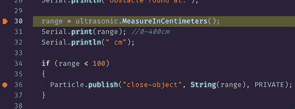](https://res.cloudinary.com/practicaldev/image/fetch/s--El9_1m6L--/c_limit%2Cf_auto%2Cfl_progressive%2Cq_auto%2Cw_880/https://blog.particle.io/wp-content/uploads/2019/05/HighlightBreak.png) 

<figcaption>当暂停在一个断点上时，当前行将以黄色高亮显示。</figcaption>

</figure>

</center>

让我们考虑一下单步执行和单步执行下面的代码行之间的区别。

```
range = ultrasonic.MeasureInCentimeters(); 
```

点击“跳过”会将执行移动到下一行`Serial.print()`，然后再次暂停。从这里，您可以检查变量、调用堆栈等等。如果有问题的代码行是一个函数，您也可以单步执行该函数的源代码。这在固件库中调试时非常方便，比如在`MeasureInCentimeters`函数的情况下，它是 [Grove-Ultrasonic-Ranger](https://build.particle.io/libs/Grove-Ultrasonic-Ranger/1.0.1/tab/Ultrasonic.cpp) 库的一部分！

<center>

<figure>[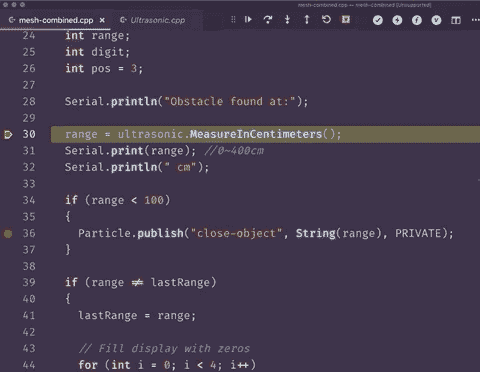](https://res.cloudinary.com/practicaldev/image/fetch/s--D2-IQvPm--/c_limit%2Cf_auto%2Cfl_progressive%2Cq_66%2Cw_880/https://blog.particle.io/wp-content/uploads/2019/05/StepInto.gif) 

<figcaption>调试器可以进入本地安装的固件库</figcaption>

</figure>

</center>

一旦进入函数，您可以使用“步出”选项继续执行当前函数的剩余部分，并在该函数返回后的下一行再次中断。

分步调试允许您检查您的代码、固件库中的代码，甚至设备 OS 固件中的源代码！有没有想过探究一下 Particle 优秀的固件团队是如何实现`Particle.publish()`的？通过工作台调试，您可以！

<center>

<figure>[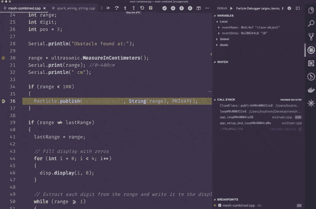](https://res.cloudinary.com/practicaldev/image/fetch/s--0xiH_6h6--/c_limit%2Cf_auto%2Cfl_progressive%2Cq_66%2Cw_880/https://blog.particle.io/wp-content/uploads/2019/05/PublishStepIntoOpt.gif) 

<figcaption>你也可以单步调试进入设备 OS 内部！</figcaption>

</figure>

</center>

#### 检查变量

分步调试本身就很神奇，我知道。然而，通常我们首先需要调试的原因是为了在应用程序到达断点时检查它的状态。Workbench 为您提供了许多方法来实现这一点。首先，当暂停在一个断点上时，您可以将鼠标悬停在一个变量或对象上，一个工具提示将会出现，其中包含关于其状态的信息。还可以使用“变量”面板检查局部和全局变量的值。

<center>

<figure>[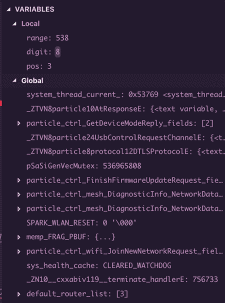](https://res.cloudinary.com/practicaldev/image/fetch/s--Se8cKmqy--/c_limit%2Cf_auto%2Cfl_progressive%2Cq_auto%2Cw_880/https://blog.particle.io/wp-content/uploads/2019/05/VariablesPanel.png) 

<figcaption>【变量】面板包含关于局部、全局和静态的信息</figcaption>

</figure>

</center>

#### 观看数值

除了检查局部和全局变量，您还可以使用 watch 面板告诉调试器跟踪给定变量或对象的状态。如果您想要了解应用程序的某个部分如何变异或受另一个变量的影响，或者如果您想要在应用程序运行时仔细查看给定变量或对象何时进入或超出范围，这将非常有用。

<center>

<figure>[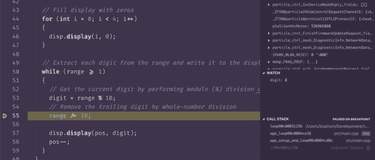](https://res.cloudinary.com/practicaldev/image/fetch/s--p_X4LxY3--/c_limit%2Cf_auto%2Cfl_progressive%2Cq_66%2Cw_880/https://blog.particle.io/wp-content/uploads/2019/05/Watch.gif) 

<figcaption>在调试</figcaption>

</figure>

时，观察面板有助于跟踪状态</center>

#### 导航调用堆栈

我最喜欢的调试特性之一是调用堆栈导航器，当您探索库或设备 OS 固件的内部时，它会非常方便。该窗格从您的当前位置开始跟踪堆栈，您可以单击堆栈中的任何条目来快速导航到该位置。

<center>

<figure>[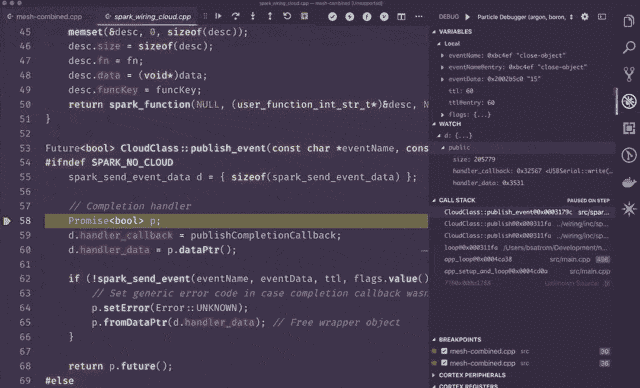](https://res.cloudinary.com/practicaldev/image/fetch/s--NvBTKQTP--/c_limit%2Cf_auto%2Cfl_progressive%2Cq_66%2Cw_880/https://blog.particle.io/wp-content/uploads/2019/05/CallStackBigOpt.gif) 

<figcaption>通过调用堆栈面板，可以在堆栈中任意位置移动当前断点</figcaption>

</figure>

</center>

#### 高级调试功能

除了本文中介绍的特性之外，工作台调试器还提供了对 VS 代码中内置的、由 cortex-debug 扩展利用的几个调试特性的访问，包括检查和编辑硬件寄存器、外设甚至直接内存位置的能力。所有这些都超出了本文的范围，所以请查看这些工具的[文档，了解如何使用它们。](https://code.visualstudio.com/docs/editor/debugging)

#### 附加提示和技巧

一旦您完成调试并准备恢复正常编码和刷新，您将需要让您的设备脱离其调试状态，这意味着您要用混合应用程序和设备操作系统固件替换“单片”调试版本。为此，将设备重新置于 DFU 模式，并运行工作台命令面板中的“`Particle: Flash application & Device OS (local)`”命令。

如果您在调试或刷新时遇到奇怪的错误，Workbench clean 命令是您的好朋友！根据我的经验，当这些事情突然出现时，运行“`Particle: Clean application & Device OS (local)`”和“`Particle: Clean application for debug (local)`”通常就足以将事情重新摆正。

自从早期基于`alert()`的调试以来，网络已经取得了很大的进步，Particle Workbench 的内置调试功能将使各地的粒子开发人员能够轻松自信地查看他们嵌入式应用程序的隐藏内容。使用 Particle Workbench 进行调试已经改变了我的游戏规则，我敢打赌这对你也是一样。

[用粒子工作台对物联网进行专业调试:超越 Serial.print()](https://blog.particle.io/2019/05/03/professional-debugging-for-iot-with-particle-workbench-going-beyond-serial-print/) 的帖子最早出现在[粒子博客](https://blog.particle.io)上。