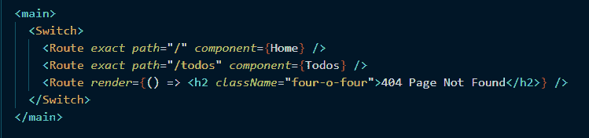
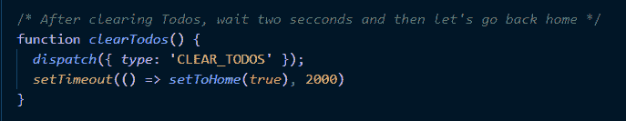
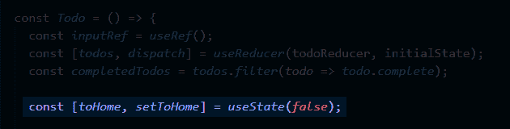
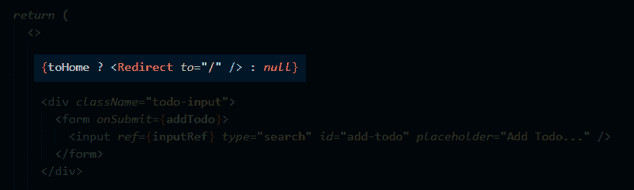

# 使用 React 路由器和挂钩进行重定向

> 原文：<https://dev.to/httpjunkie/programmatically-redirect-in-react-with-react-router-and-hooks-3hej>

很多这些简短的博客帖子只是为了我以后忘记如何做某事时可以找到，但我认为这个你可以用 React 路由器做的小技巧值得分享。

为了搭建舞台，我有一个已经设置好路由和页面的应用程序。

其中一个路径加载了一个 Todo 组件，我在其中使用了`useReducer`钩子来跟踪 todos 状态(本地状态)。我设计了一个非常简单的功能，一旦 Todos 被清除，它会将用户重定向到回家的路线。不考虑这个特性的所有边缘情况，我只想使用一些基本的逻辑得到一个基本的重定向工作，一个快速和肮脏的例子，如果我们想，我们可以稍后解决细节。

如果我们查看`Todos.js`文件，我们会看到有一个函数调用`dispatch()`并将`CLEAR_TODOS`作为动作类型发送给我们的 reducer。

在我设计的例子中，我知道一旦用户点击“CLEAR TODOS ”,我至少要重定向到 Home，在一个更好的例子中，我会通知用户(在这段代码中我没有这样做),然后重定向到 Home，因为我们的 todo 列表被清空了。所以我在这里要做的是进入一个我将创建的钩子，它有一个名为`toHome`的状态变量和一个名为`setToHome()`的相关设置/更新方法。下面的代码是一个标准的`useState`钩子:

为了在`toHome`状态变量被设置为`true`时使页面重定向，我们只需要从 React 路由器呈现一个常规的重定向组件，如果为真，我们将使用一个三元语句内联该组件，如果为假，我们将使用`null`或不呈现任何内容:

这里有一个链接，指向具有这个重定向设置的特定提交: [4ed5c6](https://github.com/httpJunkie/react-todo/commit/4ed5c60e7a58ff021d31f05f557311eabd4a098d)

以及一个到整个示例应用程序的链接，顺便说一下，它还有一些其他很酷的响应功能，[看看吧](https://github.com/httpJunkie/react-todo)！

如果你是钩子的新手，想深入了解这个主题，我有几篇文章，涵盖了基本、高级和定制钩子的主题，如果你感兴趣，还有一篇关于钩子的演讲，下面提供了链接！

*关于 React 挂钩的文章* :
[如何为状态和效果使用基本 React 挂钩](https://www.telerik.com/blogs/how-to-use-basic-react-hooks-for-state-and-effects)
[如何为上下文使用基本 React 挂钩](https://www.telerik.com/blogs/how-to-use-basic-react-hooks-for-context)
[如何为 Reducers 使用基本 React 挂钩](https://www.telerik.com/blogs/how-to-use-basic-react-hooks-for-reducers)
[创建自定义 React 挂钩所需的一切](https://www.telerik.com/blogs/everything-you-need-to-create-a-custom-react-hook)

*我谈 React 上钩*:
T3】迷上 React