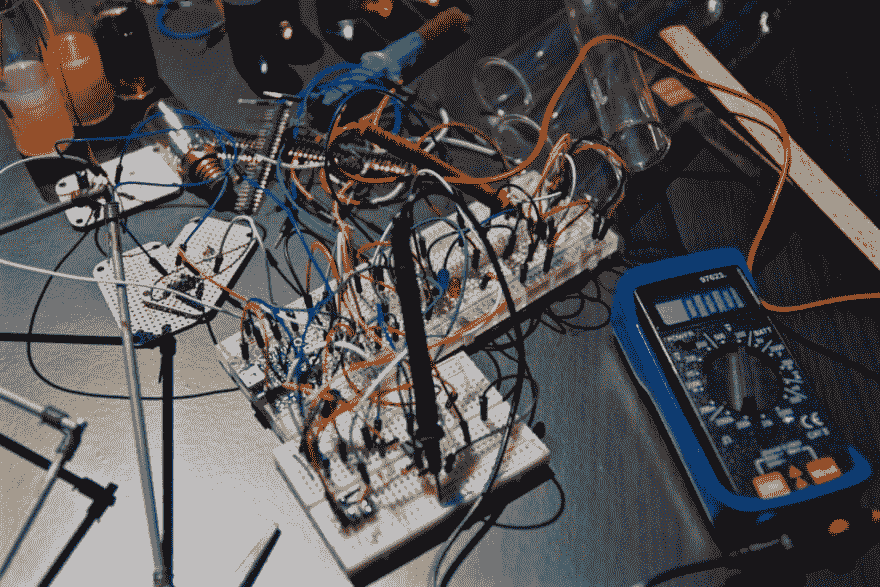
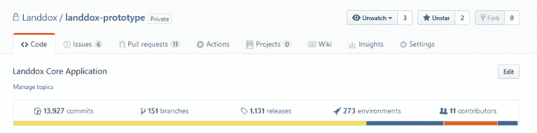
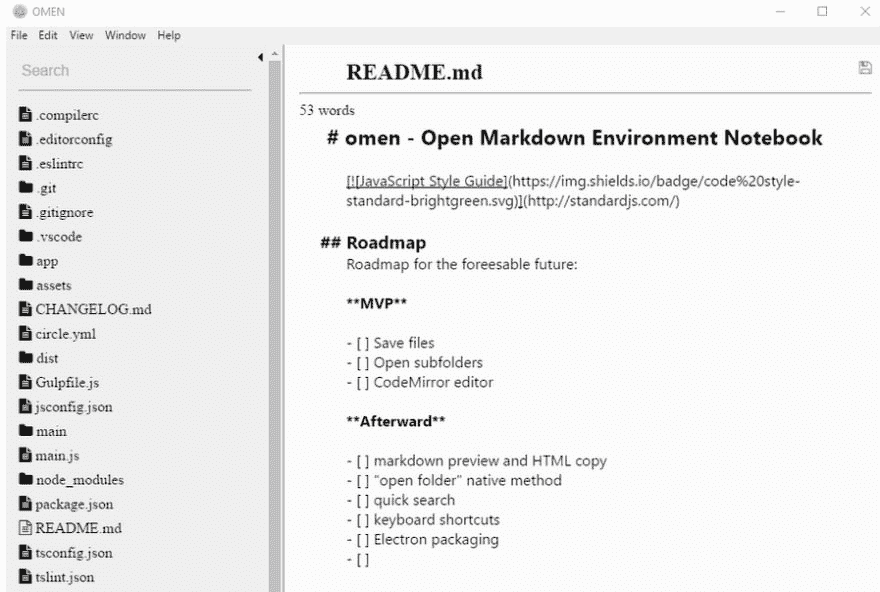
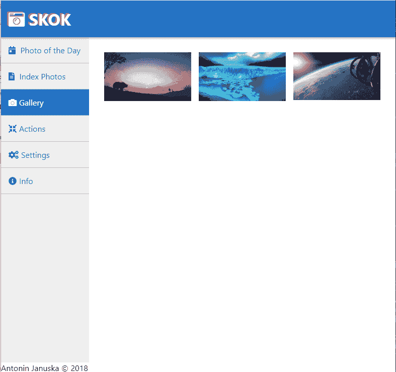

# 原型不会被抛弃——相反，要写跟踪(子弹)代码

> 原文：<https://dev.to/antjanus/prototypes-dont-get-thrown-out----write-tracer-bullet-code-instead-2ncn>

几年前，我写了一篇名为[我在一家初创公司](https://antjanus.com/blog/thoughts-and-opinions/experience-running-development-startup/)进行开发的经历的文章，我提到的一个吸引了大量评论的好东西是“原型之上的追踪器”的概念。我讨论了原型和尖峰的一些问题，以及“追踪器”是一个更好的选择。

三年后，我现在在这里对此进行扩展，并讨论为什么原型和尖峰是脚枪而不是解决方案，以及跟踪代码如何是解决问题的更好方法，特别是在快节奏的环境中。

如果你读过《实用程序员》,你会发现这个概念很熟悉，那也是我了解它的地方。

## 什么是原型？什么是尖峰？

让我们先得到这些的定义。原型和 spike 的想法都是编写一次性代码，以便学习和测试一个想法/库/任何东西。

例如，你可以用另一种语言编写你的产品的“原型”。花式榆树？您可以在 elm 中重写当前产品的一个困难部分作为测试，然后分析结果:

1.  它的表现一样好吗？
2.  开发者体验是什么样的？
3.  它是否有长期发展所必需的社区支持？

诸如此类。根据您的“测试”结果，您可能会采纳该决定，并根据原型开发/spike 期间学到的经验编写一个永久的解决方案，或者您可能会意识到此时这不是一个正确的决定。

尖峰是一个类似的想法，但可能需要更少的开发和更多的研究。基本上，它更多的是花时间在一个想法/决定上，并对其进行调查，而不是创建一个功能原型。

## 原型有什么了不起的？

原型可以很棒。为什么？原型鼓励走捷径，以便得到一个可行的想法并接受测试。

例如，如果你想为一个图片库应用程序创建一个原型，你可能会严重依赖现成的产品，以便让你尽快到达终点。你可能会在测试上偷工减料，在开发体验上偷工减料等等。

你正在测试图像应用的想法，唯一重要的是有一个最终产品展示给用户，以获得反馈。人们想要一个图库应用吗？与现有解决方案相比，它有什么优势吗？它是如何区分的？构建原型后，您预见到哪些技术挑战？

与常规开发相比，最大的优势是您不必关心细节，您只需要关心您正在测试并实现的想法。这意味着你可以发展得更快，花更少的时间剃牦牛毛。

然后你把它扔掉。

> 您从开发和反馈中获得知识，然后根据这些信息从头开始制定长期解决方案。

## 他们有什么可怕的？

最后一部分，也就是“扔出去的那部分”。我给你看样东西:

我已经做了 4 年的“原型”了。近 14，000 次提交，近十几个贡献者，1300 次发布。我们在主要版本 9.x 上(我们不遵循 semver，但是每个主要的颠簸都是一个巨大的特性或巨大的重写)。

原型的问题更多地与“文化”有关，而不是其他任何东西，但这些问题(在我看来)在大多数情况下是无法克服的:

1.  原型经常工作，看起来“足够好”，鼓励人们保留它，而不是重写它
2.  截止日期通常会阻碍重写原型的想法
3.  管理层有时并不完全理解“原型”的概念。如果他们看到一个功能性的产品，他们希望“最终产品”比原型开发花费更少的时间。

我坚持“原型”4 年的原因是，当需要重写时，它不再有意义。事情“足够好”，我们是一家初创公司，我们在烧钱，我做了开发决定，不重写，而是专注于向客户提供功能。

我一次又一次地看到开发商陷入这种困境。“我正在测试一个想法”通常会变成用偷工减料的垃圾代码来生产。

所以我的原则是:

> 期待一个原型成为你最终产品的基础。期望你的原型永远不会被扔掉，即使它应该被扔掉。

### 题外话:开发人员做了什么来使原型更有可能被扔掉

这有点可笑，但在与其他开发者交谈、阅读文章和听播客后，我发现了一个有趣的模式。开发人员将以特定的方式创建原型，以便更有可能使用以下方法将其丢弃:

1.  给变量命名是很可怕的事情，因此没有人愿意在代码库上工作
2.  使用与现有产品不兼容的未知库/框架
3.  用一种其他人都不习惯使用的语言编写它——这样就使得原型长期无用
4.  用愚蠢的名字命名存储库(猜猜是什么？把东西命名为“原型”显然是行不通的！😭)
5.  将 jQuery 用于单页面应用程序原型
6.  在非 PHP 商店中使用 PHP 作为服务器/后端原型

不要在我身上尝试最后一个，因为我喜欢 PHP。

### 我那令人沮丧的规则的一个例外

如果你有一个以原型开发为中心的文化，那么原型的缺点就不存在。我认识一些开发人员，他们习惯于做原型和尖峰，却没有在生产中使用它们的缺点。

这真是太棒了。但是建立这种文化需要时间、精力和投资。

## 一个更好的替代方案——追踪代码

在 StackOverflow 上有一个关于曳光弹的简短讨论，但要点是这样的:

> 跟踪代码不是一次性的:你可以永久地编写它。它包含了任何一段产品代码都有的所有错误检查。它根本没有完全发挥作用。

将它分解为重要的组成部分:

1.  tracer 不是一次性的。
2.  tracer 的编写类似于生产代码
3.  追踪器不一定要功能齐全
4.  追踪器是最终产品的基础

你已经可以看出它们的区别和优势了。

Tracers 对于测试您计划在生产环境中使用的想法非常有用。它们不同于原型，因为你应该对你的想法更加“确定”。追踪器不是一次性的。

在我看来，它们应该是构建解决方案的最后步骤之一。追踪器可以确保你的解决方案想法在生产环境中发挥作用。这是在你决定架构之后，在你确保你的想法是合理的之后，在你计划好事情之后。但是在你写任何代码之前。

## 良好的示踪实践

如果你正在测试一个框架或者一门新的语言，你不会使用追踪器。您将使用它来确保框架/语言在您的应用程序中为那个特定的目的而工作——并使用那个跟踪器作为进一步开发的基础。

但是这里是我的追踪练习列表:

1.  只要您有一个扩展存根的可靠计划，删除功能是没问题的
2.  你不一定要有测试，但是要像你做的那样写代码
3.  您编写的最重要的代码是其他代码与之交互的接口/端点
4.  不要把重大的改变留到“以后”

最后一条尤为重要。当处理原型时，很容易把事情留到“以后”去做。如果您计划编写将存在于您的代码库中的代码，您需要认识到您的代码何时已经出错并且已经需要重写。

这很难，但这些小的重写最终会有回报。最近我遇到过几次这种情况，当我因为做出一个让我不得不重写代码的假设而责备自己时，这是值得的，因为它让我在发布之前避免了编写遗留的/糟糕的/损坏的代码。

## 不良示踪手法

每种实践都有它的问题，每种实践都有它的基础。footgun 本质上是一个“东西”,它似乎是设计来帮助你尽可能快地失败。

因此，如果您已经习惯了编写跟踪程序的想法，以下是需要注意的事项:

### 与现有代码紧密耦合

理想情况下，跟踪器应该是半隔离的系统，公开一些接口或端点供其他代码使用。例如，如果你正在编写一个“追踪器”,专注于为你的应用程序构建一个助手工具栏，它不应该太深入到现有的代码中去修改存储值、状态管理，或者改变服务的工作方式，这会影响你的应用程序的其余部分。

It *可以*依赖现有的服务，但是你不应该对你的主要代码库做重大的改变。

### 模糊的焦点

虽然原型鼓励探索，但追踪者更专注。如果你不能确定你努力的最终结果，你就不应该写一个追踪程序。你也许应该做更多的研究。

例如，追踪器不应该是“通过改变网站上的东西来给管理能力以增加转化率”的东西。不，它应该是“创建一个功能，其中经理可以通过简单的 CSS 创建一个 A/B 测试，通过我们的分析套件跟踪”。

没有焦点，你真的不知道你在写什么。如果你不知道你在编码什么，你就不能写一个跟踪程序。

### 害怕扔掉不好的代码

这就是我提到的那把枪。追踪器不应该被扔掉，但这并不意味着你不能调整路线。或者通融一下。

这种情况以前在我身上发生过几次，在编码新特性的过程中，范围发生了变化。这不是有意要发生的，你应该事先非常确定你要做什么，这并不意味着你要么完成一个你不再需要的特性，要么仅仅因为这篇文章这么说就试图避免重写。🤷‍♀️

## 一个个人的例子

整篇文章相当模糊。实际上，很难编写代码片段来演示不同之处，也很难描述一个确切的特性来应用一个概念而不是另一个概念。

然而，我有相当多的编写跟踪程序和原型的经验。无论是在我的个人项目还是在工作中。

我有几个个人项目，我想分享一些信息，展示一下原型和追踪器之间的区别。

### 预兆

OMEN 是我的减价编辑环境。认为 IDE，但对作家和在 markdown，类似于 Scrivener，如果你知道它。我采用原型方法，主要是因为它有意义。我正在使用一个全新的堆栈:Angular 2(我在这方面的经验有限)、electronic(同样，经验有限)和 CodeMirror 用于编辑(没有经验)。

这三项技术都是新的，在全面测试和了解它们之前，我利用我有限的经验进行了尝试。我想把一些东西拿出来。

所以，我孜孜不倦地努力获得 MVP。我选择了一种方法，并立即使用它来获得我可以用来写书的最终产品(我在里面写了整整 30K 字！).我走了很糟糕的捷径。开发者体验糟透了(让我不想再回来)。我的商店有一个建筑，我把自己编码在一个角落里。最重要的是，CodeMirror 并不是我所需要的。

我放弃了这个项目，但是学到了很多关于编写编辑器的知识。我真的很喜欢它，并把我所知道的带到了我的下一个项目中。我用我新发现的 Angular 2 知识将我们的工作产品推向 Angular 2。我对电子有了足够的了解，我的下一个电子用途非常简单。

### Skok

Skok 是我最近还在做的一个项目。这是一个桌面照片管理应用程序。我使用的堆栈与 OMEN 略有不同，但我坚持使用电子堆栈。

我做的每件事都是对的，因为我花时间去研究，计划，并在我的脑海中灌输这一点，这是不能放弃的。这让我敏锐地意识到我想走捷径的地方，只是为了摆脱前阿尔法。相反，我做了长期计划。

我围绕 electronicReact 交互构建了一个很棒的架构，并且我专注于开发人员的体验，所以这个项目很好合作。

同时，我非常关注最小化的设置。我的计划是:扫描，显示照片，并设置更多的功能。我做到了。我很快就完成了最初的照片索引和照片查看，当我开始开发更多功能时，很容易就可以插入它们。

## 我很想听听你们关于原型/长钉/追踪器的故事！