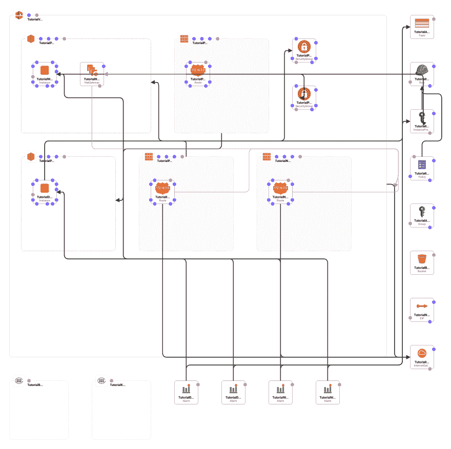

# 使用 CloudFormation 以编程方式提供:第 2 部分，最后是一些实例！

> 原文：<https://dev.to/cmiles74/provision-programmatically-with-cloudformation-finally-some-instances-2dha>

[](https://res.cloudinary.com/practicaldev/image/fetch/s--77I3zfP1--/c_limit%2Cf_auto%2Cfl_progressive%2Cq_auto%2Cw_880/https://raw.githubusercontent.com/cmiles74/cloudformation-tutorial/master/template-diagram-2.png)

这是三部分系列的第二部分，我们为一个我认为非常典型的环境构建了一个云形成模板:一个虚拟私有云分成两个子网，包含两个实例。如果你还没有读过这个系列的第一部分，我鼓励你现在就去看看！

*   [第 1 部分:我们设置 VPC 和子网](https://dev.to/cmiles74/provision-pragmatically-and-programmatically-with-cloudformation-3gni)

## 设置“管理员”组

对于这个项目，我们将创建一个通用的“管理员”组，该组可以访问我们的数据库备份的备份存储桶。我通常不允许任何人直接访问 EC2 控制台，除非他们真的需要，所以我不在这个模板中解决这个问题(此外，并不是每个 EC2 web 控制台操作都可以这样管理)。我的想法是，我们通常在单个实例上给“管理员”或“开发人员”帐户，他们并不真的需要 EC2 web 控制台来完成他们的工作。

```
 TutorialAdminGroup:
    Type: AWS::IAM::Group
    Properties:
      Policies:
        - PolicyName: TutorialAdminPolicy
          PolicyDocument:
            Statement:
            - Effect: Allow
              Action:
                - s3:ListBucket
                - s3:ListBucketByTags
                - s3:ListBucketMultipartUploads
                - s3:ListBucketVersions
              Resource: !Sub ${TutorialBackupS3Bucket.Arn}
            - Effect: Allow
              Action:
                - s3:PutObject
                - s3:DeleteObject
                - s3:GetObject
              Resource: !Sub ${TutorialBackupS3Bucket.Arn}/* 
```

Enter fullscreen mode Exit fullscreen mode

我们使用 [IAM 组资源](https://docs.aws.amazon.com/AWSCloudFormation/latest/UserGuide/aws-properties-iam-group.html)来创建我们的新组。我们提供的唯一属性是包含一列`PolicyName`和`PolicyDocument`对的`Policies`属性，在本例中，我们只定义了一个名为“TutorialAdminPolicy”的属性。

一个`PolicyDocument`包含一个`Statement`，它保存了一个`Effect`实例的列表；每个属性又包含一个带有权限列表的`Action`属性。我们使用`Resource`属性来绑定对我们的桶的引用，在本例中是备份桶的 ARN。如果我们看一下第一个`Effect`，您会看到我们已经分配了四个“ListBucket ...”我们备份桶的权限。第二个效果对备份桶中的每个文件应用了另外三个动作，这由桶的 ARN 末尾的`/*`表示。

我们添加到这个组的任何帐户将能够下载或删除桶中的任何文件(以及上传)。在这种情况下，当我们说“文件”时，我们实际上是指该项目的数据库转储。他们也能够为铲斗拉起 S3 控制台，但是他们需要一个直接连接铲斗的链接。他们将无法登录 S3 并浏览所有存储桶的列表。

最后一点:由于我们正在用模板创建一个 IAM 角色，我们需要让 CloudFormation 知道这是可以的。从现在开始，我们需要将`--capabilities`标志添加到我们的`aws`命令中。

```
aws cloudformation create-stack \
  --stack-name tutorial \
  --template-body file://template.yaml \
  --parameters ParameterKey=KeyPairName,ParameterValue=cloudfront-tutorial \
  --tags Key=Project,Value=cf-tutorial \
  --capabilities CAPABILITY_IAM 
```

Enter fullscreen mode Exit fullscreen mode

如果不包含标签，CloudFormation 将会出错退出。“更新”命令可以使用相同的标志。

### 为我们的实例设置角色

接下来，我们需要设置我们的实例可以承担的访问资源的角色(目前，只是备份存储桶)。

```
 TutorialInstanceRole:
    Type: AWS::IAM::Role
    Properties:
      ManagedPolicyArns:
        - arn:aws-us-gov:iam::aws:policy/CloudWatchAgentServerPolicy
        - arn:aws-us-gov:iam::aws:policy/service-role/AmazonEC2RoleforSSM
        - arn:aws-us-gov:iam::aws:policy/AmazonSSMReadOnlyAccess
      AssumeRolePolicyDocument:
        Statement:
          - Effect: Allow
            Principal:
              Service: ec2.amazonaws.com
            Action: sts:AssumeRole 
```

Enter fullscreen mode Exit fullscreen mode

我们使用[角色资源](https://docs.aws.amazon.com/AWSCloudFormation/latest/UserGuide/aws-resource-iam-role.html)来创建新的实例角色，并分配三个固定策略...

*   第一个让实例运行 [CloudWatch 代理](https://docs.aws.amazon.com/AmazonCloudWatch/latest/monitoring/Install-CloudWatch-Agent.html)并将事件提交给 [CloudWatch 服务](https://docs.aws.amazon.com/AmazonCloudWatch/latest/monitoring/WhatIsCloudWatch.html)
*   接下来让实例与[系统管理器](https://docs.aws.amazon.com/systems-manager/latest/userguide/what-is-systems-manager.html)交互，让我们作为一个组来管理实例
*   最后一个提供对 Systems Manager 参数存储的只读访问。

亚马逊的 CloudWatch 服务将聚合你的实例提交的数据，并让你根据这些数据设置报告、仪表盘和警报(即当 CPU 使用率过高或可用磁盘空间过低时)。Systems Manager 提供了一些管理实例的工具，比如安装补丁或软件包。它允许您作为一个组在几个实例上执行这些操作，这非常方便。我不打算在这里深入讨论这些服务，但是如果您还没有这样做的话，我鼓励您花一些时间来检查它们。

```
 TutorialInstanceRolePolicy:
    Type: AWS::IAM::Policy
    Properties:
      PolicyName: TutorialInstanceRolePolicy
      Roles:
        - Ref: TutorialInstanceRole
      PolicyDocument:
        Statement:
          - Effect: Allow
            Action:
              - s3:ListBucket
              - s3:ListBucketByTags
              - s3:ListBucketMultipartUploads
              - s3:ListBucketVersions
            Resource: !Sub ${TutorialBackupS3Bucket.Arn}
          - Effect: Allow
            Action:
              - s3:PutObject
              - s3:DeleteObject
              - s3:GetObject
            Resource: !Sub ${TutorialBackupS3Bucket.Arn}/* 
```

Enter fullscreen mode Exit fullscreen mode

我们正在创建一个新的[策略资源](https://docs.aws.amazon.com/AWSCloudFormation/latest/UserGuide/aws-resource-iam-policy.html)，我们将把它分配给我们的实例。我们将刚刚创建的角色链接起来，然后添加一个新策略来提供对备份存储桶的访问。如您所见，它与我们为管理员组创建的角色完全相同。

这个难题的最后一块是“实例概要”,我们可以将它分配给我们的实例。

```
 TutorialInstanceProfile:
    Type: AWS::IAM::InstanceProfile
    Properties:
      Roles:
        - !Ref TutorialInstanceRole 
```

Enter fullscreen mode Exit fullscreen mode

其他工作都完成了，这里没什么可看的。我们创建一个新的 [InstanceProfile 资源](https://docs.aws.amazon.com/AWSCloudFormation/latest/UserGuide/aws-resource-iam-instanceprofile.html)，并将其链接到我们的角色。当我们调配实例时，我们可以为它们分配此配置文件，然后它们将能够写入我们的备份存储桶，向 CloudWatch 提交性能和事件数据，并接受来自 System Manager 的远程命令。

### 调配 CloudWatch 日志组

在配置之前，我们最不需要的是几个 CloudWatch [日志组](https://docs.aws.amazon.com/AmazonCloudWatch/latest/logs/Working-with-log-groups-and-streams.html)。我们可以指示实例将它们的一些日志文件发送给这些组，然后通过 CloudWatch 控制台查看日志。

```
 TutorialBootLog:
    Type: AWS::Logs::LogGroup

  TutorialKernelLog:
    Type: AWS::Logs::LogGroup 
```

Enter fullscreen mode Exit fullscreen mode

我们使用[日志组](https://docs.aws.amazon.com/AWSCloudFormation/latest/UserGuide/aws-resource-logs-loggroup.html)资源来创建两个新的日志组。这些组将是我们在模板中提供的名称后的名称，并在末尾添加一些随机字符。我们现在创建组，因为我们在提供实例时将直接引用它们。

### 调配数据库服务器

我知道你在想什么:所有的工作，我们只是现在提供我们的实例！的确，有很多准备和事情要考虑，但我们正在以一种可重复且相当安全的方式为我们的服务器提供模板。想想你将要编写的所有模板吧！

我们将首先提供数据库服务器。这个有点复杂，所以我要把它分成几个部分。首先，我们用[实例资源](https://docs.aws.amazon.com/AWSCloudFormation/latest/UserGuide/aws-properties-ec2-instance.html)提供一个新实例...

```
 TutorialDatabaseServer:
    Type: AWS::EC2::Instance
    Metadata:
      AWS::CloudFormation::Init:
        config:
          files:
            /etc/profile.d/cloudformation-init.sh:
              content: !Sub |
                export BACKUP_S3_BUCKET="${TutorialBackupS3Bucket}" 
```

Enter fullscreen mode Exit fullscreen mode

请注意，在上面的代码节中，我在属性之前停止了，接下来我们将检查属性。

我们要做的第一件事是用 [CouldFormation Init type](https://docs.aws.amazon.com/AWSCloudFormation/latest/UserGuide/aws-resource-init.html) 为 CloudFormation 初始化脚本(我们将在最后调用它)设置“元数据”。这是我们告诉初始化脚本我们希望它运行时做什么的地方，在这种情况下，我们向名为`cloudformation-init.sh`的`/etc/profile.d`中的新文件添加一个新的环境变量。每当有人登录到机器上，这个脚本(以及目录中的其他内容)就会被评估，最终结果将是我们的备份存储桶的名称将通过`BACKUP_S3_BUCKET`环境变量可用。请记住，元数据本身不会做任何事情:初始化脚本将在运行时使用它，我们将在实例定义结束时使用它。

我们还需要为 CloudWatch 代理提供配置文件。这个代理将收集性能数据和日志文件，并将它们发送回 CloudWatch 服务。

```
 /etc/amazon/amazon-cloudwatch-agent.json:
              content: !Sub |
                {
                  "metrics": {
                    "append_dimensions": {
                      "AutoScalingGroupName": "${!aws:AutoScalingGroupName}",
                      "ImageId": "${!aws:ImageId}",
                      "InstanceId": "${!aws:InstanceId}",
                      "InstanceType": "${!aws:InstanceType}"
                    },
                    "metrics_collected": {
                      "cpu": {
                        "measurement": [
                          "cpu_usage_idle",
                          "cpu_usage_iowait",
                          "cpu_usage_user",
                          "cpu_usage_system"
                        ],
                        "metrics_collection_interval": 30,
                        "totalcpu": false
                      },
                      "disk": {
                        "measurement": [
                          "used_percent",
                          "inodes_free"
                        ],
                        "metrics_collection_interval": 30,
                        "resources": [
                          "*"
                        ]
                      },
                      "diskio": {
                        "measurement": [
                          "io_time"
                        ],
                        "metrics_collection_interval": 30,
                        "resources": [
                          "*"
                        ]
                      },
                      "mem": {
                        "measurement": [
                          "mem_used_percent"
                        ],
                        "metrics_collection_interval": 30
                      },
                      "statsd": {
                        "metrics_aggregation_interval": 30,
                        "metrics_collection_interval": 10,
                        "service_address": ":8125"
                      },
                      "swap": {
                        "measurement": [
                          "swap_used_percent"
                        ],
                        "metrics_collection_interval": 30
                      }
                    }
                  },
                  "logs": {
                    "logs_collected": {
                      "files": {
                        "collect_list": [
                          {
                            "log_group_name": "${TutorialBootLog}",
                            "file_path": "/var/log/boot.log"
                          },
                          {
                            "log_group_name": "${TutorialKernelLog}",
                            "file_path": "/var/log/messages"
                          }
                        ]
                      }
                    }
                  }
                } 
```

Enter fullscreen mode Exit fullscreen mode

这个配置文件告诉 CloudWatch 代理将 CPU、磁盘、内存和交换文件使用情况的数据以及两个日志文件(引导和内核日志)发送回 CloudWatch。

接下来，我们将设置实例的属性...

```
 Properties:
      ImageId: !Ref ImageId
      InstanceType: !Ref InstanceType
      KeyName: !Ref KeyPairName
      NetworkInterfaces:
        - SubnetId: !Ref TutorialPrivateSubnet
          DeviceIndex: 0
          GroupSet:
            - !Ref TutorialPrivateSecurityGroup
      BlockDeviceMappings:
        - DeviceName: !Sub "/dev/${RootDevice}"
          Ebs:
            VolumeSize: !Ref VolumeSize
            VolumeType: gp2
      IamInstanceProfile: !Ref TutorialInstanceProfile
      Tags:
        - Key: "Name"
          Value: "Tutorial  Database  Server" 
```

Enter fullscreen mode Exit fullscreen mode

在第 1 部分中，我们创建了这些参数并为它们提供了默认值，现在它们终于开始发挥作用了。如果您回头看看模板的顶部，您会看到我们为映像、实例类型、密钥对名称和根卷设置了参数。虽然我们的模板要求提供一个密钥对名称，但是其他值都用默认值填充。我的期望是，默认值通常会被使用，它们在参数部分的顶部的大部分原因是为了使它们易于获取。

我们做的第一件事是为这个实例选择我们想要的图像，在上面的代码中我们有一个对参数的引用，默认值是用于亚马逊 Linux 2 的图像。还有其他的 Linux 映像，我选择这个主要是因为它已经安装了 AWS 工具和 CloudFormation，使事情变得更容易。同样有趣的是，如果你在本地开发，你可以在你的工作站上使用一个[亚马逊 Linux 2 Docker 容器](https://hub.docker.com/_/amazonlinux/)。

接下来我们使用我们的实例类型参数，默认值是针对`t2.micro`的，因为这是一个教程，我不想浪费你的钱；这种型号可以在亚马逊的免费等级下使用。如果您在一个月内没有用完 750 小时的免费层使用时间，就不应该为调配这些实例收费。抛开成本不谈，一个微实例可能足以托管一个低流量的网站，比如你的个人博客。

我们设置想要用来提供实例的密钥对的名称，注意我们在`KeyName`属性中引用的值是我们在第 1 部分中为这个脚本设置的一个参数。为了 SSH 到实例，您需要准备好这个密钥对。

我们希望数据库服务器在我们的私有子网上，我们在指定`NetworkInterfaces`属性时会考虑到这一点。在这里，我们传入一个对私有子网的引用，然后使用网络接口的`GroupSet`属性将安全组设置为“私有”安全组。

每个实例都需要磁盘空间，我们可以使用`BlockDeviceMappings`属性为我们的实例定制[弹性块存储](https://docs.aws.amazon.com/AWSEC2/latest/UserGuide/AmazonEBS.html) (EBS)卷。我们将一个 250GB 的卷(引用我们的参数)映射到根设备，方法是使用带有我们的参数的替换函数将值设置为`/dev/xvda`，我们选择了“通用”(gp2)卷类型。

默认的卷类型是“gp2 ”,这是一个合理的选择，关于各种类型的更多信息可以在 [EBS 卷类型文档](https://docs.aws.amazon.com/AWSEC2/latest/UserGuide/EBSVolumeTypes.html)中找到。还要注意，实例引导的根设备可能因 Linux 发行版的不同而不同。例如，在 Ubuntu 下，根卷需要映射到`/dev/sda1`；如果实例找不到该卷，您会看到它在 EC2 控制台中启动，但它会在几分钟后停止。

我们没有为 EC2 实例管理凭证，而是精心创建了一个概要文件！我们用`IamInstanceProfile`属性为实例设置配置文件，并传入对该配置文件的引用。

最后，我们在实例上设置标签，在本例中，我们设置了“Name”标签。

这样一来，剩下唯一要做的事情就是在实例启动时调用 CloudFormation 初始化脚本。为了做到这一点，我们编写了一个在启动时调用`cfn-init`的小脚本。

```
 UserData: 
        Fn::Base64: 
          !Sub |
            #!/bin/bash -xe

            # cloudformation initialize
            /opt/aws/bin/cfn-init -v -s ${AWS::StackName} --region ${AWS::Region} -r TutorialDatabaseServer

            # download and install cloudwatch agent
            wget https://s3.amazonaws.com/amazoncloudwatch-agent/amazon_linux/amd64/latest/amazon-cloudwatch-agent.rpm
            yum -y install amazon-cloudwatch-agent.rpm
            mv /etc/amazon/amazon-cloudwatch-agent.json /etc/amazon/amazon-cloudwatch-agent/amazon-cloudwatch-agent.json
            sudo systemctl enable amazon-cloudwatch-agent
            sudo systemctl start amazon-cloudwatch-agent 
```

Enter fullscreen mode Exit fullscreen mode

`cfn-init`的文档[可在云形成网站](https://docs.aws.amazon.com/AWSCloudFormation/latest/UserGuide/cfn-init.html)上获得。你可以在上面的例子中看到，我们用栈的名称、栈的部署区域和服务器的名称来调用脚本。当脚本运行时，它将检查我们在实例节开始时设置的`Metadata`属性，并将执行这些任务。对于这个实例，初始化脚本将使用我们的自定义环境变量将新文件添加到`/etc/profile.d`。

`cfn-init`脚本处理将配置文件写入磁盘，我们需要做的另一件事是安装并运行 CloudWatch 代理。下一段脚本下载当前版本，安装它，将我们的配置文件移动到位，然后启用并启动服务，以便在引导时启动代理。

就这样...我们的数据库服务器。我们需要为我们的 web 服务器做几乎相同的事情。

```
 TutorialWebServer:
    Type: AWS::EC2::Instance
    Metadata:
      AWS::CloudFormation::Init:
        config:
          files:
            /etc/profile.d/cloudformation-init.sh:
              content: !Sub |
                export BACKUP_S3_BUCKET="${TutorialBackupS3Bucket}"
                export DATABASE_SERVER="${TutorialDatabaseServer.PrivateIp}" 
```

Enter fullscreen mode Exit fullscreen mode

大多数情况下，一切都是完全一样的，但也有一些小差异。当我们为初始化脚本设置`Metadata`时，我们添加了另一个包含数据库服务器私有 IP 地址的环境变量，通过这种方式，我们可以不止一次地部署这个模板，并且每个堆栈中的 web 服务器将知道在哪里找到它的匹配数据库服务器。

我没有在本文中包括它，但是我们为 CloudWatch 代理提供了与 web 服务器完全相同的配置文件。如果您正在编写这篇文章的模板，现在就花一点时间将这一节复制并粘贴到文件中。

```
 Properties:
      ImageId: !Ref ImageId
      InstanceType: !Ref InstanceType
      KeyName: !Ref KeyPairName
      NetworkInterfaces:
        - SubnetId: !Ref TutorialPublicSubnet
          DeviceIndex: 0
          GroupSet:
            - !Ref TutorialPublicSecurityGroup
      BlockDeviceMappings:
        - DeviceName: !Sub "/dev/${RootDevice}"
          Ebs:
            VolumeSize: !Ref VolumeSize
            VolumeType: gp2
      IamInstanceProfile: !Ref TutorialInstanceProfile
      Tags:
        - Key: "Name"
          Value: "Tutorial  Web  Server"
      UserData: 
        Fn::Base64: 
          !Sub |
            #!/bin/bash -xe

            # cloudformation initialize
            /opt/aws/bin/cfn-init -v -s ${AWS::StackName} --region ${AWS::Region} -r TutorialDatabaseServer

            # download and install cloudwatch agent
            wget https://s3.amazonaws.com/amazoncloudwatch-agent/amazon_linux/amd64/latest/amazon-cloudwatch-agent.rpm
            yum -y install amazon-cloudwatch-agent.rpm
            mv /etc/amazon/amazon-cloudwatch-agent.json /etc/amazon/amazon-cloudwatch-agent/amazon-cloudwatch-agent.json
            sudo systemctl enable amazon-cloudwatch-agent
            sudo systemctl start amazon-cloudwatch-agent 
```

Enter fullscreen mode Exit fullscreen mode

就属性而言，唯一的区别是我们将 web 服务器放在了公共子网中，这样它就可以与公共互联网通信(就像 web 服务器经常需要做的那样)。

至此，我们已经完成了第 1 部分中为自己设定的前四个目标。有了现在的模板，我们可以...

*   为项目提供资源
*   收回项目的资源
*   隔离项目的资源
*   按项目报告资源

我认为这是一个非常重要的里程碑！从这里，我们可以调整模板，以匹配一个特定的项目，只需一个命令设置环境。如果我们有一个客户想要一个“测试”和一个“生产”环境，我们需要做的就是提供模板两次。

## 汇报资源情况

这有点超出了 CloudFormation 的范围，但是我想我们应该暂时放下模板，看看我们可以如何使用我们一直努力放在资源上的标签。看看您账户的[计费控制台](https://console.aws.amazon.com/billing/home)。您将被拖放到控制面板，您的帐户的一些摘要数据将可见。

如果您还没有这样做，请单击左侧导航栏中的“费用浏览器”链接，并为您的帐户启用它。这是一个方便的工具，可以让你对你的资源和成本做一些简单的查询和报告。

接下来，单击左侧导航栏上的“成本分配标签”链接。在顶部，您可以看到 AWS 可以自己生成一些成本分配标签，继续操作，然后单击“激活”按钮打开这些标签。页面下方是我们定义的所有标签的列表(以及您已经设置的任何标签)。您可以选择要在成本浏览器中提供哪些标签，但我的建议是只需单击最顶部的复选框，并使它们全部处于活动状态。你永远不知道标签什么时候会派上用场！点击“激活”按钮，并确认，是的，你希望标签是“积极的”。

现在点击返回“成本浏览器”链接，并点击“启动成本浏览器”。如果你现在才激活成本浏览器，你可能要等到明天；请记住这一点，并尝试回到这一部分。

如果 Cost Explorer 手头有数据，那么您将看到另一个仪表板，试图汇总您在 amazon 上的成本。点击左侧导航栏上的放大镜图标，并选择“成本和使用”，报告生成器将显示您最近六个月的支出。单击“过去 6 个月”下拉菜单，并从底部的“历史”部分选择“1M”，这将显示您上个月的支出。

右边是过滤器列表，这是标签派上用场的地方。点击过滤器列表中的“标签”链接，将出现您的标签列表；点击“项目”,将会列出“项目”标签的所有值。在本教程中，我们将“cf-tutorial”放在“Project”标签中，选中“cf-tutorial”复选框，然后按“Apply filters”按钮来更新报告。

您现在看到的可能是一份非常枯燥的报告，因为我们一直在使用低成本的自由层实例。但是，我们仍然只有一份属于这个项目的资源报告。如果你在你的模板中放置一个“客户”标签，你可以报告一个客户的全部费用(也许你可以用它来计算如何收费)，你可以按特定项目分解一个客户的费用。这是一个有价值的工具，绝对值得花些时间来探索你的选择。

## 设置实例使用警报

我认为这与我们的报告目标有关:我们希望设置一些警报来监控我们发送到 CloudWatch 的数据，以便让我们知道我们的服务器是否开始偏离轨道。当 CPU 使用率变高或磁盘空间开始不足时，我们会设置警报，但我敢打赌，您可以想到许多其他想要监视的东西。

我们将使用[简单通知服务](https://aws.amazon.com/sns/)在警报响起时提醒我们。其工作方式是，当 CloudWatch 看到警报触发时，它会向 SNS“topic”发送一条消息。登录 SNS 控制台并将我们自己添加到通知列表(通过电子邮件或短信)将是我们的责任，我们不会填充订户列表。

```
 TutorialAlarmTopic:
    Type: AWS::SNS::Topic
    Properties:
      TopicName: TutorialAlarms 
```

Enter fullscreen mode Exit fullscreen mode

我们使用[主题](https://docs.aws.amazon.com/AWSCloudFormation/latest/UserGuide/aws-properties-sns-topic.html)资源来创建新的警报目标主题。创建 SNS 主题后，我们现在可以创建第一个提醒。

```
 TutorialDatabaseCPUAlarm:
    Type: AWS::CloudWatch::Alarm
    Properties:
      AlarmDescription: Database Server CPU Usage High
      AlarmActions:
        - !Ref TutorialAlarmTopic
      MetricName: CPUUtilization
      Namespace: AWS/EC2
      Statistic: Average
      Period: 60
      EvaluationPeriods: 3
      Threshold: 89
      ComparisonOperator: GreaterThanThreshold
      Dimensions:
        - Name: InstanceId
          Value: !Ref TutorialDatabaseServer 
```

Enter fullscreen mode Exit fullscreen mode

使用[警报](https://docs.aws.amazon.com/AWSCloudFormation/latest/UserGuide/aws-properties-cw-alarm.html)资源，我们为数据库服务器上的 CPU 使用率创建一个警报，如果服务器使用超过 89%的 CPU 超过 3 分钟，警报将被触发并向我们的 SNS 主题发送一条消息。

```
 TutorialDatabaseDiskAlarm:
    Type: AWS::CloudWatch::Alarm
    Properties:
      AlarmDescription: Database Server Disk Usage High
      AlarmActions:
        - !Ref TutorialAlarmTopic
      MetricName: disk_used_percent
      Namespace: CWAgent
      Statistic: Average
      Period: 60
      EvaluationPeriods: 3
      Threshold: 89
      ComparisonOperator: GreaterThanThreshold
      Dimensions:
        - Name: InstanceId
          Value: !Ref TutorialDatabaseServer
        - Name: ImageId
          Value: !Ref ImageId
        - Name: InstanceType
          Value: !Ref InstanceType
        - Name: path
          Value: /
        - Name: device
          Value: !Sub ${RootDevice}1
        - Name: fstype
          Value: !Ref RootFsType 
```

Enter fullscreen mode Exit fullscreen mode

下一个警报是针对数据库服务器使用的磁盘数量，这里我们设置了一个警报，如果超过 89%的磁盘正在使用，就会触发该警报。在触发警报之前，它还会等待磁盘处于这种状态 3 分钟。

设置这个警报需要更多的工作，你可以看到我们必须添加几个`Dimensions`来设置警报。这是因为当 CloudWatch 代理报告这些数据时，它会引用所有这些维度，我们需要将它们全部匹配，以便有一个工作警报。如果我们遗漏了其中的一个，那么警报将不会与任何数据匹配，也永远不会触发。

唯一剩下的是备份作业，但我们将把它留到第 3 部分。祝贺你完成了所有这些材料！虽然这可能是非常枯燥的阅读，但您确实可以为您知道将反复部署的项目获取大量的构建模板。

*   [第 3 部分:备份作业和摘要](https://dev.to/cmiles74/provision-pragmatically-and-programmatically-with-cloudformation-backup-jobs-and-wrap-up-4plp)

* * *