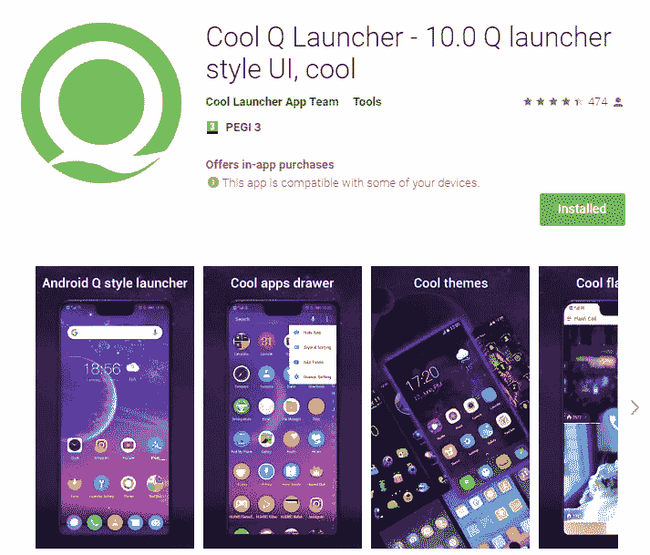
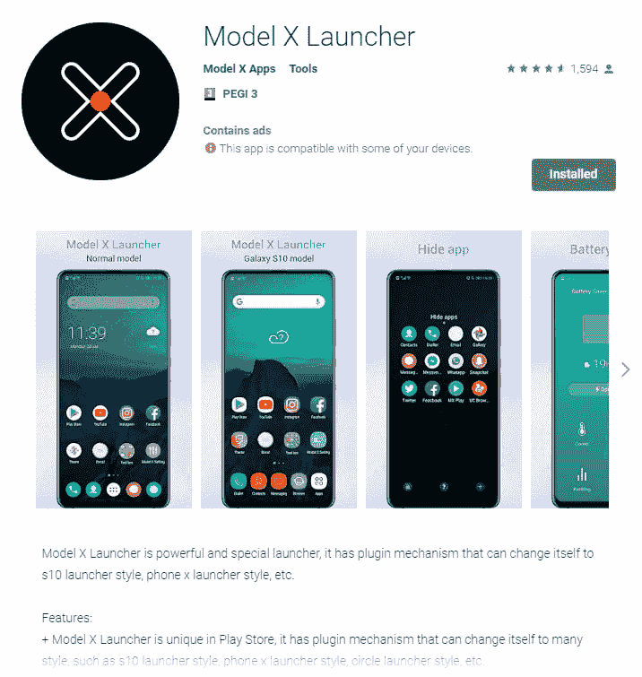

# PSA:避免可疑的 Android 应用程序

> 原文：<https://dev.to/deletescape/psa-avoid-shady-android-launcher-apps-1l00>

Play Store 上有很多非常奇怪和可疑的应用程序，但它们的下载量一直很高。这实际上是它们仍然存在的唯一原因，在你的应用程序描述中抛出一堆关键词并获得大量收入仍然非常容易。今天，我们将深入探讨这些应用程序的主要类别之一，启动器。通常不难判断其中一个是否真的值得信任，常见的危险信号有:

*   关键字填充的应用程序名称，如的启动器- S10/S9/S8 启动器，S10 主题，酷(是的，这个应用程序存在)
*   内置主题/壁纸商店作为主要卖点
*   直播/视频/3D 壁纸是主要卖点
*   电池/RAM 升压器(无论附带什么，这些都是危险信号)

还要看评论，尤其是那些评分较低的，这类出版商往往都有付费的正面评论。

<figcaption>Yes, this app is just as shady as it looks, but somehow it has over 100.000 downloads.</figcaption>

## 怎么看起来都一样？

许多这些应用程序都来自同一个开发团队。他们有多个开发人员帐户，为同一个应用程序创建大量的列表，只需进行微小的外观更改。这使得他们可以覆盖大量的关键词，获得数百万次安装，而大部分时间都不被发现。谷歌的算法会时不时地通过在 Play Store 主屏幕上为一些用户展示它们来祝福其中一个。

<figcaption>It's almost as if this was the same app (it is).</figcaption>

## 这些 app 为什么会存在？

这些软件能够工作的首要原因是有人下载它们。不是每个人都足够了解技术或应用程序，能够意识到哪些应用程序可以安全使用，哪些不可以。检查一下你不太懂技术的亲戚和朋友的手机上安装的应用程序(当然只有在他们同意的情况下)，以确保他们没有上当，这绝对不是一个坏主意。

几乎所有这些应用程序都包含广告，通常来自多个 SDK，通过它们在所有列表中获得的所有安装，产生了不小的收入。他们中的许多人额外上传分析和其他用户数据到他们自己的服务器上，这使得他们很可能额外出售这些数据或将其用于研究。

最近，他们中的一些人甚至开始提供他们的主要产品，不是高价的一次性付款，而是按月订阅。

<figcaption>The 'Model X Launcher' premium offering is a bargain at only $36/year.</figcaption>

## 这些是谁做的？

我不知道是谁有这么一点点道德操守来做这样的事情，但我可以追溯到最近这波发布会上大多数应用的开发者之一是 KK 移动。他们的网站也是这些应用程序正在使用的 API 的一部分，这些 API 显然都是基于完全未加密的 HTTP。其他 API 调用(也是 HTTP)大多直接发生在这两个 IP 上:【121.40.46.187】，。快速浏览一下 shodan 就足以知道这些已经很久没有打补丁了，很容易受到一大堆简历的攻击。所以再重复一遍，不惜一切代价避免这种类型的启动器(或者任何其他类别的应用),总会有更好的选择。

> 这篇帖子是基于这个 [twitter 帖子](https://twitter.com/deletescape/status/1133008200205250560)的。