# 简单解释了公钥密码

> 原文：<https://dev.to/brandonskerritt/public-key-cryptography-simply-explained-2ng1>

公钥密码学对每个人来说似乎都很神奇，即使是那些理解它的人。在这篇文章中，我将解释公钥加密。公钥密码学是建立在非对称密码学的基础上的，所以首先让我们来谈谈对称密码学。

**文章太长？现在太忙没时间看书？**不用担心！注册我的[邮件列表](https://pages.convertkit.com/2387f6548e/5c6c74da72)，你会得到这篇精美的 PDF 格式的文章。你还会得到一些额外的内容，这是这篇博文✨没有的

### 对称密码术

你的前门通常是用钥匙锁上的。这把钥匙可以打开和锁上你的前门。有了对称加密，你就有了一把钥匙，你可以用它来开锁和上锁。

只有有钥匙或钥匙副本的人才能打开门。现在，想象你正在巴厘岛度假。你想邀请你的朋友来照看你的猫😺当你在美丽的海滩上🏖️.

在假期之前，你给你的朋友你的门的钥匙。然后你的朋友被抢了，所以别人现在有了你的前门钥匙。或者你的朋友把它到处乱放，然后有人克隆了它。对称密钥加密的问题是，这一个密钥很容易被克隆，很容易用许多不同的方式攻击你的房子。

让我们从对称加密的实际例子中进行类比。

### 凯撒的密码

朱利叶斯·凯撒用一种密码发送信息，除了预定的接收者，没有人能读懂。主要是因为没有人能够阅读公元前 100 年的书籍，而那些能够阅读的人也无法理解随机的一串字母。这就是密码学的全部意义。创造没有第三方监听的交流方式。这个密码是*凯撒的密码*。给定一个字母表和一个键(键是 1 到 25 之间的整数)，通过键移动所有的字母表字母。

[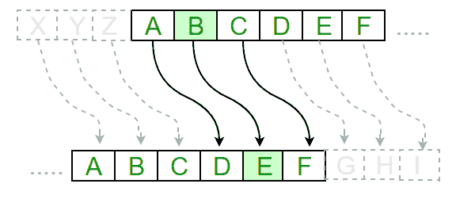](https://res.cloudinary.com/practicaldev/image/fetch/s--qEgxmyPy--/c_limit%2Cf_auto%2Cfl_progressive%2Cq_auto%2Cw_880/https://cdn-images-1.medium.com/max/600/0%2APIIOrXblvDxuEi9-.png)

移位 3，如上图所示，A 变成 D，B 变成 E，依此类推，直到 X = A。原始消息称为*明文*，加密消息称为*密文*。

执行凯撒密码最简单的方法是把所有的字母都变成数字，a = 1，b = 2，c = 3 等等。

要加密 E，需要对每个字母进行计算(其中 s 是位移):

[](https://res.cloudinary.com/practicaldev/image/fetch/s--yZ8t49kk--/c_limit%2Cf_auto%2Cfl_progressive%2Cq_auto%2Cw_880/https://cdn-images-1.medium.com/max/840/1%2A2C8XGWFYrCIAw_RR7OB-hw.png)

这被称为*函数。*你把一个输入放进去，一个输出出来。很多函数被称为双向函数。你可以使用上面的函数进行加密，解密的时候反过来做是有意义的。给定一个使一个数加倍的函数，如果你有一个加倍的数，你想反转这个函数，做与乘以 2 相反的事情，将这个数除以 2。

*mod* 是模数运算符。这是除法的余数。我们做模数是因为字母表里没有第 27 个字母，你只要从“z”绕回“a”就行了。我们将在本文中更多地讨论模块化。看看下面这个小例子:

[](https://res.cloudinary.com/practicaldev/image/fetch/s--w47IOWJg--/c_limit%2Cf_auto%2Cfl_progressive%2Cq_auto%2Cw_880/https://cdn-images-1.medium.com/max/840/1%2AWUaYwZfzt1FjLOa3FK90Mw.png)

因为 4 除以 3 有余数 1。

要解密凯撒的密码 D，你要计算每个字母:

[](https://res.cloudinary.com/practicaldev/image/fetch/s--VzcO7z32--/c_limit%2Cf_auto%2Cfl_progressive%2Cq_auto%2Cw_880/https://cdn-images-1.medium.com/max/840/1%2A1p04owssRR8RwwO9CdZ7rA.png)

如你所见，这不是很安全。总共移动 25 次，你只需要移动文本 25 次，直到你找到解密的代码，这被称为暴力攻击。你把加密的文本全部移动 25 次，直到你找到解密的文本。但是让我们想象一下这是一个硬密码——暴力破解是不可行的。

例如，你如何告诉你的朋友你正在使用 9 班制？你必须以某种方式传达给他们。任何形式的交流都可以被监听——无论是写信还是去离最近的城镇 30 英里的瑞士的一个隐蔽的森林告诉你的朋友。

后者不太可行，但比在纽约时代广场告诉你的朋友要安全得多🗽转变是什么。

现在，想象你用一个特殊的午餐盒带午餐去工作——和你从幼儿园开始就用的一样。有人偷了你的食物和午餐盒。你不介意失去食物，但你想要回午餐盒。你想让他们安全地归还你的午餐盒，而你不知道是谁拿走的——因为这样可以减轻他们的压力。

你在员工房间放一个带锁和钥匙的箱子。你给办公室里的每个人都发了一份钥匙，并希望有最好的结果——有人会把饭盒放在盒子里归还。

[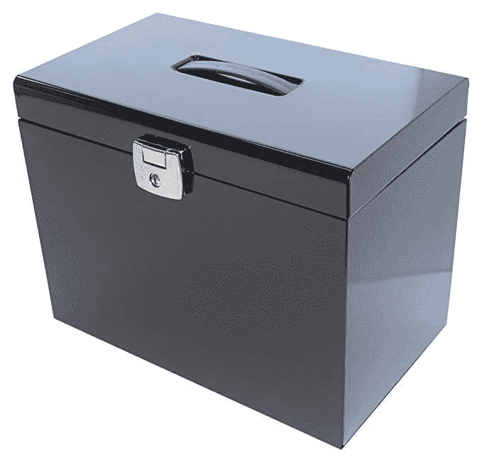](https://res.cloudinary.com/practicaldev/image/fetch/s--0_6_hVEQ--/c_limit%2Cf_auto%2Cfl_progressive%2Cq_auto%2Cw_880/https://cdn-images-1.medium.com/max/679/0%2AL967GhcV-NY6GWpM.png)

不幸的是，每个人都有的钥匙在打开箱子的同时也锁住了它。这意味着有人可以打开盒子，重新偷走你的午餐盒。

我们需要找到一种方法来摆脱这种共享密钥的想法，摆脱“任何密钥都可以锁定和解锁”的想法，这就是不对称密码术的用武之地。

### 非对称加密

[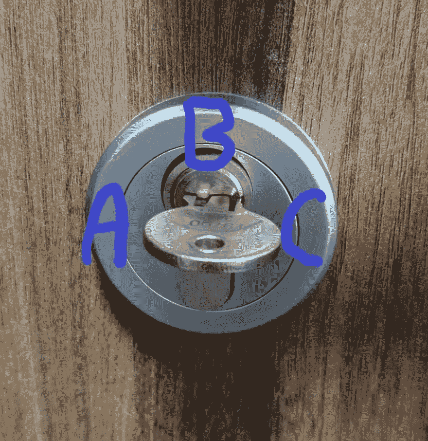](https://res.cloudinary.com/practicaldev/image/fetch/s--DrHpzv0h--/c_limit%2Cf_auto%2Cfl_progressive%2Cq_auto%2Cw_880/https://cdn-images-1.medium.com/max/1024/0%2A0vxWJd14iYJ98t80.jpg)

你在这个盒子上安装了一把特别的锁，有两把独立的钥匙。第一把钥匙🔑只能顺时针转动，从 **A** (锁定)到 **B** (解锁)到 **C** (锁定)。

第二把钥匙🗝️只能逆时针转动，从 **C** 到 **B** 到 **A** 。你选择第一把钥匙，并把它留给你自己。这被称为私钥。第二个密钥称为公钥。这把钥匙发给办公室里的每个人。你希望每个人都有这把钥匙。

当有人归还你珍贵的午餐盒时，他们可以把它放在这个盒子里。公钥能做的就是锁箱子。你的私人钥匙是唯一能打开它的钥匙。

这是公钥加密。大家都知道，如果他们把东西放在盒子里，然后锁上，只有你可以用你的私人钥匙打开它。

有了对称加密技术，每个人都可以打开你的盒子，如果他们有钥匙的话。现在，除了你没有人能打开这个盒子。

公钥密码学最早是由[怀特菲尔德-迪菲](https://www.wikiwand.com/en/Diffie%E2%80%93Hellman_key_exchange)或[詹姆斯·埃利斯](https://www.wikiwand.com/en/James_H._Ellis)制定的(埃利斯最先发现，但他没有发表。怀特菲尔德-迪菲最先发表)。埃利斯和怀特菲尔德-迪菲都很欣赏公钥密码理论的可行性，但他们从未想出它在实践中是如何工作的。

一个有效的公钥加密系统的产生归功于[Rivest–sha mir–ad leman](https://www.wikiwand.com/en/RSA_(cryptosystem))(RSA)或 [Clifford Cocks](https://www.wikiwand.com/en/Clifford_Cocks) 。和上面一样，Cocks 最先发现，但他没有发表。rivest–sha mir–ad leman 最先发表。

让我们看看这在数学上是如何工作的。

### 公钥加密背后的数学

虽然盒子类比是物理上的，但我们将回到加密消息，就像我们对凯撒密码所做的那样。

[](https://res.cloudinary.com/practicaldev/image/fetch/s--TAbfRCCj--/c_limit%2Cf_auto%2Cfl_progressive%2Cq_auto%2Cw_880/https://cdn-images-1.medium.com/max/840/1%2AIuUfVi6osxGhN0VIIlK_RA.png)

当您将公钥(K+)应用于加密的消息，然后将私钥(K-)应用于加密的消息时，您得到的是明文消息。我们也在寻找这些属性:

在计算上很容易:

*   生成一组密钥
*   使用这些密钥加密/解密

但是计算上也不可行:

### 把信息变成数字

我们想把信息转化成数字。以前我们给每个字母分配一个数字，A = 1，依此类推。*美国信息交换标准码* (ASCII)是所有英文字母和大部分符号以及它们相关的 ASCII 码&二进制输出的表格。

当你按下键盘上的一个键时，键盘会将其转换成 Ascii 码，因为对计算机来说，数字比字母更容易处理。如果你想了解更多关于 ASCII 的知识，可以看看这个[视频](https://www.youtube.com/watch?v=MijmeoH9LT4)。

[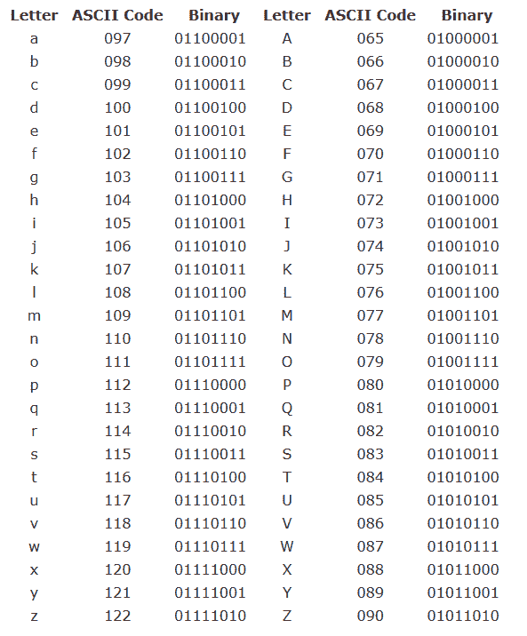](https://res.cloudinary.com/practicaldev/image/fetch/s--A2G6L6O2--/c_limit%2Cf_auto%2Cfl_progressive%2Cq_auto%2Cw_880/https://cdn-images-1.medium.com/max/593/0%2AOdQOex3Ht-iMnC9r.png)

我们来加密一下“猫”这个词。在二进制中，根据 Ascii，这是:

[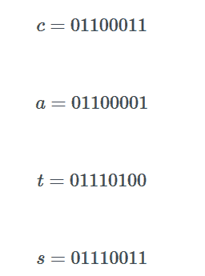](https://res.cloudinary.com/practicaldev/image/fetch/s--UOeoVg0U--/c_limit%2Cf_auto%2Cfl_progressive%2Cq_auto%2Cw_880/https://cdn-images-1.medium.com/max/256/1%2AhOKmJLYchdkpTbG2TuxT0g.png)

如果你把它们加在一起，转换成基数为 10，你得到 4430123。对于我们的例子，我们将看看 Rivest–sha mir–ad leman(RSA)是如何计算公钥和私钥的。我们也将使用更小的数字，所以数学不那么难读。

下面是我创建的一个计算器，用于将 ASCII 转换成二进制。在我的[网站](https://skerritt.blog/how-does-public-key-cryptography-work/)上查看效果更好，在那里可以交互和运行代码。

```
# https://stackoverflow.com/a/40949538 def string2bits(s=''):
    return [bin(ord(x))[2:].zfill(8) for x in s]

# edit the text below to see how this works text = 'cats'
bits = string2bits(text)

for x in bits:
    print x

# output
# 01100011
# 01100001
# 01110100
# 01110011 
```

Enter fullscreen mode Exit fullscreen mode

### RSA

*   选择 2 个大质数，p & q。

质数是只有 2 个[因子](https://www.bbc.com/bitesize/topics/zfq7hyc)，1 和它本身的数。我们将选择 5 & 7，不是大的质数，而是小的，为了简洁。

*   计算 n = pq，z = (p-1)(q-1)

[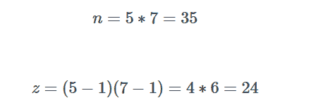](https://res.cloudinary.com/practicaldev/image/fetch/s--8NooJAZY--/c_limit%2Cf_auto%2Cfl_progressive%2Cq_auto%2Cw_880/https://cdn-images-1.medium.com/max/465/1%2AP-YOIAfDqQTNIrSmhM9kBg.png)

*   选择 e(其中 e < z)使得 e 与 z 没有公因数。

e = 5

5 和 24 没有公因数，而且比 24 小。

**选择 d，使 ed-1 能被 z 整除。

最简单的方法是在代码中遍历 d 的所有可能值。这段代码是用 [Functional Python](https://skerritt.blog/learn-functional-python-in-10-minutes/) 编写的，但是语言和范式并不重要。

```
>>> list(filter(lambda x: ((x * 5) - 1) % 24 == 0, range(1, 200)))
[5, 29, 53, 77, 101, 125, 149, 173, 197] 
```

Enter fullscreen mode Exit fullscreen mode

因为我们使用这么小的数字，我们有重叠。e 和 d 都是 5。让我们将 d 设置为 29，这样我们就不会有这种重叠。

d = 29

*   公钥是(n，e)。私钥是(n，d)

[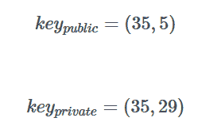](https://res.cloudinary.com/practicaldev/image/fetch/s--82UPfaxV--/c_limit%2Cf_auto%2Cfl_progressive%2Cq_auto%2Cw_880/https://cdn-images-1.medium.com/max/278/1%2A4Ds-BOOLCPVt9WRnMovzmw.png)

下面是生成 RSA 密钥的代码。注意，如上所述，在 p = 5 和 q = 7 时，我们在 d 上有重叠。

```
def rsa(p, q):
  n = p * q
  z = (p - 1) * (q - 1)

  # calculate e such that e is less than z
  # and e has no common factors with z
  for i in range(1, z - 1):
    if z % i != 0:
      e = i
      break

  d = (filter(lambda x: ((x * 5) - 1) % 24 == 0, range(1, 200)))[0]
  return{"Public key": [n, d], "Private Key": [n, e]}

# change p and q here to any prime numbers of your choice p = 5
q = 7

print(rsa(p, q)) 
```

Enter fullscreen mode Exit fullscreen mode

为了发送加密的消息，鲍勃计算出消息 m 和密钥 e 的 C = m^e 模 n。为了解密消息，爱丽丝计算出 m = c^d 模 n

加密“猫”给我们 42⁷⁵模 35 = 7。

解密“猫”给了我们 4430123。

然后，为了发送消息 m，鲍勃计算 c=m^e (mod N)并将其发送给爱丽丝，爱丽丝用她的私钥 d 和 m=c^d (mod N)解密该消息

### 为什么会起作用？

质因数分解。将两个质数相乘很容易，但要找出用什么质数来做这个数却非常困难。你可以很容易地将这两者相乘:

[](https://res.cloudinary.com/practicaldev/image/fetch/s--Xv2lkAXo--/c_limit%2Cf_auto%2Cfl_progressive%2Cq_auto%2Cw_880/https://cdn-images-1.medium.com/max/840/1%2AQzroGYekr4b2W836pXlE6Q.png)

但是如果我给你 992，474，117，并告诉你找出用来产生这个数的质数，这在计算上是不可行的。当你意识到所用的质数非常非常大时，就更是如此。

这被称为活板门功能或单向功能。虽然走一条路很容易，但走另一条路在计算上是不可行的。煮鸡蛋是单向函数，因为煮鸡蛋很容易，但不煮鸡蛋是不可能的。让我们更深入地研究数学，探索模运算。

### 回模运算

想象一个有限范围的数字，例如 1 到 12。这些数字排列成一个圆圈，很像一个时钟(模运算有时因此被称为时钟运算)

[](https://res.cloudinary.com/practicaldev/image/fetch/s--iBxcJHLJ--/c_limit%2Cf_auto%2Cfl_progressive%2Cq_auto%2Cw_880/https://cdn-images-1.medium.com/max/512/0%2APSgmS9Vbq5fOqCKS.png)

在这个钟周围数到 13。你数到 12，然后你需要再数 1，所以你回到 1。模运算仍然被定义为除法的余数，但是它也可以被定义为(并且更普遍地被定义为)时钟。

使用模运算的函数往往表现不稳定，这反过来有时使它们成为单向函数。让我们通过一个例子来看看这一点，以一个常规函数为例，看看当它变成一个模算术函数时是如何工作的。

3^x

当我们把 2 代入这个函数，我们得到= 6。插入 3，我们得到= 9

这个功能很容易逆转。如果给我们 9，我们可以知道函数的输入为 3，因为= 9。

然而，随着模运算的加入，它的行为并不明智。

图像我们有这个公式:

3^x mod 7 = 1

你怎么知道 x 是什么？你不能把模放在另一边，因为实际上没有模运算的逆运算。猜呢？让我们输入 5:

√对 7 = 5

好吧，那太大了。你可能想更低，也许 4 或 3，但实际上这是错误的方向。当 x 是 6 时，它等于 1。

在普通算术中，我们可以测试数字，并感受我们是变得更暖还是更冷，但在模算术中却不是这样。

通常反转模运算最简单的方法是为 x 的所有值编译一个表，直到找到正确的答案。虽然这对于较小的数字可能有效，但是对于大得多的数字，在计算上是不可行的。这就是为什么模运算被称为单向函数的原因。

如果我给你一个数字，比如 5787，并告诉你找到它的函数，这是不可行的。事实上，如果我给你在函数中输入任意数字的能力，还是会很难。我只花了几秒钟就做出了这个函数，但是你要花几个小时甚至几天才能算出 x 是什么。

RSA 是一个单向函数。虽然执行这个函数相对容易，但是执行该函数的逆运算并找出键是什么在计算上是不可行的。不过，如果你知道一些数字，比如 n，就有可能逆转 RSA 加密。

### 我们来说说 N

回想一下之前我详细介绍 RSA 算法是如何工作的。有一个数字，n 美元。这个 n 是特殊的，因为在某些情况下，n 可以使这个单向函数可逆

n 是两个素数的乘积。如前所述，如果我们将 5 美元和 7 美元相乘，我们会得到:

n = 35

为了让 Bob 给 Alice 发送消息，他使用 Alice 的公钥对消息进行加密。既然信息被加密了，肯定有办法让爱丽丝解密。一定有办法让爱丽丝逆转这一切，但只能让爱丽丝逆转。你不能让 Eve 或 Niamh 或 Hannah 逆转它——因为那样就没有加密的意义了。

RSA 是这样设计的，知道 P 和 Q(两个质数相乘得到 N)的人可以解密消息。

虽然爱丽丝已经告诉全世界她的公钥是 n = 35，但是除了爱丽丝没有人知道 P = 7，Q = 5。请注意，为了简洁起见，质数故意很小。

你可能在想“很容易猜到 35 的质因数是 5 和 7”，你可能是对的。但是，如果数字足够大，要找到 p 和 q 几乎是不可能的。

事实上，对于足够大的数，p 和 q 相乘本质上是单向函数。有可能在未来，也许是不久的将来(随着量子计算机的发明)，因式分解数字变得很容易。数千年来，数学家们一直试图找到一种有效的方法来分解数字，但都失败了，所以目前它被认为是安全的。

### 让我们更深入地研究数学

好，让我们看看模数是如何工作的。你知道为什么乘法是有效的，模数是如何有效的。但是其他方程呢？它们是干什么用的？

让我们使用欧拉和费尔马特的恒等式来演示解密算法:

> *对于任意整数(M)，M 与 n 互质:*

[](https://res.cloudinary.com/practicaldev/image/fetch/s--qnY9BCRH--/c_limit%2Cf_auto%2Cfl_progressive%2Cq_auto%2Cw_880/https://cdn-images-1.medium.com/max/840/1%2AWOObVP5-x7F6UB3QGIaDLQ.png)

这是欧拉函数，给出了小于 n 且与 n 互质的正整数的数目。互质是指两个数字只共享因子 1。在现代，我们在欧拉函数上使用[卡迈克尔函数](https://www.wikiwand.com/en/Carmichael_function)，因为欧拉函数有时会产生太大而无法使用的数字。然而，我们使用的是欧拉的通用函数，因为它是原始 RSA 论文所使用的。

这听起来令人困惑，但让我们来分解一下。根据函数的基本性质:

[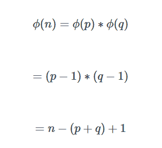](https://res.cloudinary.com/practicaldev/image/fetch/s--6Q2VPFyj--/c_limit%2Cf_auto%2Cfl_progressive%2Cq_auto%2Cw_880/https://cdn-images-1.medium.com/max/323/1%2ARNP6NmkIgg3McisKdMz_XQ.png)

由于 d 与 **ϕ** i (n)互质，所以它在整数模＄**ϕ**(n)的环中有一个乘法逆 e。这意味着，只要知道一些关于所用数字的知识，我们用于 RSA 的公式可以反过来(活板门可以反过来)。

如果没有这种特殊的数学属性，如果你知道使用的一些数字，就不可能逆转加密并找出密文。

加密算法 c = m^e mod n 的[模乘逆运算](https://www.wikiwand.com/en/Modular_multiplicative_inverse)是 m = c^d mod n。所有这些数学运算都建立在这个基础上。这里大量涉及了模运算和单向函数。为了加密，你计算 c，为了解密，你计算 m，这两个都需要知道 n，也就是我们前面讲的特殊数。

如果你想了解更多关于 RSA 的数学知识，我强烈推荐可读的，原创的 RSA 论文。

### 认证

你如何证明鲍勃发送的信息实际上是鲍勃发送的，而不是夏娃发送的？您需要一种方法来验证它们。在现实世界中，我们使用签名进行身份验证。虽然这些可以伪造，你可以使用生物扫描仪进行身份验证，但你的指纹可以被提取和复制。

您可以使用密码，但同样，就像凯撒密码及其单个密钥没有用一样，使用单个密钥的身份验证方法并不完美。

您可以使用密码，但同样，就像凯撒的密码和它的单个密钥是无用的一样，使用单个密钥的认证方法并不完美。

[](https://res.cloudinary.com/practicaldev/image/fetch/s--H_iMgmIT--/c_limit%2Cf_auto%2Cfl_progressive%2Cq_auto%2Cw_880/https://cdn-images-1.medium.com/max/840/1%2A8U8mFD7hhMZn1ox4sd4LSQ.png)

假设 Bob 想向 Alice 证明 Bob 写了他发给她的消息。Bob 用他的私钥(K-)发送他的原始消息和该消息的加密版本。Alice 使用 Bob 的公钥(K+)，使用上面的公式，将加密的消息变回普通消息。然后 Alice 检查 Bob 发送的消息和她从加密消息中得到的消息。如果它们匹配，她可以确定是有 Bob 私钥的人(可能是 Bob)发送的。

这种加密方法很糟糕，因为如果 Bob 用他的私钥加密他的消息，任何人都可以用他的私钥阅读它。此外，证明 Bob 发送了某些东西在计算上也很昂贵。这就是我们创建消息摘要并加密以验证 Bob 的原因。这个消息摘要是使用一个*散列函数完成的。*

为了学习更多关于散列函数的知识，我写了一篇姐妹文章来解释它们。

### 回到密码学

通过加密消息的散列，我们加快了加密的过程，这使得认证更快。现在，让我们捉弄一下鲍勃。

我们创建了一个电子邮件订单，向一家披萨店订购 4 份意大利香肠披萨。我们用我们的私钥签署这封邮件。我们将我们的公钥发送给比萨饼店，但是我们告诉他们 Bob 的电话已经没电了，我们的公钥实际上是 Bob 的公钥。

比萨饼店验证签名并发送 4 个意大利香肠比萨饼🍕敬鲍勃。最糟糕的是，鲍勃甚至不喜欢意大利香肠。这就是*认证机构*发挥作用的地方。

证书颁发机构(CA)将公钥绑定到特定的实体。该实体向 CA 提供身份证明，然后 CA 创建一个证书，将该实体绑定到其公钥。这个想法是为了消除对个人公钥的信任。你仍然必须信任一个组织，但许多人发现信任一个组织比信任一个人更好。

包含实体公钥的证书由 CA 进行数字签名。这个签名是 CA 说“这是实体的公钥”。

[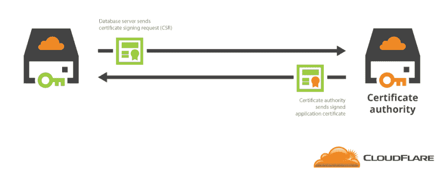](https://res.cloudinary.com/practicaldev/image/fetch/s--fDlKqePH--/c_limit%2Cf_auto%2Cfl_progressive%2Cq_auto%2Cw_880/https://cdn-images-1.medium.com/max/1024/0%2AIyRwRnk7nKCA8fse.png)

当爱丽丝想要鲍勃的公钥时，她得到鲍勃的证书。然后，她将 CA 的公钥应用于 Bob 的证书，以获得 Bob 的公钥。

[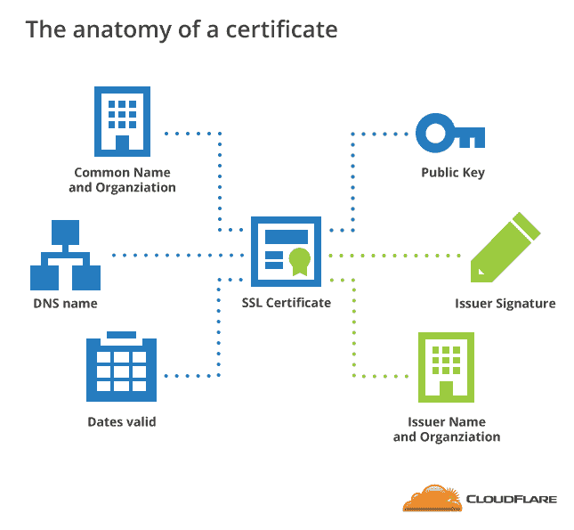](https://res.cloudinary.com/practicaldev/image/fetch/s--jB2KfxkP--/c_limit%2Cf_auto%2Cfl_progressive%2Cq_auto%2Cw_880/https://cdn-images-1.medium.com/max/645/0%2Ad5Wu8E3olF_OpejF.png)

Cloudflare 有一篇关于证书颁发机构的精彩文章[在这里](https://blog.cloudflare.com/how-to-build-your-own-public-key-infrastructure/)。

### 安全的电子邮件，具有良好的隐私性

菲尔·齐默曼发明了[非常好的隐私](https://www.wikiwand.com/en/Pretty_Good_Privacy) (PGP)，事实上的电子邮件加密标准。Zimmerman 在 PGP 中使用了 RSA。RSA 是有专利的，他没有获得 RSA inc(拥有专利的公司)的许可来使用 RSA 发布另一个密码。

齐默尔曼也是美国联邦调查的一个目标，因为当时根据美国法律，加密程序被视为军需品。当被问及所有的麻烦是否值得出版 PGP 时，他说他“不后悔”。让我们看看这个曾经是非法的算法是如何工作的。

当 Alice 想给 Bob 发送一封机密电子邮件时，她:

1.  生成随机对称私钥 K-。
2.  用 K-加密她的电子邮件(为了提高效率)
3.  也用 Bob 的公钥对 K-加密。
4.  Alice 对加密邮件进行了数字签名。
5.  爱丽丝把两个都发给了鲍勃

[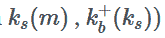](https://res.cloudinary.com/practicaldev/image/fetch/s--m5aB6_lm--/c_limit%2Cf_auto%2Cfl_progressive%2Cq_auto%2Cw_880/https://cdn-images-1.medium.com/max/165/1%2AdoDEYrRO9h1W1CRxseUFtw.png)

还有她的数字签名。

爱丽丝总共用了三把钥匙。她的私钥、Bob 的公钥和新创建的对称密钥。

[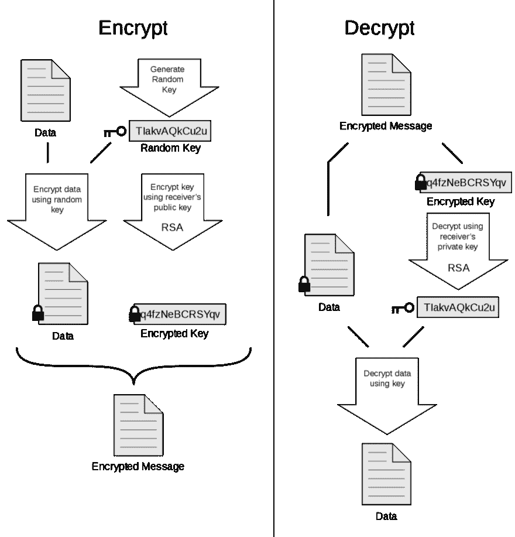](https://res.cloudinary.com/practicaldev/image/fetch/s--7HURYTpq--/c_limit%2Cf_auto%2Cfl_progressive%2Cq_auto%2Cw_880/https://cdn-images-1.medium.com/max/1024/0%2ADUNCAbU62a5Esr8H.png)

这种用公钥加密对称密钥的想法被称为[混合密码系统](https://www.wikiwand.com/en/Hybrid_cryptosystem)。有些电子邮件可能非常大，用公钥系统加密这些邮件需要很长时间。

使用对称密钥系统，如 [AES](https://www.wikiwand.com/en/Advanced_Encryption_Standard) ，它难以置信地难以破解(但没有 RSA 那么难)。用公共密钥加密 AES 密钥(仅加密密钥，而不是整个电子邮件)。这样，接收者可以应用他们的私钥并找出 AES 对称密钥来解密电子邮件。

没有多少人使用 PGP，因为它很难设置。你最多需要下载一个你信任的程序来正确实现 PGP。2018 年[显示](https://www.wired.co.uk/article/efail-pgp-vulnerability-outlook-thunderbird-smime)苹果邮件、雷鸟和 Outlook 等电子邮件客户端——设置为启用 PGP 的——可以被强制显示非加密版本。

更不用说一个人在一个由非加密邮件组成的网络上发送加密邮件看起来有多可疑了。默认情况下，唯一启用 PGP 的电子邮件客户端(和地址提供商)是 ProtonMail，但即使如此，它也只适用于质子对质子的电子邮件，你必须相信该公司会正确实施它。

> proton mail@ proton mail[@ camfassett](https://twitter.com/camfassett)他们中的大多数做得很好，但是我们理解你的观点。我们构建 ProtonMail 是为了让非技术人员也能使用 PGP 加密。我们将确保 100%达到这个目标。；)再次感谢！21:37PM-2018 年 1 月 21 日[](https://twitter.com/intent/tweet?in_reply_to=955192767952629760)[](https://twitter.com/intent/retweet?tweet_id=955192767952629760)[](https://twitter.com/intent/like?tweet_id=955192767952629760)

#### 结论

密码学已经使用了几千年，几乎和人类拥有秘密的时间一样长。在我们不断努力为除了少数人之外的所有人保守秘密的过程中，我们发现了这个非常有效的神奇算法。毫无疑问，在 300 或 400 年后，它将被破解，就像凯撒认为他的密码永远不会被破解一样。

嘿👋想订阅我的博客，了解与本文类似的最新动态吗？订阅我下面的电子邮件列表。我不会给你发垃圾邮件。我只会给你发类似的帖子😊✨

在这里报名吧！

* * *