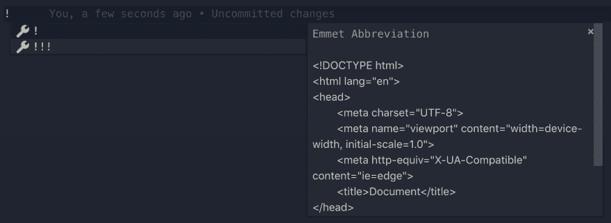

# 使用包进行热重装的包脚本

> 原文：<https://dev.to/tkshnwesper/purescript-with-hot-reloading-using-parcel-ip3>

## 这个“为什么”

因此，您可能已经注意到，Parcel 不支持 Purescript。这意味着我们不能简单地说

```
<script src="src/Main.purs"></script> 
```

让它运转起来。另一件事是，推荐的 Purescript 构建工具支持一些很酷的东西，比如

```
pulp browserify 
```

(虽然我真的没有在其他构建工具上见过这种事情)和

```
pulp server 
```

它启动一个服务器，为源代码中的任何更改重建 JS 输出。

但是浏览器没有热重装。您仍然需要进行手动刷新。我觉得当你在开发的时候，这是一种拖累，因为它不是不可能设置热重装，远非如此，它现在是超级容易的，感谢包(因为我们甚至不必配置 Webpack！🎉)我相信这一选择不会太牵强。

无论如何，让我们进入细节。

## 一些先决条件

### 得到`pulp`

我猜您已经使用推荐的方法建立了一个 Purescript 项目。如果没有，[请自便](https://github.com/purescript/documentation/blob/master/guides/Getting-Started.md)。

### 创造一个`package.json`

确保您的项目根目录中有一个`package.json`文件。您可以手动创建一个，或者在使用
设置的过程中回答几个问题

```
npm init 
```

命令。

### 也需要一些`npm`的依赖

即，

1.  `concurrently`
2.  `parcel-bundler`

你可以简单地运行，

```
npm i -D concurrently parcel-bundler 
```

### 最后是一个`index.html`文件

在我的例子中，在我为 VSCode 安装的*众多*插件中(或者甚至 VSCode 本身就支持这个),我有一个代码片段的快捷方式，它本质上生成了一个样板 HTML。您也可以通过在一个`HTML`文件中键入一个`!`来检查您是否拥有它。

[](https://res.cloudinary.com/practicaldev/image/fetch/s--eMYTS4hU--/c_limit%2Cf_auto%2Cfl_progressive%2Cq_auto%2Cw_880/https://thepracticaldev.s3.amazonaws.com/i/rmofh54jzyidbgu6vaxc.png)

无论如何，这就是:

```
<!DOCTYPE html>
<html lang="en">
<head>
  <meta charset="UTF-8">
  <meta name="viewport" content="width=device-width, initial-scale=1.0">
  <meta http-equiv="X-UA-Compatible" content="ie=edge">
  Document
</head>
<body>

</body>
</html> 
```

## 太棒了！你在做吗

你现在只需要做两个改变。

### 改变#1

在`package.json`文件中设置脚本，这将使启动开发服务器变得更加容易。

只需将其添加到`scripts`部分:

```
"start":  "concurrently \"pulp --watch build --to ./output/app.js\"  \"parcel index.html\"" 
```

### 改变#2

现在闭合回路，以便包裹拾取发出的`app.js`。

将此添加到`index.html` :
的`head`部分

```
<script src="output/app.js"></script> 
```

就是这样！我们完了！🎊

## 奔跑吧

只需运行

```
npm start 
```

这就足够了。

## 设置构建脚本

或者，您甚至可以设置一个构建脚本，在项目完成时使用。

将此添加到您的`package.json` :
中的`scripts`部分

```
"build":  "pulp build --to ./output/app.js && parcel build index.html" 
```

干杯！🍻