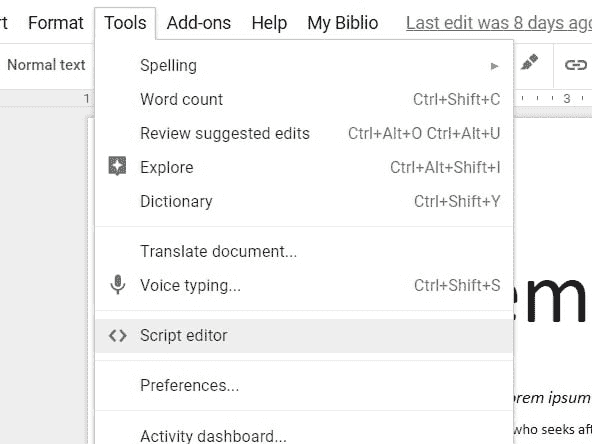
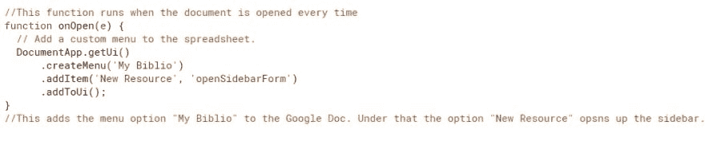
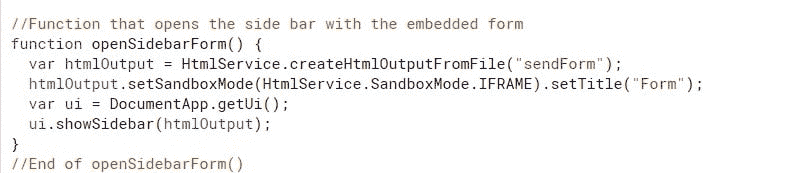
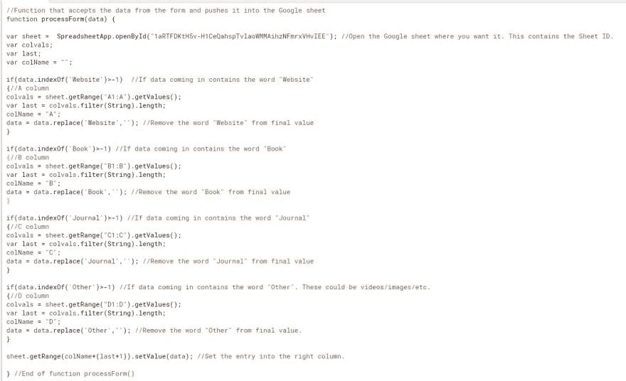
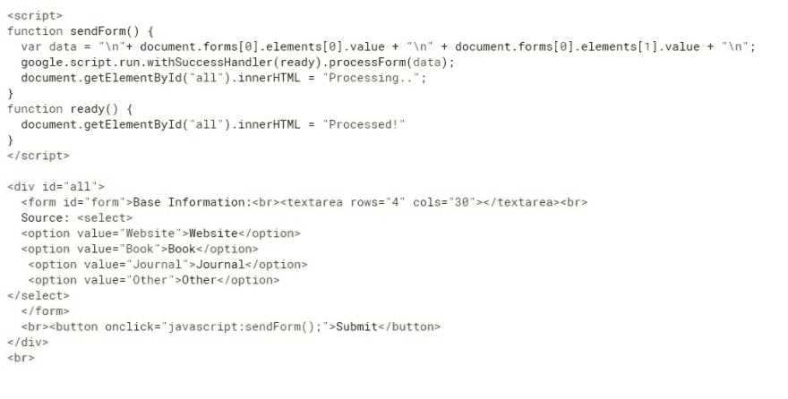
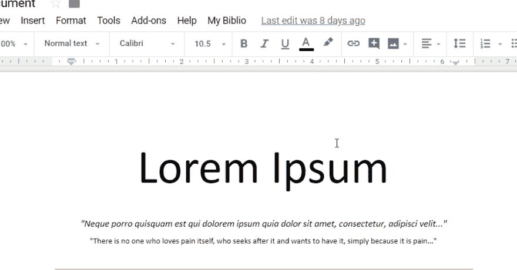

# 将数据从 Google doc 侧边栏推送到 Google 工作表

> 原文：<https://dev.to/skrish2017/pushing-data-from-google-doc-sidebar-to-a-google-sheet-3923>

我最近完成了我正在做的一门课程的研究性作业。这篇论文完全以谷歌文档的形式写成，并通过 TurnItIn 提交。如你所知，这样的论文需要大量的参考资料来支持我们在论文中的观点。通常情况下，跟踪这些资源——书籍、网站、日志、视频——会很困难。过去，我曾试图将它们组织在一个单独的谷歌表格中，以便日后阅读/引用，但要做到这一点，在浏览器标签之间来回切换总是很麻烦。我知道有现成的应用程序可以处理这类事情，但是嘿，这有什么意思呢？这个挑战迫使我在谷歌文档中编码，而我很少这样做。所以我拿了起来。

我决定试着写一个脚本，从 Google 文档中接受我的引用条目，然后按一个按钮就可以自动将该条目发送到 Google 工作表中。更多的条目会以同样的方式出现，工作表中的数据会不断被追加。

不过，有个问题。我也想把它组织得井井有条，以便以后引用时能更好地管理它。所以谷歌表单有 4 列，每一列都以资源种类为标题。该脚本应该识别哪种资源正在进入，并相应地将其放在正确的列中。

要求

在计算机科学中，我们教给学生的核心内容之一就是收集最终用户的需求。因此，我把它运用到自己身上，做了如下笔记:

*   谷歌文档中应打开一个侧栏，允许接受参考条目。
*   用 HTML 编码的侧边栏应该包含一个基本表单，该表单有一个提交按钮，它的工作是将值推入表单。
*   该表单还应该有一个分类器(像下拉菜单)来标识它是哪种资源。
*   根据表单中的选择，该条目将自动转到 Google 表单上相应的预设列。
*   额外收获:为了避免让 Google sheet 保持打开，看看它的发布版本是否可以嵌入到侧边栏 HTML 中。

**代码**

第一步是去谷歌文档，这里的参考将被创建。到了那里，我去了“工具”下的“脚本编辑器”。

代码有两个文件:code . GS(Google 脚本文件，它从这个文件中获取数据并发送给 Google Sheet)和 sendForm.html，它包含用户输入数据的表单。

**code.gs**

这个 google 脚本文件有三个功能。它们记录如下。

**sendForm.html**

第二个文件是与服务器端 Google script 函数交互的 HTML 服务。

**输出**

[输出 GIF](https://thepracticaldev.s3.amazonaws.com/i/x015wxbjeqhrm4tznjpf.gif)

**总结思路**

*   因此，解决方案是可行的。仍然需要根据类型(APA，MLA，Harvard 等)创建引用，但这种收集对我组织自己很有用。
*   可以修改 HTML 表单以容纳更多有用的信息，例如:上下文、目的、作者信息。在一个长期的研究项目中，这样的收集会证明是非常有用的。
*   我试着将 Google sheet 嵌入到侧边栏的 HTML 表单中，但是它看起来非常繁忙，并且结果没有像我希望的那样快速更新。但是到工作表的链接可以存在于 HTML 页面上。
*   这种解决方案的 2.0 版本也可能包括直接引用，以便根据所需的引用类型创建现成的引用。这显然意味着需要更多的代码来解析文本，查看作者、组织和内容类型。也许可以作为一个更大的项目来开发。