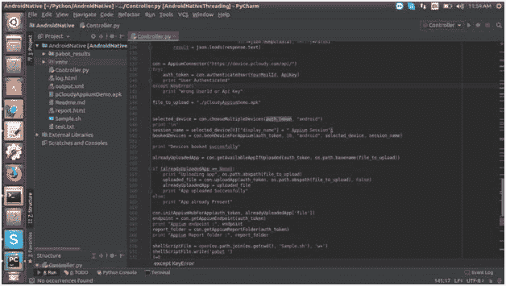
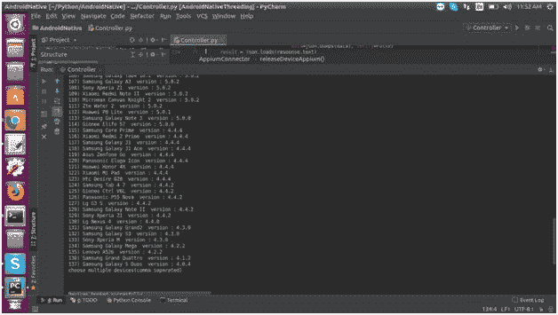
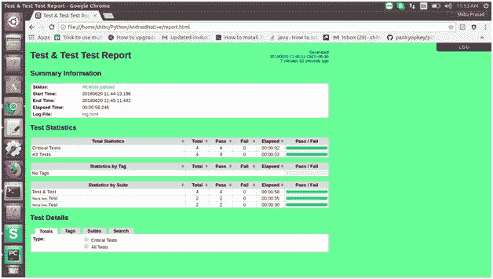

# Python + Appium + Robot 框架

> 原文：<https://dev.to/pcloudy/python-appium-robot-framework-9md>

Robot Framework 是一个通用的关键字驱动测试自动化框架，用于验收级别测试和验收测试驱动开发(ATDD)。它有一个易于使用的表格语法来创建测试用例，它的测试功能可以通过用 Python 或 Java 实现的测试库来扩展。用户还可以使用与创建测试用例相同的简单语法，从现有的关键字创建新的关键字。

先决条件(Ubuntu)

1.  安装 python(sudo apt-get install python)

2.  下载并安装 Py-Charms

3.  安装 Python pip(sudo apt-get install Python-pip)

4.  安装 Appium-Python 客户端(pip 安装 Appium-Python-Client)

5.  安装机器人框架

pip 安装机器人框架
pip 安装机器人框架-应用程序库

1.  下载示例项目并将其导入 PyCharm

如何在 [pCloudy](https://www.pcloudy.com) 设备上并行运行 Robot-Framework？

1.  打开 Controller.py，输入您的 MailId 和 ApiKey，然后运行

1.  选择要执行脚本的设备

1.  执行后，您将获得机器人框架生成的报告和日志

