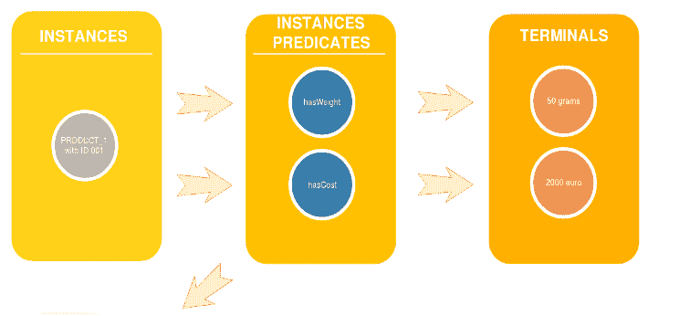

# Python Hydra:通过入侵 Web APIs 让夏天变得美好

> 原文：<https://dev.to/tuned/python-hydra-making-summer-great-by-hacking-web-apis-a0o>

这是 2017 年的一篇博客，原文可以在这里找到。我想在这里提出一个重新编辑的版本，有一些更新和补充。这篇文章中提到的活动是建立[九头蛇生态系统](http://hydraecosystem.org)的第一步，这是我们全新的开源组织。

今年我也怀着同样的热情，愉快地开始并完成了我作为谷歌暑期项目(T2 代码之夏或 GSOC)导师的冒险。世界各地的学生都有一个很好的机会来了解开源生态系统，并通过在谷歌开源的资助下对软件库做出贡献来体验真实世界操作系统组织领域的真实工作活动。今年，我设法组织了一个超级团队，集合了来自以下各方的力量:

*   Python 软件基金会的指导计划，非常积极地促进较小的操作系统组织的访问；
*   W3C Hydra 开发小组正在设计一个非常有趣的规范，使 Web APIs(特别是 REST)能够自动通信(参见[超媒体的一般介绍](https://en.wikipedia.org/wiki/Hypermedia))；
*   两位善良的学生非常理解我们正在做的事情的重要性，并决定提交提案来实现这个项目:克里斯·安德鲁和阿克谢·达西亚。

## 九头蛇

Hydra 是一个在 W3C 注册的草案中定义的工具，该规范由 Markus Lanthaler 和工作组中的团队成员(视频演示[这里](https://www.youtube.com/watch?v=fJCtaNRxg9M))正在[积极开发](https://github.com/HydraCG/Specifications)。

Hydra 是一个客户机-服务器框架(基于 W3C 的 RDF ),用于描述 Web APIs 并将其发布给网络代理。通过建模一个高级数据结构(“ApiDocumentation”或更短的“ApiDoc”，用 [JSON-LD](https://json-ld.org/) 编写)，利用规范提供的语义工具，开发人员可以使他们的数据可以被周围任何支持 Hydra 的客户端访问。

## 成就

Hydra 客户端-服务器系统使该框架的实现成为可能，现在可以通过将您自己的自定义 ApiDoc 添加到学生们今年夏天开发的一个代号为[hydrus(Hydra Universal Server)](https://github.com/HTTP-APIs/hydrus)的服务器软件来轻松设置。Hydrus 让开发人员通过两步程序运行系统:编写一次他们的 ApiDoc，并在有或没有预加载数据的情况下启动服务器(完整说明[此处](https://github.com/HTTP-APIs/hydrus#hydrus-))。

ApiDoc 可以在系统设计阶段编写一次，以后如果需要可以修改；客户端在与服务器握手时会请求 ApiDoc，这样它们就可以自动操作接口，实现驱动它们的业务逻辑。一旦系统在服务器端设置了正确的文档和数据，任何支持 Hydra 的客户端都可以连接并开始使用该接口进行操作(客户端可以在这里和这里找到，这里是 ApiDocumentation 的一个示例)。

今年夏天已经实现的下一个想法是在一个复杂的网络背景下可视化 Hydra 所做的所有工作。这就是为什么我们想出开发一个图形界面来模拟真实世界的场景，并显示正在进行的每一个 API 交互。我们称这个浏览器应用程序为**。模拟了一群商用无人机的飞行，以展示 Hydra documentation 如何让每架无人机中的内置客户端向中央服务器传达状态的变化；模拟中的每个组件既是一个 Hydra 感知客户端，也是一个 **hydrus** 服务器实例。**

 **## 意想不到的结果

上面描述的是非常酷的成就，展示了 Python-Hydra 实现如何在 Web 接口网络中轻松实现自动化。作为溢出效应，我们在使用 Python 函数式编程工具设计和实现一个非常有用的小规模 DBMS 以使用 PostgreSQL 存储语义三元组方面已经有了很好的见解，[参见这里的设计和这里的数据模型](https://www.hydraecosystem.org/Design)。此外，出现了一些关于如何使用 [HexaStore](http://www.vldb.org/pvldb/1/1453965.pdf) 索引这些数据的好选项，例如，自从我们在 2 月份开始准备以来，所有的经验都非常富有成效。更多的见解来自对智能设备操作程序的理解，以及如何让它们有效地发送/接收信号和执行消息传递操作，无人机通信的协议超级简单明了，意味着在消息频率和有效载荷大小方面是高效的。

所有这些材料都将成为现场演示活动的对象，以便将这些工具带给更广泛的受众。你可以在这里和这里阅读学生博客文章，更详细地描述这次冒险[和](https://lnkd.in/gq3Sgd4)[。](https://lnkd.in/gGn4X-u)

## 潜在增长

在互联设备(IoT)和链接知识库的场景中，Hydra 及其工具生态系统可以提高代理之间的集成和自动化水平。通过调整和改进 API 的文档来驱动 API 网络的可能性对于数据和云服务来说都是非常有趣的。

再次感谢 Python 软件基金会、W3C-Hydra 和 Google。

## 从哪里开始

我们正在这个库中从头开始开发一个 [ApiDoc。这是了解九头蛇的最简单的方法。](https://github.com/HTTP-APIs/hydrus-real-world-app/issues/1)

## 更新

经过两年的努力，这些活动奠定了水螅生态系统的基础。

## 参考文献

*   米（meter 的缩写））Lanthaler，“Hydra 的完整超媒体 API”，在 API 策略和实践会议上发表。
*   C.Pautasso、E. Wilde 和 R. Alarcon(编辑)，“REST:高级研究主题和实际应用”，Springer New York，2014 年。
*   长度 Richardson、M. Amundsen 和 S. Ruby，“RESTful Web APIs”，O'Reilly Media，2013 年。
*   米（meter 的缩写））Lanthaler，“用 JSON-LD 和 Hydra 构建下一代 Web APIs”，在 Symfony Live Portland 2013 上发表[幻灯片][视频]。
*   米（meter 的缩写））Lanthaler 和 C. Gütl，“Hydra:超媒体驱动的网络应用编程接口词汇表”，载于 2013 年第 22 届国际万维网会议(WWW2013)第 6 届网络链接数据研讨会(LDOW2013)会议录[幻灯片]。
*   米（meter 的缩写））Lanthaler，“使用 Hydra 创建第三代 Web APIs”，载于 2013 年第 22 届国际万维网大会(WWW2013)，第 35–37 页[幻灯片]。
*   米（meter 的缩写））Lanthaler 和 C. Gütl，“对您的应用程序域建模，而不是对您的 JSON 结构建模”，载于 2013 年第 22 届国际万维网大会(WWW2013)上的第 4 届 RESTful 设计国际研讨会(WS-REST 2013)会议录，第 1415–1420 页[幻灯片]。**