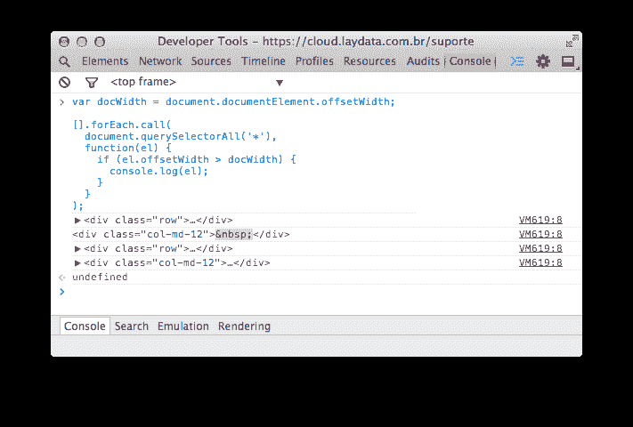

# 您正在创建水平滚动的元素是什么？

> 原文：<https://dev.to/rdeavila/qual-elemento-est-criando-scroll-horizontal-5c84>

如果您在创建页面时发现它的水平滚动条很麻烦，则可以在浏览器控制台中运行以下代码，以确定是谁造成的:

```
var docWidth = document.documentElement.offsetWidth;

[].forEach.call(
  document.querySelectorAll('*'),
  function(el) {
    if (el.offsetWidth > docWidth) {
      console.log(el);
    }
  }
); 
```

Enter fullscreen mode Exit fullscreen mode

有罪者将出现在控制台上:)

[](https://res.cloudinary.com/practicaldev/image/fetch/s--oqSAOL71--/c_limit%2Cf_auto%2Cfl_progressive%2Cq_auto%2Cw_880/https://avila.net.br/assets/scroll-horizontal.png)