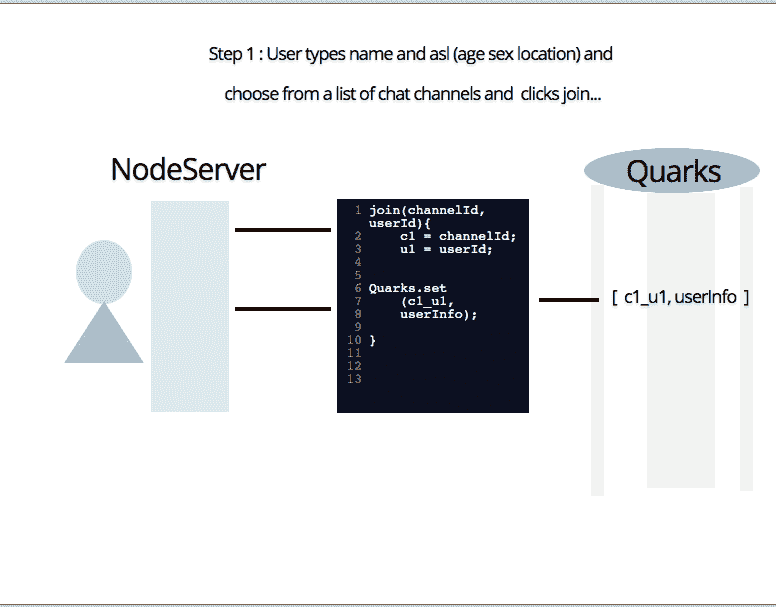
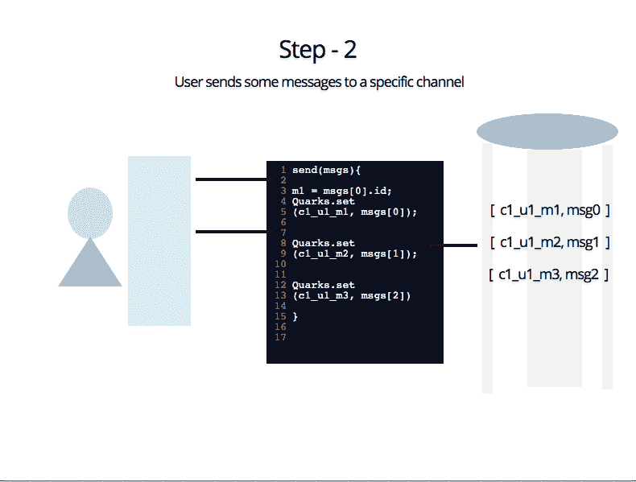
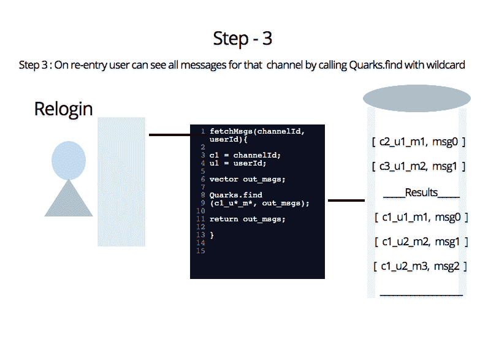
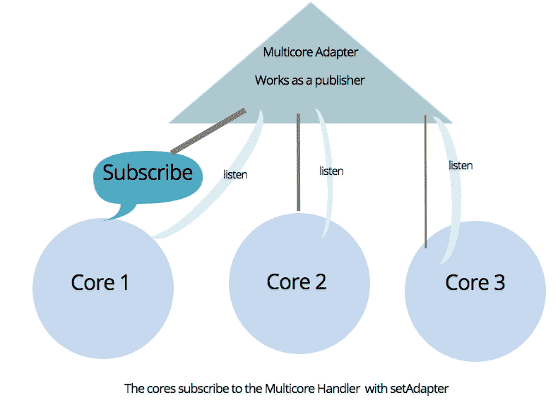
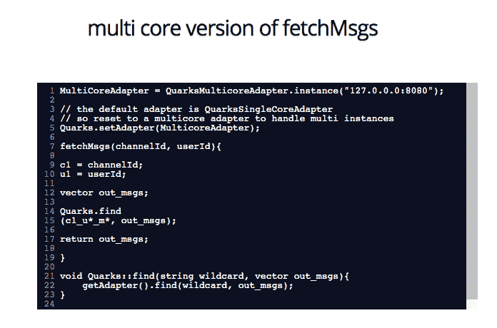
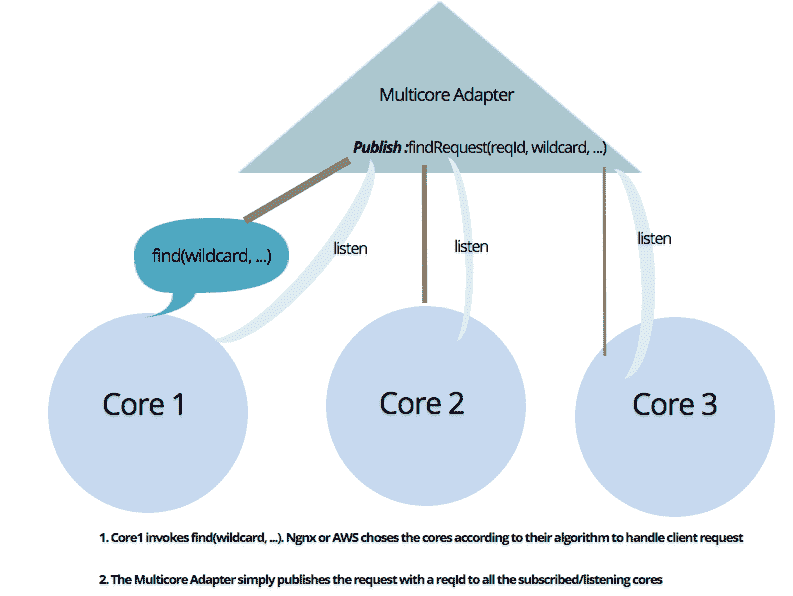
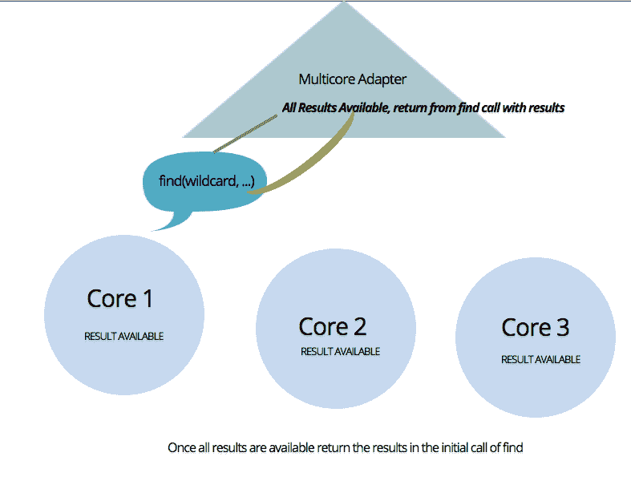

# 夸克——现代软件开发的新思维新方法

> 原文：<https://dev.to/lucpattyn/quarks-a-new-approach-with-a-new-mindset-to-programming-10lk>

随着新十年的到来，随着硬件变得现代化(像闪存盘而不是磁盘)，数据库和网络服务的概念也需要现代化。

那么，传统的系统和数据库有什么问题呢？

关系数据库表示与客户端(通常面向对象)表示相比是完全不同的。为了克服这个问题，引入了非 SQL(例如 mongo、couchdb 等)。然而，即使在那时，它们也是在考虑到磁盘的情况下开发的，并没有针对像闪存盘这样的新硬盘系统进行优化使用。rocksdb 就是这样一个针对新时代硬件的优化商店，它的优势在于后来才开发出来。同样，就数据管理和服务而言，我们需要提出新的概念，使服务器端和客户端的开发变得容易。

夸克的概念随之而来(这个名字最初是由我的一位尊敬的同事拉塞尔·艾哈迈德·阿普博士提出的)。Quarks 计划提供一个统一的结构来解决架构问题，这是朝着现代软件开发的正确方向迈出的一步。随着微服务概念越来越受欢迎，对于服务器端编程需要有一个心态和态度的转变。在未来几十年内，拥有一个单独的重型独立数据库将不是一个可行的解决方案；因此，夸克的概念可以被认为是一个改变服务编写方式的解决方案。

Quarks 是一个小型轻量级的易于分发的服务，它消除了在服务器端编写大量 API 的需要。在简单的场景中，也不需要在服务器中创建数据模型，也不需要将它们链接到单独的独立数据库。夸克的核心是简单的概念。现代的编程应该是简单的——当需要时，程序不必担心流量管理、线程、系统的扩展和分配。

为了扩展——简单地复制 Quarks 服务器，在前面放一个标准的负载平衡器(比如 nginx)来分发 api 调用。如果需要的话，Quarks 服务将相互通信并交换数据。

之所以命名为夸克，是因为夸克服务的行为就像小粒子(读作轻量级微服务)，最终创造出一个大系统！启动并运行它就像在托管服务器中放置一个可执行文件并运行它一样简单。

现在大多数现代应用程序都必须处理数据，Quarks 提供了一种机制，通过智能查询技术快速缓存、存储、检索和操作这些数据(利用现代硬件)。

用一个现实生活中的例子来解释夸克的用法可能更好。
在继续这个例子之前，这里有两行精华:

1.  用户->[夸克。存储] ->线程管理-->[缓存/内存]->队列-->持久存储
2.  用户->[夸克。查询]->线程管理->提取到[缓存/RAM]->返回

在我们看完一个用例场景后，我们将讨论如何对大量数据进行扩展。

用户故事-公共聊天系统

第一步:用户输入姓名和 asl(年龄性别位置)并从聊天频道列表中选择，然后点击加入。
通过 api 或 socket 调用 nodejs/php 服务器。
服务器生成一个用户标识，并将用户分配到一个频道

步骤 2:用户向特定通道发送一些消息

步骤 3:在重新进入时，用户可以看到该频道的所有消息。

我们将这些步骤描述如下:
(使用图表来说明解决方案)
其中 c1 =频道名称，u1 =用户 id，m1 =消息 ID，数据通过 Quarks.set 保存为键值对

[](https://res.cloudinary.com/practicaldev/image/fetch/s--Jyo8TQHT--/c_limit%2Cf_auto%2Cfl_progressive%2Cq_auto%2Cw_880/https://thepracticaldev.s3.amazonaws.com/i/db3zv7or79rdufg271et.png)

[](https://res.cloudinary.com/practicaldev/image/fetch/s---EL69zEZ--/c_limit%2Cf_auto%2Cfl_progressive%2Cq_auto%2Cw_880/https://thepracticaldev.s3.amazonaws.com/i/oc2xl1n0tsomv6gzwqf8.png)

[](https://res.cloudinary.com/practicaldev/image/fetch/s--nbYbKeER--/c_limit%2Cf_auto%2Cfl_progressive%2Cq_auto%2Cw_880/https://thepracticaldev.s3.amazonaws.com/i/tuw7f4b9tjdz7v0tnpe0.png)

当我谈到智能查询时，看看如何使用通配符搜索从大量数据中检索所需信息。

不用说，所有的保存、服务器命中、请求排队、流量处理、线程管理现在都是 Quarks 系统中令人头疼的部分。

现在来看看扩展和分布式系统..

随着流量的增长，我们可以创建夸克实例的新实例(让我们称之为核心)，这些实例可以由多核/多实例管理器来控制。下图:

[](https://res.cloudinary.com/practicaldev/image/fetch/s--VWDgv8eO--/c_limit%2Cf_auto%2Cfl_progressive%2Cq_auto%2Cw_880/https://thepracticaldev.s3.amazonaws.com/i/ssjjmqrys3uw545q2fnx.png)

基本上，这个想法是有许多轻量级的易丢弃服务器(称之为夸克核心)和一个足够的平衡服务器(计划命名为玻色子)。一旦玻色子开始运行，内核之间就可以互相交流，并快速获取大量结果。

那么，多核系统的 fetchMessages 看起来怎么样呢？与您在步骤 3 中看到的没有太大区别。fetchMessages 调用对夸克的查找查询。

[](https://res.cloudinary.com/practicaldev/image/fetch/s--SBqlTLA2--/c_limit%2Cf_auto%2Cfl_progressive%2Cq_auto%2Cw_880/https://thepracticaldev.s3.amazonaws.com/i/vq8urz51eixnd4broro7.png)

再次说明 Quarks 如何在内部处理查询:

**【添加于 2020 年 3 月 15 日】——可以说，已经有了思想的进化，
夸克如何更优雅地工作已经在后续文章中描述:**[https://dev.to/lucpattyn/quarks-architecture-2lk4](https://dev.to/lucpattyn/quarks-architecture-2lk4)

首先，查找请求被传送到多核管理器，多核管理器发布请求供所有侦听内核处理:

[](https://res.cloudinary.com/practicaldev/image/fetch/s--RCJW1FRE--/c_limit%2Cf_auto%2Cfl_progressive%2Cq_auto%2Cw_880/https://thepracticaldev.s3.amazonaws.com/i/z98gsgcj3j61a7cdil9f.png)

最后，当结果变得可用时，管理器聚集它们并返回到由客户端调用的请求核心。

[](https://res.cloudinary.com/practicaldev/image/fetch/s--sWXVHTZe--/c_limit%2Cf_auto%2Cfl_progressive%2Cq_auto%2Cw_880/https://thepracticaldev.s3.amazonaws.com/i/he84rl8mvqanm6bx764j.png)

请注意——在客户端编码中，我们几乎不会注意到差异。

夸克提供的一些关键特征:

1)数据的持久性——Quarks 将提供一种机制，在填充一定量的存储器/高速缓存后，它将发送批量数据进行序列化/转储到数据库，以供以后检索。这减少了对持久存储的访问。但是，它将提供一种机制，如果需要，可以立即转储到持久存储。

2)对数据的查询——quark 将能够通过 [ORM](https://en.wikipedia.org/wiki/Object-relational_mapping) 样式的查询对值(以及键)进行查询，并对查询到的数据应用业务逻辑。

示例查询格式，..
*查询有类似项目*(即项目 1、项目 2 等)关键字的待售项目。)，然后找到这些商品的卖家(商品具有包含卖家的 user_id 的 seller_id 字段),最后列出与送货类型为 pickup(不是 home delivery)的卖家相关联的所有订单。
订单对象的关键字看起来像 ord*_user*(即 ord1_user1、ord2_user1 等。)
卖家拥有用户 1、用户 2 等形式的用户 id。*

```
{
    filter:
    [
        {
        keys: "item*",
        where: [{rating:{gt:3}},{approved:{eq:1}}]
        filter:
        {                
            map: {field:"seller_id", as:"sellers"},         
            filter:
            {
                map: 
                                {
                                prefix:"ord*_"
                                field:"user_id",
                                suffix:"" ,
                                as:"orders"                            
                                },
                where:{deliveryType:{eq:"pickup"}}              
            }
        },

    ]
}

```

*在这里，在通过过滤获得一组对象之后，map 指定如何通过连接
i)前缀、
ii)给定字段名的现有对象的字段值和
iii)后缀来形成通配符搜索，从而连接/包括附加结果。*
因此，在获得卖家列表和商品后，我们巧妙地通过形成一个通配符比较字符串来查询这些卖家的订单，其形式为 ord*_user*。

像 javascript 这样的脚本语言(通过 v8 引擎)将被允许在查询的数据中应用业务逻辑。我们也将能够使用插件进行计算和运算。

3)排序-排序将基于查询和应用服务器端逻辑来完成，如果必要的话通过脚本/插件来完成。

4)将在服务器端提供有效期满的数据期满机制。

最后，Quarks 可以通过简单的脚本或插件(动态加载的库)与业务逻辑驻留在同一个内存空间中，而不需要单独的服务器来存储数据。轻量级服务器查询相同内存空间的数据将使结果检索比传统系统快得多。

现在这个百万美元的问题——夸克已经被开发出来了吗？不要！这是一个我们正在努力的概念，希望在接下来的 6 个月里能有一些实实在在的东西展示出来。我们计划使用以下技术:
a) C++ Crow Webserver 用于服务客户端请求
b)良好的 JSON 解析 C++库(尚未决定，可能会使用 Crow 中提供的那个)
c) ZeroMQ for PUBSUB。

“如果我们取得了一些进展，请放心，你会在这个网站上看到更多关于夸克的文章。”

*   修改后的 2019 年 11 月 1 日——上述说法现在需要改变，因为我们已经让夸克开始运行了！

此外，还引入了 rocksdb 和 v8 javascript 引擎，并集成了 ZeroMQ 用于 Quarks 内核之间的内部通信。
代码回购在这里可以找到:[https://github.com/lucpattyn/quarks](https://github.com/lucpattyn/quarks)

只是再重复一次，夸克是一个系统，也是一种哲学，一套概念和指导方针(例如。较长的读取时间，较短的突发写入时间..在适当的时候会有更多)来使现代编程变得容易和简单。我们改天将对此进行更多的讨论。

2020 年 10 月 30 日更新:
想更清楚地说明夸克与传统架构框架的不同之处:

传统框架:
客户端- > api 网关- >后端服务器逻辑- >对单独的服务器 db 进行查询(发生延迟)- >获取数据- >处理获取的数据- >产生结果- >发送回客户端

Quarks 框架:
客户端- > api 网关- > quarks 数据查找(在查找时应用业务逻辑)- >将数据发送回客户端
*减少了到不同服务器的往返行程，并消除了中间的一些步骤。

2022 年 7 月 24 日更新:
关于夸克架构的后续文章-
[https://dev . to/lucpattyn/Quarks-replication-for-a-scalable-solution-1 h64](https://dev.to/lucpattyn/quarks-replication-for-a-scalable-solution-1h64)

暂时结束，
Mukit