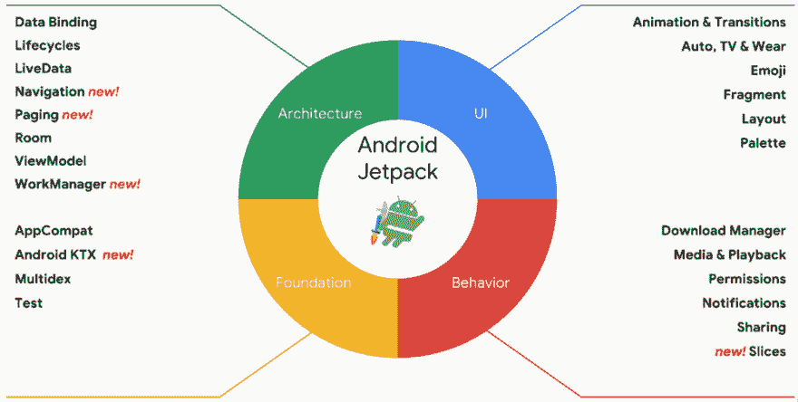
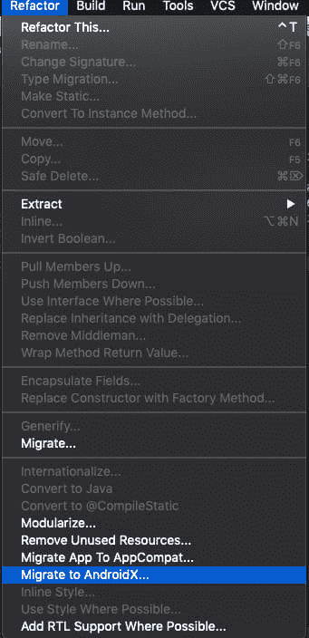

# 这是安卓喷气背包吗？

> 原文：<https://dev.to/gvetri/que-es-android-jetpack-5g3>

今年谷歌 I/O 2019 彩票已经开始。这使我想起了去年的事态发展，其中最引人注目的是 Android Jetpack，但很多人还不知道它。所以我想到了写一篇关于这是什么的小文章。

# Que es Android Jetpack？

Android Jetpack 是一套将 Android 支持库和新 Jetpack 组件相结合的自动存储塔，可创建更好的应用程序。
基本上谷歌就想让我们专注于开发我们应用程序的逻辑，停止写这么多 boilerplate 代码。Jetpack 库使用 androidx 包名称。*

[](https://res.cloudinary.com/practicaldev/image/fetch/s--j_r473oH--/c_limit%2Cf_auto%2Cfl_progressive%2Cq_auto%2Cw_880/https://thepracticaldev.s3.amazonaws.com/i/qae2h1ir6kefa4kw67xz.png)

## 书店在 Android Jetpack 里面吗？

Android Jetpack 分为以下几个部分

架构:栋德 podemos encontrar los Android 架构组件，视图模型，数据绑定，LiveData y 导航 no deben faltar en tu 应用程序。

UI:您可以在此找到有关使用者介面的资讯，例如动画、转场、片段和配置图。

Behavior:我们应用程序的行为取决于这些基础，处理权限和通知位于此处。

foundation:Android API 的核心是 AppCompat、androidktx 以及测试应用程序所需的功能。

## jetpack+kot Lin =□

Android Jetpack 的组件之一是 Android KTX，这些组件是 Kotlin 的扩展，可优化 Jetpack 组件的使用，从而编写更多 Kotlin 代码。
你可以在这里看到 Android KTX 的一些例子:
[https://developer . Android . com/kot Lin/ktx . html](https://developer.android.com/kotlin/ktx.html)

## 来自由港的移民申请喷气背包

不需要立即升级，但将来需要升级，因为 Android q API(29 . 0 . 0)仅在 Jetpack 中提供。

**在将 AppCompat 项目迁移到 AndroidX 之前，你必须知道不能只迁移其中的一部分。只能移植整个项目。**

1.  将所有库更新为最新版本，编写本文时最新版本为 28.0.0。请测试您的应用程式，并修正可能导致此更新的任何错误。

2.  使用 Android Studio 提供的 refactor 选项，Android studio 会检查您的设计，然后在屏幕上显示要进行的更改列表。接受并希望很多东西不会损坏，不应该
    [](https://res.cloudinary.com/practicaldev/image/fetch/s--u-cNwWir--/c_limit%2Cf_auto%2Cfl_progressive%2Cq_auto%2Cw_880/https://thepracticaldev.s3.amazonaws.com/i/ffmltmtkz5ig49wvtf3l.png)

3.  在 gradle . properties 文件中包括以下行。第一行指示应用程序使用 andidx 而不是 AppCompat，第二行指示第三方库仍使用 AppCompat 来支持您的 andidx 应用程序。

4.

```
android.useAndroidX=true
android.enableJetifier=true 
```

Enter fullscreen mode Exit fullscreen mode

## 摘要

Android Jetpack 是 Android 库的名称，以 androidx 开头。AppCompat 应用程序必须尽早迁移到 AndroidX。

如果您喜欢这篇文章，请在 [Twitter](https://www.twitter.com/gvetri18) 上跟我来，要阅读更多的编程文章和 Android 文章，请访问我的博客[。](https://www.codingpizza.com)