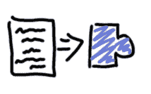
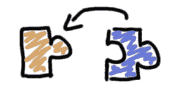
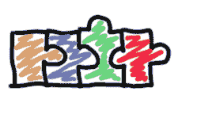
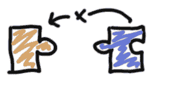
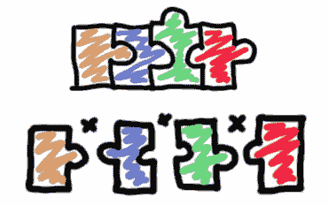
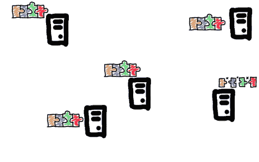

# 什么是块链

> 原文：<https://dev.to/valerybriz/que-es-blockchain-3a44>

blockchain 简介

一个月前我开始在[处方](https://www.prescrypto.com/)工作。在我获得的众多技能和知识中，有一个一直特别吸引我注意的是——《T2》【block chain】在《T4》电子处方的产生中的应用。这个故事始于几年前。

### 在我大学的头几年…

我第一次听到术语 *Blockchain* 。从那时起，我几乎总是听到他们谈论‘T2’bit coin。经过调查，我发现它是一种电子货币，但是它的来源和用途我都不知道，很多人认为它只在 *deep web* 使用。随着时间的推移，采用这种新技术的公司和机构出现了，从而使公众更多地了解到这种新技术是如何运作的，从而打破了货币或数据交易模式。

为了更清楚地了解*区块链*，我开始阅读与*比特币*采矿方式有关的概念。我天真地以为这是一条路，结果是认识到采矿只是整体的一部分。我几乎无法理解比我最初想象的要多得多的拼图碎片。经过多次阅读、讨论和深思熟虑，我得以将各方聚集在一起，更好地理解了*【block chain】*技术概念的含义。

### 几年后……

我来到了[处方](https://www.prescrypto.com/)，对这种技术及其操作有了更清楚的认识。而且我在工作的第一个月里，团队分享的知识和经历帮助了我，∞！，了解*【block chain】*作为一个整体是如何工作的。因此，在货币交易系统之外使用这种技术——正如最初开始时那样——是非常广泛的，因为将这种技术纳入其他进程可以解决许多复杂的信息传递情况。

### 挑战:我的工作是什么？

当我和我的家人和朋友一起吃饭时经常问这个问题。向他们解释我的工作是一项总是以五个字开头的挑战:听说过比特币吗？

*是的*是通常的答案。我很惊讶他们知道这个词，不管他们年龄多大或在哪里发展。但是，大多数人的概念往往含糊不清。面对这一点，我决定想出一种具体而全面地解释什么是 *Blockchain* 。

经过对不同的豚鼠进行了几次试验，结果在我解释完之后，他们再也看不到我惊慌失措的样子了。我也不太纠结，也不提供可能会混淆他们的细节。我会告诉你们这项技术，因为我一直在我的工作中使用它。

### Qué es 区块链？

*Blockchain* 被翻译成西班牙语为□，每一个都包含信息。此技术用于传输和存储加密的数据，以确保其安全性。这意味着它们会变成一种看不见的文字形式，不受他人的视线影响。

由于一个信息或数据包是加密的，因此它将成为一个连接在一起的块。欧盟使它们之间共享信息，例如它们相对于其他块的位置。假设加密信息实际上是一个独特的形状，如下所示:

如果向新零件添加有关旧零件的信息，则新零件会稍加修改，以便与旧零件完全匹配:

一个加密的信息链将被逐块地或逐块地组装起来。新块将始终添加到链的末端，而不是链中的其他位置。当一个新块进入一个字符串时，会生成一个仅用于解密该块中的信息的唯一密钥，此过程称为“*minar”*，由不知道该块中包含的信息的第三方执行。只有将块添加到字符串中的用户才知道生成的密钥。链可以一个零件一个零件地循环，直到到达我们需要的位置。链和每个零件都是固定的，这意味着它们一旦形成就不能改变或删除。

### 是否有可能换块？

若要向链中添加块，该块必须包含要连接的块的信息，这将导致新块改变其原始形状，并具有与链中最后一个块完全匹配的新块。你还记得吧？如果一个块被更改，加密信息将更改，从而导致它不再与上一个块匹配。

然后，每个零件都会被改变，从而导致整个链出现错误，这种错误可以立即被检测为链中的异常改变。然后，我们可以在蓝色零件上上下移动原始链:

### 什么是系统分配？

这种连接和形成加密信息链的方式确保了数据传输的安全性。另一个非常重要的是 *Blockchain* 是分布式系统。这意味着字符串的精确副本将同时存储在多个站点上，而不存在特定的主站点或原始源。这些站点中的每一个都可以检查链和进入链的每个新零件的可靠性。

如果有任何图块发生变更(例如蓝色图块范例)，则变更会变更整个字串，以使所有图块重新对齐。这将是一个复杂的过程，因为它必须同时发生在存储链的每个站点。

如果用户想要获取这些部件中任何一个部件的信息，则必须使用将块绑定到字符串时生成的(唯一)密钥对其进行解密。不用说，这把钥匙只对那件有用，因为每把钥匙都有自己的钥匙。

### 区块链 es…

正如您所见， *Blockchain* 是一种非常安全的存储敏感信息的系统，但由于其排序和易于跟踪的方式(半次获得了必要的访问权限)，在需要以复杂方式存储互连信息的情况下，即使这些信息不是必需的，也可能会很有用

我希望这种笼统但具体的解释有助于了解什么是*【block chain】*；或者，如果概念已经明确，但又不知道如何解释，现在这样做比较容易。

origination e publica do en[http://blog . prescrypto . com/2018/08/04/mi-primer-mes-en-prescrypto/](http://blog.prescrypto.com/2018/08/04/mi-primer-mes-en-prescrypto/)