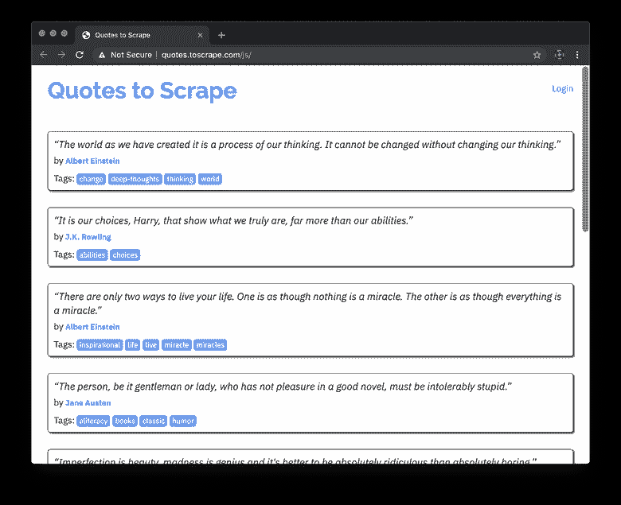
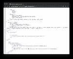
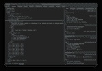

# 快速点击:用{htmlunit}抓取 javascript“启用”的站点

> 原文：<https://dev.to/hrbrmstr/quick-hit-scraping-javascript-enabled-sites-with-htmlunit-55d0>

我以前顺便提到过 [`{htmlunit}`](https://dev.to/hrbrmstr/htmlunitjars-updated-to-2340-4l8j) ，但是没有在博文中放任何代码。因为我刚刚把`{htmlunitjars}`更新到最新最好的版本，现在可能是一个很好的时间来做一个快速演示。

`{htmlunit}` / `{htmunitjars}`包让 r 可以使用[HtmlUnit Java library](http://htmlunit.sourceforge.net/)的功能，html unit 的 TLDR 在于它可以帮助你抓取一个使用 javascript 创建 DOM 元素的站点。通常，你必须使用 Selenium/ `{Rselenium}`、Splash/ `{splashr}`或 Chrome/ `{decapitated}`来尝试使用 javascript 生成你需要的内容。这些都是相当大的外部依赖，需要随身携带，尤其是如果您需要的是快速获取动态内容的方法。虽然`{htmlunit}`确实有一个`{rJava}`依赖项，但是我已经很长时间没有在 Windows、Ubuntu/Debian 或 macOS 上使用过 Java 了——即使是在新开发的系统上——所以对于人们来说这不应该是一个阻碍(尽管 Java+R 保证的安装简易性还远非完美)。

为了展示`{htmlunit}`的能力，我们将与一个致力于实践网络抓取的网站`toscrape.com`合作，特别是 [javascript 生成的沙盒网站](http://quotes.toscrape.com/js/)。看起来是这样的:

[](https://i2.wp.com/rud.is/b/wp-content/uploads/2019/04/quotes-to-scrape-01.png?ssl=1)

现在，在浏览器上打开页面的“查看源代码”版本和开发者工具的“元素”面板，您会看到内容就在网站上的 javascript 中，但是源代码没有`<div>`元素，因为它们是在页面加载后动态生成的。

[ ](https://rud.is/b/2019/04/27/quick-hit-scraping-javascript-enabled-sites-with-htmlunit/quotes-to-scrape-03/) [ ](https://rud.is/b/2019/04/27/quick-hit-scraping-javascript-enabled-sites-with-htmlunit/quotes-to-scrape-02/)

这两种观点之间的关键差异是我认为使用“选择器小工具”这样的工具弊大于利的一个原因。你最好学习 HTML 和动态页面的基础知识，而不是依赖那根拐杖，因为总有一天它会回来咬你一口。

让我们试着抓住引言的第一页。注意，要运行所有代码，你需要安装`{htmlunitjars}`和`{htmlunit}`，这可以通过`install.packages(c("htmlunitjars", "htmlunit"), repos = "https://cinc.rud.is")`来完成。

首先，我们将尝试简单的:

```
library(rvest)

pg <- read_html("http://quotes.toscrape.com/js/")

html_nodes(pg, "div.quote")
## {xml_nodeset (0)} 
```

因为没有执行 javascript，所以没有内容返回是意料之中的。现在，我们将使用`{htmlunit}`来看看我们是否能得到实际的内容:

```
library(htmlunit)
library(rvest)
library(purrr)
library(tibble)

js_pg <- hu_read_html("http://quotes.toscrape.com/js/")

html_nodes(js_pg, "div.quote")
## {xml_nodeset (10)}
## [1] <div class="quote">\r\n <span class="text">\r\n “The world as we h ...
## [2] <div class="quote">\r\n <span class="text">\r\n “It is our choices ...
## [3] <div class="quote">\r\n <span class="text">\r\n “There are only tw ...
## [4] <div class="quote">\r\n <span class="text">\r\n “The person, be it ...
## [5] <div class="quote">\r\n <span class="text">\r\n “Imperfection is b ...
## [6] <div class="quote">\r\n <span class="text">\r\n “Try not to become ...
## [7] <div class="quote">\r\n <span class="text">\r\n “It is better to b ...
## [8] <div class="quote">\r\n <span class="text">\r\n “I have not failed ...
## [9] <div class="quote">\r\n <span class="text">\r\n “A woman is like a ...
## [10] <div class="quote">\r\n <span class="text">\r\n “A day without sun ... 
```

我加载了`{purrr}`和`{tibble}`是有原因的，所以让我们用它们从内容中制作一个漂亮的数据框:

```
tibble(
  quote = html_nodes(js_pg, "div.quote > span.text") %>% html_text(trim=TRUE),
  author = html_nodes(js_pg, "div.quote > span > small.author") %>% html_text(trim=TRUE),
  tags = html_nodes(js_pg, "div.quote") %>% 
    map(~html_nodes(.x, "div.tags > a.tag") %>% html_text(trim=TRUE))
)
## # A tibble: 10 x 3
## quote author tags   
## <chr> <chr> <list> 
## 1 “The world as we have created it is a process of our thinking. … Albert Einste… <chr […
## 2 “It is our choices, Harry, that show what we truly are, far mor… J.K. Rowling <chr […
## 3 “There are only two ways to live your life. One is as though no… Albert Einste… <chr […
## 4 “The person, be it gentleman or lady, who has not pleasure in a… Jane Austen <chr […
## 5 “Imperfection is beauty, madness is genius and it's better to b… Marilyn Monroe <chr […
## 6 “Try not to become a man of success. Rather become a man of val… Albert Einste… <chr […
## 7 “It is better to be hated for what you are than to be loved for… André Gide <chr […
## 8 “I have not failed. I've just found 10,000 ways that won't work… Thomas A. Edi… <chr […
## 9 “A woman is like a tea bag; you never know how strong it is unt… Eleanor Roose… <chr […
## 10 “A day without sunshine is like, you know, night.” Steve Martin <chr [… 
```

公平地说，我们*并不真的*需要`{htmlunit}`这个网站。javascript 数据随页面一起出现，并且格式良好，所以我们也可以使用`{V8}`:

```
library(V8)
library(stringi)

ctx <- v8()

html_node(pg, xpath=".//script[contains(., 'data')]") %>% # target the <script> tag with the data
  html_text() %>% # get the text of the tag body
  stri_replace_all_regex("for \\(var[[:print:][:space:]]*", "", multiline=TRUE) %>% # delete everything after the `var data=` content
  ctx$eval() # pass it to V8

ctx$get("data") %>% # get the data from V8
  as_tibble() %>% # tibbles rock
  janitor::clean_names() # the names do not so make them better
## # A tibble: 10 x 3
## tags author$name $goodreads_link $slug text                            
## <list> <chr> <chr> <chr> <chr>                           
## 1 <chr [… Albert Einst… /author/show/9810.Alb… Albert-E… “The world as we have created i…
## 2 <chr [… J.K. Rowling /author/show/1077326.… J-K-Rowl… “It is our choices, Harry, that…
## 3 <chr [… Albert Einst… /author/show/9810.Alb… Albert-E… “There are only two ways to liv…
## 4 <chr [… Jane Austen /author/show/1265.Jan… Jane-Aus… “The person, be it gentleman or…
## 5 <chr [… Marilyn Monr… /author/show/82952.Ma… Marilyn-… “Imperfection is beauty, madnes…
## 6 <chr [… Albert Einst… /author/show/9810.Alb… Albert-E… “Try not to become a man of suc…
## 7 <chr [… André Gide /author/show/7617.And… Andre-Gi… “It is better to be hated for w…
## 8 <chr [… Thomas A. Ed… /author/show/3091287.… Thomas-A… “I have not failed. I've just f…
## 9 <chr [… Eleanor Roos… /author/show/44566.El… Eleanor-… “A woman is like a tea bag; you…
## 10 <chr [… Steve Martin /author/show/7103.Ste… Steve-Ma… “A day without sunshine is like… 
```

但是,`{htmlunit}`代码(IMO)更简单一些，它被设计用于使用后加载资源获取的站点以及使用内联 javascript 的站点(比如这个)。

### 鳍

虽然`{htmlunit}`很棒，但它不能在超级复杂的网站上工作，因为它没有试图成为 100%完整的浏览器实现。不过，它在很多网站上运行得非常好，所以下次你需要抓取动态内容时，不妨试一试。如果您需要执行更复杂的页面抓取任务，这个包还包含一个 min-DSL。

您可以在以下网址找到`{htmlunit}`和`{htmlunitjars}`:

*   来源:[https://git.sr.ht/~hrbrmstr/htmlunitjars](https://git.sr.ht/~hrbrmstr/htmlunitjars)/[https://git.sr.ht/~hrbrmstr/htmlunit](https://git.sr.ht/~hrbrmstr/htmlunit)
*   git lab:[https://gitlab.com/hrbrmstr/htmlunitjars](https://gitlab.com/hrbrmstr/htmlunitjars)/[https://gitlab.com/hrbrmstr/htmlunit](https://gitlab.com/hrbrmstr/htmlunit)
*   吉图:[https://github.com/hrbrmstr/htmlunitjars](https://github.com/hrbrmstr/htmlunitjars)/[https://github.com/hrbrmstr/htmlunit](https://github.com/hrbrmstr/htmlunit)