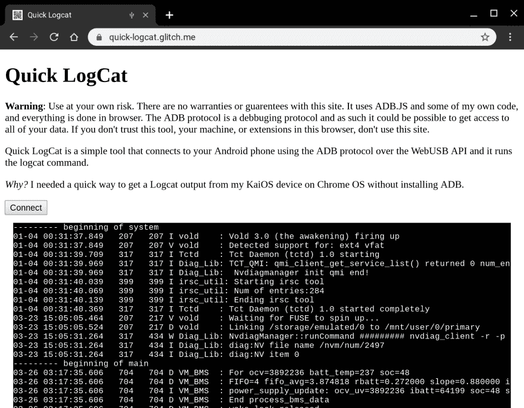

# 从网络上调试 android

> 原文：<https://dev.to/chromiumdev/quick-logcat-debugging-android-from-the-web-29g3>

上周我在飞往德里的飞机上，我希望能够用 Chrome OS 对我的 KaiOS 设备进行调试——由于多种原因，我从未达到我需要的水平(端口转发不起作用——在另一篇帖子中有更多相关内容)，但我确实构建了一个简单的工具，它确实帮助我在基于 Android 的设备上构建网络。

我已经用 [WebADB.js](https://github.com/webadb/webadb.js) 做了几个兼职项目，但我想我至少会发布一个我上周制作的工具，如果你需要调试你的 Android 设备，并且你没有安装`adb`或任何其他 Android 系统工具，它会帮助你。

快速日志就是这样。它可以连接到任何处于开发者模式并启用了 USB 的 Android 设备，通过 USB 连接到您的机器，最重要的是，您授权从网页访问以连接到设备，一旦所有这些都完成，它只需运行`adb shell logcat`来创建以下输出。

[](https://res.cloudinary.com/practicaldev/image/fetch/s--MKaGRhNu--/c_limit%2Cf_auto%2Cfl_progressive%2Cq_auto%2Cw_880/https://paul.kinlan.img/2019-03-30-quick-logcatdebugging-android-from-the-web.jpeg)

查看我的 github 账户上的[源代码，具体来说是](https://github.com/PaulKinlan/QuickLogcat)[logger 类](https://github.com/PaulKinlan/QuickLogcat/blob/master/app/scripts/main.mjs)，它是我逻辑中的重中之重——注意这里的很多代码与 [webadb.github.io](https://webadb.github.io/) 上的演示非常相似，但是希望可以相对清楚地了解我是如何与 WebUSB API(非常酷)交互的。结果是我的索引文件中的以下代码:我实例化一个控制器，连接到将打开 USB 端口的设备，然后我启动`logcat`进程，并通过`logcat`启动`cat`日志。

它甚至使用。mjs 档案:D

```
 <script type="module">
    import LogcatController from "/scripts/main.mjs";
    onload = () => {
      const connect = document.getElementById("connect");
      const output = document.getElementById("output");
      let controller = new LogcatController();
      connect.addEventListener("click", async () => {
        await controller.connect();
        controller.logcat((log) => {
          output.innerText += log;
        })
      });
    };
  </script> 
```

ADB 是一个非常强大的协议，你可以读取系统文件，可以覆盖个人数据，甚至可以轻松地下载应用程序，所以如果你让你的 Android 设备访问任何外部网站，你需要完全信任该网站的运营商。

该演示展示了 [WebUSB](https://developers.google.com/web/updates/2016/03/access-usb-devices-on-the-web) API 的强大功能，我们可以在没有任何本机安装的组件、驱动程序或软件的情况下与硬件进行交互，并具有一个无处不在的显式用户选择加入模型，该模型可以停止对 USB 组件的驱动访问。

我还有几个主意，如果你愿意的话，完全可以通过网络更新固件。我们在印度经常看到的一件事是将 APK 的软件加载到用户的新手机上，虽然我不是说我们必须这样做，但一个干净的网络界面比人们现在使用的软件更受欢迎。

你认为用`Web USB`和`adb`访问可以构建什么？