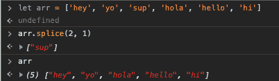

# 快速查看切片和拼接

> 原文：<https://dev.to/benhaugen/quick-review-of-slice-and-splice-156g>

切片和拼接可能会混淆，部分原因是它们的名称非常相似。但是在操作数组时，它们都非常重要。考虑到许多技术面试都涉及到数组，所以不仅要理解这两种方法，还要理解它们之间的区别，这一点非常重要。

## 切片

需要理解的一件事是。slice()方法的优点是它不改变原始数组。它是非破坏性的。可以想象，它用于提取数组的一部分，或者说块。通常，该方法接受两个参数，第一个参数是必需的(除非您只想复制数组)。把这第一个论点当作起点。这是切片开始的地方！第二个，可选参数，是您想要切片的位置。

**你的任务:**
让我们来看一个例子，由我来承担。我要你看看这个数组，里面有一个关于我的明显的谎言，把它变成真实的东西。

lies = ['People '，' think '，' Ben '，' is '，' cool '，' but '，' he '，' is '，' not']
怎样才能让我变酷？？

[https://repl.it/@ben1232jazz/1?lite=true](https://repl.it/@ben1232jazz/1?lite=true)

正如您在上面的代码中看到的，我们希望从第 2 个元素索引开始切片，一直切片到第 5 个元素索引。第二个参数 5 不包括在切片中，因此得到第二、第三和第四个索引中的元素。还要注意，当我们 console.log 原始的“lies”数组时，它并没有改变。您可以使用。join()方法和一些字符串串联来看看我在句子形式上有多酷。

# 拼接

现在让我们来谈谈超级相似的外表，但非常不同的表演。splice()方法。一个非常重要的区别是。slice()和。splice()是一种破坏性的方法。Splice 允许您在阵列中删除和添加元素。首先，我们来看看移除元素。

同样，这个方法可以接受两个参数，第一个是必需的。第一个论点是你的出发点。第二个参数是要从数组中移除的元素数量。下面的图片是一个简单的例子。注意这个方法确实是破坏性的。我们从第二个元素索引开始，告诉它从数组中拼接出一个元素。

如果我们不定义第二个参数，从给定索引开始的每个元素都将从数组中移除。看看下面的例子。我们从第二个索引开始切片，只剩下前两个元素。

**你的任务:**
让我们再来看一次数组，试着为我做得更好一点。让我看起来不好笑。提示:如果你想从数组的末尾而不是开头开始，你也可以使用负数。

silly_array = ["本"，"是"，"真的"，"搞笑"，"看着"]

[https://repl.it/@ben1232jazz/2?lite=true](https://repl.it/@ben1232jazz/2?lite=true)

最后，让我们看看如何使用？拼接()。该方法的第一部分与之前完全相同。你的第一个参数是从哪里开始，第二个参数是你想删除多少个元素(可能是 0)，第三个参数是你想添加什么。该元素将被添加到起始索引之前。您可以添加任意多的元素，只需将它们作为附加参数添加即可。我先不给你看一个例子，让我们看看你自己能不能得到这个。

**你的任务:**
看下面的数组，我们如何添加一个单词来改变我的银行账户的整个前景。我现在就告诉你，目前那里“没有”很多。

fake_news = ["Ben "，" does "，" has "，" a "，" lot "，" of "，" money"]

[https://repl.it/@ben1232jazz/3?lite=true](https://repl.it/@ben1232jazz/3?lite=true)

正如你在上面看到的，我们从第二个索引开始，不要删除任何东西，第三个参数“not”被添加到第二个索引之前。

毒品。