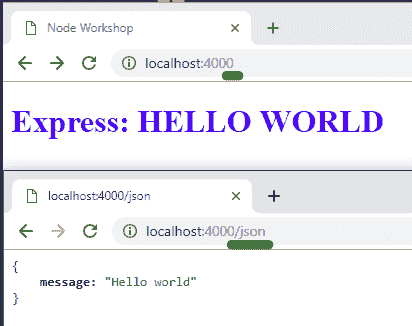

# Node Express 你的第一个 Web 服务器用 Node 和 Express 在 5 分钟

> 原文：<https://dev.to/lennythedev/quick-server-with-node-and-express-in-5-minutes-17m7>

我知道，我知道...另一个节点快速教程😑。但是如果你还没有开始学习 Node 和构建服务器，也许这个超级快速的教程就是你所期待的！😆

# 第一步:安装节点

好吧，这肯定需要 5 分钟以上，但如果你已经有了节点，跳过这一步，让我们开始吧！

### 为你的操作系统安装最新的 LTS 版本

[https://nodejs . org/en/download/](https://nodejs.org/en/download/)

为了测试它是否工作，在您的项目根目录
中创建一个文件`server.js`

```
// server.js
console.log("Hello World!"); 
```

Enter fullscreen mode Exit fullscreen mode

并对其进行测试

```
$ node server.js
Hello world! 
```

Enter fullscreen mode Exit fullscreen mode

不错！我们已经准备好做一些后端工作了！

# 第二步:设置 npm

我们使用 NPM 来管理我们的节点包。初始化 npm 并让它采用默认值。

```
$ npm init -y 
```

Enter fullscreen mode Exit fullscreen mode

# 第三步:安装导入快递中间件

> 一个**中间件**是一段可以访问`request`和`response`对象的代码。现在，考虑一下 *express* 通过在我们的代码和 Node 的 HTTP 内容之间充当“中间人”🕵️，使事情变得更简单。

```
$ npm install express 
```

Enter fullscreen mode Exit fullscreen mode

```
// server.js
const express = require('express');
const server = express(); 
```

Enter fullscreen mode Exit fullscreen mode

# 第四步:添加一个 JSON **路由处理器**

每当客户端请求/访问“/json”(localhost:4000/JSON)时，发送 JSON，即“Hello world”消息

```
// server.js
...
server.get("/json", (req, res) => {
   res.json({ message: "Hello world" });
}); 
```

Enter fullscreen mode Exit fullscreen mode

# 第五步:添加一个 HTML **路由处理程序**

每当客户端请求/访问“/”(localhost:4000)时，发送一个 HTML 页面文件

> `__dirname`保存当前模块的目录(server.js)

```
// server.js
...
server.get("/", (req, res) => {
   res.sendFile(__dirname + '/index.html');
}); 
```

Enter fullscreen mode Exit fullscreen mode

在与`server.js`
相同的关卡中创建`index.html`！或者如果你喜欢蓝色标题，你可以复制粘贴这个。

```
<!DOCTYPE html>
<html lang="en">
 <head>
   Node Workshop
 </head>
 <body>
     <h1 style="color: blue;">
        Express: HELLO WORLD
     </h1>
 </body>
</html> 
```

Enter fullscreen mode Exit fullscreen mode

# 第五步:启动服务器

```
// server.js
...
const port = 4000;

server.listen(port, () => {
    console.log(`Server listening at ${port}`);
}); 
```

Enter fullscreen mode Exit fullscreen mode

```
# CTRL+C to stop server if currently running
$ npm start 
```

Enter fullscreen mode Exit fullscreen mode

# 第六步:测试

```
# on another terminal

$ curl http://localhost:4000/json
{"message":"Hello world"}

$ curl http://localhost:4000
<!-- index.html --> ... 
```

Enter fullscreen mode Exit fullscreen mode

或者打开浏览器并转到

*   [http://localhost:4000/JSON](http://localhost:4000/json)
*   [http://localhost:4000](http://localhost:4000)

[](https://res.cloudinary.com/practicaldev/image/fetch/s--4zfiGmp3--/c_limit%2Cf_auto%2Cfl_progressive%2Cq_auto%2Cw_880/https://thepracticaldev.s3.amazonaws.com/i/ypqz165i5f8sb44w8iji.png)

[](https://i.giphy.com/media/gGuOldphm6vzW/source.gif)

### 完整代码

```
const express = require('express');
const server = express();
const port = 4000;

server.get("/", (req, res) => {
   res.sendFile(__dirname + '/index.html');
});

server.get("/json", (req, res) => {
   res.json({ message: "Hello world" });
});

server.listen(port, () => {
    console.log(`Server listening at ${port}`);
}); 
```

Enter fullscreen mode Exit fullscreen mode

## “好的，很好。但是我能用这个做什么呢？”

再添加一些路由和 HTML 页面
，你就有了一个 HTML + JSON 服务器！

```
...
server.get("/items", (req, res) => {
   res.json({ items: [{ "id": 1, "name": "banana" }, 
                      { "id": 2, "name": "apple" }
                     ] 
           });
});

server.get("/info", (req, res) => {
   res.sendFile(__dirname + '/info.html');
});
... 
```

Enter fullscreen mode Exit fullscreen mode

我们需要覆盖更多的东西

*   构建一个实现 GET / POST / PUT / DELETE 的 REST(ful) API 服务器
*   提供接受数据的模板(而不是静态 HTML)
*   多得多！

## 接下来:

## 文章不再可用

这篇文章是我正在撰写的 Node+Express 系列文章的一部分。

与此同时，如果您对 Node+Express 还不满意🤓，
查看我的节点研讨会(Gihub repo 和幻灯片):

## /[节点 _ 车间](https://github.com/lenmorld/node_workshop)

### 使用 Node、Express 和 MongoDB 为您的下一个 web 应用程序构建服务器和 API

<article class="markdown-body entry-content container-lg" itemprop="text">

# 节点车间

> 为您的下一个 web 应用程序创建一个 server + REST API！

在本次研讨会中，我们将讨论概念并通过活动将它们付诸实践，所有这些都是关于 web 服务器的。这里的代码和概念将是您下一个 web 项目的良好基础。主题包括但不限于:

*   使用 Node 和 Express 构建 web 服务器和 REST API
*   了解路由、请求和响应
*   用 HTTP 方法实现 CRUD
*   使用模板构建服务器渲染的网站
*   连接到云 NoSQL 数据库:MongoDB Atlas DB
*   使用会话、cookies 和令牌进行用户身份验证
*   使用外部 API，如 Github Jobs、Giphy、Spotify

## 以前的事件

*   [节点研讨会-2020 年 8 月 27 日](https://www.facebook.com/events/1125391177830448/)

    *   [欠邮](https://dev.to/lennythedev/node-workshop-free-online-workshop-by-scs-concordia-3dc5)
*   [节点研讨会-2020 年 7 月 16 日](https://www.facebook.com/events/751112552346326/)

    *   [欠邮](https://dev.to/lennythedev/node-workshop-part-2-free-online-workshop-by-scs-concordia-4e37)

# 材料

预览幻灯片: [Google Drive 文档](https://drive.google.com/file/d/11-HTDPgCY-ZNEIqddwQbn_4PDCa14C2R/view?usp=sharing)

素材:[观念链接](https://www.notion.so/lennythedev/Node-workshop-Homepage-56f2822d63e549b286c76102e6ea6b28)

# 密码

### 参加研讨会:

```
$ git checkout dev
$ node server.js 
```

### 到最新开发

```
$ git checkout master

$
```

…</article>

[View on GitHub](https://github.com/lenmorld/node_workshop)

Here we discussed:

*   使用节点和 Express
*   路由、请求和响应
*   构建 REST API
*   服务器呈现的模板
*   连接到 NoSQL (mongo)数据库
*   使用外部 API，如 Spotify
*   还有更多！

* * *

感谢阅读我的第一篇开发帖子！祝上菜愉快！