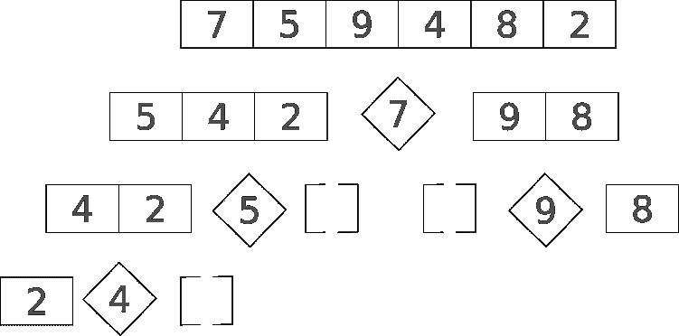

# 快速排序算法

> 原文：<https://dev.to/domazet93/quicksort-sorting-algorithm-2phi>

**快速排序**是一种排序算法。这是一种**分治**算法，通过递归地将一个序列分成更小的子序列来进行排序。让我们看看我们的功能:

```
function quick_sort(array) {
    if(array.length < 2) return array;

    const pivot = array[0];

    let lower = array.filter(e => e < pivot),    
        greater = array.filter(e => e > pivot);

    return [...quick_sort(lower), pivot, ...quick_sort(greather)];
}

quick_sort([7,5,9,4,8,2]) 
```

空数组和只有一个元素的数组是基础情况。这里没有排序，我们可以直接返回这些数组。

快速排序算法从选择一个**枢轴**开始。选择支点有很多方法:
第一个元素(如我们所做的)
最后一个元素
数组的中间值作为支点
一个随机元素作为支点

```
const pivot = array[0]; 
```

在过滤集合(数组)之后，我们有:
低于中枢
的所有数字的子数组中枢
大于中枢
的所有数字的子数组

```
return [...quick_sort(lower), pivot, ...quick_sort(greater)]; 
```

在两个子数组(lower 和 greater)上递归调用 quicksort，将集合分解成单元素列表(基本情况)，然后将它们组合成一个排序列表。

这里是所有的步骤(堆栈),取决于我们选择的支点。

[](https://res.cloudinary.com/practicaldev/image/fetch/s--rM7ylZkO--/c_limit%2Cf_auto%2Cfl_progressive%2Cq_auto%2Cw_880/https://thepracticaldev.s3.amazonaws.com/i/dosd19hotyqyev853bsq.png)