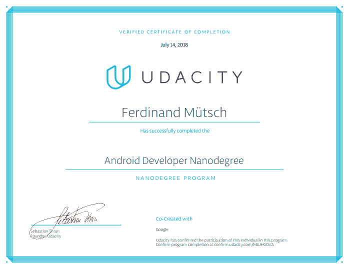
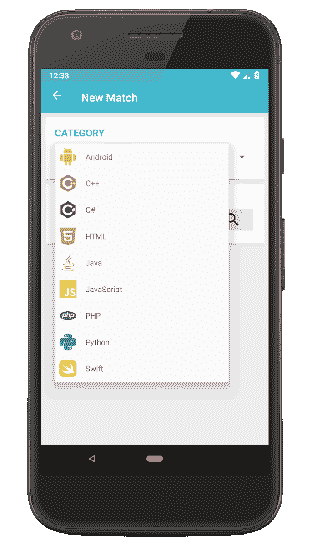

# 我对 Android 开发者 Nanodegree 的体验

> 原文：<https://dev.to/n1try/quiznerd---my-experiences-with-the-android-developer-nanodegree-19h3>

去年 3 月至 8 月，我参加了 Udacity 的 [Android 开发者纳米学位](https://www.udacity.com/course/android-developer-nanodegree-by-google--nd801)项目，在此我想分享我的经历。

最初，我在脸书上看到一则广告，申请由谷歌和 Udacity 为纳米学位项目提供的奖学金，通常费用为 900 欧元。我以前做过很少的 Android 开发，虽然我并不特别想为 Android 开发人员的职业生涯做准备，但我绝对有兴趣更彻底地学习 Android。然而，众所周知，如果没有一个真正的、严肃的项目要做，就很难找到学习新技术的动力。因此，我申请了奖学金，我很幸运(感谢谷歌和 Udacity 给我这个机会！).

# 毫度

## 时间管理

当参加纳米学位项目时，你通常有六个月的时间来完成它。由于大学的课程，我只有时间开始，所以基本上我有三个月的时间来完成它。但由于我不是一个完全的初学者，这是完全可以管理的。

Udacity 建议在每个学习部分结束时，制定一份何时完成哪个课程模块的时间表，以及期末项目的软截止日期。然而，这只是一个建议。唯一严格的截止日期是最后项目的提交。就我个人而言，我决定每周花两天时间完全专注于纳米学位的学习和编码。

## 结构

这个特定的纳米学位项目由五个主要部分组成。

1.  开发 Android 应用
2.  高级 Android 应用程序开发
3.  Android 和 Java 的 Gradle
4.  面向 Android 开发者的材料设计
5.  顶点工程

每个部分都由几节 **(1)视频课**组成，Udacity 开发者在其中解释概念并进行现场编码。在课间，有**测验**来测试你学到的知识，然而，这些测验通常都很简单明了。除此之外，还有几个 **(3)编码任务**，需要你实际应用新学到的概念。每一项编码任务都是从一个未完成的小玩具应用程序和一个你必须完成的待办事项列表开始的。to do 非常明确地告诉你该做什么，所以有时候这并不是一个真正的挑战。此外，如果你不想的话，你可以不做编码工作，因为没有人会检查你的结果。但很明显，这样做是有意义的，并且对每个部分末尾的 **(4)项目应用**有很大帮助(有时不止一个)。对于这个项目，你被告知要实现一个具有特定功能的应用程序(例如，烹饪食谱管理器、电影收藏管理器、RSS 阅读器等)。).通常它是从一个你必须完成的未经加工的应用程序框架开始的——这一次没有具体的待办事项或说明。最后，你可以通过 GitHub 库或者以 ZIP 文件的形式提交你的代码，Udacity 导师会检查你的代码，并给你关于功能、设计和代码风格的有用反馈。

以下是我的三个项目应用:

1.  **[popular-movies-Android](https://github.com/n1try/popular-movies-android):**应用程序，用于显示从在线电影数据库获取的电影信息。重点是与外部的第三方 web API 进行交互。
2.  **[烘焙-时间-安卓](https://github.com/n1try/baking-time-android) :** 显示烘焙食谱和说明的 App。重点是小部件、响应式设计和集成视频播放器。
3.  **[XYZ-reader-Android](https://github.com/n1try/xyz-reader-android):**文字文章基础阅读 app。重点是正确实施材料设计，动画和 UX。

## 社区

也许整个课程中最棒的是社区。有一个官方的 Slack 频道和一个论坛，论坛上满是来自世界各地的志同道合的开发者，他们正经历着和你一样的经历。人们问问题，讨论特定的任务或技术，你会立刻感到非常受欢迎。无论你对一项任务没有把握，还是无法修复某个错误，总有人会帮助你。此外，许多 Udacity 导师在 Slack 和论坛上提供支持，例如以每周 AMA 会议的形式。除此之外，课程的每个参与者都有一个私人导师，如果你有问题，可以直接联系 Udacity 导师。事实上，我从来没有联系过我的家人，但是我确信他们愿意帮助我。

## 事业腾飞

尽管拥有纳米学位在你的简历上看起来很不错，但 Udacity 也提供了很多支持，帮助你用新获得的 Android 知识建立成功的职业生涯。他们为你的申请提供信息和支持，审阅你的简历等等。

## 顶点工程

在课程的最后，有所谓的**顶点项目**，这是整个纳米学位过程中最有趣的部分(也是最大的努力)。你的任务是自由实现你喜欢的任何应用程序，给定一些要求，例如，你至少使用三个第三方库，遵循材料设计指南，提供一个主屏幕小工具等等。

期末专题由两部分组成。首先，你必须提交一份设计提案，其中包括你的应用程序想法，一些模型和你计划如何实现它的细节。在你的设计被 Udacity 导师批准后，你可以开始第二阶段，即实际的实现。

# QuizNerd

那时我有几次编码面试，所以我有了实现一个多人编码问答游戏作为最终项目的想法。虽然这可能是一个比大多数其他项目更全面的项目，但我仍然想做它，特别是因为这是一个我真的想为自己拥有的应用程序，而不仅仅是纳米学位。

我在那个最终项目上花了大约两周的时间进行几乎全职的编码，最终开发出了我的名为 QuizNerd 的应用。它在纯 Android(使用 Java)中实现，没有任何结构框架(例如像 [Dagger](http://square.github.io/dagger/) )，并使用谷歌的 [Firebase](https://firebase.google.com/) 作为后端。更准确地说，我使用 Firebase 身份验证进行用户管理， [Firestore](https://firebase.google.com/docs/firestore/) 作为实时文档数据库，FCM 用于通知和，Firebase [云功能](https://firebase.google.com/docs/functions/)作为后端逻辑的无服务器框架。

如果你是一个喜欢像[QuizClash](https://play.google.com/store/apps/details?id=se.feomedia.quizkampen.de.lite)这样的游戏的开发者，我很乐意让你试试 QuizNerd！你可以在 [Play Store](https://play.google.com/store/apps/details?id=com.github.n1try.quiznerd) 上找到它，它有数百个针对 Android、C++、C#、HTML、Java、JavaScript、PHP、Python 和 Swift 的问题。请随时与我分享您的反馈🙂。

# 结论

很有趣！在 Nanodegree 期间，我学到了很多东西，现在我有点自信地称自己为 Android 开发者。大多数概念都解释得非常详细。例如，我最喜欢的一章是关于 Gradle 的，他们精确地解释了 Gradle 是如何工作的，如何编写自己的 Gradle 任务，以及如何将其应用于 Android。

如果你不断激励自己完成课程，尤其是完成期末项目，这将会有所回报。而且，除了宝贵的编程知识，你还结识了很多来自世界各地社区的有趣的人。

然而，我想批评两件事。首先，如今 Java 在 Android 开发中迅速变得不那么流行，而 Kotlin 被认为是未来。与我交谈过的许多专业开发人员声称，今天仍然用 Java 而不是 Kotlin 来启动一个新的 Android 项目没有太大意义，所以我希望 Nandogree 是基于 Kotlin 的，以便更加经得起未来的考验。此外，像 Dagger 这样的事实上的标准框架在整个课程中都没有提到，而(在我看来)像 homescreen widget 这样不太有用的东西是由 Udacity 推出的。也许在课程的新版本中，这种情况会有所改变。

第二件事是，正如我前面提到的，每一部分的最终项目中的待办事项任务都过于具体和精细。有时候，我发现自己只是愚蠢地做着 TODOs 想要我做的事情，而不是试图捕捉更高层次的画面并自己解决设计问题。

也就是说，我会向所有有兴趣成为 Android 开发者的人推荐 Udacity Nanodegree。玩得开心！

**编辑:**随时在 QuizNerd 挑战我。我的昵称和 dev.to 上的一样。

# 链接

*   [Google Play 上的 QuizNerd](https://play.google.com/store/apps/details?id=se.feomedia.quizkampen.de.lite)
*   [nano degree 2018 期末项目征集](https://google-udacity-scholars18.github.io/and/)