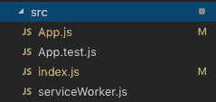
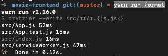
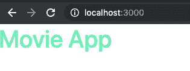
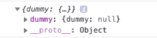

# React 内置前端的 Rails API，第二部分。

> 原文：<https://dev.to/jean182/rails-api-with-a-frontend-built-in-react-part-ii-2jib>

这是我的系列的第二部分，我将开始构建前端，而不是继续 API，这是因为做同样的事情很糟糕，我想改变做教程的常规方式。

我不是 React 方面的专家，所以我们将使用 create-react-app，因为这是设置一切的更简单的方法，我们将设置其他库以使我们的项目工作。

让我们开始吧，确保您使用的是最新版本的 node，并且您已经更新了 npm 来完成这项工作:

```
$ npx create-react-app movie-frontend
$ cd movie-frontend 
```

Enter fullscreen mode Exit fullscreen mode

有了那个设置，你应该可以在 [http://localhost:3000/](http://localhost:3000/) 上运行服务器，我用 yarn，但是你可以用 npm。

```
$ yarn run start 
```

Enter fullscreen mode Exit fullscreen mode

## 剔除不必要的废话

现在让我们移除一些我们不会用到的东西。在这种情况下，我们将删除位于 src 文件夹中的所有 css 文件和 logo.svg，以及代码中的引用。它应该看起来像上面的图像

[](https://niceguysfinishlast.dev/static/541953bdc12335de794360d3f86eb5ce/32b9d/src-first.png)

现在让我们更新我们的 App.js 和 index.js

```
// App.js
import React from "react"

function App() {
  return (
    <div className="App">
      <h1>Movie App</h1>
    </div>
  )
}

export default App

// index.js
import React from "react"
import ReactDOM from "react-dom"
import App from "./App"
import * as serviceWorker from "./serviceWorker"

ReactDOM.render(<App />, document.getElementById("root"))

// If you want your app to work offline and load faster, you can change
// unregister() to register() below. Note this comes with some pitfalls.
// Learn more about service workers: https://bit.ly/CRA-PWA
serviceWorker.unregister() 
```

Enter fullscreen mode Exit fullscreen mode

请注意，我们刚刚删除了 css 导入和徽标导入，并修改了组件，只显示了 h1 标记。

## 添加代码格式化程序。

在这种情况下，我们将使用漂亮，这是一个固执己见的代码格式化程序，我们的项目，这将使我们的代码有些一致性。

```
$ yarn add --dev --exact prettier 
```

Enter fullscreen mode Exit fullscreen mode

添加了更漂亮的，让我们添加一个自定义脚本来检查我们所有的文件

```
"scripts":  {  //...rest  of  the  scripts  "format":  "prettier --write src/**/*.{js,jsx}"  }, 
```

Enter fullscreen mode Exit fullscreen mode

最后，让我们创建一个文件来添加一些规则到我们的代码中，我将使用 gatsby starter 博客的规则，因为我很懒

```
$ touch .prettierrc 
```

Enter fullscreen mode Exit fullscreen mode

规则:

```
{  "endOfLine":  "lf",  "semi":  false,  "singleQuote":  false,  "tabWidth":  2,  "trailingComma":  "es5"  } 
```

Enter fullscreen mode Exit fullscreen mode

这应该让我们通过运行下面的
在 cmd 中使用更漂亮的

```
$ yarn run format 
```

Enter fullscreen mode Exit fullscreen mode

这会给我们这样的输出

[](https://niceguysfinishlast.dev/static/9962b5b527ad17f29f4c3d1c483eee14/349f8/prettier-output.png)

## 设计我们的应用程序

我们的应用程序现在看起来非常难看，所以让我们改变一些事情，让一切变得更好。

像往常一样，在前端教程中我们不要打破常规，我们将使用 boostrap。我喜欢将它作为 npm 包使用，因为这样我可以使用 scss 覆盖变量。所以我们需要增加对 scss 文件的支持。

```
$ yarn add node-sass 
```

Enter fullscreen mode Exit fullscreen mode

现在，让我们创建一个 scss 来设计我们的应用程序，并将其导入到 App.js 文件中。

```
$ mkdir src/styles
$ touch src/styles/main.scss 
```

Enter fullscreen mode Exit fullscreen mode

```
// App.js
import React from "react"
import "./styles/main.scss"

// Rest of the code 
```

Enter fullscreen mode Exit fullscreen mode

重新启动你的服务器，一切都应该正常运行，没有问题(只是一个丑陋的用户界面)，这在这篇文章中不会得到改善。

Bootstrap 是一个前端框架，用于创建一个响应良好的网站，它内置了一些组件，让我们可以非常容易地设计和创建东西。虽然它是一个伟大的工具，但它不是魔术。添加 bootstrap 相当简单，但我想先指出一些事情

1.  Bootstrap 使用 Jquery，JQuery 是另一个 javascript 库和依赖项，与 react 不同，它直接操作 DOM，React 使用一种称为虚拟 DOM 的东西，它的性能更好，因为它不更新整个 DOM。不建议合并。见此[篇](https://medium.com/@wisecobbler/if-you-think-you-need-jquery-in-your-react-app-you-re-doing-it-wrong-77899ed7217e)或此[篇](https://programmingwithmosh.com/javascript/react-vs-jquery-how-they-compare/)供参考。
2.  由于 JQuery 不在范围内，我们将失去一些引导功能，所有这些都是通过 JS(使用 JQuery)完成的，例如模态。
3.  没有所有的 JS 功能，我们如何使用 bootstrap？幸运的是，有几个库用于将 bootstrap JS 功能与 React 集成，其中一个是 [React Bootstrap](https://react-bootstrap.github.io/) ，它目前是测试版，还有[React class](https://reactstrap.github.io)。
4.  这两个库提供了现成的组件，比如导航栏、模态、下拉菜单、列、表格。
5.  根据我的经验，我认为只有在真正需要的时候才避免使用这些组件更灵活(使用 JS only 功能)，因为它们的核心组件不太灵活。
6.  使用这两个库中的一个是强制性的，除非你计划重新实现整个引导功能。
7.  也就是说，bootstrap 真的很酷，他们的网格系统，他们的 flex 实用程序，间距实用程序，让一切都变得非常愉快。

让我们添加引导程序

```
$ yarn add bootstrap 
```

Enter fullscreen mode Exit fullscreen mode

现在我们必须将引导程序导入到我们创建的 main.scss 文件中

```
// main.scss
@import "~bootstrap/scss/bootstrap"; 
```

Enter fullscreen mode Exit fullscreen mode

通过将我们的文件导入到 scss 文件中，我们能够使用 bootstrap 提供的所有样式帮助程序，现在，如果您重新启动服务器，您可以看到我们项目中的排版被更改为使用 bootstrap 使用的样式。

使用 sass 和 bootstrap 允许我们修改 bootstrap 使用的变量，例如最常见的是默认颜色，但是您可以修改的不仅仅是颜色，您可以在这里查看您可以做什么。我们将创建一个全局文件来添加所有变量并覆盖引导程序变量。

```
$ touch src/styles/_variables.scss 
```

Enter fullscreen mode Exit fullscreen mode

```
// _variables.scss
$primary: #71eeb8;
$secondary: #ffa7c4;
$info: #64b5f6;
$danger: #d23669;
$warning: #ffcc99;

// Bootstrap overrides
$theme-colors: (
  primary: $primary,
  info: $info,
  secondary: $secondary,
  danger: $danger,
  warning: $warning,
); 
```

Enter fullscreen mode Exit fullscreen mode

要查看我们的更改，我们需要将新文件导入到我们的 main.scss 文件中，它也应该在开头

```
@import "variables";

@import "~bootstrap/scss/bootstrap"; 
```

Enter fullscreen mode Exit fullscreen mode

现在，如果我们将 App.js 中的 h1 修改为这个

```
function App() {
  return (
    <div className="App">
      <h1 className="text-primary">Movie App</h1>
    </div>
  )
} 
```

Enter fullscreen mode Exit fullscreen mode

我们会看到这样的情况:

[](https://niceguysfinishlast.dev/static/ccd0d99f5c124914a888d17891498d9c/8844e/text-primary.png)

请注意它是如何从引导默认蓝色变为我们在 _variables.scss 文件中定义的主要颜色的。

## Redux 为全局状态

我们将把 redux 添加到我们的应用程序中，以便有一些东西来管理我们的全局状态。

```
$ yarn add redux react-redux redux-logger 
```

Enter fullscreen mode Exit fullscreen mode

我们正在添加 redux 和 react 的集成，还有一个名为 redux-logger 的库，它在一个动作被触发时进行记录。

现在我学习 redux 的方法是使用这个[模式](https://github.com/erikras/ducks-modular-redux)，基本上就是把你所有的 redux reducer 东西放在一个地方。我喜欢这样，因为一切都包含在一个模块中，而不是必须创建不同的文件。现在，如果你习惯于使用 redux 的常规方式，那很好，你可以这样做，没有区别。

让我们创建两个文件夹:

```
$ mkdir src/redux
$ mkdir src/redux/modules 
```

Enter fullscreen mode Exit fullscreen mode

我们将开始构建一个虚拟模块，这将有助于拥有一个样板就绪的项目，如果你想重用它，我们还将添加 redux-actions，这是一个提供帮助者来构建我们的模块的库(不是严格必要的，但它有助于快速编写)。

```
$ touch src/redux/modules/dummy.js
$ yarn add redux-actions 
```

Enter fullscreen mode Exit fullscreen mode

在这个文件中，我们添加了关于这个模块的所有东西，动作，默认的缩减器和传奇(我们还没有添加)。

```
// dummy.js
import { handleActions, createAction } from "redux-actions"

// Actions
export const DUMMY_ACTION = "movie-frontend/dummy/DUMMY_ACTION"

// Initial State
export const getInitialState = () => {
  return {
    dummy: null,
  }
}

// Reducer
const reducer = handleActions(
  {
    [DUMMY_ACTION]: (state, action) => {
      const { dummy } = action.payload
      return {
        ...state,
        dummy: dummy,
      }
    },
  },

  getInitialState()
)

export default reducer

// Action Creators
export const dummyAction = createAction(DUMMY_ACTION) 
```

Enter fullscreen mode Exit fullscreen mode

现在我们已经准备好了模块，我们需要创建 rootReducer，它是我们将要在模块文件夹中创建的每个模块的全局容器。

```
$ touch src/redux/rootReducer.js 
```

Enter fullscreen mode Exit fullscreen mode

```
// rootReducer.js
import { combineReducers } from "redux"

import dummy from "./modules/dummy"

const rootReducer = combineReducers({
  dummy,
})

export default rootReducer 
```

Enter fullscreen mode Exit fullscreen mode

现在让我们添加 redux-saga，这是一个帮助我们管理副作用的库。副作用是修改给定函数范围之外的事情的函数。起初听起来很复杂，但它是最酷的库之一。通过本教程，你将对它们的工作原理有一个清晰的认识，所以继续阅读本系列，我们将会讲到这一部分。

```
$ yarn add redux-saga 
```

Enter fullscreen mode Exit fullscreen mode

在我们的项目中使用 redux saga，让我们在虚拟模块中添加一个虚拟 saga。

```
// dummy.js
import { handleActions, createAction } from "redux-actions"
import { takeEvery, all } from "redux-saga/effects"

/* Rest of our code */

// Sagas
export function* createDummySaga(action) {
  // We'll have all the logic to call the side effect from here
}

// Saga
export function* dummySaga() {
  yield all([takeEvery(DUMMY_ACTION, createDummySaga)])
} 
```

Enter fullscreen mode Exit fullscreen mode

我们在这里做的是 dummySaga 函数正在监视它内部的动作，所以每当 DUMMY_ACTION 在代码中被触发时，Saga 将执行 createDummySaga 函数，我们可以在我们的 DummySaga 中添加我们想要的任意多个 saga。

让我们为我们的传奇故事创建一个主容器。

```
$ touch src/redux/rootSaga.js 
```

Enter fullscreen mode Exit fullscreen mode

```
// rootSaga.js
import { all } from "redux-saga/effects"
import { dummySaga } from "./modules/dummy"

export default function* rootSaga() {
  yield all([dummySaga()])
} 
```

Enter fullscreen mode Exit fullscreen mode

所有这些都已创建，现在我们需要创建我们的商店，然后将我们的应用程序包装在一个提供商中，该提供商将使我们的商店在应用程序中可用。

```
$ touch src/redux/setupStore.js 
```

Enter fullscreen mode Exit fullscreen mode

```
import { createStore, applyMiddleware } from "redux"
import { createLogger } from "redux-logger"
import createSagaMiddleware from "redux-saga"
import rootSaga from "./rootSaga"

import rootReducer from "./rootReducer"

export default function setupStore(initialState = {}) {
  let middlewares = []

  if (process.env.NODE_ENV === "development") {
    const logger = createLogger({ collapsed: true })
    middlewares.push(logger)
  }
  const sagaMiddleware = createSagaMiddleware()

  middlewares.push(sagaMiddleware)

  const store = createStore(
    rootReducer,
    initialState,
    applyMiddleware(...middlewares)
  )

  sagaMiddleware.run(rootSaga)

  return store
} 
```

Enter fullscreen mode Exit fullscreen mode

这个文件负责返回带有相关中间件的商店，请注意我们是如何注入传奇的，如果我们正在开发，我们将日志记录器作为另一个中间件注入，这允许我们将中间件功能集成到我们的传奇中。

```
import React from "react"
import { Provider } from "react-redux"import setupStore from "./redux/setupStore"
import "./styles/main.scss"

const store = setupStore()

function App() {
  return (
    <Provider store={store}> <h1 className="text-primary">Movie App</h1>
    </Provider> )
}

export default App 
```

Enter fullscreen mode Exit fullscreen mode

如果做得正确，项目应该继续运行，没有错误，如果您在 store 声明上添加一行代码，您就可以检查一切是否正常。

```
import React from "react"
import { Provider } from "react-redux"
import setupStore from "./redux/setupStore"
import "./styles/main.scss"

const store = setupStore()
console.log(store.getState())
/* Rest of the code*/ 
```

Enter fullscreen mode Exit fullscreen mode

这将输出我们的 rootContainer 中包含的所有 reducers 及其默认状态。

[](https://niceguysfinishlast.dev/static/56a4c0edbecd2908fbbe5ffb176933d8/2b3f6/getState.png)

很酷吧？

## 创建环境变量

这一点非常重要，因为在我们的远程报告中可能有我们不想要的信息，例如 API url，所以我们将创建一个. env 文件来指定它。

```
$ touch .env 
```

Enter fullscreen mode Exit fullscreen mode

```
// .env
REACT_APP_API_URL=localhost:3000/api/v1/ 
```

Enter fullscreen mode Exit fullscreen mode

这是一个简单的解释，但是请记住，如果您正在处理想要对其他人隐藏的 API 键或数据，它会很有用。

## 安装 Axios

这部分主要是让一切运行和完成设置，现在我们需要安装 axios，因为我们需要为我们的 API 设置一些请求。

```
$ mkdir src/api
$ touch src/api/api.js
$ yarn add axios humps 
```

Enter fullscreen mode Exit fullscreen mode

如你所见，我们还添加了一个名为 humps 的库，这是因为在使用 ruby 和 JS 时有一个问题，通常你在 ruby 中像这样输入变量(使用小写字母和下划线)

```
my_number = 0 
```

Enter fullscreen mode Exit fullscreen mode

同时在 JS(camelcase)

```
myNumber = 0 
```

Enter fullscreen mode Exit fullscreen mode

当我们使用 API 的时候，这会给我们带来一个大问题，因为我们必须为所有的东西选择一个标准，这是绝对不推荐的。Humps 是一个帮助我们将下划线转换成大写字母库，反之亦然，它就是为此目的而创建的。因此，为了自动完成这种转换，我们需要在 axios 中使用我们新创建的 api.js

```
import axios from "axios"
import humps from "humps"

const API = axios.create({
  baseURL: process.env.REACT_APP_API_URL, transformResponse: [
    ...axios.defaults.transformResponse,
    data => humps.camelizeKeys(data), ],
  transformRequest: [
    data => humps.decamelizeKeys(data),
    ...axios.defaults.transformRequest, ],
}) 
```

Enter fullscreen mode Exit fullscreen mode

请注意我们在这里如何使用环境变量来设置默认端点，以及我们如何在突出显示的行中使用驼峰。

## 包装完毕

如果你想阅读所有内容，或者只是想对我们所做的事情做一个简短的总结，在这里，我们创建了一个 React 应用程序，集成了 redux 和一些中间件，sass，axios，用于向我们的 API 发出请求，并使用环境变量来隐藏敏感数据。我希望你觉得这很有用，不要忘记订阅并保持联系，以获得任何建议和改进

(这是一篇发表在我的博客 niceguysfinishlast.dev 上的文章，你可以通过[点击这里](https://niceguysfinishlast.dev/rails-api-with-a-frontend-built-in-react-part-ii/)在线阅读。)