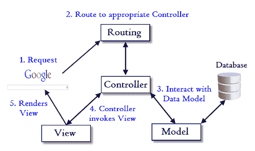
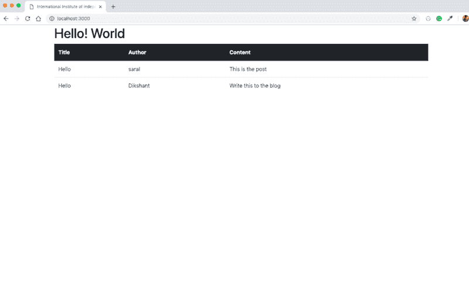

# 铁轨！我来了。(第二天)

> 原文：<https://dev.to/saral/rails-here-i-come-day-2-128i>

第一天，我在 rails 文档中遇到了一条关于控制器和路由的语句。上面写着“控制器的目的是接收应用程序的特定请求。路由决定哪个控制器接收哪个请求。通常，每个控制器有多条路由，不同的路由可以由不同的操作提供服务。每个动作的目的都是收集信息并提供给视图。现在，虽然我确实理解了它的第一部分，但涉及路由的后一部分让我不得不说，“我不知道你想传达什么。”因此，我花了一整天的时间来尝试真正理解路由和控制器的概念。

[](https://res.cloudinary.com/practicaldev/image/fetch/s--BIq0-i3e--/c_limit%2Cf_auto%2Cfl_progressive%2Cq_auto%2Cw_880/https://www.bogotobogo.com/RubyOnRaiimg/MVC/MVC_Rails.png)

一张看起来类似上面的图片让我对正在发生的事情有了直观的了解。我今天主要关注路由和控制器部分，今天只在模型区域稍微冒险了一下。

我是如何理解它的？

我首先尝试创建一个显示静态数据的简单静态页面。

首先，我使用`$ rails new blog`设置了新的 rails 应用程序。这为我生成了所有需要的文件。

接下来，我通过`$ rails g controller home index`为主页设置了一个控制器和一个视图。这个命令在终端中为我设置了一个家庭控制器。它还生成了样式表文件夹的 home.scss，并在视图上生成了 home 文件夹。在主文件夹中，它还生成了一个 index.html.erb 文件夹。这就是我昨天所做的。

然后，我着手将到`get` index 的路线配置为主页。为此，我对 routes.rb 文件进行了更改。

```
Rails.application.routes.draw do
   get 'home/index'
   root 'home#index'
end 
```

这里的本质是 rails 通过 get 方法获取`home/index`视图，并通过 root 将页面设置为主页。因此，在访问 localhost:3000 url 时，将显示 index.html 的内容。然而，在这之前，我仍然需要在家庭控制器中定义`/index`。所以我把`homecontroller.rb.`改成了

```
Class HomeController < ApplicationController
  def index

  end
end 
```

我认为这里正在进行的是定义索引，虽然没有提到，但是函数正在从 views 文件夹中呈现模板`home/index`。因此，我们可以看到`home/index`是如何路由到控制器的。

当我在终端中运行`rails s`后启动`localhost:3000`，我看到了 index.html 的内容。

[](https://res.cloudinary.com/practicaldev/image/fetch/s--3Z3aHvwx--/c_limit%2Cf_auto%2Cfl_progressive%2Cq_auto%2Cw_880/https://i.postimg.cc/d0Jt74sK/rails-1-at-8-20-33-PM.png)

然而，这里的数据是静态的，这也是我昨天做的事情，尽管我现在比昨天有了更好的理解。

下一步是尝试获取动态数据。为此，我需要建立一个数据库。这将是我的第一个 rails 数据库。我跑了`rails generate model Post title:string author:string blob:text`。这为我建立了一个带有两个表格标题的数据库，标题和正文。标题和正文都是文本类型。在数据库准备好之前要做的最后一件事是迁移它(我仍然需要弄清楚为什么以及为什么这很重要)。现在，我可以用`rails db:migrate`设置数据库。这里需要注意的一点是，rails 中用单数命名数据库的惯例。因此，数据库被命名为 post 或 user 等，而命名控制器是以复数形式进行的，因此将被命名为 post 或 users。

接下来，我登录到 rails 控制台，以便手动将数据插入数据库。明天我将深入研究从表单中获取数据，现在，我想手动插入数据并显示它们。把我带到 rails 控制台。虽然，我不得不说，到达控制台消耗了相当多的时间。我不断地收到各种错误信息，我不断地排除故障，但是一旦我最终修复了它，我就有了控制台。现在我想起来了，我想我应该记录我不断得到的错误消息。最后，我认为起作用的是移除并重新安装 ruby。

回到控制台，我运行了`Post.all`命令。这允许我查看数据库中的内容，而现在数据库中什么也没有。因此，我通过`Post.create(title: 'Hello World', author: 'saral' , blob: 'This is the post')`和 Post.create 手动将内容添加到数据库中(标题:' Hello '，作者:' Dikshant '，blob:'将此内容写入博客')。我已经把数据库填充好了。我所需要的就是在 post 视图中显示它们。

现在，我必须从数据库中获取数据，并把它们显示在主页上。为此，我可以使用我以前用来从控制台查看数据库内容的`Post.all`。在主控制器上定义了@posts。

```
class HomeController < ApplicationController
    def index 
        @posts = Post.all
    end
end 
```

在这里，我声明了一个全局(实例)变量 post，并将从 Post.all 获得的数据存储在其中。@表示文章现在是一个全局变量。我可以声明一个没有@的变量，但是这样我就不能对它们进行全局访问。

现在，剩下要做的就是修改视图，从控制器获取变量。

```
<div class="container">
    <h1> Hello! World </h1>
    <table class="table">
        <thead class="thead-dark">
        <tr>
            <th scope="col"> Title </th>
            <th scope="col"> Author </th>
            <th scope="col"> Content </th>
        </tr>
        </thead>
        <% @posts.each do |post| %>
        <tr>
            <td> <%= post.title %> </td>
            <td> <%= post.author %> </td>
            <td> <%= post.blob %> </td>
        </tr>
        <% end %>  
    </table>
</div> 
```

现在，我使用嵌入式 ruby 在 index.html.erb 文件中运行了一个循环。我想这就是为什么 html 文件的扩展名是 erb，这样你就可以嵌入和运行 ruby 命令了。循环`<% @posts.each do |post| %>`在`@posts`变量上运行一个循环，并使用`<%= post.title %>`为每个`post`打印出表格中的数据。

两个嵌入式 ruby 代码的一个关键区别是在`%`之后使用了`=`。`=`的用法渲染显示内容。

最后，我生成了主页上的数据。
[](https://res.cloudinary.com/practicaldev/image/fetch/s--25XSCW8U--/c_limit%2Cf_auto%2Cfl_progressive%2Cq_auto%2Cw_880/https://i.postimg.cc/MGPGBV33/display-at-9-15-21-PM.png) 。

我还是想更好的理解 ruby 中的循环。虽然我觉得自己对循环有所了解，但 ruby 中的循环对我来说有点神秘。所以，我会深入调查一下。此外，我将从表单中探索和获取数据，并显示它们。那是明天的。