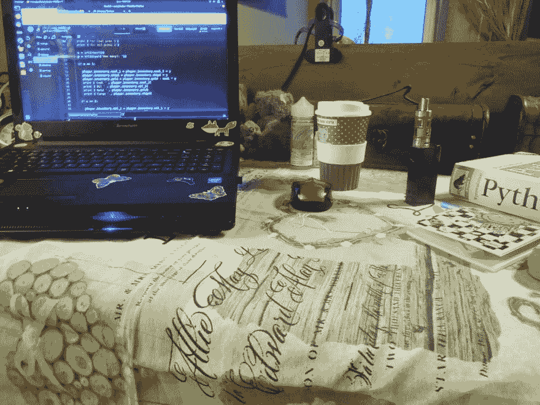

# 雨天，咖啡和代码...

> 原文：<https://dev.to/anyaritanake/rainy-day-coffee-and-code-5mm>

对我来说，这是最好的依从。当然，你可以添加一些功能，如咕噜猫和最喜欢的音乐。你也可以用一杯茶代替咖啡。然而...我在想....
你们呢？你有像这样的东西吗？请分享。

[《超现实世界》](https://www.mixcloud.com/johnnyminthemix/surreal-world-progressive-house-set/)