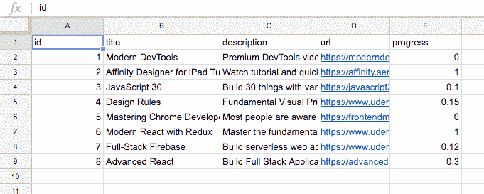
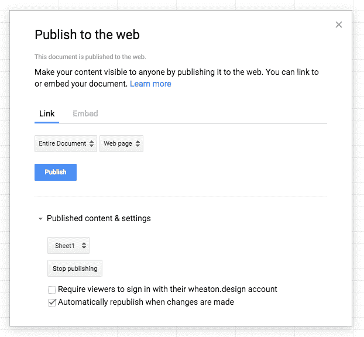

# 使用 Google Sheets 的快速原型

> 原文：<https://dev.to/mikewheaton/rapid-prototypes-with-google-sheets-cd8>

在构建新的 web 应用程序或功能的原型时，您通常需要测试数据来填充视图。通常的方法是创建一个快速的 JavaScript 对象或 JSON 文件，这就足够了。

在某种程度上。当你有很多物品后，随着物品的增加，很难找到你要找的物品。然后，您意识到需要另一个属性，您必须将它单独添加到每个项目中。

即使数据集很小，也很快无法维护。

我在为 [Lurn](https://lurn.today) 构建原型视图时遇到了这个问题。我去寻找一个类似电子表格的界面来编辑 JSON 文件，并发现了一个更好的选择。原来 Google Sheets 可以通过一个公共 URL 以 JSON 格式访问。这不仅提供了一种快速创建和维护数据的方法，它甚至开辟了让其他人像迷你 CMS 一样编辑数据或通过[谷歌表单](https://www.google.com/forms/about/)接受用户输入的可能性。

想跳到最后的结果吗？这里有一个 [CodeSandbox 演示](https://codesandbox.io/s/rmlmx2ymlq)。

让我们开始吧。

## 创建并发布您的数据

首先进入[谷歌工作表](https://docs.google.com/spreadsheets/)，创建一个空白的电子表格。对于每一列，使用一个茶色标题，这样以后就可以很容易地用`row.myColumnHeader`来访问它。在呈现列表时，您还需要一个 ID 列作为每一项的唯一键。

[](https://res.cloudinary.com/practicaldev/image/fetch/s--PWxkDKtB--/c_limit%2Cf_auto%2Cfl_progressive%2Cq_auto%2Cw_880/https://wheaton.design/static/18930ba4ed8403c73100804ff6fb7b9a/3024d/sheet.png)

数据准备就绪后，转到文件菜单，选择“发布到网站”。默认设置很好，所以您可以点击发布。

[](https://res.cloudinary.com/practicaldev/image/fetch/s--vCExeId1--/c_limit%2Cf_auto%2Cfl_progressive%2Cq_auto%2Cw_880/https://wheaton.design/static/f014890d2cb6936d1fbc3e7a10d310cf/7a138/publish.png)

## 检索您的数据

现在您已经保存了电子表格并拥有了它的唯一键，您可以将浏览器指向以下格式的 URL:

```
https://spreadsheets.google.com/feeds/cells/SPREADSHEET_KEY/1/public/full?alt=json 
```

你的数据在光荣的 JSON 里面！其实结构有点乱。

幸运的是，有一个名为[table t . js](https://github.com/jsoma/tabletop)的项目使得 Google Sheets 数据更容易解析。更好的是，有人帮我们创建了一个服务来运行脚本并返回干净的 JSON:【https://spreadsheet.glitch.me/

因此，与其直接从 Google 获取数据，不如使用以下格式的 URL:

```
https://spreadsheet.glitch.me/?key=SPREADSHEET_KEY 
```

## 渲染 React 组件

你就快到了！让我们将数据导入 React 应用程序。

无论在哪个组件中显示数据，首先都要向状态添加一个空数组。这是您将电子表格中的项目载入时放置它们的位置。

```
class App extends Component {
  state = {
    items: []
  }; 
```

当您希望 React 组件请求外部数据时，`componentDidMount`是开始请求的地方。创建该方法并添加一个 fetch()，它将请求数据并将其放入组件的状态中。

```
 componentDidMount() {
    fetch(`https://spreadsheet.glitch.me/?key=SPREADSHEET_KEY`)
      .then(response => response.json())
      .then(items => this.setState({ items }))
      .catch(error => console.log("Error fetching data:", error));
  } 
```

现在在 render 方法中，您可以从 state 中获取项目并映射到它们上面。

```
 render() {
    const { items } = this.state;

    if (!items.length) {
      return <p>Loading...</p>;
    }

    return (
      <div>
        <p>Loaded {items.length} rows from Google Sheets:</p>
        <ol>
          {items.map(item => (
            <li key={item.id}>{item.title}</li>
          ))}
        </ol>
      </div>
    );
  } 
```

请注意，当数组为空时，会显示一条加载消息。 [Fetch API](https://developer.mozilla.org/en-US/docs/Web/API/Fetch_API) 是异步的，可能需要几秒钟才能得到响应并重新呈现组件。

一旦数据返回，`items`数组将为电子表格的每一行包含一个对象。每一列都有对应的属性，可以像`item.title`一样访问。

就是这样！您有一个从电子表格中提取数据的 React 组件。这对于一个大型应用程序来说不太适合，但是对于一个快速原型来说，你现在有了一个更简单的方法来建立测试数据并随着时间的推移维护它。

请看这个 [CodeSandbox 演示](https://codesandbox.io/s/rmlmx2ymlq)中的实际操作。

## 习题与延伸阅读

想更进一步吗？

*   创建一个[谷歌表单](https://www.google.com/forms/about/)，向你的电子表格添加数据。
*   将[table t . js](https://github.com/jsoma/tabletop)添加到您的项目中以提高性能。
*   如果请求失败，显示错误而不是加载消息。