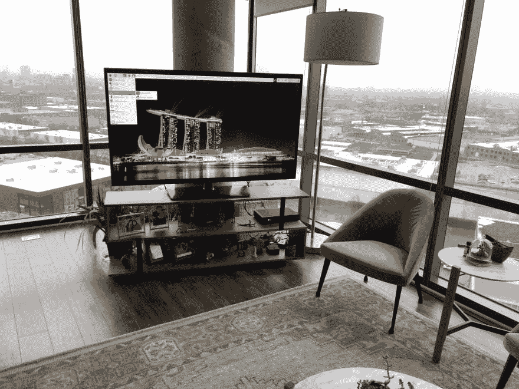
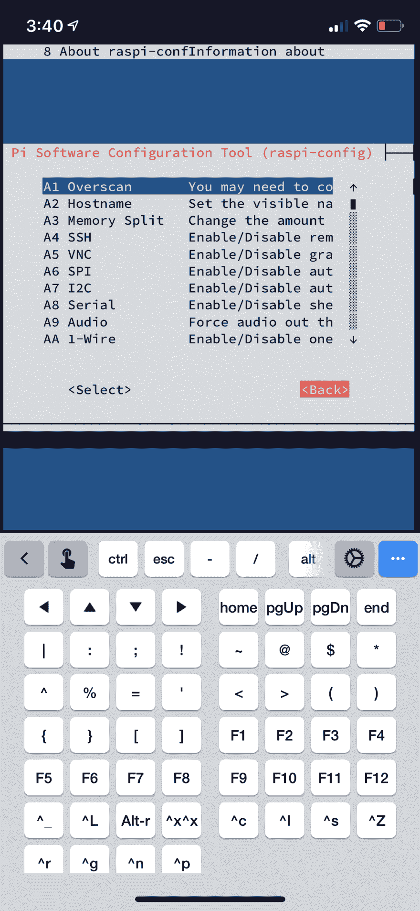
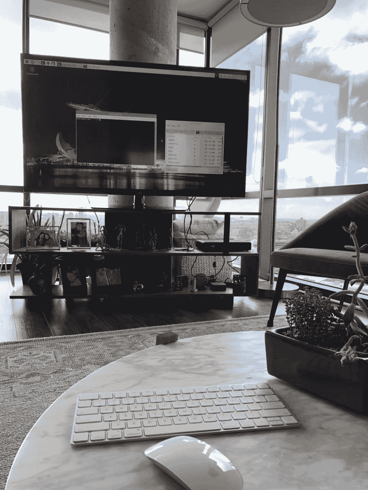

# 电视上的树莓派

> 原文：<https://dev.to/tathagata/raspberry-pi-on-your-tv-2kl6>

我有一个覆盆子馅饼，已经积了几个月的灰尘了。上个月早些时候，我把它连接到 usb 键盘、鼠标和显示器上，并设置了 WiFi。但由于所有杂乱的电线和专用于屏幕的空间，它挫败了作为一台袖珍计算机的目的。上周末，我终于得到了一个令我满意的设置。可选蓝牙键盘和鼠标，所以没有杂乱的电线。

### 使用电视作为显示器

这个白痴盒子是我的一个恶习，它吸干了我所有的生产时间。因为它已经在我的客厅里有一个专用的地方，所以我把它插到了电视上。好玩到我在电视柜上所有的小饰品后面都藏了一台 linux 机！

[](https://res.cloudinary.com/practicaldev/image/fetch/s--LyOSLAko--/c_limit%2Cf_auto%2Cfl_progressive%2Cq_auto%2Cw_880/https://thepracticaldev.s3.amazonaws.com/i/wsm472onfe8sneswehcy.jpg)

需要做一个小的设置更改，这样当我打开电视或从其他 HDMI 输入切换时，我可以立即切换到 pi。以 root 用户身份编辑 lightdm 配置`/etc/lightdm/lightdm.conf`，取消对`xserver-command=X`到`xserver-command=X -s 0 dpms`的注释。保存和`reboot`。

### 手机应用取代鼠标和键盘

#### 终端仿真器

Termius -一个漂亮的终端模拟器，速度快，功能齐全，最棒的是对我来说是免费的。只需安装，连接到树莓派的地址和繁荣你是在外壳上。让我惊讶的是，ncurses 屏幕在 Termius 上呈现得如此美丽！

[](https://res.cloudinary.com/practicaldev/image/fetch/s--SyWfKBXN--/c_limit%2Cf_auto%2Cfl_progressive%2Cq_auto%2Cw_880/https://thepracticaldev.s3.amazonaws.com/i/z2gvvi6vaudueme80gjw.jpg)

旁注: [Fing](https://www.fing.com/) 是一个很好的小应用程序，可以找到你网络上设备的地址。

#### 通过手机/Ipad 访问 GUI

在你的 iPhone 或 iPad 上安装 [VNC 浏览器](https://www.realvnc.com/en/connect/download/viewer/)。在 pi 上，安装 realvnc。

```
sudo apt-get update 
sudo apt-get install realvnc-vnc-server
reboot 
```

重启后`sudo raspi-config` > *高级选项* > *VNC* 启用。👍

就是这样！你可以在电视上运行 Linux 桌面，你可以在手机或平板电脑上使用它。所以从理论上来说，我可以从网飞 n chill 切换到 linux 桌面，只需轻点遥控器上的按钮。

### (可选)蓝牙键盘&鼠标

虽然 realVNC 比我对免费应用的预期要好，但加入蓝牙键盘和鼠标也不错。我的魔法键盘和鼠标很小，而且是无线的——有时可能会很有用。

```
sudo bluetoothctl
scan on
connect ma:ca:dd:re:ss:00
pair ma:ca:dd:re:ss:00 
remove ma:ca:dd:re:ss:00 
```

[](https://res.cloudinary.com/practicaldev/image/fetch/s--NV9t90pY--/c_limit%2Cf_auto%2Cfl_progressive%2Cq_auto%2Cw_880/https://thepracticaldev.s3.amazonaws.com/i/cumy1ii7rmbqp3xafwi2.jpg)

提示:以下是如何找到你的蓝牙设备的 mac 地址，如果你有他们连接到你的 mac:点击苹果菜单，按住 option 键，点击系统信息，然后点击蓝牙。

#### 等待。封面图片和这个帖子有什么关系？

一件都没有。这是我在索伦托拍的照片。❤️，迫不及待想回去了！