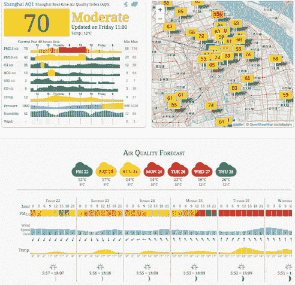
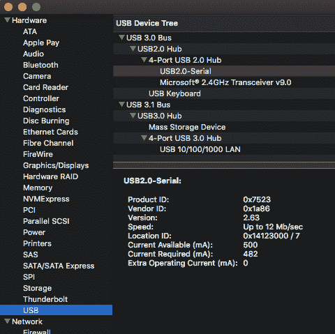
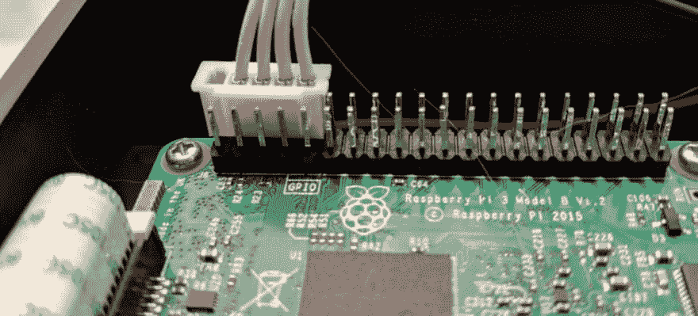

# 树莓 Pi PM2.5/10 空气质量监测器

> 原文：<https://dev.to/jeikabu/raspberry-pi-pm2510-air-quality-monitor-2ede>

我在上海生活和工作。我们谈论空气质量指数(AQI)就像其他地方的人谈论天气一样(顺便说一下，我们也谈论天气)。铁杆发烧友可以获得一个[空气质量预报](http://aqicn.org/city/shanghai/) :

[](https://res.cloudinary.com/practicaldev/image/fetch/s--av6bQ4YY--/c_limit%2Cf_auto%2Cfl_progressive%2Cq_auto%2Cw_880/https://rendered-obsolete.github.io/assets/shanghai_aqi.png)

我一直在寻找一些东西来证明我的树莓 Pi 的存在，并在 HackerNoon (和一个非常[最近的更新](https://hackernoon.com/how-to-build-a-mobile-particulate-matter-sensor-a2d5eee693ba))上看到了[这个项目，它使用 SDS011 粒子传感器来测量 AQI。**有趣的事实**:《哈克蒙邮报》顶部的照片是上海，黄浦江以西(“浦西”)——大多数照片是东方的天际线(“浦东”)。](https://hackernoon.com/how-to-measure-particulate-matter-with-a-raspberry-pi-75faa470ec35)

有几个现有的项目:

*   [zefanja/aqi](https://github.com/zefanja/aqi)(Python；由上述帖子的作者)
*   [rust-nova-sds011](https://github.com/woofwoofinc/rust-nova-sds011) (铁锈)
*   [SDS 011 _ 粒子 _ 传感器](https://gitlab.com/frankrich/sds011_particle_sensor) (Python)和[“SDS 011-RS”](https://github.com/chrisballinger/sds011-rs)(Rust)它启发了
*   可能更多…

我们将主要关注后两个以及两个 Rust 版本都使用的 [serial-rs](https://github.com/dcuddeback/serial-rs) 。

## PC

最初在 PC/Mac 上使用传感器附带的 USB 适配器最容易上手。

“sds011-rs”为 USB 适配器(“ch341-uart 转换器”)提供到 [Mac 驱动程序](http://www.wch.cn/download/CH341SER_MAC_ZIP.html)的直接链接，下面是对 Windows 等的支持。遵循存档内`ReadMe.pdf`中的说明。

如果您检查“系统报告”或“系统信息”，适配器将显示为**USB 2.0-串行** :

[](https://res.cloudinary.com/practicaldev/image/fetch/s--jJAqRtKh--/c_limit%2Cf_auto%2Cfl_progressive%2Cq_auto%2Cw_880/https://rendered-obsolete.github.io/assets/mac_usb_pm25.png)

找到设备的名称:

```
$ ls /dev/tty.wch*

/dev/tty.wchusbserial141230 
```

Enter fullscreen mode Exit fullscreen mode

末尾的数字似乎来自“位置 ID ”,如果重新连接 USB 适配器，可能会略有不同。

## 实现

首先我们需要打开`/dev/tty.wchusbserial141230`串口设备:

```
pub fn new(path: &Path) -> Result<Self, serial::Error> {
    let serial_port = serial::open(path)?;
    let sensor = Sensor {
        serial_port,
        device_id: None,
    };
    Ok(sensor)
}

pub fn configure(&mut self, timeout: Duration) -> serial::Result<()> {
    const PORT_SETTINGS: serial::PortSettings = serial::PortSettings {
        baud_rate: serial::Baud9600,
        char_size: serial::Bits8,
        parity: serial::ParityNone,
        stop_bits: serial::Stop1,
        flow_control: serial::FlowNone,
    };

    self.serial_port.configure(&PORT_SETTINGS)?;
    self.serial_port.set_timeout(timeout)?;
    Ok(())
} 
```

Enter fullscreen mode Exit fullscreen mode

在请求读数之前，通过将传感器设置为`Measuring`“工作状态”:
，确保传感器没有休眠

```
let wake_command = SendData::set_work_state(WorkState::Measuring);
sensor.send(&wake_command).unwrap(); 
```

Enter fullscreen mode Exit fullscreen mode

命令长 19 字节，格式如下:

| Zero | one | Two | 3 - 14 | Fifteen | Sixteen | Seventeen | Eighteen |
| --- | --- | --- | --- | --- | --- | --- | --- |
| `0xAA` | `0xB4` | 命令 | 数据(结尾的 0) | `0xFF` | `0xFF` | 校验和 | `0xAB` |

“命令”字段是下列之一:

```
#[repr(u8)]
#[derive(Debug, PartialEq, Clone, Copy)]
pub enum Command {
    /// Get/set reporting mode. `Initiative` (0) to automatically generate measurements, or `Passive` (1) to use `Request` commands.
    ReportMode = 2,
    /// Query measurement. When `ReportMode` is `Passive`
    Request = 4,
    /// Get device id
    DeviceId = 5,
    /// Get/set sleeping (0) or awake/measuring (1) state
    WorkState = 6,
    /// Get firmware version
    Firmware = 7,
    /// Get/set duty cycle
    DutyCycle = 8,
} 
```

Enter fullscreen mode Exit fullscreen mode

“数据”的格式取决于命令:

| 位 | three | 4 - 14 | 细节 |
| --- | --- | --- | --- |
|  | `0` | 全部`0` | “获取”值(包括`Request`) |

| 位 | three | 4 - 14 | 细节 |
| --- | --- | --- | --- |
|  | `1` | 值(尾随`0` s) | “设置”值(不包括`Request`) |

校验和的计算方法是将字节 2 至 14 相加(从命令到校验和之前):

```
pub fn generate_checksum(data: &[u8]) -> u8 {
    let mut checksum: u8 = 0;
    for data in &data[2..] {
        checksum = checksum.wrapping_add(*data);
    }
    checksum
}

// Alternatively, using `u16` to prevent overflow and truncating/taking modulus
pub fn generate_checksum(data: &[u8]) -> u8 {
    let mut checksum: u16 = 0;
    for data in &data[2..] {
        checksum += u16::from(*data);
    }
    checksum as u8
} 
```

Enter fullscreen mode Exit fullscreen mode

要么使用[包装](https://doc.rust-lang.org/std/num/struct.Wrapping.html)算术、截断，要么使用模数(`%` -如在几个实现中所见)来处理溢出。

注意，在其中一个实现中有`checksum - 2`。`- 2`来自命令终止字节`0xFF`，它是`-1`的[二进制补码形式](https://en.wikipedia.org/wiki/Two%27s_complement)(即`checksum + 0xFF + 0xFF`是`checksum - 1 - 1`)。

发送命令后，有一个 10 字节的响应:

| Zero | one | 2 - 5 | 6 - 7 | eight | nine | 细节 |
| --- | --- | --- | --- | --- | --- | --- |
| `0xAA` | `0xC0` | 数据 | 设备 Id | 校验和 | `0xAB` | 通过`Initiative`报告或通过`Request`和`Passive`报告接收测量值 |

| Zero | one | Two | three | 4 - 5 | 6 - 7 | eight | nine | 细节 |
| --- | --- | --- | --- | --- | --- | --- | --- | --- |
| `0xAA` | `0xC5` | 命令 | `0` | 价值 | 设备 Id | 校验和 | `0xAB` | “获取”命令 |
| `0xAA` | `0xC5` | 命令 | `1` | 价值 | 设备 Id | 校验和 | `0xAB` | “设置”命令 |

用类似于
的代码读取

```
type Response = [u8; 10];

let mut bytes_received = Response::default();
let mut num_bytes_received;
loop {
    // Read the first byte looking for a "Start" (0xAA)
    num_bytes_received = match self.serial_port.read(&mut bytes_received[..1]) {
        Ok(num_bytes) => num_bytes
        Err(_) => // Error handling
    };
    if num_bytes_received == 0 {
        //return
    }
    match Serial::try_from(bytes_received[0]) {
        Ok(Serial::Start) => {} // Ok, got `0xAA`
        other => continue;
    }

    // Read the second byte looking for either `0xC0` or `0xC5`
    num_bytes_received += match self.serial_port.read(&mut bytes_received[1..2]) {
        Ok(read) => read,
        Err(_) => // Error handling
    };
    let serial_read = Serial::try_from(bytes_received[1]);
    if serial_read == Ok(Serial::ResponseByte) || serial_read == Ok(Serial::ReceiveByte) {
        // Read remaining 8 bytes
        let num_bytes = self.serial_port.read(&mut bytes_received[2..])?;
        num_bytes_received += num_bytes;
        break;
    }
}
// Return all 10 bytes
bytes_received 
```

Enter fullscreen mode Exit fullscreen mode

最后，pm 2.5 和 10 的读数可以从 10 字节的响应中计算出来:

```
fn response_to_measurement(data: Response) -> SensorMeasurement {
    let pm2_5 = (f32::from(data[2]) + f32::from(data[3]) * 256.0) / 10.0;
    let pm10 = (f32::from(data[4]) + f32::from(data[5]) * 256.0) / 10.0;
    SensorMeasurement { pm2_5, pm10 }
} 
```

Enter fullscreen mode Exit fullscreen mode

## 圆周率

我们假设您已经[在 Raspberry Pi 3 上安装并运行了](//./raspberry-pi-3-rasbian-primer-i6d)(尽管这可能也适用于 a 2)。

将 sds011 插入 USB 端口，检查`dmesg` :
的输出

```
[69000.284345] usb 1-1.5: new full-speed USB device number 6 using dwc_otg
[69000.417442] usb 1-1.5: New USB device found, idVendor=1a86, idProduct=7523, bcdDevice= 2.63
[69000.417458] usb 1-1.5: New USB device strings: Mfr=0, Product=2, SerialNumber=0
[69000.417467] usb 1-1.5: Product: USB2.0-Serial
[69000.418425] ch341 1-1.5:1.0: ch341-uart converter detected
[69000.421856] usb 1-1.5: ch341-uart converter now attached to ttyUSB0 
```

Enter fullscreen mode Exit fullscreen mode

具有正确供应商/产品 ID 的设备为`now attached to ttyUSB0`，因此传感器可用作`/dev/ttyUSB0`。

你*可以*复制代码并直接在 Pi 上构建。但是，我很不耐烦，所以我们要用 musl 为 armv7 进行[交叉编译。](///2019/03/19/rust_lambda.html)

在`.cargo/config`(或`~/.cargo/config` ):

```
[target.armv7-unknown-linux-musleabihf]
linker = "arm-linux-musleabihf-gcc" 
```

Enter fullscreen mode Exit fullscreen mode

在 PC/Mac 上:

```
# 1\. Build it
CROSS_COMPILE=arm-linux-musleabihf- cargo build --target armv7-unknown-linux-musleabihf
# 2\. Copy it to the Pi (if `raspberrypi.local` doesn't work, use the pi's IP address)
scp target/armv7-unknown-linux-musleabihf/debug/pm25 pi@raspberrypi.local:~/
# 3\. Ssh in and run it
ssh pi@raspberrypi.local ./pm25 /dev/ttyUSB0 
```

Enter fullscreen mode Exit fullscreen mode

这并没有立即奏效。原来用`serial::unix::TTYPort::set_timeout()`启用的串口超时不起作用。与其尝试读取并查看是否有超时来将传感器设置为`Measuring`，不如直接设置它。

### GPIO

Pi 2/3 有大量的 USB 端口，但根据您的使用情况，将 SDS011 连接到 GPIO 引脚可能比让 USB 适配器伸出来更有价值。

SDS011 引脚在传感器和 USB 适配器上都有清晰的标签，并与各种 pi 上的引脚对齐。您可以通过查看 [Pi GPIO 引脚](https://www.raspberrypi.org/documentation/usage/gpio/)的示意图来确认这一点，从电路板的左上角开始:

| 设备 |  |  |  |  |  |
| --- | --- | --- | --- | --- | --- |
| SDS011 | 网络计算机 | 5v | G | 处方 | 税 |
| Pi3 | 5v | 5v | G | Tx (14) | Rx (15) |

所以，传感器可以直接连接到圆周率，就像这样:

[](https://res.cloudinary.com/practicaldev/image/fetch/s--4ki1yr-k--/c_limit%2Cf_auto%2Cfl_progressive%2Cq_auto%2Cw_880/https://rendered-obsolete.github.io/assets/pi_gpio_pm25.jpeg)

确保电线根据上表连接 Pi 和 SDS011(带`Tx->Rx`)。

[官方 UART 文档](https://www.raspberrypi.org/documentation/configuration/uart.md)有点不清楚，但是要使用串行 GPIO(引脚 14 和 15 ),必须配置 Pi 上的 UART:

```
sudo echo "enable_uart=1" >> /boot/config.txt

sudo vim /boot/cmdline.txt
# Remove `console=serial0,115200`

# Restart for changes to take effect
sudo shutdown -r now 
```

Enter fullscreen mode Exit fullscreen mode

现在可以通过`/dev/ttyS0`访问传感器。

事情又一次没有立即奏效。现在`serial::unix::TTYPort::read()`一次只返回一个字节。要么需要用`read_exact()`代替，要么用一个循环:

```
while num_bytes_received < bytes_received.len() {
    let num_bytes = self.serial_port.read(&mut bytes_received[num_bytes_received..])?;
    num_bytes_received += num_bytes;
} 
```

Enter fullscreen mode Exit fullscreen mode

## 在关闭

是一个有趣而简单的项目。周六早午餐时，我给我的一些朋友现场直播了“详细的”空气质量指数读数，他们笑得很开心。

将所有代码[推送到 github](https://github.com/jeikabu/sds011-rs) 。