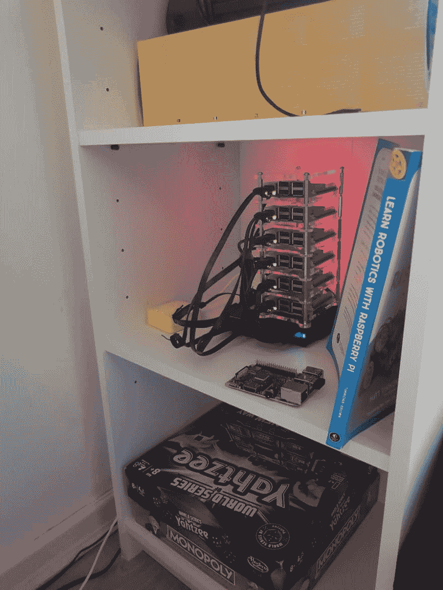

# 树莓星团 Kubernetes

> 原文：<https://dev.to/garfbradaz/raspberrypi-cluster-kubernetes-n75>

## 创建树莓 Pi 集群学习 Kubernetes

2018 年 8 月，我买了一些 Pi 的 tp create a cluster，主要是在阅读和观看了[亚历克斯·埃利斯](https://blog.alexellis.io/build-your-own-bare-metal-arm-cluster/)和[斯科特·汉瑟曼](https://www.hanselman.com/blog/HowToBuildAKubernetesClusterWithARMRaspberryPiThenRunNETCoreOnOpenFaas.aspx)关于这个主题的博客和视频后，这激励我做出了购买决定。当时我正在经营代码俱乐部，所以我认为这将是一个很好的展示和讲述。<！-更- >

亚历克斯和斯科特的帖子都很鼓舞人心，我真的很想以前给它。不管怎样，我得到了设备，但是工作和现实生活阻碍了我，进展缓慢。然后在 2018 年 12 月，我找到了一份新工作，从今年 4 月开始，他们广泛使用 Kubernetes，所以我还有另一个很好的理由来启动和运行它——学习 Kubernetes！

所以这个月我终于让它工作了，包括一个合适的主节点和节点设置:

有一些棘手的问题，比如确保为 Pi 设置静态 IP(并在路由器上正确设置)，更重要的是，为路由器本身设置静态 IP *。黄色框是图片是我最后去找的的 [rGL-MT300N-V2 路由器，也是他帖子里唯一的一点 Hanselmans 购物清单，我转自。](https://www.amazon.co.uk/gp/product/B073TSK26W/ref=oh_aui_search_asin_title?ie=UTF8&psc=1)*

## 我的儿子们喜欢它

我的两个儿子很喜欢它，因为我们也在同时制作树莓派机器人。他们感兴趣的是这是在做什么以及*为什么*。激发小孩子的好奇心是很重要的，而我仅仅建立网站并不能让他们兴奋起来！

## 我该这么做吗？

是的。:)

## 接下来是什么？

嗯，学习 Kubernetes 本身和运行一些。NET 核心容器站点。我想看看有多快。NET SDK 现在是为了在 Pi 上构建，因为我想用本地构建服务器进行实验。

此外，Alex 还是 OpenFaaS 的创造者，这是一种与云无关的无服务器解决方案。最近在我目前的工作岗位上使用过 Azure Functions，我很清楚为什么这是一个好主意。无服务器基础设施*，没有*绑定到特定的云。我想探索把一个小的 Web API app 转换成 OpenFaaS，在那里做实验(我其实超级兴奋)。

最后，当我重新启动我的代码俱乐部时，我想做一个展示，讲一些有趣的事情，包括集群。我在考虑运行一些 OpenFaaS 函数，与我正在构建的 Pi 机器人“对话”,并可能允许您控制它。

在四月到来之前有很多事情要做！