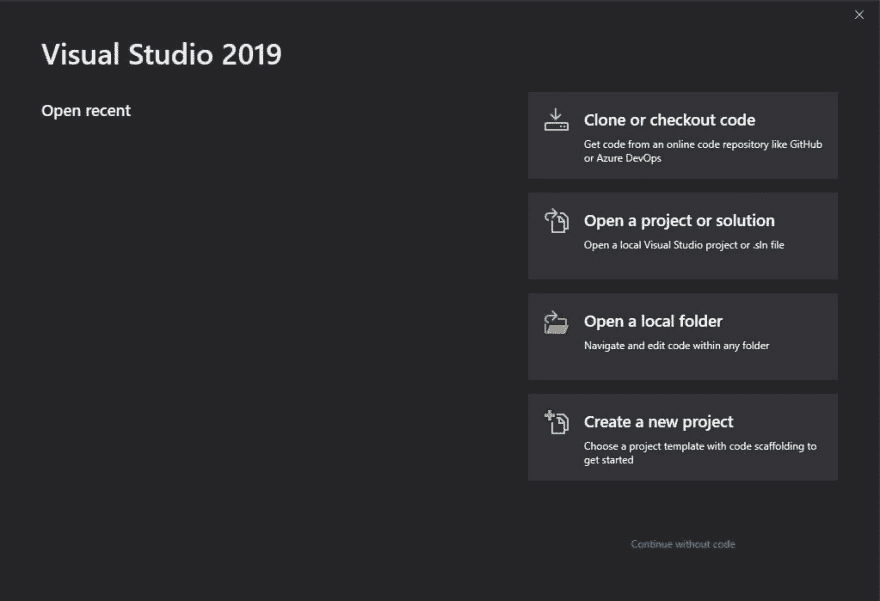
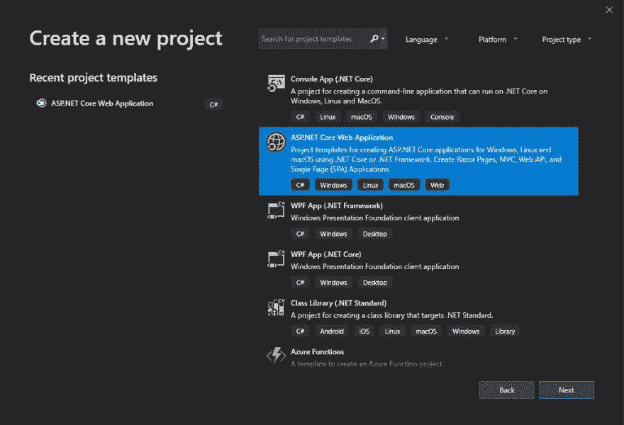
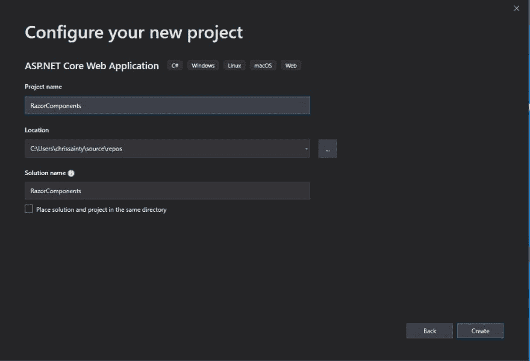
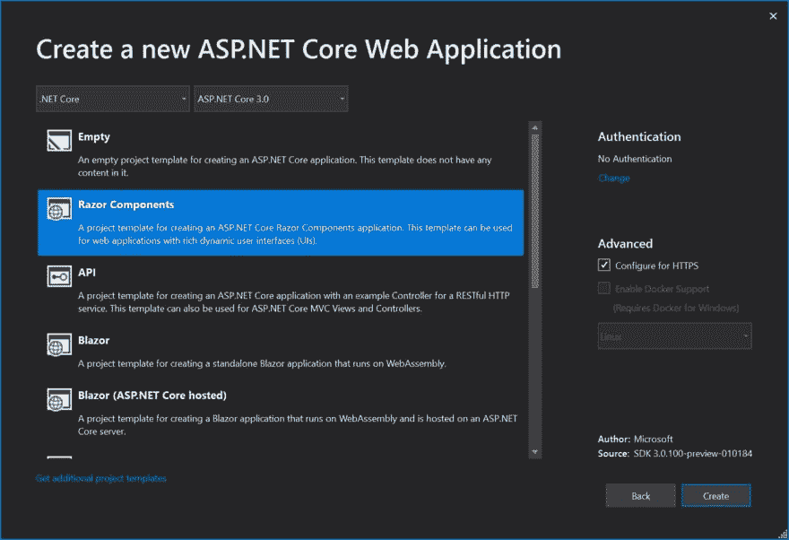
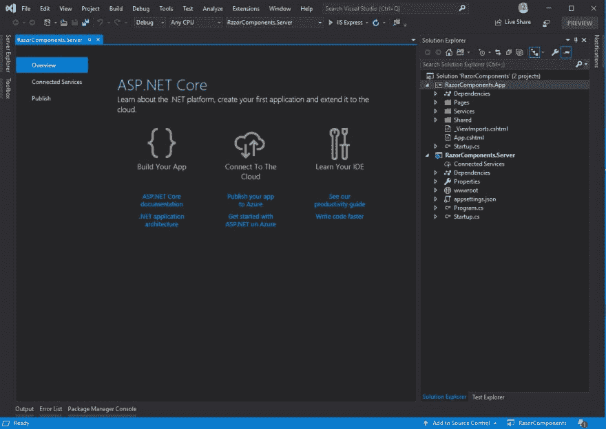
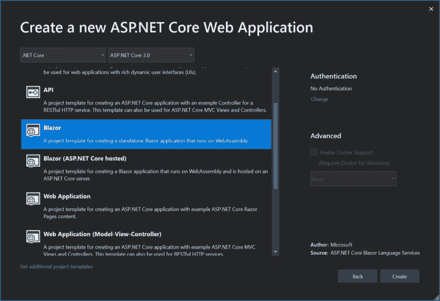

# 剃须刀组件首次官方预览

> 原文：<https://dev.to/progresstelerik/razor-components-first-official-preview-17e0>

布拉索世界最近一直很活跃！这篇博客向你介绍了 Razor 组件的最新版本，并提供了 Blazor 0 . 8 . 0 版本的概述。

最近在 Blazor 的世界里，这是一段令人兴奋和忙碌的时光。我们已经有了 Razor 组件的第一个官方预览版(正式名称为服务器端 Blazor)。然后，仅仅一周之后，我们也收到了 Blazor 的 0.8.0 版本！在这篇文章中，我将向你介绍 Razor 组件的第一个版本，我还将简要概述 Blazor 0 . 8 . 0 版本的内容。

### 剃须刀组件

他们来了，而且是正式的！所以，当然，你想知道你怎样才能得到它们？

如你所料，你需要安装一些预览版来玩 Razor 组件。你首先会需要的是[Visual Studio 2019 的最新预览版](https://visualstudio.microsoft.com/vs/preview/)(目前是预览版 2.2)。在下载/安装的同时，你还需要[最新的预览版。网芯 SDK](https://dotnet.microsoft.com/download/dotnet-core/3.0) 。

一旦它们都安装好了，您就可以开始了。

### 创建您的第一个项目

安装好所有东西后，您就可以开始创建您的第一个 Razor 组件项目了。Visual Studio 2019 的情况略有不同，当它首次启动时，你会看到一个新的模态屏幕。

[](https://res.cloudinary.com/practicaldev/image/fetch/s--KTWrnKzc--/c_limit%2Cf_auto%2Cfl_progressive%2Cq_auto%2Cw_880/https://d585tldpucybw.cloudfront.net/sfimages/default-source/blogs/2019/2019-02/visualstudio2019-startup-modal.jpg%3Fsfvrsn%3D443a801d_1)

从这里，选择“创建新项目”。然后，您将转到项目模板屏幕。

[](https://res.cloudinary.com/practicaldev/image/fetch/s--r11_nuJo--/c_limit%2Cf_auto%2Cfl_progressive%2Cq_auto%2Cw_880/https://d585tldpucybw.cloudfront.net/sfimages/default-source/blogs/2019/2019-02/vs2019-project-selection.jpg%3Fsfvrsn%3Df9455fed_1)

在此屏幕上，选择“ASP。NET Core Web 应用程序”模板，然后单击“下一步”。在下一个屏幕上，您可以为您的项目命名，并选择您想要保存它的位置。

[](https://res.cloudinary.com/practicaldev/image/fetch/s--ELhRnV2d--/c_limit%2Cf_auto%2Cfl_progressive%2Cq_auto%2Cw_880/https://d585tldpucybw.cloudfront.net/sfimages/default-source/blogs/2019/2019-02/vs2019-projectname.jpg%3Fsfvrsn%3D5bdc445_1)

为项目命名后，单击“创建”完成，您将看到一个新的模式，允许您选择新的 ASP.NET 核心 Web 项目的类型。

[](https://res.cloudinary.com/practicaldev/image/fetch/s--cA2MRbYp--/c_limit%2Cf_auto%2Cfl_progressive%2Cq_auto%2Cw_880/https://d585tldpucybw.cloudfront.net/sfimages/default-source/default-album/razor-components-fnp.jpg%3Fsfvrsn%3D462a7cec_1)

这里是你可以选择剃须刀组件的地方。然后，您可以单击“确定”,系统将为您生成解决方案。当它完成的时候，你会得到这样的结果。

[](https://res.cloudinary.com/practicaldev/image/fetch/s--FZkHY9OC--/c_limit%2Cf_auto%2Cfl_progressive%2Cq_auto%2Cw_880/https://d585tldpucybw.cloudfront.net/sfimages/default-source/blogs/2019/2019-02/rc-solution.jpg%3Fsfvrsn%3D15b77f0f_1)

恭喜你！您刚刚创建了第一个 Razor 组件应用程序。

### 项目变更

任何测试过 Razor 组件早期版本的人(当它被称为服务器端 Blazor 的时候)可能会注意到生成的项目中有一个微小的变化。根文件夹现在是服务器项目的一部分，而不再是应用程序项目的一部分。这是因为 app 项目不再是一个 web 项目，它现在是一个库项目。

这样做的原因是长期计划是只有一个项目。但是目前有一个工具问题——Razor 组件有一个与 Razor 页面和 Razor 视图相同的. cshtml 扩展名。问题是 Razor 组件需要与其他两个组件不同的编译。如果它们都在同一个项目中，那么就没有办法知道如何编译一个. cshtml 文件。

这将在未来的版本中通过引入 razor 组件的新文件扩展名. Razor 来解决。老实说，我并不完全喜欢这个扩展名——我认为这对开发人员来说可能有点困惑，但命名东西很难，我不知道有什么好的替代方案。无论如何，有了这个新的扩展，将有可能在单个项目中托管所有的东西，并且不再需要。应用程序项目了。

### 组件库

不幸的是，这个版本中没有组件库项目模板。但是，您仍然可以创建它们，您只需要使用 Blazor 模板和 dotnet CLI。

```
dotnet new -i Microsoft.AspNetCore.Blazor.Templates::0.8.0-preview-19104-04 
```

一旦安装了模板，就可以使用下面的命令创建一个项目

```
dotnet new blazorlib 
```

在第一个预览版中需要注意的一个大问题是 Razor 组件不支持具有静态资产的组件库。因此，举例来说，如果您有一个包含一些 JavaScript 的组件库，并且您从 Razor 组件项目中引用它，那么当您运行该项目时，这些 JavaScript 文件将不会被添加。这是一个相当大的限制，但是团队将在未来的预览版中解决这个问题。

### MVC &剃刀页面集成

现在，如果你有现有的 MVC 或 Razor 页面应用，并且对使用 Razor 组件感兴趣，这真的很令人兴奋。长期计划是能够将 Razor 组件与 MVC 或 Razor 页面混合搭配。不只是整页，而是一页的一部分。我认为这真的是一个令人印象深刻的计划，应该提供一个极其平滑的迁移到 Razor 组件的路径。

在第一个预览中，您可以将 Razor 组件添加到 MVC 视图或 Razor 页面中。有什么问题吗？他们还没有互动。

这是通过使用一个新的 HTML 助手 RenderComponentAsync 实现的。例如，如果我们想将一个名为 BlazorLabel 的组件呈现到一个接受文本参数的 MVC 页面中，它应该显示名为 LabelText。我们可以使用下面的代码做到这一点。

```
@(await Html.RenderComponentAsync<BlazorLabel>(new { LabelText = "Cool Label" })) 
```

然而，这种语法只是暂时的。从长远来看，该团队希望开发人员能够使用普通的元素和属性语法，因此上面的内容将变成这样:

```
<BlazorLabel LabelText="Cool Label"></BlazorLabel> 
```

当然还有很长的路要走，但我认为这一承诺是相当令人敬畏的。值得指出的是，这种关系将是单向的，这意味着 MVC 视图和 Razor 页面可以托管 Razor 组件，而不是相反。

这为 Razor 组件的首次预览做好了准备。我认为这是一个坚实的第一次预览，虽然我们没有获得许多新功能，但我们为未来做了很多基础工作。

在我们结束之前，让我们快速看一下 Blazor 0 . 8 . 0 版本中有什么。

### Blazor 0.8.0

这个版本并不是要给 Blazor 增加新的特性——它更像是一个维护版本。0.8.0 的主要目标是更新 Blazor 以使用。NET Core 3 以及一些错误修复。

### 开始设置

如果你已经按照步骤使用了 Razor 组件，那么你也已经准备好使用 Blazor 了。您需要做的唯一额外的事情是从 Visual Studio Marketplace 安装 [Blazor 语言服务。所有这些都是为你提供 Blazor 独立和 Blazor 托管模板。一旦安装了扩展，就可以选择 Blazor 项目类型。](https://marketplace.visualstudio.com/items?itemName=aspnet.blazor)

[](https://res.cloudinary.com/practicaldev/image/fetch/s--SnVGhYR4--/c_limit%2Cf_auto%2Cfl_progressive%2Cq_auto%2Cw_880/https://d585tldpucybw.cloudfront.net/sfimages/default-source/default-album/blazor-components-fnp.jpg%3Fsfvrsn%3Decdf360c_1)

### 性能& IL 链接器改进

这个版本中一个很好的补充是 Mono WASM (WebAssembly)运行时的更新版本。这个新版本将运行在 Chrome 上的 Blazor 应用程序的速度提高了大约 25%,这是不容小觑的。

另一个改进是 IL 链接器。如果你以前没有听说过这个，IL 链接器负责减少 Blazor 应用程序的大小。它通过删除没有代码路径命中的代码和库来实现这一点。这与 JavaScript 世界中的树摇动概念非常相似。

到目前为止，IL 链接器有点过于激进，一些流行的库(最著名的是 Json.NET)不能开箱即用地与 Blazor 一起使用。但是有了这个新版本，情况就不再是这样了，现在可以在 Blazor 应用程序中使用更多的库。

### Blazor 托管的模板 Bug

目前，Blazor 托管的模板有一个错误，可以通过尝试加载获取数据页面来发现。这是因为模板没有对 Json.NET 的引用(这在中已被删除)。网芯 3)。通过安装 Json.NET，然后更新服务器项目启动，你可以很容易地解决这个问题。ConfigureServices 方法如下:

```
public void ConfigureServices(IServiceCollection services)
{
    services.AddMvc().AddNewtonsoftJson();
    services.AddResponseCompression();
} 
```

### 包装完毕

总的来说，我认为这是相当不错的几个版本，尤其是当你考虑到已经发生的变化时。Blazor 团队正在创建一些真正坚实的基础，他们可以在此基础上继续前进。

目前最大的问题似乎与工具有关。与我交谈过的大多数人都遇到了相当多的 Visual Studio 2019 问题，这可能会令人沮丧。但是让我们记住这都是尖端技术，事情每天都在改进。

如果你还没有接触过剃须刀组件和 Blazor，我建议你试一试。这真的是一个惊人的框架，你已经可以实现这么多。