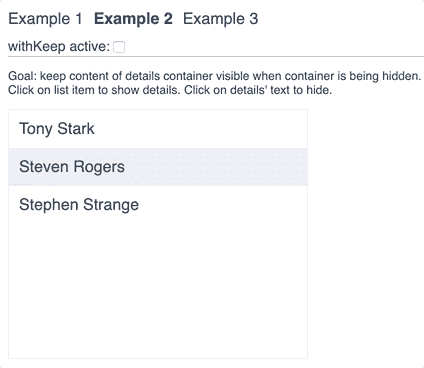

# react-keep - tiny 库帮助处理消失的数据

> 原文：<https://dev.to/mariuszdev/react-keep-tiny-library-helping-with-vanishing-data-436c>

我把常用的模式变成了微型库。它是高阶组件，有条件地记住道具的先前值，并将它们传递下去。因此，您有时间优雅地隐藏组件或显示带有旧数据的占位符。

[GitHub 回购和单据](https://github.com/pilaas/react-keep)
[参见示例](https://codesandbox.io/s/pjo5369v0m?autoresize=1&fontsize=14&view=preview)

