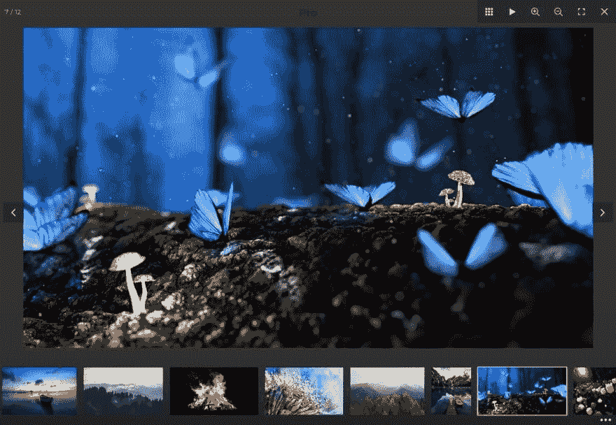

# 反应灯箱。介绍全屏灯箱基本！

> 原文：<https://dev.to/piotrzdziarski/react-lightbox-introducing-fullscreen-lightbox-basic-5aao>

全屏灯箱的基本版本现在可以在 React 环境下工作了！只需一个组件，您就可以轻松使用强大的 lightbox。

可以使用 NPM:
NPM install—save-dev fs lightbox-react 安装 light box

或者从塔尔巴尔档案馆。下载:[https://fslightbox.com/react/download](https://fslightbox.com/react/download)

演示:[https://fslightbox.com/react](https://fslightbox.com/react)

你可以在文档中学习如何使用 light box:
文档:[https://fslightbox.com/react/documentation](https://fslightbox.com/react/documentation)

项目仓库:
[https://github.com/piotrzdziarski/fslightbox-react](https://github.com/piotrzdziarski/fslightbox-react)

