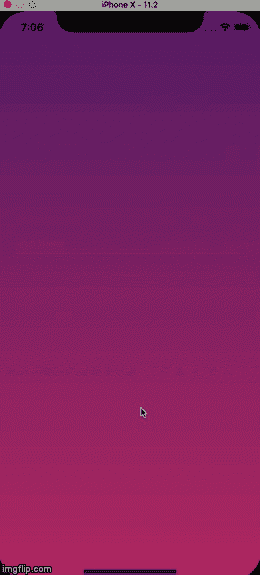

# 对本地动画输入做出反应

> 原文：<https://dev.to/saadbashar/react-native-animated-inputs-4cfn>

这是一个非常直接的探索，关于我如何在我的 react 原生形式中做动画输入。演示如下:

[](https://imgflip.com/gif/2rtnqt)

因此，我基本上有三个文本输入，我需要一个接一个地动画。我用 react 原生动画模块来做这种动画。

在动画模块中，有一种叫做**交错**的方法，它有助于用**连续延迟**一个接一个地制作动画组件。我只需要将我的数组输入传递给这个方法来实现这个动画。完整的代码如下所示:

```
// Creating arrays to hold the animation arrays
const arr = [];
for (var i = 0; i < 3; i++) {
  arr.push(i)
};

// Inputs configs
const inputs = [
  {
    placeholder: 'Full Name',
  },
  {
    placeholder: 'Email Address',
  },
  {
    placeholder: 'Password',
  }
];

export default class App extends React.Component {
  constructor(props) {
    super(props);
    this.animatedInputValue = [];
    arr.forEach((value) => {
      this.animatedInputValue[value] = new Animated.Value(0)
    });
  }

  componentDidMount() {
    // creating array animations 
    const inputAnimations = arr.map((item) => {
      return Animated.timing(
        this.animatedInputValue[item],
        {
          toValue: 1,
          duration: 1500,
        }
      );
    });
    // Animate each element after 1000 miliseconds
    Animated.stagger(1000, inputAnimations).start();
  }

  render() {
    const animatedInputs = inputs.map((a, i) => {
      return (
        <Animated.View 
          key={i} 
          style={{
            opacity: this.animatedInputValue[i], // attaching animations to the input opacity
          }} 
        >
          <TextInput
            style={[{ borderColor: '#fff', borderBottomWidth: 1, padding: 5, marginBottom: 30 }]}
            selectionColor="#fff"
            placeholder={a.placeholder}
            placeholderTextColor="#fff"
          />
        </Animated.View>  
      );
    });

    return (
      <LinearGradient
        colors={['#642B73', '#C6426E']}
        style={{
          position: 'absolute',
          width: '100%',
          height: '100%',
          justifyContent: 'center',
          alignItems: 'center'
        }}
      >
        <View style={{ width: '100%', paddingHorizontal: 25  }}>
          {animatedInputs}
        </View>
      </LinearGradient>
    );
  }
} 
```