# 与 Chuck Norris 进行本地聊天

> 原文：<https://dev.to/nickparsons/react-native-chat-with-chuck-norris-3h7m>

我是 [Stream](https://getstream.io/chat/) 的开发者传道者，也是 Feeds 和 Chat 的 API 的开发者传道者，我可以尽情地使用我们的各种工具、令人惊叹的 UI 套件和新产品！多年来，Stream 一直是 feeds 即服务的领先提供商，为超过 5 亿的最终用户提供 feeds。在过去的几个月里，这个团队一直在努力开发一个新产品——聊天。

在本教程中，我将带你了解如何用 React Native、[天赋聊天](https://github.com/FaridSafi/react-native-gifted-chat)(React Native Chat Components by Stream 目前在 [beta](https://github.com/GetStream/stream-chat-react-native) 、 [Serverless](https://serverless.com) ，当然还有[Stream Chat](https://getstream.io/chat/)构建一个简单的 messenger 风格的应用。为了增加混合，我将引入一个后端 Lambda 函数，它将自动响应第三方 API 提供的 Chuck Norris 笑话和事实。

对于繁重的工作，我们将使用 [Stream Chat JS](https://www.npmjs.com/package/stream-chat) ，这是一个直接与 Stream API 通信的 JavaScript SDK。如果你有兴趣查看一个很棒的流聊天教程，看看这里的。

> 我还应该指出，我将使用 macOS 和 iOS，所以如果你使用 Windows 或 Linux，本教程可能会稍有偏差。

要跟进这篇文章，请确保您已经安装和/或设置了以下内容:

*   [世博会](https://expo.io)
*   [无服务器](https://serverless.com)
*   [AWS](https://aws.amazon.com)

> *寻找代码库？你可以在这里找到开源代码[。来个快速演示怎么样？我也有！看看](https://github.com/GetStream/react-native-chat-chucky)[开胃](https://appetize.io/app/crhnp4qabpmznx6bzvfz6ad708)上的演示。*

让我们找点乐子！🏂

## 1。按流配置聊天

前往 [https://getstream.io](https://getstream.io) ，点击网站右上角的“注册”按钮。按照提示进行操作。

[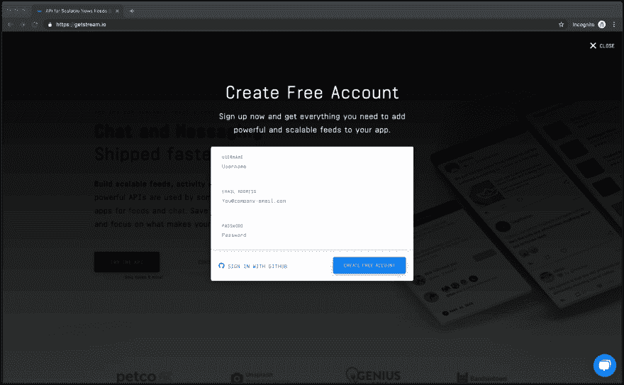](https://res.cloudinary.com/practicaldev/image/fetch/s--ZVUUde_B--/c_limit%2Cf_auto%2Cfl_progressive%2Cq_auto%2Cw_880/https://i.imgur.com/r8aJ5Mx.png)

一旦你被重定向，前往[https://getstream.io/chat/#pricing](https://getstream.io/chat/#pricing)并点击“开始试用”按钮——这将为你的帐户启用试用聊天(14 天)。一旦审判开始，你就快成功了！

[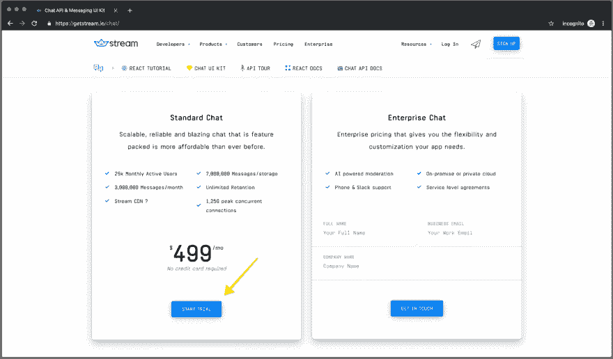](https://res.cloudinary.com/practicaldev/image/fetch/s--9lbjbaQe--/c_limit%2Cf_auto%2Cfl_progressive%2Cq_auto%2Cw_880/https://i.imgur.com/Zoqwf0X.png)

回到仪表板，单击您的应用程序。仪表盘默认为“Feeds”，所以请点击顶部的“Chat”按钮。

[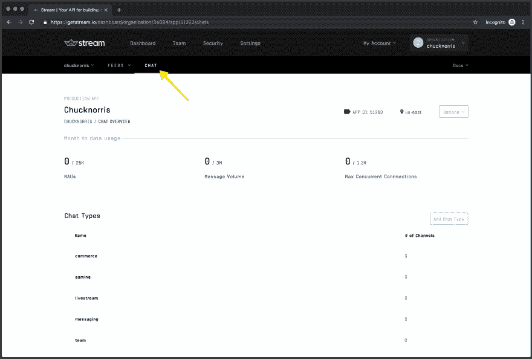](https://res.cloudinary.com/practicaldev/image/fetch/s--n0Nz5Ty8--/c_limit%2Cf_auto%2Cfl_progressive%2Cq_auto%2Cw_880/https://i.imgur.com/26rfcMT.png)

从这里，如果你向下滚动，你会看到你新启用的聊天应用程序的各种设置。确保在一个新标签页中打开它——你将需要这个页面中的**密钥**、**秘密**(底部)和**应用 ID** (顶部)。

如果你对 Stream Chat 的定价和产品比较感兴趣，可以看看[这个](https://medium.com/@scott_11393/what-i-learned-researching-chat-api-pricing-the-stream-blog-5722512854d0)。

## 2。设置无服务器

当您只有几个必需的端点时，类似于这个构建，无服务器通常是最有意义的。启动服务器可能需要相当长的时间，而且可能相当昂贵。我并不是说无服务器环境适用于所有人和所有事物，但是，我是说如果你正在构建一个很小的 API，无服务器环境绝对是一个不错的选择。

前往[https://dashboard.serverless.com](https://dashboard.serverless.com)创建一个新账户。遵循入职流程(电子邮件验证、用户名选择、应用创建等。).创建应用程序后，保存租户名称(例如，nick-chuck 用户名= nickchuck 租户)，并保存应用程序名称—在接下来的几个步骤中，我们将需要这两个名称。

[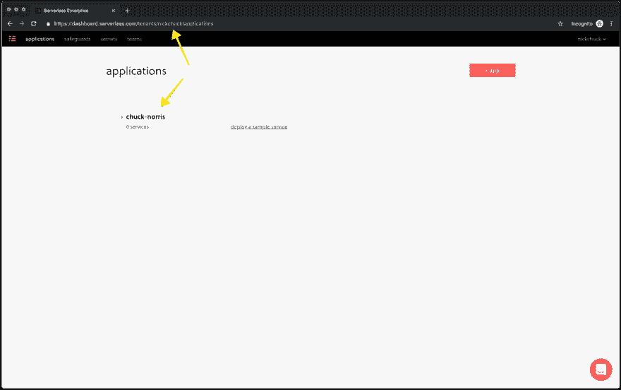](https://res.cloudinary.com/practicaldev/image/fetch/s--eQrMU0IV--/c_limit%2Cf_auto%2Cfl_progressive%2Cq_auto%2Cw_880/https://i.imgur.com/Gij33L9.png)

## 3。使用 Expo 创建一个 React 本机应用程序

Expo 通过使用 Expo APIs 简化了构建 React 本地应用程序的过程。从技术上讲，我们根本不需要它；然而，如果你想快速地将一些东西组合在一起，并有可能为 iOS 或 Android 开发一个版本，Expo 将是最快的方式。毕竟，你可以随时退出你的世博项目。

要创建你的应用，打开你的终端，前往你选择的目录(我会在`~/Code`)。一旦一切就绪，运行下面的命令来搭建项目。

```
$ expo init react-native-chat-chucky 
```

按照 Expo CLI 的提示，在选项卡和空白问题中选择“空白”。一旦你回答完问题，Expo 会生成目录并使用 yarn 或 npm 安装必要的依赖项。您的终端应该如下所示:

[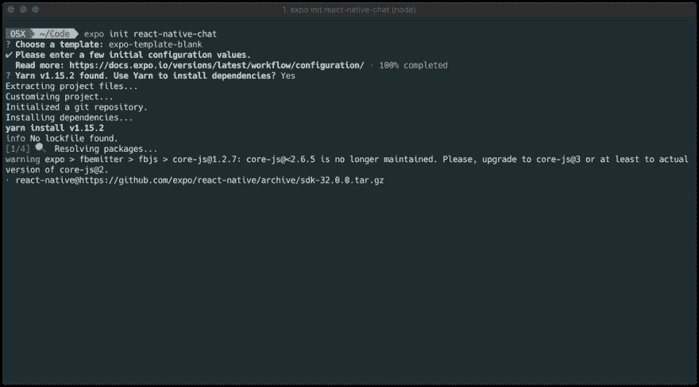](https://res.cloudinary.com/practicaldev/image/fetch/s--oyPcK25L--/c_limit%2Cf_auto%2Cfl_progressive%2Cq_auto%2Cw_880/https://i.imgur.com/OK7nMQ4.png)

一切就绪！👏

## 4。添加聊天 SDK 以反应本地聊天

接下来，让我们使用下面的命令安装所有需要的依赖项。我将为此使用 yarn，但是如果您在初始设置时选择了 npm，请使用它来避免混合锁文件。

```
$ yarn add axios md5 react-native-gifted-chat react-native-iphone-x-helper react-native-parsed-text react-router-native stream-chat 
```

## 5。添加默认消息

为了显示聊天界面，我们使用了 [react-native-gifted-chat](https://www.npmjs.com/package/react-native-gifted-chat) ，这是一个非常棒的 UI 库，专门用于处理聊天应用程序。有了天才聊天，我们可以把 UI 放在一边，快速启动并运行！

为了开始一个初始消息，我们需要创建一个新目录和一个消息文件。UI 已经被连接起来需要这个文件，所以只需要创建它并放入一个自定义消息。

```
$ mkdir data && touch messages.js 
```

完成这一步后，将下面的代码片段粘贴到文件中并保存。

```
module.exports = [
  {
    _id: Math.round(Math.random() * 1000000),
    text: "Say something... I'll tell you some fun facts! 🤣",
    createdAt: Date.now(),
    user: {
      _id: "chuck",
      name: "Chuck Norris"
    }
  },
  {
    _id: Math.round(Math.random() * 1000000),
    text: "Chat with Chuck!",
    createdAt: Date.now(),
    system: true
  }
]; 
```

可以走了！🚀

## 6。添加路由&屏幕反应原生

我们已经有了所有必要的依赖项，所以让我们继续前进，把所有的东西都绑在一起！

修改您的`App.js`文件，使其包含以下代码片段。

```
import React, { Component } from "react";
import { KeyboardAvoidingView, StyleSheet } from "react-native";
import { NativeRouter as Router, Route, Switch } from "react-router-native";

import Chat from "./screens/Chat";
import Login from "./screens/Login";

export default class App extends Component {
  render() {
    return (
      <KeyboardAvoidingView behavior="padding" enabled style={styles.root}>
        <Router>
          <Switch>
            <Route exact path="/chat" component={Chat} />
            <Route path="/" component={Login} />
          </Switch>
        </Router>
      </KeyboardAvoidingView>
    );
  }
}

const styles = StyleSheet.create({
  root: {
    flex: 1,
    backgroundColor: "white"
  }
}); 
```

创建一个名为 screens 的目录，并在其中创建两个文件— `Chat.js`和`Login.js`。

```
$ mkdir screens && cd screens && touch Chat.js && touch Login.js 
```

一旦这两个文件就位，我们将需要填充它们！将下面显示的代码放到适当的文件中。

`Chat.js`

```
import React, { Component } from "react";
import { Constants, LinearGradient } from "expo";
import {
  ActivityIndicator,
  Platform,
  SafeAreaView,
  StyleSheet,
  Text,
  View
} from "react-native";
import {
  GiftedChat,
  Bubble,
  InputToolbar,
  SystemMessage
} from "react-native-gifted-chat";
import { StreamChat } from "stream-chat";
import { isIphoneX, getBottomSpace } from "react-native-iphone-x-helper";
import axios from "axios";
import md5 from "md5";

const client = new StreamChat("<YOUR_STREAM_APP_ID>");

export default class Chat extends Component {
  constructor(props) {
    super(props);

    this.state = {
      messages: [],
      typingText: null,
      user: null,
      token: null,
      channel: null
    };

    this._isMounted = false;
    this._isAlright = null;
  }

  componentWillMount() {
    this._isMounted = true;

    this.setState({
      messages: require("../data/messages.js")
    });
  }

  async componentDidMount() {
    const { location } = this.props;
    const user = location.state.user;

    try {
      const init = await axios.post("<YOUR_SERVERLESS_INVOCATION_URL>", {
        name: user.name,
        email: user.email
      });

      await client.setUser(init.data.user, init.data.token);

      const channel = client.channel("messaging", md5(user.email), {
        name: "Chat with Chuck Norris",
        members: ["chuck", init.data.user.id]
      });

      await channel.create();
      await channel.watch();

      channel.on(event => this.incoming(event));

      this.setState({
        user: init.data.user,
        token: init.data.token,
        channel
      });
    } catch (error) {
      console.log(error);
    }
  }

  componentWillUnmount() {
    this._isMounted = false;
  }

  incoming(evt) {
    if (evt.type === "message.new" && evt.user.id !== this.state.user.id) {
      this.onReceive(evt);
    }
  }

  onSend = async (messages = []) => {
    try {
      await this.state.channel.sendMessage({
        text: messages[0].text
      });

      this.setState(previousState => {
        return {
          messages: GiftedChat.append(previousState.messages, messages),
          typingText: "Chuck Norris is typing..." // mock typing indicator
        };
      });
    } catch (error) {
      console.log(error);
    }
  };

  onReceive = data => {
    this.setState(previousState => {
      return {
        messages: GiftedChat.append(previousState.messages, {
          _id: data.message.id,
          text: data.message.text,
          createdAt: data.message.created_at,
          user: {
            _id: data.message.user.id,
            name: data.message.user.name
          }
        }),
        typingText: null
      };
    });
  };

  renderBubble = props => {
    return (
      <Bubble
        {...props}
        wrapperStyle={{
          left: {
            backgroundColor: "#f0f0f0"
          }
        }}
      />
    );
  };

  renderInputToolbar = props => {
    if (isIphoneX()) {
      return (
        <SafeAreaView>
          <InputToolbar {...props} />
        </SafeAreaView>
      );
    }
    return <InputToolbar {...props} />;
  };

  renderSystemMessage = props => {
    return (
      <SystemMessage
        {...props}
        containerStyle={{
          marginBottom: 15
        }}
        textStyle={{
          fontSize: 14
        }}
      />
    );
  };

  renderFooter = props => {
    if (this.state.typingText) {
      return (
        <View style={styles.footerContainer}>
          <Text style={styles.footerText}>{this.state.typingText}</Text>
        </View>
      );
    }

    return null;
  };

  render() {
    if (!this.state.user) {
      return (
        <View style={styles.loader}>
          <ActivityIndicator />
        </View>
      );
    }

    const { user } = this.state;

    return (
      <>
        <GiftedChat
          messages={this.state.messages}
          onSend={this.onSend}
          user={{
            _id: user.id // sent messages should have same user._id
          }}
          renderBubble={this.renderBubble}
          renderSystemMessage={this.renderSystemMessage}
          renderInputToolbar={this.renderInputToolbar}
          renderFooter={this.renderFooter}
          listViewProps={this._listViewProps}
        />
        <LinearGradient
          pointerEvents="none"
          colors={this._gradient}
          style={styles.header}
        />
      </>
    );
  }

  get _gradient() {
    return [
      "rgba(255, 255, 255, 1)",
      "rgba(255, 255, 255, 1)",
      "rgba(255, 255, 255, 0)"
    ];
  }

  get _listViewProps() {
    return {
      style: styles.listViewStyle,
      contentContainerStyle: styles.contentContainerStyle
    };
  }
}

const styles = StyleSheet.create({
  footerContainer: {
    marginTop: 5,
    marginLeft: 10,
    marginRight: 10,
    marginBottom: 10
  },
  footerText: {
    fontSize: 14,
    color: "#aaa"
  },
  header: {
    height: Constants.statusBarHeight + 64,
    position: "absolute",
    top: 0,
    left: 0,
    right: 0
  },
  listViewStyle: {
    flex: 1,
    marginBottom: isIphoneX() ? getBottomSpace() : 0
  },
  loader: {
    flex: 1,
    justifyContent: "center",
    alignItems: "center"
  },
  contentContainerStyle: {
    paddingTop: 24
  }
}); 
```

`Login.js`

```
import React, { Component } from "react";
import {
  Image,
  SafeAreaView,
  StyleSheet,
  Text,
  TextInput,
  TouchableOpacity,
  View
} from "react-native";
import { Link } from "react-router-native";

const hitSlop = { top: 24, right: 24, bottom: 24, left: 24 };

class Login extends Component {
  constructor(props) {
    super(props);

    this.state = {
      email: "",
      name: ""
    };
  }

  _handleChange = name => value => {
    this.setState({
      [name]: value
    });
  };

  _renderLink = props => (
    <TouchableOpacity disabled={!this._canLogin} hitSlop={hitSlop} {...props} />
  );

  render() {
    const { email, name } = this.state;
    return (
      <SafeAreaView style={styles.root}>
        <View style={styles.brand}>
          <Image style={styles.logo} source={require("img/chuck.png")} />
          <Text style={styles.name}>Chuck Bot</Text>
        </View>
        <TextInput
          style={styles.input}
          placeholder="Name"
          onChangeText={this._handleChange("name")}
          value={name}
        />
        <TextInput
          autoCapitalize="none"
          style={styles.input}
          placeholder="Email"
          onChangeText={this._handleChange("email")}
          value={email}
        />
        <View style={styles.btnWrapper}>
          <Link to={this._to} component={this._renderLink}>
            <Text style={this._labelStyle}>Chat with Chuck</Text>
          </Link>
        </View>
      </SafeAreaView>
    );
  }

  get _to() {
    return {
      pathname: "/chat",
      state: {
        user: this.state
      }
    };
  }

  get _canLogin() {
    const { email, name } = this.state;
    return Boolean(name) && Boolean(email);
  }

  get _labelStyle() {
    return {
      ...styles.btnLabel,
      color: this._canLogin ? "rgb(0, 122, 255)" : "#eeeeee"
    };
  }
}

export default Login;

const styles = StyleSheet.create({
  btnLabel: {
    fontSize: 16,
    color: "rgb(0, 122, 255)"
  },
  btnWrapper: {
    alignItems: "center",
    justifyContent: "center",
    paddingVertical: 32
  },
  brand: {
    alignItems: "center",
    justifyContent: "center",
    marginBottom: 32
  },
  input: {
    flexDirection: "row",
    fontSize: 20,
    fontWeight: "600",
    marginVertical: 8,
    borderRadius: 8,
    borderColor: "#f9f9f9",
    borderWidth: 2,
    padding: 16,
    width: 343
  },
  logo: {
    width: 80,
    height: 112
  },
  name: {
    fontSize: 20,
    fontWeight: "800",
    marginTop: 16
  },
  root: {
    flex: 1,
    paddingHorizontal: 16,
    justifyContent: "center",
    alignItems: "center"
  }
}); 
```

> *在第 22 行，从您的 Stream Dashboard 中拖放 Stream 应用程序 ID。在第 53 行，您需要添加由 AWS API Gateway 提供的 Lambda 端点——不要担心，您现在还没有，我们将在下一节中介绍它。*

呜！快到了！👨‍🚀

## 7。添加无服务器目录&文件

现在，您已经使用 Expo 成功搭建了一个 React 本机应用程序，接下来进入目录(例如 react-native-chat-chucky)。

```
$ cd react-native-chat-chucky 
```

首先，让我们继续创建一个名为 serverless 的新目录，然后进入该目录，这样我们就可以安装一些依赖项。

```
$ mkdir serverless && cd serverless 
```

创建一个新的`package.json`文件。

```
$ touch package.json 
```

然后，将下面示例片段的内容复制到 package.json 文件中。

```
{  "name":  "stream-react-chat",  "version":  "1.0.0",  "description":  "Facilitates communication between RN and Stream",  "main":  "handler.js",  "license":  "BSD-3-Clause",  "private":  false,  "scripts":  {  "start":  "sls offline",  "deploy":  "sls deploy"  },  "dependencies":  {  "@babel/runtime":  "^7.3.1",  "axios":  "^0.18.0",  "babel-runtime":  "^6.26.0",  "stream-chat":  "^0.9.0",  "uuid":  "^3.3.2"  },  "devDependencies":  {  "babel-loader":  "^8.0.5",  "eslint":  "^5.16.0",  "eslint-plugin-import":  "^2.17.2",  "eslint-plugin-node":  "^8.0.1",  "eslint-plugin-promise":  "^4.1.1",  "prettier":  "^1.17.0",  "serverless-offline":  "^4.9.4",  "serverless-webpack":  "^5.2.0",  "webpack":  "^4.30.0",  "webpack-node-externals":  "^1.7.2"  }  } 
```

> *添加 package.json 文件后，确保在无服务器目录下运行 yarn 以正确安装模块。*

完成上述步骤后，您需要将以下文件内容复制/粘贴到您的无服务器目录中。

`.eslintrc.json`

```
{  "plugins":  ["babel"],  "extends":  ["eslint:recommended"],  "rules":  {  "no-console":  0,  "no-mixed-spaces-and-tabs":  1,  "comma-dangle":  0,  "no-unused-vars":  1,  "eqeqeq":  [2,  "smart"],  "no-useless-concat":  2,  "default-case":  2,  "no-self-compare":  2,  "prefer-const":  2,  "no-underscore-dangle":  [2,  {  "allowAfterThis":  true  }],  "object-shorthand":  1,  "babel/no-invalid-this":  2,  "array-callback-return":  2,  "valid-typeof":  2,  "arrow-body-style":  2,  "require-await":  2,  "react/prop-types":  0,  "no-var":  2,  "linebreak-style":  [2,  "unix"],  "semi":  [1,  "always"]  },  "env":  {  "es6":  true  },  "parser":  "babel-eslint",  "parserOptions":  {  "sourceType":  "module",  "ecmaVersion":  2018,  "ecmaFeatures":  {  "modules":  true  }  }  } 
```

`.prettierrc`

```
{  "trailingComma":  "es5",  "tabWidth":  4,  "semi":  true,  "singleQuote":  true  } 
```

`webpack.config.js`

```
const path = require("path");
const slsw = require("serverless-webpack");
const nodeExternals = require("webpack-node-externals");

module.exports = {
  entry: slsw.lib.entries,
  target: "node",
  devtool: "source-map",
  mode: "production",
  externals: [nodeExternals()],
  optimization: {
    minimize: false
  },
  performance: {
    hints: false
  },
  module: {
    rules: [
      {
        test: /\.js$/,
        exclude: /node_modules/,
        use: [
          {
            loader: "babel-loader"
          }
        ]
      }
    ]
  }
}; 
```

`serverless.yml`

```
service: <YOUR_APP_NAME> # e.g. chuck-norris
app: <YOUR_APP_NAME> # e.g. chuck-norris
tenant: <YOUR_TENANT_NAME> # e.g. tenant

frameworkVersion: ">=1.32.0  <2.0.0"

provider:
  name: aws
  runtime: nodejs8.10
  stage: prod
  region: us-east-1
  memorySize: 3008
  timeout: 30
  environment:
    STREAM_KEY: "<YOUR_STREAM_KEY>"
    STREAM_SECRET: "<YOUR_STREAM_SECRET>"
    STREAM_APP_ID: "<YOUR_STREAM_APP_ID>"
functions:
  init:
    handler: handler.init
    events:
      - http:
          path: /init
          method: post
  reply:
    handler: handler.reply
    events:
      - http:
          path: /reply
          method: post

plugins:
  - serverless-webpack
  - serverless-offline

custom:
  webpack:
    packager: "yarn"
    webpackConfig: "webpack.config.js"
    includeModules:
      forceInclude:
        - "@babel/runtime"
  serverless-offline:
    port: 8000 
```

> *在`serverless.yml`文件的顶部，您将定义从无服务器仪表板保存的租户名称和应用程序名称。在我的例子中，我使用**尼克查克**作为我的租户名称，使用**查克诺里斯**作为我的应用程序名称。*

干得好！👊

## 8。设置 AWS

网上有大量支持如何做到这一点的信息。我将提供必要的步骤，但这绝对是我推荐您阅读的内容！

> 需要注意的重要一点是，无服务器需要几种不同的 AWS IAM 权限。S3、CloudFormation、API Gateway 和 Lambda 等等。这里提供了一些方法来限制 IAM 权限，以满足必要的要求。我发现虽然这是最安全的方法，但肯定不是最快的。我的建议是，如果这是一个个人 AWS 帐户，请节省一些时间，并从 IAM 授予您的帐户“AdministratorAccess”权限。

设置 AWS 帐户和 IAM 权限后，使用 aws-cli 在命令行中指定您的凭据(凭据可以在 IAM 下找到)。

```
$ aws configure 
```

aws-cli 将询问您的访问密钥 ID 和秘密访问密钥。它还会问您几个(可选)问题，以便 AWS CLI 可以正确地提供您的配置文件。

[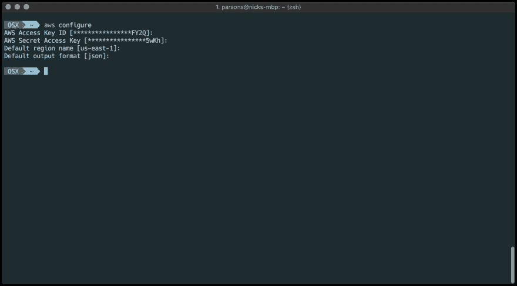](https://res.cloudinary.com/practicaldev/image/fetch/s--WwJjpS8d--/c_limit%2Cf_auto%2Cfl_progressive%2Cq_auto%2Cw_880/https://i.imgur.com/InY9WGK.png)

> *第一次需要安装 aws-cli？在 macOS 上超级简单。只需运行 brew 安装 aws-cli 和家酿将照顾你的休息！*

干得好！🕺

## 9。部署无服务器版本

配置好 AWS 并将您的 AWS 凭证安全地存储在您的机器上之后，是时候将无服务器构建部署到 Lambda 了！导航到 React 本机代码库中的无服务器目录，然后运行以下命令！

> *如果您尚未安装无服务器 CLI，您可以使用 npm install -g 无服务器进行安装。*

```
$ sls deploy 
```

构建将开始，您应该开始看到实时的日志记录！

[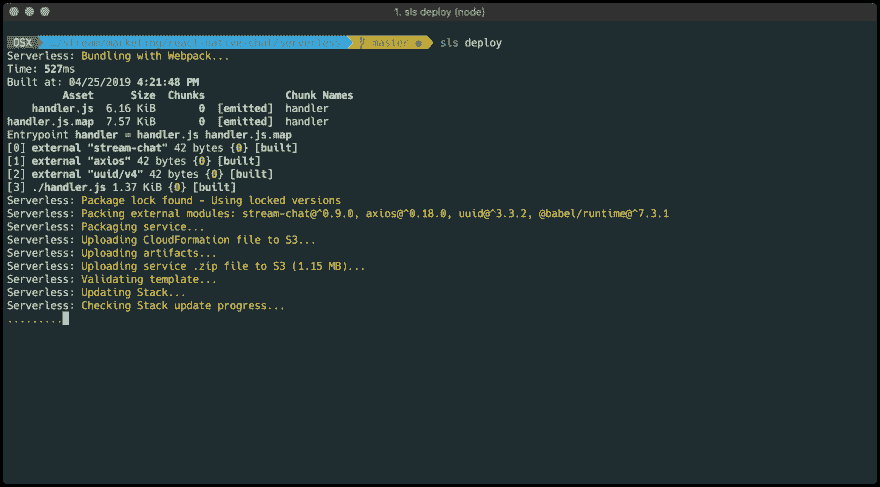](https://res.cloudinary.com/practicaldev/image/fetch/s--t1WOEDGo--/c_limit%2Cf_auto%2Cfl_progressive%2Cq_auto%2Cw_880/https://i.imgur.com/Xb9NFdO.png)

> 遇到问题？请在文章末尾的评论中留下详细信息，我会帮你解决的！

嘣！💥

## 10。启用 API 网关以开始服务请求

Serverless 已经为您完成了一些繁重的工作，自动化了大部分构建。在无服务器出现之前，我们只有 Lambda 可以使用，有时事情确实有点不稳定和麻烦。对于一个只有 Lambda 的工作流，我们过去常常被要求压缩我们的代码库(节点模块等等),然后手动将压缩文件上传到 AWS。呸！😫

要验证您的 Lambda 是否与 API Gateway 一起提供，请登录 AWS 并搜索 API Gateway。

[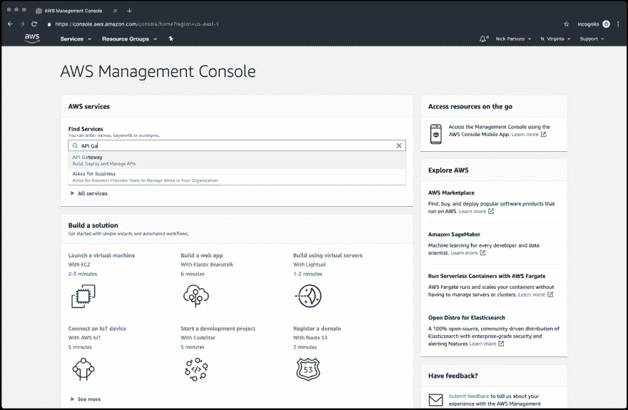](https://res.cloudinary.com/practicaldev/image/fetch/s--TtsT82W8--/c_limit%2Cf_auto%2Cfl_progressive%2Cq_auto%2Cw_880/https://i.imgur.com/ZFzXwl1.png)

单击“API Gateway”，您将被重定向到带有 API 列表的仪表板。我的帐户下有一些，所以它可能会显示一些不同的东西。理想情况下，你在寻找一种叫做`prod-<YOUR_APP_NAME>`的东西。我的情况是`prod-react-native-app`。单击正确的 API 查看您的资源。

[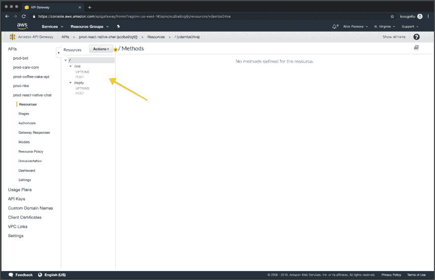](https://res.cloudinary.com/practicaldev/image/fetch/s--m_8HsdIm--/c_limit%2Cf_auto%2Cfl_progressive%2Cq_auto%2Cw_880/https://i.imgur.com/yvl5ps7.png)

选择顶部根资源后，单击“Actions”下拉菜单并选择“Deploy API”。

[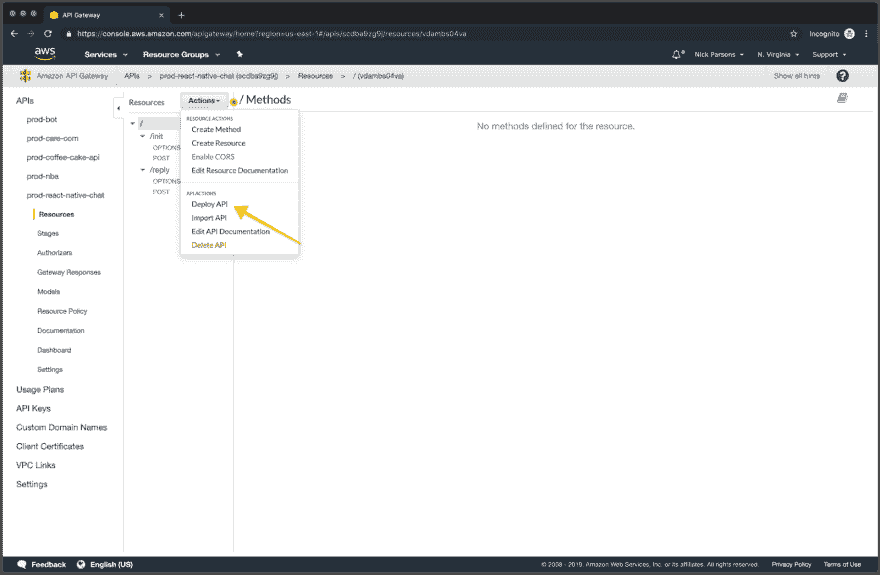](https://res.cloudinary.com/practicaldev/image/fetch/s--ufk6yO0q--/c_limit%2Cf_auto%2Cfl_progressive%2Cq_auto%2Cw_880/https://i.imgur.com/aCA9GED.png)

将显示一个模式，供您指定您的“阶段”。如果你在下拉列表中还没有一个“stage ”,创建一个新的，你可以随意命名。我选择“prod”这个名称，因为当我推送到 Lambda 时，它通常已经使用[无服务器离线](https://www.npmjs.com/package/serverless-offline)进行了测试，并且已经可以生产了。

[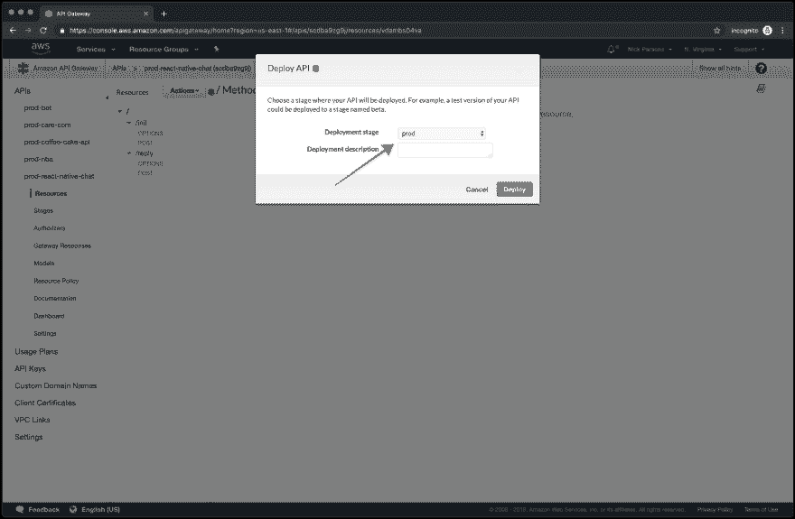](https://res.cloudinary.com/practicaldev/image/fetch/s--pls8c8qL--/c_limit%2Cf_auto%2Cfl_progressive%2Cq_auto%2Cw_880/https://i.imgur.com/HM4gBc6.png)

点击“部署”，您的 API 将被部署到 API Gateway！现在，只需捕获调用 URL 并保存它以供下一步使用！

[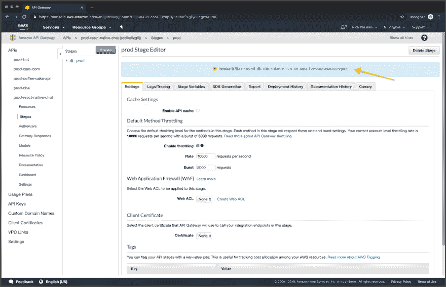](https://res.cloudinary.com/practicaldev/image/fetch/s--4MI-omuI--/c_limit%2Cf_auto%2Cfl_progressive%2Cq_auto%2Cw_880/https://i.imgur.com/KSyp8gp.png)

快到了！🏎

## 11。在 Chat.js 中指定 Init 端点

保存您的调用 URL 后，init 处理程序将被调用，方法是将`/init`附加到它的末尾。转到`Chat.js`，第 53 行，从 AWS API Gateway 放入您的调用 URL。这将处理流聊天所需的服务器端令牌的获取和生成。

有了合适的 URL，代码将在用户登录后向`/init`发送用户信息(又名 you！).POST 将返回一个带有用户信息和生成的用户令牌的序列化对象。

[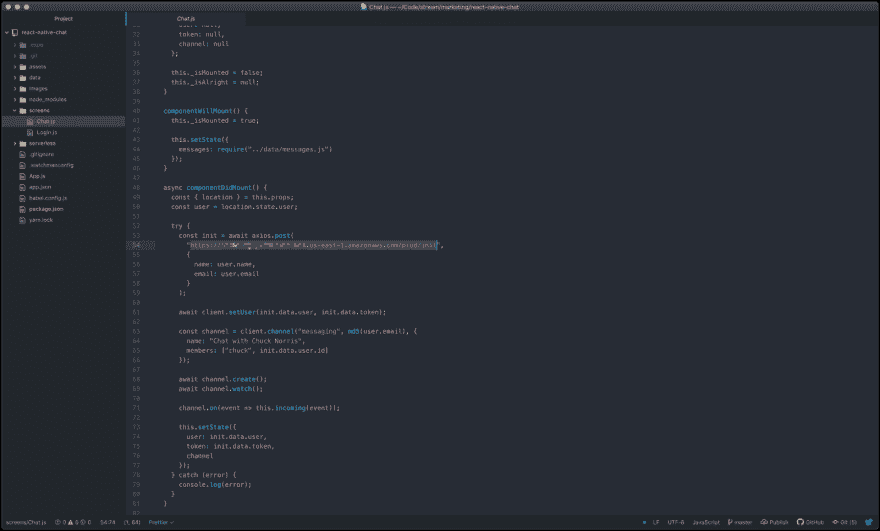](https://res.cloudinary.com/practicaldev/image/fetch/s--FlIe2Tix--/c_limit%2Cf_auto%2Cfl_progressive%2Cq_auto%2Cw_880/https://i.imgur.com/Tr1Ti6S.png)

> *您的端点当前未受到 API 密钥的保护。如果您想要启用 API 密钥，可以在 API 网关内逐个路由地完成。*

答对了。🎲

## 12。设置 Webhook 回复 URL

类似于上面的步骤，URL 将是您的调用 URL，并在末尾附加了`/reply`。在 Stream Chat 仪表盘中，向下滚动到“Chat Events”部分，通过滑动切换按钮直到它变为绿色来启用 webhook。然后将您的 URL 放入输入中，并单击“保存”。

[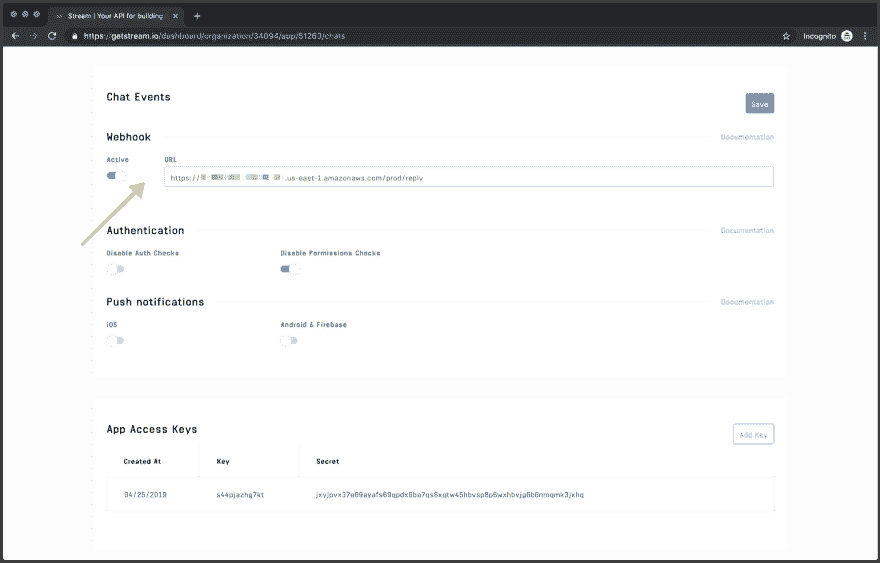](https://res.cloudinary.com/practicaldev/image/fetch/s--h47Yc79a--/c_limit%2Cf_auto%2Cfl_progressive%2Cq_auto%2Cw_880/https://i.imgur.com/xZPDtAk.png)

有了合适的 URL 和激活的 webhook，任何通过 UI 发送的聊天事件都会通过 POST 转发到 Lambda。正文包含许多有用的信息，包括聊天标识符(CID)、发出请求的用户、消息正文等等。

如果您查看 serverless/handler.js 中的回复处理程序，您会注意到，只有当事件来自“chuck”以外的用户(Chuck Norris 的预设用户)时，我们才会发回聊天消息。这是相当简单的逻辑，不应该太混乱。

> *Stream CLI 还提供了设置 Webhook URL 的功能——你可以在这里下载 Stream CLI [。请在此](https://github.com/getstream/stream-cli)查阅文档[。](https://github.com/GetStream/stream-cli/blob/master/docs/chat.md#stream-chatpushwebhook)*

再走一步！🚶

## 13。火本地聊起来！

你已经走了很长一段路。到目前为止，我们已经用 Expo 和 Gifted Chat 构建了一个定制的 React 原生聊天 UI，绑定到 Stream，用 Serverless 设置了一个 AWS Lambda，并在 Stream Chat 仪表板上配置了一个 webhook。哇，太多了。

现在是时候和查克·诺里斯一起娱乐一下了，听听他生活中所有激动人心的故事。

使用命令行启动 iOS 模拟器(从您的项目目录中)。

```
$ expo start — ios 
```

**或**

进入 React Native 的根目录并运行命令`yarn start`。Expo 将为您打开一个新的调试器窗口。接下来，按照下面的步骤。

*   打开 Xcode
*   导航到 Xcode 菜单栏，直到它下拉
*   找到“打开开发者工具”，然后点击“模拟器”

iOS 模拟器将启动并挂在你窗口的右上角。接下来，关注 Expo 打开的调试器窗口。在左下角，点击“在 iOS 模拟器上运行”。

[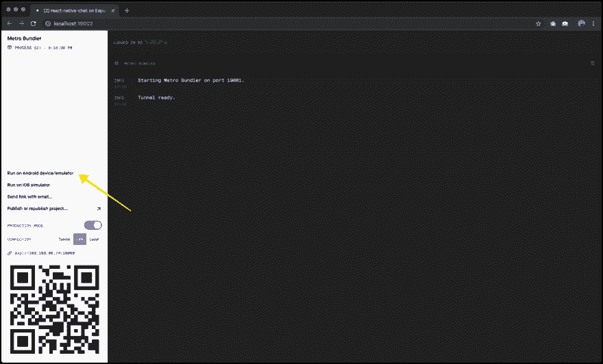](https://res.cloudinary.com/practicaldev/image/fetch/s--ExKzvgtD--/c_limit%2Cf_auto%2Cfl_progressive%2Cq_auto%2Cw_880/https://i.imgur.com/uqGrdtm.png)

应用程序应该加载到 iOS 模拟器中，您应该会看到登录屏幕！

[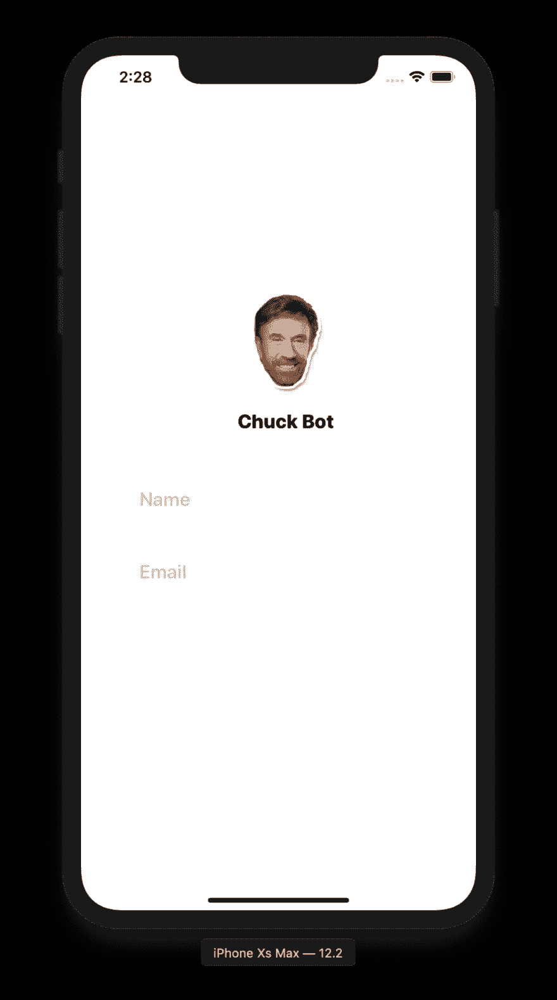](https://res.cloudinary.com/practicaldev/image/fetch/s--fJYrpz-q--/c_limit%2Cf_auto%2Cfl_progressive%2Cq_auto%2Cw_880/https://i.imgur.com/nhjDSZN.png)

键入您的姓名和电子邮件，然后单击底部的“与 Chuck 聊天”按钮。该应用程序将向服务器发出请求，并在流中检索您的应用程序提供的有效用户令牌。从这里开始，一切都是为了开心！

[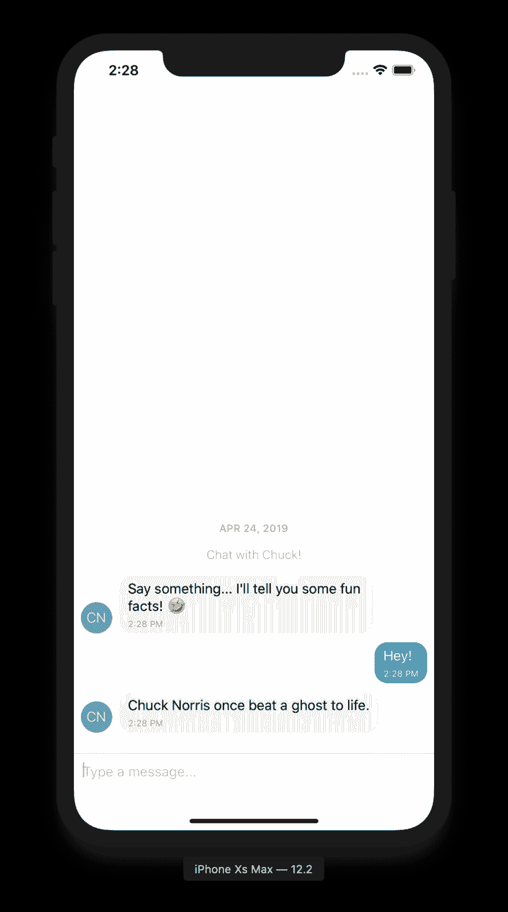](https://res.cloudinary.com/practicaldev/image/fetch/s--02tql-g5--/c_limit%2Cf_auto%2Cfl_progressive%2Cq_auto%2Cw_880/https://i.imgur.com/YbIN0Kb.png)

> *停滞在构建阶段？在下面的评论中留下一些细节，我很乐意帮助你！*

如果你想进一步定制这款应用，或者把它变成 APK (Android)或 IPA (iOS)，我建议你查看以下链接:

*   [借助 Expo 构建独立应用](https://docs.expo.io/versions/latest/distribution/building-standalone-apps/)
*   [天才聊天— GitHub](https://github.com/FaridSafi/react-native-gifted-chat)
*   [流式聊天文档](https://getstream.io/chat/docs/)
*   [流聊天教程](https://getstream.io/chat/react-native-chat/tutorial/)

这是一个总结！[按流聊天](https://getstream.io/chat/)提供了必要的后端基础设施来从头开始构建聊天产品，只剩下前端由您决定！看看这些 [React powered 教程建立在流聊天](https://getstream.io/chat/react-chat/tutorial/)之上。如果您对使用另一种语言/框架进行构建感兴趣，Stream 为那些喜欢在 iOS 上进行原生开发的人提供了几个[SDK](https://github.com/GetStream/stream-sdks)以及一个 [iOS (Swift) SDK](https://getstream.io/tutorials/ios-chat/) 。