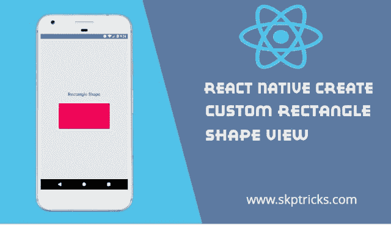

# React 本机创建自定义矩形形状视图

> 原文：<https://dev.to/skptricks/react-native-create-custom-rectangle-shape-view-31gd>

来源: [React Native 创建自定义矩形形状视图](https://www.skptricks.com/2019/04/react-native-create-custom-rectangle-shape-view.html)

本教程解释了如何在 react 本地应用程序中创建自定义矩形和方形视图。在欧几里得平面几何中，矩形是有四个直角的四边形。它也可以定义为等角四边形，因为等角意味着它的所有角度都相等(360/4 = 90°)。也可以定义为包含一个直角的平行四边形。四条边等长的矩形是正方形。求矩形面积的公式是(A = W * L)。正方形具有相同的线条结构，但正方形的宽度和高度相同。

点击此处阅读更多内容...