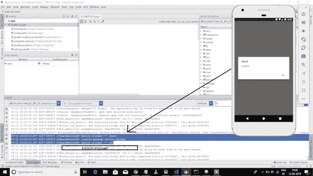

# 使用控制台进行本机调试。日志()

> 原文：<https://dev.to/skptricks/react-native-debugging-using-consolelog-o58>

Post 链接:[使用控制台反应原生调试。Log()](https://www.skptricks.com/2019/03/react-native-debugging-using-consolelog.html)

本教程解释了如何在 react 本机应用程序中使用 console.log()执行调试。Console.log()是 javascript 中内置的预定义函数。这个函数是为 Android 和 iOS 应用程序创建的，用于在运行时维护和调试应用程序中的错误。Console.log()帮助我们检测代码中的错误。

在本例中，我们在函数中使用 console.log 语句，该函数作为点击监听器映射到按钮。当用户在按钮上执行 click 事件时，它将在控制台中打印 console.log 语句消息。在这里，我们使用 android studio 进行演示，每当用户点击按钮，然后你可以在 android studio 的 logcat 部分看到 console.log 消息。参考下面的例子截图。

[使用控制台进行本机调试。Log()](https://www.skptricks.com/2019/03/react-native-debugging-using-consolelog.html)

