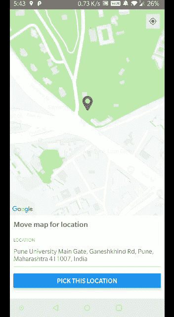
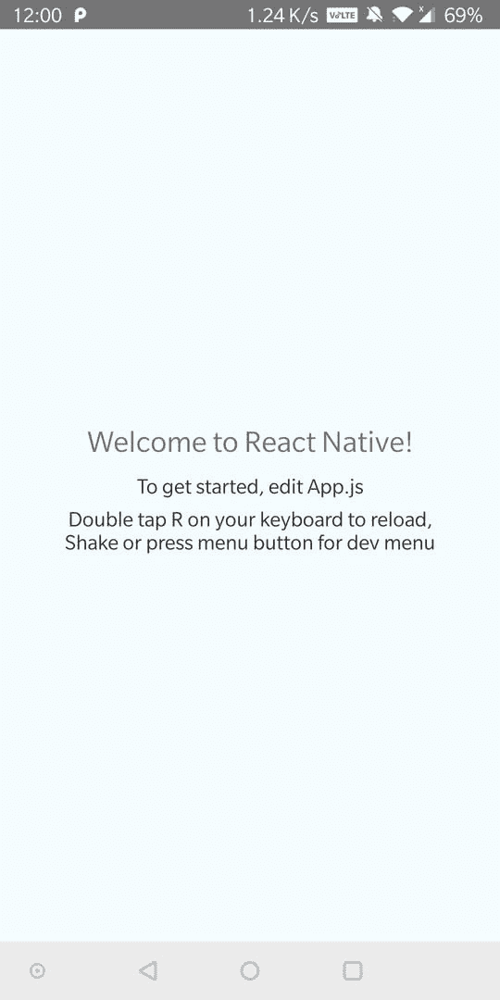
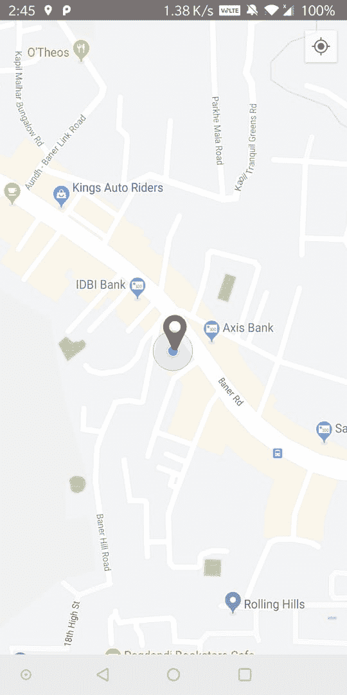
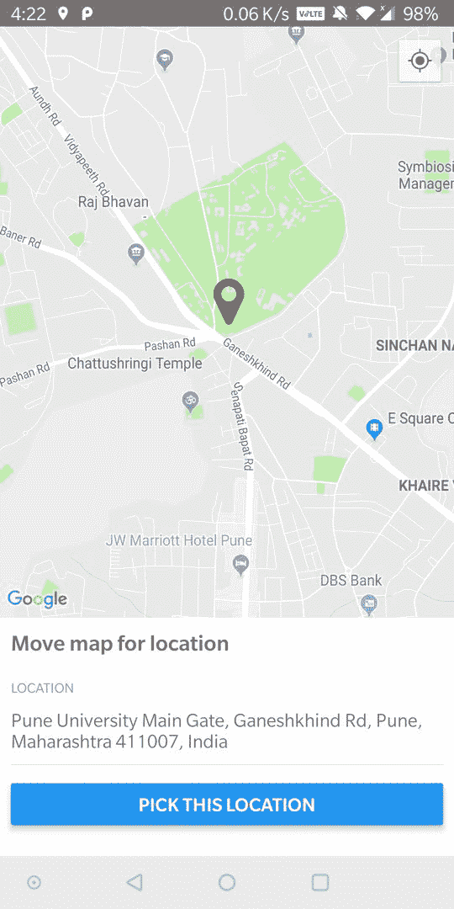

# 反应原生地图与 Android 的实时位置选择

> 原文：<https://dev.to/rishikeshvedpathak/react-native-map-with-real-time-location-selection-for-android-21hd>

<figure>[](https://res.cloudinary.com/practicaldev/image/fetch/s--EG0hdi7y--/c_limit%2Cf_auto%2Cfl_progressive%2Cq_66%2Cw_880/https://cdn-images-1.medium.com/max/352/1%2AZwx58P_-NooFcR2Ycu3gIA.gif) 

<figcaption>反应原生地图与安卓实时位置选择</figcaption>

</figure>

如今，几乎每个移动应用程序都需要地图集成。 [React Native](https://facebook.github.io/react-native/) 给出了一个很大的能力，可以很容易地服务于这个目的。今天我们将了解如何集成谷歌地图，以及如何使用谷歌地图平台 https://maps.googleapis.com[通过在地图视图中移动来获取实时位置。](https://maps.googleapis.com/)

#### 使用 react-native-cli 创建新项目

首先，您需要在开发机器上全局安装 react-native-cli。您可以使用 npm 命令安装它:

```
**npm install -g react-native-cli** 
```

安装 react-native-cli 后，使用命令:
创建一个新项目

```
**react-native init ReactNativeMapView** 
```

这将为您生成一个带有一些预先配置的依赖项的样板文件。下面是构建这个项目时的依赖项:

```
**"react": "16.8.3",  
"react-native": "0.59.5"** 
```

您可以使用 **react-native run-android** 运行您的应用程序，这将在您的设备上显示以下输出。

<figure>[](https://res.cloudinary.com/practicaldev/image/fetch/s--2kvpENgL--/c_limit%2Cf_auto%2Cfl_progressive%2Cq_auto%2Cw_880/https://cdn-images-1.medium.com/max/540/1%2AkroUxSx-bcxmONEyy9eBFQ.jpeg) 

<figcaption>反应本机初始设备输出</figcaption>

</figure>

#### 安装并配置 react-native-maps

现在让我们使用 npm 命令安装[react-native-maps](https://github.com/react-native-community/react-native-maps): NPM install react-native-maps-save。该库附带了需要与 React Native 一起编译的平台本机代码。这需要您配置您的构建工具。详细的安装说明在[这里](https://github.com/react-native-community/react-native-maps/blob/master/docs/installation.md)给出，我们将使用 react native link 进行设置。运行 react-native link react-native-maps，这将把包与我们的本机应用程序链接起来(适用于 Android 和 iOS)。您应该在命令行上看到下面的输出，

<figure>[](https://res.cloudinary.com/practicaldev/image/fetch/s--2s1BqGBT--/c_limit%2Cf_auto%2Cfl_progressive%2Cq_auto%2Cw_880/https://cdn-images-1.medium.com/max/784/1%2AVsPqXbuoECYVfKqyfd7REg.jpeg) 

<figcaption>执行' react-native link react-native-maps '</figcaption>

</figure>

后命令行输出

#### 在我们的应用中添加地图查看权限

在编写代码以在我们的应用程序中显示地图之前，我们需要确保用户配置并允许所需的权限。为此，在 Android/app/src/main/Android manifest . XML 文件中添加以下权限集。

```
\<uses-permission android:name="android.permission.SYSTEM\_ALERT\_WINDOW" /\>

\<uses-permission android:name="android.permission.ACCESS\_FINE\_LOCATION" /\> 
```

此外，我们需要添加谷歌的地理位置 API 键。从生成您自己的 API 密钥

[地理位置 APIs |谷歌地图平台|谷歌云](https://cloud.google.com/maps-platform/)

在同一个文件中，在最后的<application>标记内添加以下代码行。</application> 

```
\<meta-data
android:name="com.google.android.geo.API\_KEY"
android:value="\<\<YOUR API KEY GOES HERE\>\>"/\> 
```

#### 编写代码显示地图视图

现在是时候写一些代码来在我们的应用程序中显示实时地图视图了。

```
constructor(props) {
 super(props);
 this.state = {
 loading: true,
 region: {
 latitude: 10,
 longitude: 10,
 latitudeDelta: 0.001,
 longitudeDelta: 0.001
 }
 };
}

render() {
 return (
\<MapView
 style={styles.map}
 initialRegion={this.state.region}
 showsUserLocation={true}
 onMapReady={this.onMapReady}
 onRegionChangeComplete={this.onRegionChange}\>

\<MapView.Marker
 coordinate={{ "latitude": this.state.region.latitude, 
 "longitude": this.state.region.longitude }}
 title={"Your Location"}
 draggable /\>

\</MapView\>);
} 
```

上面的代码将显示一个简单的地图视图，如下所示，

[](https://res.cloudinary.com/practicaldev/image/fetch/s--1Sxu9zjq--/c_limit%2Cf_auto%2Cfl_progressive%2Cq_auto%2Cw_880/https://cdn-images-1.medium.com/max/540/1%2ANyVIG62E4Me9DdwocrfMsg.jpeg)

#### 使用字体添加自定义标记

很多时候，我们会在地图上看到一个中心定位的图标，它固定在中心，我们会看到地图围绕它移动。为了实现这一点，我们需要添加一个自定义标记使用图标或图像。在这里，我们将显示图标作为一个标记，这样做，我们需要配置和添加字体。按照以下步骤添加字体，

第一步:下载 fontawesome-webfont.ttf 文件，并将其重命名为 fontawesome.ttf.

第二步:在您的项目目录的根目录下创建 **/assets/fonts/** 目录。

第三步:将 fontawesome.ttf 文件粘贴到/assets/fonts/

第四步:将下面的代码添加到你的 package.json 文件中。

```
"rnpm": {
 "assets": [
 "./assets/fonts"
 ]
} 
```

第五步:运行 react-native link。

现在我们已经配置了字体，我们可以添加一个字体作为标记。

```
\<View\>
 \<MapView
 initialRegion={this.state.region}
 showsUserLocation={true}
 \>
 \</MapView\>

\<View style={styles.mapMarkerContainer}\>
 \<Text style={{ fontFamily: 'fontawesome', fontSize: 42, color: 
 "#ad1f1f" }}\>&#xf041;\</Text\>
 \</View\>
 \</View\>
\</view\> 
```

这将显示如下输出，

[](https://res.cloudinary.com/practicaldev/image/fetch/s--UOQ1XUI_--/c_limit%2Cf_auto%2Cfl_progressive%2Cq_auto%2Cw_880/https://cdn-images-1.medium.com/max/540/1%2AquJRxJJFsaqsGIEPTeSVHA.jpeg)

#### 从地图上获取位置细节

我们可以使用[谷歌的地图 API](https://maps.googleapis.com) 获得位置细节。我们需要提供的只是 https://maps.googleapis.com 的[的纬度、经度和 API 密钥。](https://maps.googleapis.com)

使用 MapView 提供的 onRegionChangeComplete prop 方法可以捕获当前的经纬度。

参见下面使用 react-native-maps 进行实时位置选择的最终输出，

[](https://res.cloudinary.com/practicaldev/image/fetch/s--RtN-XMJb--/c_limit%2Cf_auto%2Cfl_progressive%2Cq_auto%2Cw_880/https://cdn-images-1.medium.com/max/540/1%2A2r9YAGWAL_XZz0lXGHN_Wg.jpeg)

#### 结论

我们已经成功地创建了一个 react 本地应用程序，可以捕捉和显示用户在地图上的当前位置。您可以在 GitHub repo 中找到最终代码，

[RishikeshVedpathak/ReactNativeMapView](https://github.com/RishikeshVedpathak/ReactNativeMapView)

我希望这将有助于您理解并鼓励您使用 react native 自由使用 google 的地图 API。请随时反馈意见和建议！